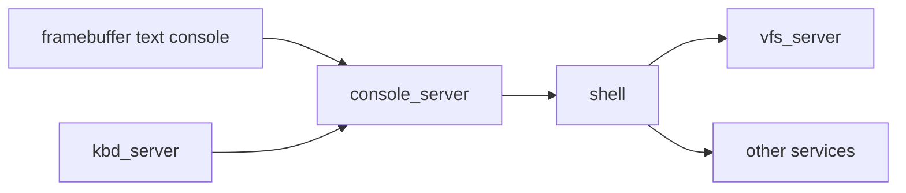

# Phase 09 — Framebuffer and Shell

**Status:** Complete
**Source Ref:** phase-09
**Depends on:** Phase 7 ✅, Phase 8 ✅
**Builds on:** Combines the console/keyboard servers from Phase 7 with the VFS from Phase 8 to create a visible, interactive system
**Primary Components:** framebuffer console, text renderer, shell, console_server (extended)

## Milestone Goal

Make the OS pleasant to interact with by adding on-screen text output and a very small
shell for manual exploration.

## Why This Phase Exists

Up to this point the OS communicates only through serial output, which is invisible to
anyone without a terminal connected. A framebuffer console and shell transform the system
from a kernel demo into something that looks and feels like an operating system. This
phase also validates the full service architecture end-to-end: keyboard input flows through
`kbd_server`, console output flows through `console_server` to both serial and screen, and
shell commands exercise the VFS path for file operations.

## Learning Goals

- Understand how UI can remain a userspace concern in a microkernel.
- Learn the basics of text rendering, input handling, and command dispatch.
- End with a system that feels like an operating system rather than a kernel demo.

## Feature Scope

- Framebuffer text rendering
- Console output routed to serial and screen
- Line input with basic editing
- Shell built-ins such as `help`, `echo`, `ls`, and `cat`
- Enough process or command infrastructure to launch a few actions

## Important Components and How They Work

### Framebuffer Console

Parses framebuffer information from boot data and exposes a simple drawing API. Uses a
fixed bitmap font for text rendering. Handles scrolling, cursor positioning, and basic
ANSI-like control sequences.

### Extended console_server

The console server from Phase 7 is extended to own the visible terminal state. It routes
output to both serial and the framebuffer, providing a unified output path for all
programs.

### Shell

A tiny command interpreter that speaks only to documented services. It reads line input
from the keyboard path, parses commands, and dispatches to built-in handlers. Commands
like `ls` and `cat` exercise the VFS path from Phase 8.

## How This Builds on Earlier Phases

- **Extends** `console_server` from Phase 7 to drive framebuffer output in addition to serial
- **Extends** `kbd_server` from Phase 7 with scancode-to-character translation and input delivery
- **Reuses** the VFS and filesystem layer from Phase 8 for file-oriented shell commands
- **Reuses** the IPC and service registry from Phases 6-7 for all inter-service communication

## Implementation Outline

1. Parse framebuffer information from boot data and expose a simple drawing API.
2. Add text rendering with a fixed bitmap font.
3. Extend the console service to own the visible terminal state.
4. Build a tiny shell that speaks only to documented services.
5. Keep the command model simple and text-oriented.

## Acceptance Criteria

- Text appears on screen in addition to serial output.
- Keyboard input reaches the shell through userspace services.
- The shell can run a handful of built-in commands.
- File-oriented commands such as `ls` and `cat` exercise the VFS path.

## Companion Task List

- [Phase 9 Task List](./tasks/09-framebuffer-and-shell-tasks.md)

## How Real OS Implementations Differ

- Real systems have richer terminal stacks, GPU drivers, process launch models, shells,
  libraries, and compatibility layers.
- Production terminal emulators handle hundreds of escape sequences and support Unicode.
- A learning system should stop once text I/O and a few commands make the service
  architecture visible and satisfying to use.

## Deferred Until Later

- Pipes and redirection
- Job control
- Full-screen applications
- Advanced graphics or windowing
