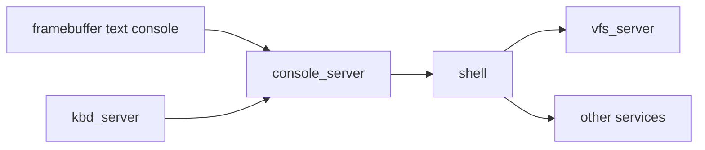

# Phase 9 - Framebuffer and Shell

## Milestone Goal

Make the OS pleasant to interact with by adding on-screen text output and a very small
shell for manual exploration.

## Learning Goals

- Understand how UI can remain a userspace concern in a microkernel.
- Learn the basics of text rendering, input handling, and command dispatch.
- End with a system that feels like an operating system rather than a kernel demo.

## Feature Scope

- framebuffer text rendering
- console output routed to serial and screen
- line input with basic editing
- shell built-ins such as `help`, `echo`, `ls`, and `cat`
- enough process or command infrastructure to launch a few actions

## Implementation Outline

1. Parse framebuffer information from boot data and expose a simple drawing API.
2. Add text rendering with a fixed bitmap font.
3. Extend the console service to own the visible terminal state.
4. Build a tiny shell that speaks only to documented services.
5. Keep the command model simple and text-oriented.

## Acceptance Criteria

- Text appears on screen in addition to serial output.
- Keyboard input reaches the shell through userspace services.
- The shell can run a handful of built-in commands.
- File-oriented commands such as `ls` and `cat` exercise the VFS path.

## Companion Task List

- [Phase 9 Task List](./tasks/09-framebuffer-and-shell-tasks.md)

## Documentation Deliverables

- explain framebuffer ownership and text rendering at a high level
- document the shell command model and service dependencies
- explain why the shell is intentionally tiny

## How Real OS Implementations Differ

Real systems have richer terminal stacks, GPU drivers, process launch models, shells,
libraries, and compatibility layers. A learning system should stop once text I/O and a
few commands make the service architecture visible and satisfying to use.

## Deferred Until Later

- pipes and redirection
- job control
- full-screen applications
- advanced graphics or windowing
