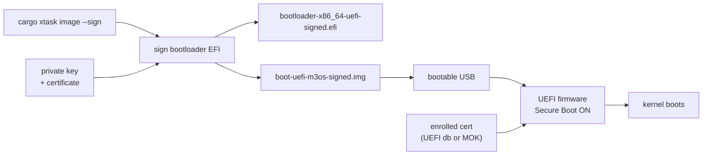

# Phase 10 — Secure Boot Signing (Optional)

**Status:** Complete
**Source Ref:** phase-10
**Depends on:** Phase 9 ✅ (optional — framebuffer needed to confirm boot visually)
**Builds on:** Takes the bootable disk image from earlier phases and adds cryptographic signing for UEFI Secure Boot
**Primary Components:** cargo xtask sign, cargo xtask image --sign, key generation, certificate enrollment

## Milestone Goal

Sign the kernel's EFI binary so it can boot on real hardware with UEFI Secure Boot
enabled, without needing to disable the firmware security check.



## Why This Phase Exists

Modern hardware ships with UEFI Secure Boot enabled by default. Without a signed EFI
binary, booting the OS on real hardware requires disabling Secure Boot, which weakens
the machine's security posture. This phase bridges the gap between "runs in QEMU" and
"boots on real hardware" by adding a signing step to the build pipeline and documenting
the certificate enrollment workflow.

## Learning Goals

- Understand how UEFI Secure Boot works and why it exists.
- Learn the key hierarchy: PK -> KEK -> db -> signed binary.
- Understand the difference between personal Secure Boot (self-signed + enrolled)
  and distribution Secure Boot (shim + Microsoft CA).
- See how the build pipeline can be extended to include a signing step.

## Feature Scope

- A key generation script (one-time setup).
- A `cargo xtask sign` subcommand plus a `cargo xtask image --sign` convenience path.
- Documentation explaining the full signing and enrollment workflow.
- A signed disk image that can be copied to removable media for Secure Boot tests.
- The signed image boots with Secure Boot enabled on a real machine.

Out of scope for this phase:
- The shim chain (needed only for public distribution).
- Microsoft CA submission.
- Key revocation or rotation.

## Important Components and How They Work

### Key Generation

A one-time setup step generates a 4096-bit RSA key pair and self-signed X.509 certificate
with `openssl`. The private key signs EFI binaries; the certificate is enrolled on target
machines.

### cargo xtask sign

Signs any EFI executable with the project's key pair. Supports optional `--key` / `--cert`
overrides for custom key locations.

### cargo xtask image --sign

Extends the existing image build pipeline to produce a signed bootable disk image in
addition to the unsigned image. The output includes both `.img` and `.vhdx` formats.

### Certificate Enrollment: Two Paths

**Path A — Via shim's MOK database (easier on most Linux systems)**

Most Linux machines already boot through shim. On these systems `mokutil` can enroll
your certificate into shim's MOK (Machine Owner Key) list, which shim checks before
handing off to the next stage. This does **not** add the key to the UEFI firmware's
own signature database.

```bash
mokutil --import m3os.crt   # run on the target machine
# reboot -> MOKManager prompt appears -> enroll -> reboot again
```

**Path B — Direct UEFI firmware db enrollment (no shim required)**

On machines where you control the UEFI firmware, you can add your certificate directly
to the firmware's `db` (allowed signatures) database. This works independently of shim.

- Put the firmware into **Setup Mode** (clear the Platform Key via UEFI setup).
- Enroll your own PK, KEK, and db certificates using `efi-updatevar` or the firmware
  setup UI.
- The firmware then trusts your signed binary directly, without shim.

This gives full control but overwrites the OEM key hierarchy, which may affect Windows
Secure Boot on dual-boot machines.

## How This Builds on Earlier Phases

- **Wraps** the existing `cargo xtask image` pipeline from earlier phases with a signing step
- **Requires** Phase 9's framebuffer output to visually confirm that Secure Boot succeeded
- **Does not modify** any kernel code — operates purely on the build output artifacts

## Implementation Outline

1. Generate a 4096-bit RSA key pair and self-signed X.509 certificate with `openssl`.
2. Add `cargo xtask sign <unsigned-efi>` for signing any EFI executable with
   optional `--key` / `--cert` overrides.
3. Extend `cargo xtask image` with `--sign` so the build produces a signed bootable
   disk image in addition to the unsigned image.
4. Document the one-time certificate enrollment. Two paths exist — choose based on the
   target machine (see above).
5. Verify the signed binary boots with `mokutil --sb-state` or `dmesg` reporting
   Secure Boot enabled.

## Acceptance Criteria

- `cargo xtask sign <unsigned-efi>` produces a verified `*-signed.efi`.
- `cargo xtask image --sign` produces `boot-uefi-m3os-signed.img` (and `.vhdx`).
- The signed EFI passes `sbverify --cert m3os.crt <signed-efi>`.
- The unsigned EFI fails `sbverify --cert m3os.crt <unsigned-efi>`.
- The kernel boots on real hardware with Secure Boot enabled after enrolling the cert.
- Booting the unsigned or untrusted image with Secure Boot on is rejected by firmware.

## Companion Task List

- [Phase 10 Task List](./tasks/10-secure-boot-tasks.md)

## How Real OS Implementations Differ

- Linux distributions use a **shim** first-stage bootloader signed by Microsoft's UEFI
  CA. The shim maintains its own **MOK (Machine Owner Key)** database and verifies GRUB,
  which in turn verifies the kernel. This lets distros ship updates without involving
  Microsoft on every kernel release.
- The shim approach requires applying to the Microsoft UEFI CA program (months, legal
  entity required), signing the shim binary with Microsoft's key, and then using the
  shim to trust the distro's own key for subsequent stages.
- For a personal OS there are two practical options:
  - **Via shim's MOK** (`mokutil --import`): the easiest path on machines that already
    boot through shim. The key lives in shim's MOK list, not the UEFI firmware db.
  - **Direct UEFI db enrollment** (`efi-updatevar` or firmware setup): adds the key to
    the firmware's own signature database, works without shim, but requires putting the
    firmware into Setup Mode and re-enrolling the PK/KEK hierarchy.
- Windows uses a similar hierarchy but its keys are enrolled by the OEM at manufacturing
  time. End users cannot easily add their own keys on consumer hardware that ships with
  "Windows Secure Boot" locked down (though most firmware allows it in the UEFI setup).

## Deferred Until Later

- Key rotation and revocation.
- Submitting to the Microsoft UEFI CA for public distribution.
- Measured boot / TPM attestation (verifying the kernel hash against a TPM PCR).
- Signing individual kernel modules (not applicable to a monolithic or microkernel
  design where all trusted code is in the single EFI binary).
