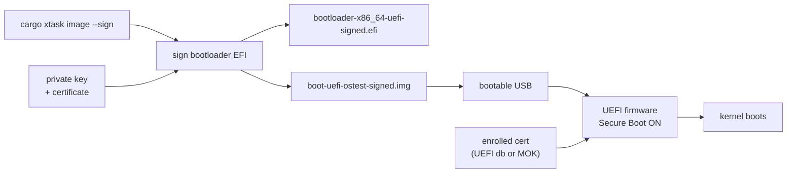

# Phase 10 - Secure Boot Signing (Optional)

## Milestone Goal

Sign the kernel's EFI binary so it can boot on real hardware with UEFI Secure Boot
enabled, without needing to disable the firmware security check.



## Learning Goals

- Understand how UEFI Secure Boot works and why it exists.
- Learn the key hierarchy: PK → KEK → db → signed binary.
- Understand the difference between personal Secure Boot (self-signed + enrolled)
  and distribution Secure Boot (shim + Microsoft CA).
- See how the build pipeline can be extended to include a signing step.

## Feature Scope

- A key generation script (one-time setup).
- A `cargo xtask sign` subcommand plus a `cargo xtask image --sign` convenience path.
- Documentation explaining the full signing and enrollment workflow.
- A signed disk image that can be copied to removable media for Secure Boot tests.
- The signed image boots with Secure Boot enabled on a real machine.

Out of scope for this phase:
- The shim chain (needed only for public distribution).
- Microsoft CA submission.
- Key revocation or rotation.

## Prerequisites

**This phase requires Phase 9 (Framebuffer and Shell) to be useful.**
Without framebuffer output, a signed kernel that boots successfully shows a blank
screen. Complete Phase 9 first so there is something visible to confirm the boot.

## Implementation Outline

1. Generate a 4096-bit RSA key pair and self-signed X.509 certificate with `openssl`.
2. Add `cargo xtask sign <unsigned-efi>` for signing any EFI executable with
   optional `--key` / `--cert` overrides.
3. Extend `cargo xtask image` with `--sign` so the build produces a signed bootable
   disk image in addition to the unsigned image.
4. Document the one-time certificate enrollment. Two paths exist — choose based on the
   target machine (see below).
5. Verify the signed binary boots with `mokutil --sb-state` or `dmesg` reporting
   Secure Boot enabled.

### Certificate Enrollment: Two Paths

**Path A — Via shim's MOK database (easier on most Linux systems)**

Most Linux machines already boot through shim. On these systems `mokutil` can enroll
your certificate into shim's MOK (Machine Owner Key) list, which shim checks before
handing off to the next stage. This does **not** add the key to the UEFI firmware's
own signature database.

```bash
mokutil --import ostest.crt   # run on the target machine
# reboot → MOKManager prompt appears → enroll → reboot again
```

**Path B — Direct UEFI firmware db enrollment (no shim required)**

On machines where you control the UEFI firmware, you can add your certificate directly
to the firmware's `db` (allowed signatures) database. This works independently of shim.

- Put the firmware into **Setup Mode** (clear the Platform Key via UEFI setup).
- Enroll your own PK, KEK, and db certificates using `efi-updatevar` or the firmware
  setup UI.
- The firmware then trusts your signed binary directly, without shim.

This gives full control but overwrites the OEM key hierarchy, which may affect Windows
Secure Boot on dual-boot machines.

## Acceptance Criteria

- `cargo xtask sign <unsigned-efi>` produces a verified `*-signed.efi`.
- `cargo xtask image --sign` produces `boot-uefi-ostest-signed.img` (and `.vhdx`).
- The signed EFI passes `sbverify --cert ostest.crt <signed-efi>`.
- The unsigned EFI fails `sbverify --cert ostest.crt <unsigned-efi>`.
- The kernel boots on real hardware with Secure Boot enabled after enrolling the cert.
- Booting the unsigned or untrusted image with Secure Boot on is rejected by firmware.

## Companion Task List

- [Phase 10 Task List](./tasks/10-secure-boot-tasks.md)

## Documentation Deliverables

- Explain the UEFI Secure Boot key hierarchy (PK / KEK / db / dbx).
- Document the personal signing workflow end-to-end.
- Explain what the shim chain is and why it is needed for distribution but not here.
- Note the limitations: this key is trusted only on machines where it has been enrolled.
- Link to the implementation notes in [`../10-secure-boot.md`](../10-secure-boot.md).

## How Real OS Implementations Differ

Linux distributions use a **shim** first-stage bootloader signed by Microsoft's UEFI
CA. The shim maintains its own **MOK (Machine Owner Key)** database and verifies GRUB,
which in turn verifies the kernel. This lets distros ship updates without involving
Microsoft on every kernel release.

The shim approach requires:
- Applying to the Microsoft UEFI CA program (months, legal entity required).
- Signing the shim binary with Microsoft's key.
- The shim then trusts the distro's own key for subsequent stages.

For a personal OS there are two practical options:
- **Via shim's MOK** (`mokutil --import`): the easiest path on machines that already
  boot through shim. The key lives in shim's MOK list, not the UEFI firmware db.
- **Direct UEFI db enrollment** (`efi-updatevar` or firmware setup): adds the key to
  the firmware's own signature database, works without shim, but requires putting the
  firmware into Setup Mode and re-enrolling the PK/KEK hierarchy.

Windows uses a similar hierarchy but its keys are enrolled by the OEM at manufacturing
time. End users cannot easily add their own keys on consumer hardware that ships with
"Windows Secure Boot" locked down (though most firmware allows it in the UEFI setup).

## Deferred Until Later

- Key rotation and revocation.
- Submitting to the Microsoft UEFI CA for public distribution.
- Measured boot / TPM attestation (verifying the kernel hash against a TPM PCR).
- Signing individual kernel modules (not applicable to a monolithic or microkernel
  design where all trusted code is in the single EFI binary).
