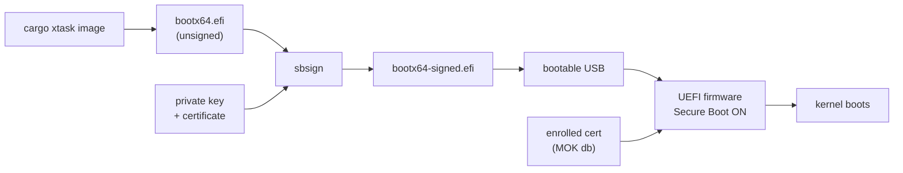

# Phase 10 - Secure Boot Signing (Optional)

## Milestone Goal

Sign the kernel's EFI binary so it can boot on real hardware with UEFI Secure Boot
enabled, without needing to disable the firmware security check.

## Learning Goals

- Understand how UEFI Secure Boot works and why it exists.
- Learn the key hierarchy: PK → KEK → db → signed binary.
- Understand the difference between personal Secure Boot (self-signed + enrolled)
  and distribution Secure Boot (shim + Microsoft CA).
- See how the build pipeline can be extended to include a signing step.

## Feature Scope

- A key generation script (one-time setup).
- A `cargo xtask sign` subcommand (or `--sign` flag on `cargo xtask image`).
- Documentation explaining the full signing and enrollment workflow.
- The signed image boots with Secure Boot enabled on a real machine.

Out of scope for this phase:
- The shim chain (needed only for public distribution).
- Microsoft CA submission.
- Key revocation or rotation.

## Prerequisites

**This phase requires Phase 9 (Framebuffer and Shell) to be useful.**
Without framebuffer output, a signed kernel that boots successfully shows a blank
screen. Complete Phase 9 first so there is something visible to confirm the boot.

## Implementation Outline

1. Generate a 4096-bit RSA key pair and self-signed X.509 certificate with `openssl`.
2. Add a `sign` subcommand to `xtask` that calls `sbsign` on the EFI binary produced
   by the `image` subcommand.
3. Document the one-time MOK enrollment process (`mokutil --import` + reboot).
4. Verify the signed binary boots with `mokutil --sb-state` reporting Secure Boot on.

## Acceptance Criteria

- `cargo xtask sign` (or `cargo xtask image --sign`) produces a signed EFI binary.
- The signed binary passes `sbverify --cert ostest.crt bootx64-signed.efi`.
- The kernel boots on real hardware with Secure Boot enabled after enrolling the cert.
- Booting the unsigned binary with Secure Boot on is rejected by firmware.

## Companion Task List

- [Phase 10 Task List](./tasks/10-secure-boot-tasks.md)

## Documentation Deliverables

- Explain the UEFI Secure Boot key hierarchy (PK / KEK / db / dbx).
- Document the personal signing workflow end-to-end.
- Explain what the shim chain is and why it is needed for distribution but not here.
- Note the limitations: this key is trusted only on machines where it has been enrolled.

## How Real OS Implementations Differ

Linux distributions use a **shim** first-stage bootloader signed by Microsoft's UEFI
CA. The shim maintains its own **MOK (Machine Owner Key)** database and verifies GRUB,
which in turn verifies the kernel. This lets distros ship updates without involving
Microsoft on every kernel release.

The shim approach requires:
- Applying to the Microsoft UEFI CA program (months, legal entity required).
- Signing the shim binary with Microsoft's key.
- The shim then trusts the distro's own key for subsequent stages.

For a personal or embedded OS, bypassing shim and enrolling a self-signed key directly
into the firmware's MOK database is simpler and equally secure for single-machine use.

Windows uses a similar hierarchy but its keys are enrolled by the OEM at manufacturing
time. End users cannot easily add their own keys on consumer hardware that ships with
"Windows Secure Boot" locked down (though most firmware allows it in the UEFI setup).

## Deferred Until Later

- Key rotation and revocation.
- Submitting to the Microsoft UEFI CA for public distribution.
- Measured boot / TPM attestation (verifying the kernel hash against a TPM PCR).
- Signing individual kernel modules (not applicable to a monolithic or microkernel
  design where all trusted code is in the single EFI binary).
