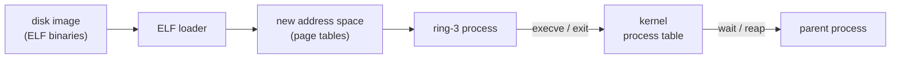

# Phase 11 - ELF Loader and Process Model

## Milestone Goal

Load and execute arbitrary userspace binaries from disk as isolated ring-3 processes,
with a proper lifecycle: spawn, run, wait, exit.

## Learning Goals

- Understand what it actually means to "run a program" at the kernel level.
- Learn how ELF segments are mapped into a fresh address space.
- See how process creation, exit codes, and reaping fit into the kernel's job.

## Feature Scope

- ELF64 parser: load `PT_LOAD` segments, set up stack, jump to entry point
- `execve` syscall: replace the current process image with a new binary
- `fork` or `posix_spawn`-style spawn: create a child process
- `exit` / `exit_group` syscalls: terminate cleanly with an exit code
- `wait` / `waitpid` syscalls: block parent until child exits, collect exit code
- per-process kernel stack and saved register state
- process table in the kernel tracking pid, state, parent, exit code

## Implementation Outline

1. Write an ELF64 parser that reads a file from the VFS and validates the header.
2. Allocate a fresh page table root and map each `PT_LOAD` segment at the right virtual address.
3. Allocate and map a userspace stack; push `argc`/`argv`/`envp` in the System V ABI layout.
4. Wire `execve` to load a new image into the calling process's address space.
5. Wire `fork` to copy the parent's page tables and kernel state into a new process entry.
6. Wire `exit` to mark the process as zombie and wake any waiting parent.
7. Wire `waitpid` to block until a matching child transitions to zombie, then reap it.

## Acceptance Criteria

- A statically linked ELF binary (written in Rust or C with no libc) boots from disk,
  runs in ring 3, and exits cleanly.
- The kernel correctly records and reports the exit code to the waiting parent.
- Two processes run concurrently without corrupting each other's address spaces.
- `init` can spawn a child, wait for it, and spawn another.

## Companion Task List

- [Phase 11 Task List](./tasks/11-process-model-tasks.md)

## Documentation Deliverables

- explain the ELF loading sequence: parse → allocate → map → stack → enter
- document the process table structure and lifecycle states
- explain what `fork` does to page tables and why copy-on-write is deferred
- note what the System V AMD64 ABI requires at process entry

## How Real OS Implementations Differ

Production kernels implement copy-on-write `fork` so parent and child share physical
pages until one writes. They also support dynamic linking (the ELF interpreter field
points at `ld.so`), `execve` argument size limits, and process groups. The toy
implementation uses eager copying and static linking only, which is much simpler to
reason about.

## Deferred Until Later

- copy-on-write page faults
- dynamic linking and `ld.so`
- process groups and sessions
- `clone` with shared address spaces (threads)
- `ptrace` and debugging support
