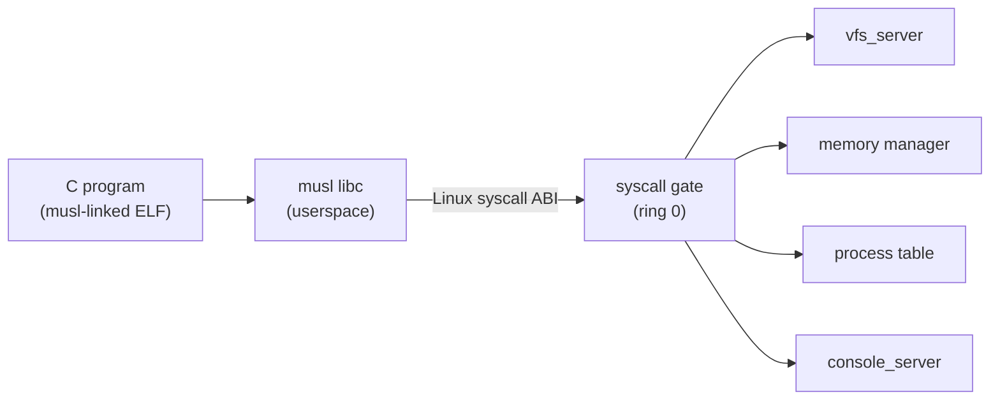

# Phase 12 - POSIX Compatibility Layer

## Milestone Goal

Implement enough Linux-compatible syscalls and bundle musl libc so that ordinary
C programs compiled on the host can run unmodified inside the OS.

## Learning Goals

- Understand what a syscall ABI compatibility layer actually involves.
- See why musl is a practical first libc target.
- Learn which Linux syscalls are load-bearing for compiled programs.

## Feature Scope

- Linux-compatible syscall numbers for the ~40 calls musl needs:
  `read`, `write`, `open`, `openat`, `close`, `lseek`, `fstat`, `fstatat`,
  `mmap`, `munmap`, `brk`, `exit`, `exit_group`, `getpid`, `writev`,
  `readv`, `getcwd`, `chdir`, `ioctl` (minimal), `uname`
- musl libc compiled on the host against this ABI, bundled in the disk image
- C runtime stub (`crt0`) that calls `main` and passes the exit code to `exit`
- userspace `malloc`/`free` backed by `brk`/`mmap`

## Implementation Outline

1. Audit which syscall numbers Linux assigns to the ~40 musl-required calls.
2. Add a second dispatch table in the syscall gate that maps Linux numbers to
   internal kernel functions. The existing custom ABI remains untouched.
3. Compile musl on the host with `--target x86_64-unknown-none`, patching only
   the syscall wrapper stubs to use `syscall` with Linux numbers.
4. Write a minimal `crt0.s` that satisfies the System V entry convention.
5. Bundle musl headers and the compiled `libc.a` in the disk image.
6. Validate with a "hello world" C binary: compile on host, copy to image, run inside OS.

## Acceptance Criteria

- A C program that calls `printf`, `malloc`, `fopen`, and `exit` runs correctly.
- Programs compiled with `cc -static -o hello hello.c` (targeting musl) execute
  inside the OS without modification.
- Standard I/O reaches the console server through the syscall path.
- The existing custom syscall ABI still works for native Rust userspace code.

## Companion Task List

- [Phase 12 Task List](./tasks/12-posix-compat-tasks.md)

## Documentation Deliverables

- document the Linux syscall number mapping table and dispatch strategy
- explain what musl needs vs. what glibc needs and why musl is the right choice
- document the C runtime entry sequence (`_start` → `__libc_start_main` → `main`)
- explain which syscalls are stubbed, which are real, and what the gaps mean

## How Real OS Implementations Differ

Real Linux-compatible layers (WSL, FreeBSD's Linux ABI, Darling) implement hundreds
of syscalls and handle subtleties like signal masks, `/proc` reads, `epoll`, and
`futex`-based threading. This phase targets only the subset needed for a single-threaded
C compiler and basic file utilities. Threading and `futex` are deferred.

## Deferred Until Later

- `futex` and pthreads
- `epoll` / `poll` / `select`
- signal delivery through the Linux signal ABI
- `/proc` filesystem entries
- dynamic linker support (`PT_INTERP`, `LD_LIBRARY_PATH`)
- `mprotect` and memory permission changes
