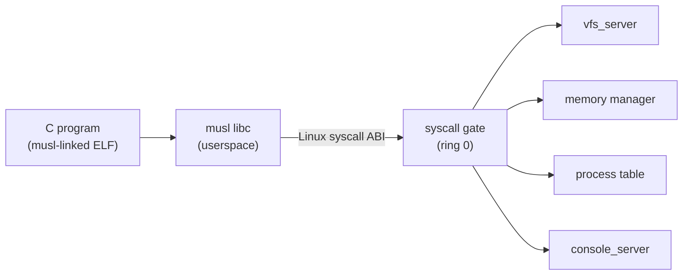

# Phase 12 — POSIX Compatibility Layer

**Status:** Complete
**Source Ref:** phase-12
**Depends on:** Phase 11 ✅
**Builds on:** ELF loader and process model from Phase 11, adding Linux-compatible syscall numbers so musl-linked C binaries can run unmodified
**Primary Components:** kernel/src/arch/x86_64/ (syscall gate), userspace/syscall-lib/, userspace/coreutils/

## Milestone Goal

Implement enough Linux-compatible syscalls and bundle musl libc so that ordinary
C programs compiled on the host can run unmodified inside the OS.

## Why This Phase Exists

The custom syscall ABI from earlier phases works for native Rust userspace code, but
the OS cannot run standard C programs without a POSIX-compatible syscall interface.
By implementing the Linux syscall numbers that musl libc requires, the OS gains access
to the entire ecosystem of portable C programs — compilers, utilities, and libraries —
without requiring each to be ported to a custom ABI.

## Learning Goals

- Understand what a syscall ABI compatibility layer actually involves.
- See why musl is a practical first libc target.
- Learn which Linux syscalls are load-bearing for compiled programs.

## Feature Scope

- Linux-compatible syscall numbers for the ~40 calls musl needs:
  `read`, `write`, `open`, `openat`, `close`, `lseek`, `fstat`, `fstatat`,
  `mmap`, `munmap`, `brk`, `exit`, `exit_group`, `getpid`, `writev`,
  `readv`, `getcwd`, `chdir`, `ioctl` (minimal), `uname`
- musl libc compiled on the host against this ABI, bundled in the disk image
- C runtime stub (`crt0`) that calls `main` and passes the exit code to `exit`
- userspace `malloc`/`free` backed by `brk`/`mmap`

## Important Components and How They Work

### Syscall Dispatch Table

A second dispatch table in the syscall gate maps Linux syscall numbers to internal
kernel functions. The existing custom ABI remains untouched — both dispatch paths
coexist, selected by convention or entry mechanism.

### musl libc Integration

musl is compiled on the host with syscall wrapper stubs patched to use `syscall` with
Linux numbers. The compiled `libc.a` and headers are bundled in the disk image so
userspace C programs can link against them.

### C Runtime Entry (crt0)

A minimal `crt0.s` satisfies the System V entry convention: it sets up the stack
frame, calls `__libc_start_main`, which in turn calls `main` and passes the return
value to `exit`.

### Userspace Memory Allocation

`malloc`/`free` in musl are backed by `brk` and `mmap` syscalls, which the kernel
implements to grow the process heap or map anonymous pages.

## How This Builds on Earlier Phases

- **Extends Phase 11 (Process Model):** adds Linux-compatible syscall numbers alongside the existing custom ABI in the syscall gate
- **Reuses Phase 11 (ELF Loader):** musl-linked ELF binaries are loaded by the same ELF loader
- **Reuses Phase 8 (VFS):** file-oriented syscalls (`open`, `read`, `write`, `close`) route to the existing VFS layer

## Implementation Outline

1. Audit which syscall numbers Linux assigns to the ~40 musl-required calls.
2. Add a second dispatch table in the syscall gate that maps Linux numbers to
   internal kernel functions. The existing custom ABI remains untouched.
3. Compile musl on the host with `--target x86_64-unknown-none`, patching only
   the syscall wrapper stubs to use `syscall` with Linux numbers.
4. Write a minimal `crt0.s` that satisfies the System V entry convention.
5. Bundle musl headers and the compiled `libc.a` in the disk image.
6. Validate with a "hello world" C binary: compile on host, copy to image, run inside OS.

## Acceptance Criteria

- A C program that calls `printf`, `malloc`, `fopen`, and `exit` runs correctly.
- Programs compiled with `cc -static -o hello hello.c` (targeting musl) execute
  inside the OS without modification.
- Standard I/O reaches the console server through the syscall path.
- The existing custom syscall ABI still works for native Rust userspace code.

## Companion Task List

- [Phase 12 Task List](./tasks/12-posix-compat-tasks.md)

## How Real OS Implementations Differ

Real Linux-compatible layers (WSL, FreeBSD's Linux ABI, Darling) implement hundreds
of syscalls and handle subtleties like signal masks, `/proc` reads, `epoll`, and
`futex`-based threading. This phase targets only the subset needed for a single-threaded
C compiler and basic file utilities. Threading and `futex` are deferred.

## Deferred Until Later

- `futex` and pthreads
- `epoll` / `poll` / `select`
- signal delivery through the Linux signal ABI
- `/proc` filesystem entries
- dynamic linker support (`PT_INTERP`, `LD_LIBRARY_PATH`)
- `mprotect` and memory permission changes
