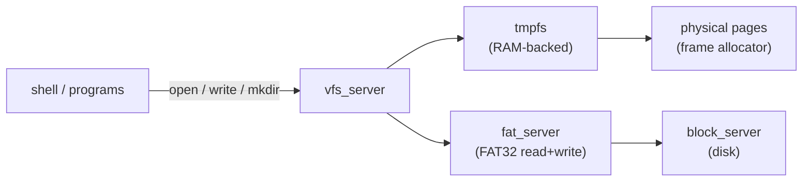

# Phase 13 — Writable Filesystem

**Status:** Complete
**Source Ref:** phase-13
**Depends on:** Phase 8 ✅
**Builds on:** Read-only VFS and FAT32 driver from Phase 8, adding write paths and an in-memory tmpfs
**Primary Components:** kernel/src/fs/ (VFS, FAT32, tmpfs), kernel-core/src/fs/

## Milestone Goal

Allow processes to create, write, and delete files so the OS has persistent and
ephemeral mutable storage. A RAM-backed tmpfs provides scratch space; FAT32 gains
write support for persistence across reboots.

## Why This Phase Exists

A read-only filesystem is insufficient for any real work — programs need to create
temporary files, store configuration, and persist data across reboots. Without write
support the OS cannot build software, save user work, or even create log files. This
phase adds the write path to FAT32 for persistence and introduces tmpfs for fast
ephemeral storage, completing the basic storage story.

## Learning Goals

- Understand the difference between a page-backed in-memory filesystem and a
  disk-backed one.
- See how the VFS abstraction layer hides the difference from callers.
- Learn the minimal write path for FAT32: directory entries, cluster chains, FAT table
  updates.

## Feature Scope

### tmpfs

In-memory filesystem backed by kernel-allocated pages:
- `mkdir`, `create`, `write`, `read`, `unlink`, `rmdir`
- mounted at `/tmp` by default

### FAT32 Write Path

- file create (new directory entry + cluster allocation)
- append and overwrite writes
- file delete (mark entry free, return clusters to FAT)
- directory create and remove

### VFS and Syscall Integration

- VFS dispatch updated to route write calls to the correct backend
- Syscalls: `write`, `creat`, `mkdir`, `unlink`, `rmdir`, `rename`, `truncate`

## Important Components and How They Work

### tmpfs

Stores file data as kernel page lists with no disk involvement. Implemented as a hash
map from path to page list. Mounted at `/tmp` during init. `fsync` is a no-op since
all data is in RAM.

### FAT32 Write Path

Extends the read-only FAT32 driver to support writes. Creating a file allocates
clusters from the FAT free list, creates a new directory entry, and writes data to
the allocated clusters. Deleting a file marks the directory entry as free and returns
clusters to the FAT. `fsync` flushes dirty sectors to the block device.

### VFS Dispatch

The VFS layer gains a `WriteableFs` trait alongside the existing `ReadableFs`. Write
calls are dispatched to the correct backend (tmpfs or FAT32) based on the mount point.

## How This Builds on Earlier Phases

- **Extends Phase 8 (VFS/Storage):** adds write paths to the existing read-only VFS and FAT32 driver
- **Reuses Phase 8 (Block Device):** FAT32 writes go through the same block device layer used for reads
- **Reuses Phase 3 (Memory Management):** tmpfs allocates physical frames from the frame allocator for file data

## Implementation Outline

1. Add a `WriteableFs` trait to the VFS server alongside the existing `ReadableFs`.
2. Implement tmpfs as a hash map from path to page list; no disk involved.
3. Mount tmpfs at `/tmp` during init; verify read/write round-trips.
4. Add the FAT32 write path: allocate clusters, update the FAT table, write directory
   entries.
5. Add `fsync` as a no-op on tmpfs and a flush call on FAT32.
6. Expose write-oriented syscalls through the POSIX compatibility layer.

## Acceptance Criteria

- A program can create a file in `/tmp`, write text into it, close it, reopen it,
  and read the same text back.
- A file created on the FAT32 partition survives a reboot and is visible to the host.
- `unlink` removes a tmpfs file and frees its pages.
- Directory creation and removal work on both backends.
- Writing past the end of a FAT32 file allocates new clusters correctly.

## Companion Task List

- [Phase 13 Task List](./tasks/13-writable-fs-tasks.md)

## How Real OS Implementations Differ

Production kernels use a page cache that unifies file data and anonymous memory,
deferring writes to disk with periodic background flushing (pdflush/writeback threads).
FAT32 on real systems is wrapped in transaction layers or replaced entirely with
journaling filesystems (ext4, APFS, NTFS) to survive power loss. This phase writes
through immediately and accepts the corruption risk, which is fine for a single-user
development machine running in QEMU.

## Deferred Until Later

- page cache and write-back buffering
- journaling or copy-on-write crash recovery
- file permissions and ownership bits
- hard links and symbolic links
- `mmap` of file-backed pages
- extended attributes
