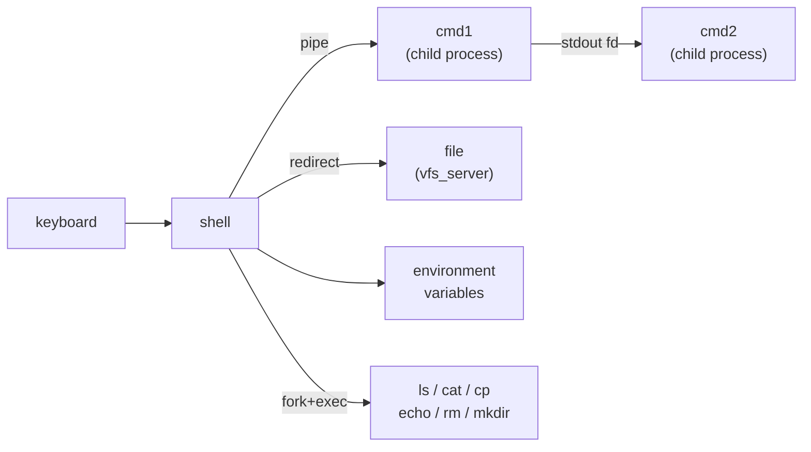

# Phase 14 - Shell and Userspace Tools

## Milestone Goal

Turn the minimal shell from Phase 9 into a genuinely useful interactive environment:
pipes, I/O redirection, job control, environment variables, and a small set of core
utilities that exercise the filesystem and process model.

## Learning Goals

- Understand how a shell implements pipes using file descriptors and `fork`.
- See how job control maps onto process groups and signals.
- Learn how environment variables are passed through `execve`.

## Feature Scope

- **Pipes**: `cmd1 | cmd2` — connect stdout of one child to stdin of the next
- **I/O redirection**: `cmd > file`, `cmd < file`, `cmd >> file`
- **Job control**:
  - `Ctrl-C` sends SIGINT to the foreground job
  - `Ctrl-Z` suspends it (SIGTSTP)
  - `fg` and `bg` built-ins
- **Environment variables**: `export KEY=val`, `$KEY` expansion, passed to children
  via `execve` `envp`
- **Core utilities** (compiled as separate ELF binaries):
  `ls`, `cat`, `cp`, `mv`, `rm`, `mkdir`, `rmdir`, `echo`, `pwd`, `cd`, `env`, `true`, `false`
- Shell built-ins: `exit`, `cd`, `export`, `unset`, `help`

## Implementation Outline

1. Add file descriptor table per process: integers mapping to open file descriptions.
2. Implement `pipe` syscall: allocate a kernel pipe buffer, return two fds.
3. Implement `dup2` syscall: redirect one fd to another before `execve`.
4. Add signal infrastructure: `SIGINT`, `SIGTSTP`, `SIGCONT`, `SIGCHLD` at minimum.
5. Wire `Ctrl-C` and `Ctrl-Z` in the keyboard server to deliver signals to the
   foreground process group.
6. Implement process groups so the shell can address foreground and background jobs.
7. Extend the shell parser to handle `|`, `>`, `<`, `>>`, `&`, and variable expansion.
8. Compile each utility as a standalone static ELF and add to the disk image.

## Acceptance Criteria

- `ls | grep txt` produces the filtered listing.
- `cat file.txt > copy.txt` creates a copy via redirection.
- `Ctrl-C` kills the foreground command without killing the shell.
- `sleep 10 &` runs in the background; the shell remains responsive.
- `fg` brings the background job back to the foreground.
- `export PATH=/bin` and then running `ls` without a full path works.
- All listed utility binaries run and produce correct output.

## Companion Task List

- [Phase 14 Task List](./tasks/14-shell-and-tools-tasks.md)

## Documentation Deliverables

- explain how pipes work: kernel buffer, two file descriptors, producer/consumer
- document how the shell uses `fork` + `dup2` + `execve` to set up a pipeline stage
- explain process groups and how the terminal's foreground group determines signal delivery
- document the `execve` `envp` layout and how environment variables propagate

## How Real OS Implementations Differ

Real shells (bash, zsh) handle dozens of redirection forms, subshells, here-documents,
arithmetic expansion, glob expansion, and complex job control edge cases built up over
decades. POSIX specifies the full signal and job control semantics in fine detail. This
phase implements the minimum needed to make the shell feel real. Edge cases — redirecting
stderr, pipelines with more than two stages, `trap` built-ins — are intentionally deferred.

## Deferred Until Later

- stderr redirection and `2>&1`
- pipelines longer than two stages
- subshells `$(...)` and backtick expansion
- here-documents
- `trap` built-in
- shell scripting (loops, conditionals, functions)
- tab completion
