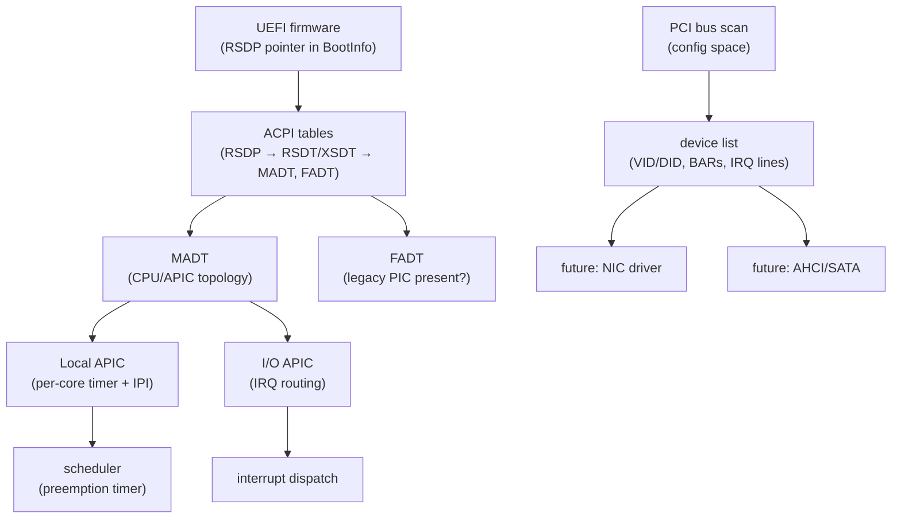

# Phase 15 — Hardware Discovery

**Status:** Complete
**Source Ref:** phase-15
**Depends on:** Phase 3 ✅
**Builds on:** Interrupt handling and memory management from Phase 3, replacing the legacy PIC with APIC and adding ACPI/PCI hardware enumeration
**Primary Components:** kernel/src/acpi/, kernel/src/pci/, kernel/src/arch/x86_64/ (APIC, IDT)

## Milestone Goal

Replace the hardcoded, single-core interrupt model with proper hardware discovery
via ACPI and PCI, and switch from the legacy 8259 PIC to the APIC. This unlocks
multi-core support and arbitrary device discovery in later phases.

## Why This Phase Exists

The legacy 8259 PIC is a single-core interrupt controller that cannot route interrupts
to multiple processors. To support SMP (symmetric multiprocessing) and to discover
devices like network cards and disk controllers dynamically, the kernel must parse ACPI
tables for hardware topology and switch to the APIC interrupt model. PCI enumeration
is the standard mechanism for discovering what hardware is present, and it is required
before any device driver (network, storage, GPU) can be initialized.

## Learning Goals

- Understand how ACPI tables describe the hardware topology to the OS.
- See how the APIC model replaces the legacy 8259 PIC and why it must.
- Learn what PCI configuration space is and how devices are enumerated.

## Feature Scope

### ACPI Parsing

- walk RSDP → RSDT/XSDT → iterate SDTs
- parse MADT: extract Local APIC base, I/O APIC base, IRQ source overrides
- parse FADT: detect whether legacy PIC is present

### Local APIC Initialization

- map the LAPIC MMIO registers
- configure the LAPIC timer for periodic preemption (replaces PIT-driven timer)
- send end-of-interrupt (EOI) through LAPIC instead of PIC

### I/O APIC Initialization

- program IRQ redirection table entries for keyboard and serial
- disable legacy 8259 PIC

### PCI Bus Enumeration

- scan bus 0-255, device 0-31, function 0-7 via config space reads
- record vendor ID, device ID, class, BAR addresses, and IRQ line for each device
- expose the device list through a simple read-only kernel API

## Important Components and How They Work

### ACPI Table Chain

The UEFI firmware provides a pointer to the RSDP (Root System Description Pointer).
The RSDP points to the RSDT or XSDT, which contains pointers to individual System
Description Tables (SDTs). The MADT describes CPU and APIC topology; the FADT
describes legacy hardware presence.

### Local APIC

Each CPU core has a Local APIC mapped at a fixed MMIO address. It provides a per-core
timer (used for preemptive scheduling) and inter-processor interrupts (IPIs). EOI is
acknowledged by writing to the LAPIC EOI register rather than the legacy PIC.

### I/O APIC

The I/O APIC replaces the 8259 PIC for routing external interrupts (keyboard, serial,
disk) to specific CPU cores. Its redirection table entries specify which core receives
each interrupt and with what vector number.

### PCI Configuration Space

Each PCI device exposes a 256-byte configuration space accessible via port I/O
(address port 0xCF8, data port 0xCFC). The scan loop iterates all bus/device/function
combinations, reading vendor ID to detect present devices, then recording class code,
BAR addresses, and interrupt line for later use by device drivers.

## How This Builds on Earlier Phases

- **Replaces Phase 3 (Interrupts):** switches from the legacy 8259 PIC to the APIC interrupt model
- **Extends Phase 3 (Memory Management):** LAPIC MMIO pages must be identity-mapped using the page table infrastructure
- **Enables future phases:** PCI device list is consumed by Phase 16 (Network) for virtio-net and by Phase 8's block driver for virtio-blk

## Implementation Outline

1. Parse the RSDP address from `BootInfo` (UEFI already locates it).
2. Walk the RSDT/XSDT and collect pointers to each SDT.
3. Parse the MADT and record the Local APIC base address and all I/O APIC descriptors.
4. Identity-map the Local APIC MMIO page and write the initialization sequence.
5. Program the I/O APIC redirection table for the IRQs the kernel currently handles.
6. Disable the 8259 PIC.
7. Switch the scheduler's timer source from the PIT to the LAPIC timer.
8. Implement PCI config space reads (port I/O: address port 0xCF8, data port 0xCFC).
9. Enumerate all PCI functions and store the device list in a static kernel array.

## Acceptance Criteria

- The kernel boots using the LAPIC timer for preemption instead of the PIT.
- Keyboard interrupts are delivered via the I/O APIC without regression.
- The legacy 8259 PIC is fully masked and disabled.
- A boot log entry prints the full PCI device list with vendor ID and class codes.
- ACPI table parsing logs the CPU count and APIC IDs found in the MADT.

## Companion Task List

- [Phase 15 Task List](./tasks/15-hardware-discovery-tasks.md)

## How Real OS Implementations Differ

Production kernels use ACPI's AML bytecode interpreter to handle dynamic hardware
configuration (hotplug, power transitions, embedded controller queries). PCI
enumeration extends to PCIe extended config space (4 KB per function) and uses
MCFG tables for MMIO-mapped access. IRQ routing on modern systems runs through
MSI/MSI-X rather than the I/O APIC. This phase uses only the static descriptor tables
and legacy port-I/O PCI access, which is sufficient for a single-machine QEMU target.

## Deferred Until Later

- ACPI AML interpreter and dynamic hardware events
- PCIe extended config space (MCFG)
- MSI and MSI-X interrupt routing
- PCI device power management (D-states)
- ACPI S-states (sleep, hibernate)
- PCIe hotplug
