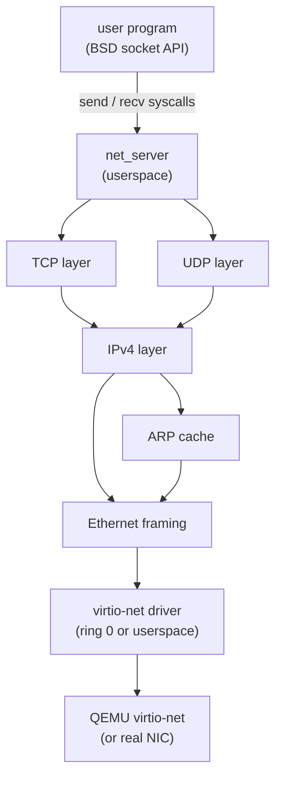

# Phase 16 — Network Stack

**Status:** Complete
**Source Ref:** phase-16
**Depends on:** Phase 12 ✅, Phase 15 ✅
**Builds on:** PCI device enumeration from Phase 15 to find the virtio-net NIC, and POSIX syscall layer from Phase 12 to expose the socket API
**Primary Components:** kernel/src/net/, kernel-core/src/net/, userspace/ping/

## Milestone Goal

Add a minimal but real TCP/IP stack so the OS can send and receive packets over a
network. A virtio-net NIC in QEMU is the hardware target. The end goal is a working
`ping` and a simple TCP connection.

## Why This Phase Exists

An OS without networking is fundamentally limited — it cannot fetch code, communicate
with other machines, or participate in any modern workflow. This phase builds the
complete network stack from the NIC driver up through TCP, giving the OS the ability
to send ICMP pings, exchange UDP datagrams, and establish TCP connections. Each layer
is implemented from scratch, making the full path from application to wire visible and
understandable.

## Learning Goals

- Understand the layered network model by implementing each layer from scratch.
- See how the kernel mediates between the NIC driver and userspace sockets.
- Learn what the virtio transport protocol looks like at the register level.

## Feature Scope

### virtio-net Driver

Initialize virtio PCI device, set up transmit and receive descriptor rings, send and
receive raw Ethernet frames.

### Ethernet Layer

Frame parsing and construction, EtherType dispatch.

### ARP

Request/reply for IPv4 address resolution, small cache.

### IPv4

Packet parsing, routing (single default gateway), checksum.

### ICMP

Echo request/reply (`ping`).

### UDP

Send and receive datagrams.

### TCP

Three-way handshake, send/receive with flow control (no retransmit timer in the first
pass), connection close.

### Socket API

`socket`, `bind`, `connect`, `listen`, `accept`, `send`, `recv`, `sendto`, `recvfrom`,
`close` — exposed through the POSIX syscall layer.

### net_server

Userspace process that owns the stack; kernel delivers raw frames to it via a shared
page capability.

## Important Components and How They Work

### virtio-net Device

Found via the PCI device list from Phase 15. The driver performs feature negotiation,
sets up virtqueues (transmit and receive descriptor rings), and exchanges Ethernet
frames with the virtual NIC. The available ring holds buffers offered to the device;
the used ring holds buffers the device has consumed or filled.

### ARP Cache

Maps IPv4 addresses to MAC addresses. On a cache miss, the stack sends an ARP request
and blocks or queues the packet until a reply arrives. The cache has a fixed size with
simple eviction.

### TCP State Machine

Implements the standard TCP states: SYN_SENT, SYN_RECEIVED, ESTABLISHED, FIN_WAIT,
CLOSE_WAIT, etc. The three-way handshake (SYN, SYN-ACK, ACK) establishes connections.
Flow control uses a receive window. Connection teardown uses FIN exchange.

### Socket Syscall Routing

Socket syscalls go through the POSIX compatibility layer and route to the net_server
process via IPC. The net_server owns the protocol state and dispatches to the
appropriate layer (TCP, UDP, ICMP, or raw).

## How This Builds on Earlier Phases

- **Extends Phase 15 (Hardware Discovery):** uses the PCI device list to find and initialize the virtio-net NIC
- **Extends Phase 12 (POSIX Compat):** socket syscalls are added to the POSIX syscall layer
- **Reuses Phase 6 (IPC):** socket syscalls route to net_server via IPC; raw frames are delivered through shared page capabilities
- **Reuses Phase 3 (Memory Management):** virtio descriptor rings and packet buffers are allocated from kernel memory

## Implementation Outline

1. Use the PCI device list from Phase 15 to find the virtio-net device.
2. Initialize the virtio device: feature negotiation, virtqueue setup.
3. Implement the Ethernet and ARP layers.
4. Implement IPv4 and ICMP; test with `ping 10.0.2.2` (QEMU default gateway).
5. Implement UDP; test with a simple echo server.
6. Implement TCP state machine: SYN, SYN-ACK, ACK, data, FIN.
7. Expose socket syscalls through the POSIX compatibility layer, routing to net_server
   via IPC.

## Acceptance Criteria

- `ping 10.0.2.2` receives ICMP echo replies from the QEMU gateway.
- A UDP echo client can send a datagram and receive it back.
- A TCP client can connect to a host listener, exchange a line of text, and close
  cleanly.
- A TCP server running inside the OS can accept a connection from the host.

## Companion Task List

- [Phase 16 Task List](./tasks/16-network-tasks.md)

## How Real OS Implementations Differ

Production network stacks handle retransmission timers, SACK, TCP congestion control
(CUBIC, BBR), scatter-gather DMA, checksum offload, VLAN tagging, IPv6, DNS, TLS,
and non-blocking I/O via `epoll`. They are typically 50,000-200,000 lines of code.
This phase implements a toy single-connection stack with no retransmit timer and no
congestion control — enough to demonstrate every layer of the model but not suitable
for real traffic.

## Deferred Until Later

- TCP retransmission timer and congestion control
- IPv6
- DNS resolution
- TLS / DTLS
- `epoll` / `select` / `poll` for non-blocking sockets
- multiple simultaneous TCP connections
- checksum offload via virtio features
- DHCP client
