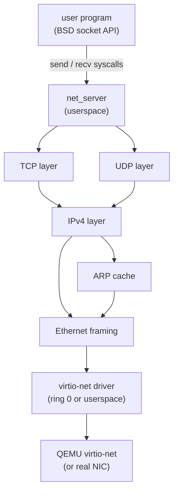

# Phase 16 - Network Stack

## Milestone Goal

Add a minimal but real TCP/IP stack so the OS can send and receive packets over a
network. A virtio-net NIC in QEMU is the hardware target. The end goal is a working
`ping` and a simple TCP connection.

## Learning Goals

- Understand the layered network model by implementing each layer from scratch.
- See how the kernel mediates between the NIC driver and userspace sockets.
- Learn what the virtio transport protocol looks like at the register level.

## Feature Scope

- **virtio-net driver**: initialize virtio PCI device, set up transmit and receive
  descriptor rings, send and receive raw Ethernet frames
- **Ethernet layer**: frame parsing and construction, EtherType dispatch
- **ARP**: request/reply for IPv4 address resolution, small cache
- **IPv4**: packet parsing, routing (single default gateway), checksum
- **ICMP**: echo request/reply (`ping`)
- **UDP**: send and receive datagrams
- **TCP**: three-way handshake, send/receive with flow control (no retransmit timer
  in the first pass), connection close
- **Socket API**: `socket`, `bind`, `connect`, `listen`, `accept`, `send`, `recv`,
  `sendto`, `recvfrom`, `close` — exposed through the POSIX syscall layer
- **net_server**: userspace process that owns the stack; kernel delivers raw frames
  to it via a shared page capability

## Implementation Outline

1. Use the PCI device list from Phase 15 to find the virtio-net device.
2. Initialize the virtio device: feature negotiation, virtqueue setup.
3. Implement the Ethernet and ARP layers.
4. Implement IPv4 and ICMP; test with `ping 10.0.2.2` (QEMU default gateway).
5. Implement UDP; test with a simple echo server.
6. Implement TCP state machine: SYN, SYN-ACK, ACK, data, FIN.
7. Expose socket syscalls through the POSIX compatibility layer, routing to net_server
   via IPC.

## Acceptance Criteria

- `ping 10.0.2.2` receives ICMP echo replies from the QEMU gateway.
- A UDP echo client can send a datagram and receive it back.
- A TCP client can connect to a host listener, exchange a line of text, and close
  cleanly.
- A TCP server running inside the OS can accept a connection from the host.

## Companion Task List

- [Phase 16 Task List](./tasks/16-network-tasks.md)

## Documentation Deliverables

- explain the virtio transport: descriptor rings, available ring, used ring
- document the Ethernet → ARP → IP → TCP/UDP layering and how each layer calls the next
- explain the TCP state machine with a diagram
- document the socket API and how syscalls route to net_server via IPC
- explain the ARP cache: why it exists, what happens on a miss

## How Real OS Implementations Differ

Production network stacks handle retransmission timers, SACK, TCP congestion control
(CUBIC, BBR), scatter-gather DMA, checksum offload, VLAN tagging, IPv6, DNS, TLS,
and non-blocking I/O via `epoll`. They are typically 50,000–200,000 lines of code.
This phase implements a toy single-connection stack with no retransmit timer and no
congestion control — enough to demonstrate every layer of the model but not suitable
for real traffic.

## Deferred Until Later

- TCP retransmission timer and congestion control
- IPv6
- DNS resolution
- TLS / DTLS
- `epoll` / `select` / `poll` for non-blocking sockets
- multiple simultaneous TCP connections
- checksum offload via virtio features
- DHCP client
