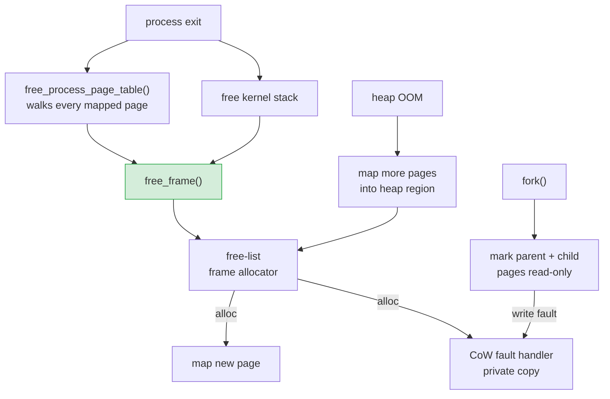

# Phase 17 — Memory Reclamation

**Status:** Complete
**Source Ref:** phase-17
**Depends on:** Phase 11 ✅, Phase 14 ✅
**Builds on:** Replaces the bump frame allocator from Phase 2; extends the page table and process model from Phases 11/14
**Primary Components:** kernel/src/mm/frame_allocator.rs, kernel/src/mm/mod.rs, kernel/src/task/, kernel/src/process/

## Milestone Goal

Close the memory leaks that have accumulated since Phase 2. The bump frame allocator
is replaced with a free-list allocator that can actually reclaim frames, the kernel
heap grows on demand instead of being fixed at 1 MiB, kernel stacks are freed when
processes exit, and `fork` switches from eager full-copy to copy-on-write so parent
and child share physical pages until one of them writes.

## Why This Phase Exists

Since Phase 2, the bump frame allocator has been unable to reclaim freed frames,
causing a steady leak of physical memory every time a process exits. Kernel stacks
accumulate indefinitely, the heap cannot grow past its initial 1 MiB, and every
`fork` duplicates all physical pages even when neither process writes to them. These
problems compound as process churn increases: without reclamation, the system
eventually exhausts physical memory. This phase replaces the leaking allocator with
one that can give frames back, adds reference counting for copy-on-write sharing, and
ensures that all process-associated memory is properly freed on exit.

## Learning Goals

- Understand why a bump allocator leaks and what data structure replaces it.
- See how a kernel heap can grow by mapping fresh frames into a contiguous virtual
  region.
- Learn how copy-on-write works at the page-fault level: shared read-only pages
  become private writable copies on demand.
- Observe the lifecycle of a kernel stack from allocation through process exit to
  reclamation.

## Feature Scope

- **Free-list frame allocator**: replace the bump allocator with a linked free-list
  (or bitmap) that tracks individual 4 KiB frames; `alloc_frame()` pops from the
  list, `free_frame()` pushes back
- **Process page table teardown**: `free_process_page_table()` walks every user-range
  PTE, calls `free_frame()` for each mapped page, and frees the page table frames
  themselves
- **Kernel stack reclamation**: `drain_dead()` in the scheduler frees the kernel stack
  of every reaped process via the frame allocator
- **Growable kernel heap**: when the linked-list allocator returns OOM, the heap
  subsystem maps additional frames into the heap virtual region and retries the
  allocation
- **Copy-on-write fork**: `fork` marks every user page in both parent and child as
  read-only and increments a per-frame reference count; a page fault on a CoW page
  allocates a fresh frame, copies the data, and maps the new frame writable
- **Frame reference counting**: a global `RefCount` table indexed by physical frame
  number; incremented on CoW fork, decremented on unmap; frame is freed only when
  the count reaches zero

## Important Components and How They Work

### Free-List Frame Allocator

Each free frame stores a pointer to the next free frame in its first 8 bytes, forming
an intrusive linked list. The list is initialized by walking the bootloader memory map
and pushing every usable frame. A free count is tracked for diagnostics. The allocator
is `Send + Sync` behind a `spin::Mutex` and exposes the same `FrameAllocator` trait
interface as the old bump allocator.

### Frame Reference Counting

A `RefCount` table (`Vec<AtomicU16>` or equivalent) sized to the highest physical
frame number. Incremented on `alloc_frame`, incremented again on CoW clone, decremented
on `free_frame`. Frames are only reclaimed when the count reaches zero. Double-free
detection uses a poisoned magic value written to the first 8 bytes of each free frame.

### Copy-on-Write Fork

On `fork`, every user PTE in both parent and child is marked read-only and the frame's
reference count is incremented. A page fault on a CoW page (present, not writable,
refcount > 1) allocates a fresh frame, copies the 4 KiB contents, and maps the new
frame writable. If refcount is exactly 1, the page is simply remapped writable without
copying.

### Growable Kernel Heap

A large virtual region (e.g., 64 MiB starting at `HEAP_START`) is reserved but only
the initial 1 MiB is mapped. When the linked-list allocator returns `None`, the next
1 MiB chunk is mapped, `allocator.extend()` is called, and the allocation retried.
Growth is capped at the reserved region size.

## How This Builds on Earlier Phases

- **Extends Phase 2**: replaces the bump frame allocator with a free-list allocator
  that supports reclamation
- **Extends Phase 11**: adds page table teardown and kernel stack freeing to the
  process exit path introduced in Phase 11
- **Extends Phase 14**: converts the eager full-copy fork from Phase 14 into
  copy-on-write fork with reference counting
- **Reuses Phase 3**: the kernel heap from Phase 3 is made growable rather than
  fixed-size

## Implementation Outline

1. Design the free-list data structure. Each free frame stores a pointer to the next
   free frame in its first 8 bytes, forming an intrusive linked list. Initialize the
   list by walking the bootloader memory map and pushing every usable frame. Track
   the total free count for diagnostics.
2. Replace `BumpFrameAllocator` with `FreeListFrameAllocator` in
   `kernel/src/mm/frame_allocator.rs`. Keep the same `FrameAllocator` trait interface
   so callers do not change. The new allocator must be `Send + Sync` behind a
   `spin::Mutex`.
3. Implement `free_frame()` to push a frame back onto the free list. Add a debug
   assertion that the frame is not already free (double-free detection via a
   poisoned magic value written to the first 8 bytes of each free frame).
4. Add a `RefCount` table: a `Vec<AtomicU16>` (or a bitmap plus counter array) sized
   to the highest physical frame number. Increment on `alloc_frame`, increment again
   on CoW clone, decrement on `free_frame`; actually reclaim only when the count
   reaches zero.
5. Update `free_process_page_table()` in `kernel/src/mm/mod.rs` to walk all four
   page-table levels for the user address range, decrement the reference count for
   each leaf frame, and free the frame when it reaches zero. Free intermediate table
   frames (L1, L2, L3 tables) as well once all their entries are empty.
6. Update `drain_dead()` in the scheduler: after reaping a zombie process, recover
   the kernel stack base address from the process's saved state, unmap the stack
   pages, and return them to the frame allocator.
7. Make the kernel heap growable. Reserve a large virtual region (e.g., 64 MiB
   starting at `HEAP_START`) but only map the initial 1 MiB. When the linked-list
   allocator returns `None`, map the next 1 MiB chunk of the reserved region, call
   `allocator.extend()`, and retry the allocation. Cap growth at the reserved
   region size and panic if exceeded.
8. Implement copy-on-write fork:
   a. In `fork`, iterate over every user PTE in the parent. Clear the writable bit
      in both parent and child entries. Increment the frame's reference count.
   b. Register a page-fault handler that checks whether the faulting address maps to
      a CoW page (present, not writable, refcount > 1).
   c. On a CoW fault: allocate a new frame, copy the 4 KiB contents, map the new
      frame writable in the faulting process, decrement the old frame's reference
      count.
   d. If refcount is exactly 1 when the fault fires, the page is the last reference;
      simply remap it writable without copying.
9. Add a `frame_stats()` function that returns the current free count, used count,
   and CoW-shared count for debugging and acceptance testing.
10. Stress-test: run a loop that forks and immediately exits many times; verify the
    free frame count returns to its original value.

## Acceptance Criteria

- `free_frame()` returns frames to the allocator; the free count increases after a
  process exits.
- Forking 100 times and exiting each child returns the system to roughly the same
  free frame count as before the loop.
- A parent and child created by `fork` share physical pages until the child writes;
  writing triggers a page fault that creates a private copy.
- The kernel heap successfully grows past 1 MiB when a large allocation is requested.
- Kernel stacks of exited processes do not accumulate; `drain_dead()` reclaims them.
- Double-free of a frame triggers a kernel panic with a diagnostic message.
- All existing tests continue to pass without modification.

## Companion Task List

- [Phase 17 Task List](./tasks/17-memory-reclamation-tasks.md)

## How Real OS Implementations Differ

- Production kernels use buddy allocators (Linux's page allocator splits and coalesces
  power-of-two blocks) or slab allocators on top of page allocators for small objects.
- Reference counting in Linux is done with `struct page` metadata rather than a
  separate table.
- CoW is also used for `mmap(MAP_PRIVATE)` and file-backed pages, not just fork.
- The kernel heap in Linux is not a single contiguous region; `vmalloc` allocates from
  a scattered virtual range while `kmalloc` uses slab caches backed by physically
  contiguous pages.
- This phase keeps things simple: one free list, one reference count table, one
  contiguous heap region.

## Deferred Until Later

- Buddy allocator with power-of-two coalescing
- Slab or SLUB allocator for small kernel objects
- Demand paging from disk (swap)
- Huge page (2 MiB / 1 GiB) support
- NUMA-aware frame allocation
- `mmap(MAP_PRIVATE)` with CoW semantics for file-backed pages
- Kernel stack guard pages
- Memory pressure notifications and OOM killer
