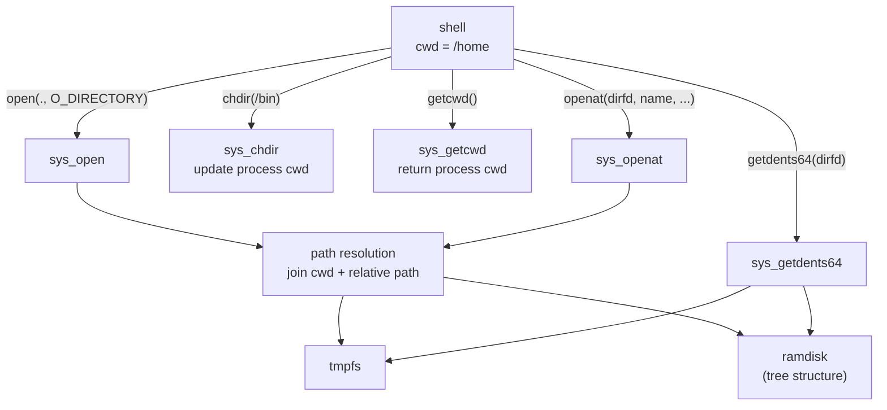

# Phase 18 - Directory and VFS

## Milestone Goal

Make the filesystem navigable. Right now `getdents64` returns ENOSYS, directories
cannot be opened as file descriptors, every process thinks its working directory is
`/`, and the ramdisk is a flat array with no directory hierarchy. This phase fixes all
of that: directories become first-class objects, paths resolve relative to a real
per-process working directory, and the ramdisk gains a tree structure so binaries live
under `/bin` instead of floating in a flat namespace.

## Learning Goals

- Understand how a per-process working directory is stored and used during path
  resolution.
- See how a directory file descriptor differs from a regular file descriptor.
- Learn how `getdents64` serializes directory entries into a userspace buffer.
- Observe the difference between a flat file list and a hierarchical directory tree
  in a ramdisk.

## Feature Scope

- **Per-process `cwd`**: add a `cwd: String` field to the `Process` struct; `fork`
  copies it, `chdir` validates the target path and updates it, `getcwd` returns it
- **`chdir` validation**: `chdir` must verify the target path exists and is a
  directory before updating `cwd`; return ENOENT or ENOTDIR on failure
- **Directory file descriptors**: `open` with `O_DIRECTORY` (or on a path that is a
  directory) returns an fd backed by a directory handle instead of returning EISDIR
- **`getdents64` for tmpfs**: iterate the tmpfs node's children and serialize each
  entry (inode number, name, type) into the userspace buffer in the Linux
  `linux_dirent64` layout
- **`getdents64` for ramdisk**: synthesize directory entries from the ramdisk's tree
  structure; include `.` and `..` entries
- **Ramdisk directory tree**: replace the flat file array with a tree; the xtask
  image builder places ELF binaries under `/bin`, configuration files under `/etc`,
  and the root contains both directories
- **Path resolution**: all syscalls that accept a path (`open`, `stat`, `unlink`,
  `mkdir`, `chdir`) join relative paths against the calling process's `cwd` before
  performing the filesystem lookup
- **`openat`**: accept a directory fd as the base for relative path resolution; the
  special value `AT_FDCWD` uses the process `cwd`

## Implementation Outline

1. Add a `cwd: String` field to `Process` in `kernel/src/process/mod.rs`. Initialize
   it to `"/"` for the init process. Copy it in `fork`. Update it in `chdir` after
   verifying the target exists and is a directory.
2. Implement a `resolve_path(cwd, relative)` function that joins a relative path
   against the current working directory, normalizes `.` and `..` components, and
   returns an absolute path. Use this function at the top of every path-accepting
   syscall.
3. Change `sys_open` to allow opening directories. When the target is a directory
   (or `O_DIRECTORY` is set), allocate an fd whose backing object is a directory
   handle rather than a file handle. Return ENOTDIR if `O_DIRECTORY` is set but the
   target is not a directory.
4. Implement `sys_getdents64` for tmpfs: call `list_dir()` on the tmpfs node (the
   function already exists but is unreachable), serialize each child into a
   `linux_dirent64` struct, and copy the buffer to userspace. Handle partial reads
   when the buffer is too small by returning the entries that fit and resuming on the
   next call using an offset stored in the fd.
5. Restructure the ramdisk from a flat `Vec<(name, data)>` to a tree of directory
   and file nodes. Each directory node holds a `Vec` of children. Update the xtask
   image builder to place files under their directory paths (e.g., `/bin/shell`,
   `/etc/motd`).
6. Implement `sys_getdents64` for ramdisk directories: iterate the children of the
   directory node, synthesize `.` and `..` entries, and serialize into the userspace
   buffer.
7. Implement `sys_openat`: if the first argument is `AT_FDCWD`, resolve against the
   process `cwd`; otherwise look up the directory fd in the fd table and resolve
   against its path.
8. Update `sys_getcwd` to copy the process's `cwd` string into the userspace buffer
   instead of always returning `"/"`.
9. Update `sys_chdir` to call `resolve_path`, verify the result is an existing
   directory on either tmpfs or ramdisk, and store the resolved absolute path in
   `process.cwd`.
10. Wire the shell's `ls` command to use `open(path, O_DIRECTORY)` followed by
    `getdents64` in a loop, printing each entry.

## Acceptance Criteria

- `ls /bin` lists the ELF binaries placed there by the image builder.
- `ls /tmp` lists files created at runtime.
- `ls /` shows `bin`, `tmp`, `etc`, and any other top-level entries.
- `cd /bin && pwd` prints `/bin`.
- `cd nonexistent` returns an error and does not change the working directory.
- `getcwd()` returns the correct absolute path after one or more `chdir` calls.
- Opening a directory without `O_DIRECTORY` returns a valid directory fd.
- Opening a regular file with `O_DIRECTORY` returns ENOTDIR.
- `getdents64` on a directory with more entries than fit in one buffer call correctly
  resumes on the next call.
- Relative paths (e.g., `open("shell", ...)` while cwd is `/bin`) resolve correctly.
- `openat(dirfd, "file", ...)` resolves relative to the directory fd's path.
- All existing tests continue to pass without modification.

## Companion Task List

- [Phase 18 Task List](./tasks/18-directory-vfs-tasks.md)

## Documentation Deliverables

- explain the per-process `cwd` field: where it is stored, how `fork` copies it, how
  `chdir` updates it
- document the path resolution algorithm: joining, normalization of `.` and `..`,
  absolute vs. relative
- explain the `linux_dirent64` layout and how `getdents64` serializes entries into a
  userspace buffer
- document the ramdisk tree structure and how the xtask image builder populates it
- explain the difference between a directory fd and a regular file fd in the fd table
- document `openat` and `AT_FDCWD` semantics

## How Real OS Implementations Differ

Production kernels represent directories as in-kernel dentry caches backed by inodes
on disk. Path resolution walks a dentry tree with mount-point crossing, symlink
following (with loop detection), and permission checks at every component. The VFS
layer in Linux is a ~30,000-line abstraction that lets dozens of filesystem drivers
plug in behind the same interface. `getdents64` in Linux reads from the page cache
and handles concurrent modification via sequence locks. This phase does the simplest
correct thing: a `cwd` string, string-based path joins, and direct iteration over
in-memory data structures with no caching layer.

## Deferred Until Later

- full VFS abstraction layer with pluggable filesystem drivers
- mount points and `mount` / `umount` syscalls
- symbolic links and `readlink`
- hard links and link counts
- inode numbers (currently synthesized or zero)
- permission bits and `chmod` / `chown`
- `..` across mount boundaries
- `fstat` / `fstatat` for directory fds
- `renameat2` and cross-directory rename
