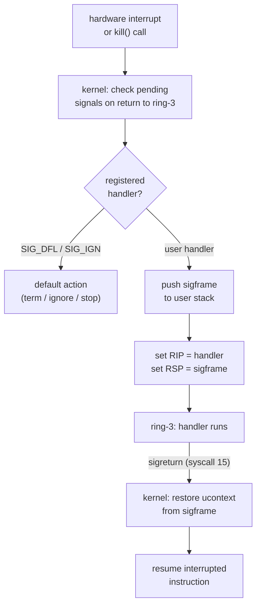

# Phase 19 — Signal Handlers

## Milestone Goal

Enable userspace programs to install and execute signal handlers. Implement the
signal trampoline mechanism so ring-3 code can catch `SIGINT`, `SIGSEGV`, `SIGCHLD`,
and other signals, run a user-supplied handler, and return cleanly to the interrupted
execution without kernel assistance beyond the initial delivery and the `sigreturn`
syscall.

## Learning Goals

- Understand why the kernel must save the full interrupted register state before
  branching to a signal handler and how it reconstructs it on return.
- Learn what a signal trampoline is and why userspace (musl's `__restore_rt`) calls
  `sigreturn` rather than returning normally from the handler function.
- See why `sigreturn` is the only safe way to restore privileged state: a user
  function returning normally would unwind the C call stack, losing the interrupted
  registers.
- See how signal masking during handler execution prevents re-entrant delivery of
  the same signal.
- Understand the role of `sigaltstack` in handling `SIGSEGV` when the process stack
  has already overflowed.
- Learn how `sa_restorer` in `rt_sigaction` links the kernel's frame layout to the
  libc-provided trampoline stub.

## Feature Scope

- **`sigreturn` (syscall 15)**: restore the `ucontext` / `sigframe` previously pushed
  to the user stack and resume the interrupted thread
- **Signal trampoline**: when delivering a signal to a process with a registered
  handler, the kernel pushes a `sigframe` (saved registers + `ucontext`) onto the
  user stack, sets `RIP` to the handler address, and sets `RSP` to the adjusted frame
  pointer; the frame includes a return address pointing at the `__restore_rt` stub
- **`rt_sigprocmask` (syscall 14)**: implement the blocked-signal bitfield per process;
  `SIG_BLOCK`, `SIG_UNBLOCK`, `SIG_SETMASK` operations
- **`sa_mask` honour**: during handler execution, add `sa_mask | signal_being_delivered`
  to the process's blocked set; restore the original mask on `sigreturn`
- **`sigaltstack` (syscall 131)**: register and activate an alternate signal stack;
  used for `SIGSEGV` handlers when the main stack has overflowed
- **musl compatibility**: validate that `rt_sigaction` with `SA_RESTORER` stores the
  restorer pointer and that the kernel uses it as the return address in the frame

## Implementation Outline

1. Define the `sigframe` layout in the kernel (matches the Linux `ucontext_t` +
   `siginfo_t` layout that musl expects): general-purpose registers, `rflags`,
   `rip`, `rsp`, the old signal mask, and the restorer address.
2. In `check_pending_signals()`, after selecting a signal to deliver, check the
   process's `SignalDisposition` table for a user handler. If present, call
   `setup_signal_frame()` instead of the default-action path.
3. Implement `setup_signal_frame()`: read the current user `RSP` (or alt-stack base
   if `SS_ONSTACK` and the signal has `SA_ONSTACK` set), subtract the frame size,
   write the `sigframe` struct to user memory, then mutate the saved trap frame so
   that `IRET` / `SYSRET` returns to the handler.
4. Implement `sys_sigreturn`: read the `sigframe` pointer from the user stack (`RSP`
   at the time of the syscall), validate it is in user-space, copy saved registers
   back into the trap frame, and restore the old signal mask.
5. Implement `sys_rt_sigprocmask`: update `task.blocked_signals` according to the
   `how` argument (`SIG_BLOCK`, `SIG_UNBLOCK`, `SIG_SETMASK`). Never allow blocking
   `SIGKILL` or `SIGSTOP`.
6. Extend `rt_sigaction` to record `sa_restorer` (the `SA_RESTORER` flag) and store
   it in the `SignalAction` entry; use this address as the return address written into
   the `sigframe`.
7. Implement `sys_sigaltstack` (syscall 131): read / write the `stack_t` struct in
   the process's task block; set the `SS_ONSTACK` flag in the saved `stack_t` while
   a handler using the alt stack is executing.
8. Write a test program that installs a `SIGINT` handler via `rt_sigaction`, raises
   `SIGINT` via `kill(getpid(), SIGINT)`, executes the handler, and returns; assert
   that execution continues after the `raise` call.
9. Write a `SIGSEGV` handler test: map no guard page, overflow the stack, recover
   via `sigaltstack`-backed handler.
10. Audit `check_pending_signals()` call sites: it must be invoked on every return to
    ring-3, including from `sys_read`, `sys_write`, `sys_waitpid`, and any future
    blocking syscalls that can be interrupted by a signal (`EINTR` handling).
11. Add a kernel-side assertion that `sigframe` written to user memory is 16-byte
    aligned (System V AMD64 ABI requires 16-byte stack alignment at `CALL`); misaligned
    frames cause SSE faults in musl startup code.

## Acceptance Criteria

- A statically linked musl binary that installs a `SIGINT` handler, calls `raise(SIGINT)`,
  prints inside the handler, and continues execution after `raise` returns runs correctly.
- `SIGSEGV` delivered to a process with a `sigaltstack`-backed handler executes the
  handler and does not triple-fault.
- A handler does not re-enter itself when the same signal fires during handler execution
  (blocked by automatic masking).
- `rt_sigprocmask(SIG_BLOCK, ...)` prevents delivery of the blocked signal until
  `SIG_UNBLOCK` is called; the blocked signal is held as pending and delivered
  immediately on unblock.
- After `sigreturn`, the process resumes at the exact instruction that was interrupted,
  with all registers restored to their pre-signal values.
- `SIGKILL` and `SIGSTOP` cannot be blocked or caught; `rt_sigaction` returns `EINVAL`
  for both.
- Nested signals with distinct numbers are handled correctly: signal A fires during
  signal B's handler (B is not in `sa_mask` of A), both handlers run, both frames are
  restored in reverse order.
- The kernel shell (Phase 9 / ring-0) continues to handle `SIGINT` via its existing
  default-action path; no regression.
- `sigaltstack` stack is marked `SS_ONSTACK` while the handler runs and cleared on
  `sigreturn`; a second call to `sigaltstack` while `SS_ONSTACK` returns `EPERM`.

## Companion Task List

- [Phase 19 Task List](./tasks/19-signal-handlers-tasks.md)

## Documentation Deliverables

- Diagram the `sigframe` layout and explain which fields musl's `__restore_rt` reads
- Document the delivery decision tree: pending vs. blocked, default vs. handler,
  alt-stack selection
- Explain why `sigreturn` is a syscall and not a normal function return
- Document the signal mask lifecycle: saved in `sigframe`, restored by `sigreturn`
- Note which signals are unblockable (`SIGKILL`, `SIGSTOP`) and why
- Show the stack layout before and after `setup_signal_frame()`: original RSP,
  alignment padding, sigframe struct, restorer return address
- Explain the `SA_RESTORER` flag and the contract between the kernel and musl: the
  kernel writes the restorer address as the handler's return address; musl's `__restore_rt`
  executes `syscall` with `rax = 15` to invoke `sigreturn`

## How Real OS Implementations Differ

Linux maintains a full `sigcontext` embedded inside `ucontext_t` for every supported
architecture, including FPU / SSE / AVX state (managed via `XSAVE`). The in-kernel
`copy_siginfo_to_user` and related helpers handle dozens of signal sources with
different `siginfo` payloads. Linux also supports real-time signals (`SIGRTMIN` through
`SIGRTMAX`) with a queued delivery model and `sigqueue` for passing an integer or
pointer payload alongside the signal. This phase implements only the standard-signal
subset with no FPU state save and no real-time signal queue.

## Deferred Until Later

- Real-time signals (`SIGRTMIN` through `SIGRTMAX`) and the `sigqueue` API
- `signalfd` — receiving signals as readable file descriptors
- FPU / SSE / AVX state save and restore in the `sigframe`
- Per-thread signal masks and thread-directed signal delivery (requires `clone`)
- `SA_NODEFER`, `SA_RESETHAND` flag semantics
- `SIGALRM` and `timer_create` timer signals
- `ptrace`-stop signals
