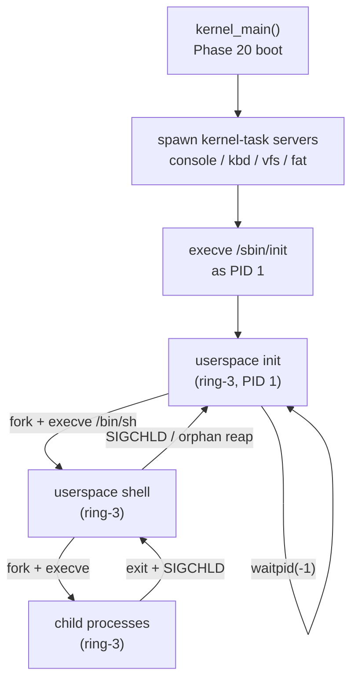

# Phase 20 — Userspace Init and Shell

**Status:** Complete
**Source Ref:** phase-20
**Depends on:** Phase 19 ✅
**Builds on:** Uses signal handling from Phase 19; moves the ring-0 init/shell from earlier phases into ring-3 userspace
**Primary Components:** userspace/init/, userspace/shell/, kernel/src/main.rs

## Milestone Goal

Replace the kernel-resident `init_task` and `shell_task` ring-0 functions with real
ring-3 userspace processes. After this phase PID 1 is a `no_std` Rust binary loaded
from the ramdisk; the interactive shell is a userspace ELF that init spawns. The kernel
is no longer responsible for parsing commands or managing the interactive session.

## Why This Phase Exists

Up to this point, command parsing and the interactive session run inside the kernel
at ring 0. This is both a security risk (a bug in the shell could corrupt kernel
memory) and an architectural dead end (kernel code cannot be replaced or upgraded
without rebooting). Moving init and the shell to ring 3 enforces proper privilege
separation, exercises the full syscall interface end-to-end, and establishes the
standard Unix process hierarchy where PID 1 is the ancestor of all userspace
processes and is responsible for orphan reaping.

## Learning Goals

- Understand the Unix PID 1 contract: why init must never exit and must reap orphaned
  children.
- See how a kernel transitions from running its own code to handing control to a
  userspace binary as the primary interactive process.
- Learn how a minimal shell uses `fork`, `execve`, `waitpid`, `dup2`, and `pipe`
  without depending on libc.
- See what `no_std` userspace Rust looks like in practice: syscall wrappers, manual
  stack setup, and `#[panic_handler]`.
- Understand how pipe fd plumbing works at the kernel level: two file descriptors
  pointing at the same kernel buffer, one for reading and one for writing, with
  EOF triggered when the last write end closes.
- See why the shell must close both ends of a pipe in the parent process after forking,
  or the child reader will never see EOF.

## Feature Scope

- **`userspace/init`**: minimal `no_std` Rust binary; sets up `stdin`/`stdout`/`stderr`
  fds; `fork` + `execve /bin/sh`; loops on `waitpid(-1, WNOHANG)` to reap orphans;
  never exits (infinite wait loop if shell dies); writes a boot banner to stdout before
  spawning the shell
- **`userspace/shell`**: interactive `no_std` Rust shell; reads `stdin` byte by byte
  into a line buffer; parses command and arguments; `fork` + `execve`; `waitpid` for
  foreground jobs; two-stage `cmd1 | cmd2` pipes via `pipe` + `dup2`; `>` / `<`
  I/O redirection; `cd` builtin via `chdir` syscall; `exit` builtin; `Ctrl-C` (`SIGINT`)
  kills the foreground child via `kill(child_pid, SIGINT)`; prints a `$` prompt and
  echoes characters as they are typed (since the keyboard server does not do echo)
- **`kernel_main` cleanup**: remove the call to `init_task()`; instead load and
  `execve` the `/sbin/init` ELF as PID 1 after the kernel-task servers are running
- **Remove** `shell_task()` and `init_task()` from `kernel/src/main.rs`; `stdin_feeder_task`
  may remain as a kernel task bridging the keyboard server ring buffer into the PID 1
  stdin fd
- **`Cargo.toml` / xtask**: uncomment the `userspace/init` and `userspace/shell`
  workspace members; add them to the ramdisk image build step

## Important Components and How They Work

### Userspace Init (PID 1)

A `no_std` Rust binary that opens `/dev/console` as fds 0, 1, 2, then forks and execs
`/bin/sh`. It enters an infinite `waitpid(-1, WNOHANG)` + `pause` loop to reap orphaned
children. Init must never exit; if the shell dies, it re-spawns or waits gracefully.

### Userspace Shell (sh0)

An interactive `no_std` Rust shell that reads one byte at a time from fd 0, accumulates
a line buffer (max 256 bytes), tokenizes on whitespace (respecting single-quoted strings),
and dispatches commands. Builtins (`cd`, `exit`) are handled directly. External commands
use `fork` + `execve` with `waitpid` for foreground execution. Pipe support uses `pipe`
+ `dup2` for two-stage `cmd1 | cmd2` pipelines. I/O redirection (`>`, `<`) uses `open`
+ `dup2` in the child before exec.

### Syscall Shim Layer

Inline-asm wrappers shared by both binaries for `read`, `write`, `fork`, `execve`,
`waitpid`, `exit`, `pipe`, `dup2`, `open`, `close`, `chdir`, `kill`, `getpid`. These
follow the System V AMD64 ABI syscall convention.

### Kernel Boot Transition

In `kernel_main`, after all kernel-task servers are started, the kernel loads `/sbin/init`
from the ramdisk via the ELF loader, allocates a new address space, and transfers to
ring-3 as PID 1. The `init_task()` and `shell_task()` functions are removed from
`kernel/src/main.rs`.

## How This Builds on Earlier Phases

- **Replaces Phase 9**: the ring-0 kernel shell from Phase 9 is replaced by a ring-3
  userspace shell
- **Extends Phase 11**: uses the ELF loader and process model to load init and the
  shell as userspace binaries
- **Extends Phase 14**: exercises `fork`, `execve`, `waitpid`, `pipe`, and `dup2`
  syscalls as the primary execution model
- **Extends Phase 19**: uses signal handling for `SIGINT` delivery to foreground
  children and `SIGCHLD` for child exit notification
- **Reuses Phase 18**: relies on directory navigation (`chdir`, `getcwd`) and path
  resolution for the `cd` builtin

## Implementation Outline

1. Uncomment `userspace/init` and `userspace/shell` in the workspace `Cargo.toml` and
   verify each crate has `#![no_std]`, a `#[panic_handler]`, and a `_start` entry point
   that calls into Rust (or a thin asm stub that sets up `rbp` and calls `main`).
2. Write the syscall shim layer shared by both binaries: inline-asm wrappers for
   `read`, `write`, `fork`, `execve`, `waitpid`, `exit`, `pipe`, `dup2`, `open`,
   `close`, `chdir`, `kill`, `getpid`.
3. Implement `userspace/init/src/main.rs`: open `/dev/console` as fds 0, 1, 2; fork
   and exec `/bin/sh`; enter an infinite `waitpid(-1, WNOHANG)` + `pause` loop.
4. Implement the line-reader in `userspace/shell`: read one byte at a time from fd 0
   until `\n` or `\r`; handle backspace; cap line length at 256 bytes.
5. Implement the tokenizer: split on whitespace, respect single-quoted strings, expand
   nothing else (no glob, no variable expansion in this phase).
6. Implement command dispatch: detect `cd` and `exit` builtins; otherwise `fork` +
   `execve`; parent calls `waitpid` for foreground; print exit status on non-zero.
7. Implement pipe support: detect `|` token; allocate a `pipe` fd pair; fork left
   child with `dup2(pipe_write, STDOUT_FILENO)`; fork right child with
   `dup2(pipe_read, STDIN_FILENO)`; close both pipe ends in the parent; `waitpid` both.
8. Implement `>` and `<` redirection: open the target file before `fork`; after `fork`
   in the child, `dup2` onto stdout or stdin; close the extra fd; exec.
9. In `kernel_main`, after all kernel-task servers have been started, load `/sbin/init`
   from the ramdisk via the ELF loader, allocate a new address space, and transfer to
   ring-3 as PID 1. Remove the `init_task()` and `shell_task()` function calls.
10. Add the two ELF binaries to the xtask ramdisk assembly step so they appear at
    `/sbin/init` and `/bin/sh` in the filesystem image.
11. Validate end-to-end: boot in QEMU, observe the shell prompt, run `echo hello`,
    run `ls | cat`, run `cat /etc/motd > /tmp/out`, run `cd /bin && pwd`.
12. Confirm that the `stdin_feeder_task` kernel task (or equivalent) correctly feeds
    keyboard bytes into the PID 1 process's stdin fd, so that the shell's `read(0, ...)`
    syscall blocks until a key is pressed rather than spinning.
13. Run `cargo xtask check` to confirm no new clippy warnings are introduced by the
    two new workspace members before declaring the phase complete.

## Acceptance Criteria

- The OS boots and presents an interactive shell prompt without any ring-0 command
  parsing code running.
- `ps` (or `cat /proc/1/status` if available) shows PID 1 is `init` and PID 2 is `sh`.
- `echo hello world` prints correctly.
- `ls | cat` produces the directory listing via a two-stage pipe.
- `cat /sbin/init > /dev/null` exercises I/O redirection without crashing.
- `cd /bin && pwd` prints `/bin`.
- `Ctrl-C` during a long-running child kills the child but leaves the shell running.
- Orphaned grandchildren are reaped by PID 1 (not left as zombies indefinitely).
- `exit` in the shell causes init to re-spawn it (or the boot stops gracefully).
- `kernel/src/main.rs` no longer contains `shell_task` or `init_task` functions.
- A command that does not exist (e.g. `notacommand`) causes `execve` to fail; the shell
  prints an error and returns to the prompt without crashing.
- Running `true` exits 0; running `false` exits 1; the shell prints nothing extra for
  `true` and prints a non-zero exit notice for `false`.

## Companion Task List

- [Phase 20 Task List](./tasks/20-userspace-init-shell-tasks.md)

## How Real OS Implementations Differ

- Production init systems (systemd, OpenRC, s6) handle service supervision, dependency
  ordering, socket activation, cgroups, and logging.
- Even BusyBox's `init` handles `/etc/inittab` respawn entries, runlevels, and
  `sysvinit` compatibility.
- Real shells (dash, bash) implement full POSIX parameter expansion, here-documents,
  arithmetic, function definitions, and complex job control.
- This phase targets only the subset needed to run interactive commands and pipelines --
  enough to feel like a real shell without the decades of accumulated specification
  compliance.

## Deferred Until Later

- Moving kernel-task servers (`console_server`, `kbd_server`, `vfs_server`, `fat_server`)
  to ring-3 userspace (requires the capability-grant IPC phase)
- PTY / TTY line discipline (`/dev/pts`, `termios`, raw mode, character echo)
- Job control: `SIGTSTP`, `SIGCONT`, `fg`, `bg`, process groups, sessions
- Multi-user login and `/etc/passwd`
- Shell scripting: loops, conditionals, functions, variable assignment
- Environment variable export and `$VAR` expansion
- Tab completion and readline-style editing
- `exec` builtin (replace shell image) and `source` / `.`
- Pipelines longer than two stages
- Subshell expansion `$(...)` and backtick substitution
- Here-documents and here-strings
- Stderr redirection (`2>`, `2>&1`) and fd duplication beyond 0/1/2
