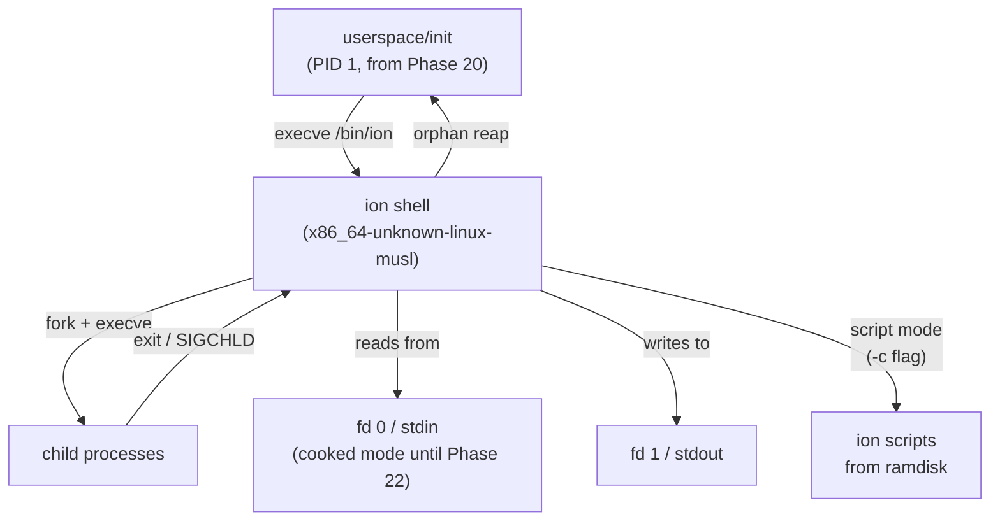
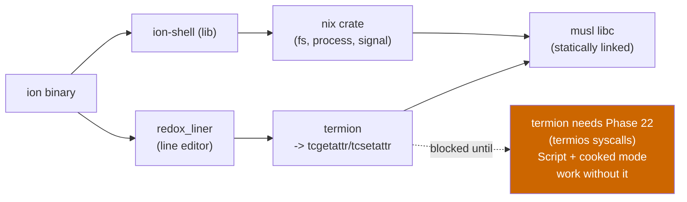

# Phase 21 — Ion Shell Integration

**Status:** Complete
**Source Ref:** phase-21
**Depends on:** Phase 20 ✅
**Builds on:** Replaces the minimal sh0 shell from Phase 20 with the Ion shell; reuses the init binary and syscall infrastructure from Phase 20
**Primary Components:** userspace/init/, xtask/

## Milestone Goal

Replace the minimal `no_std` shell from Phase 20 with
[ion](https://github.com/redox-os/ion) -- the shell built for Redox OS, another custom
Rust OS. After this phase `/bin/ion` is the interactive shell that userspace init
spawns. The kernel-level and custom-shell scaffolding from Phase 20 remains as a
regression harness; the user-facing shell gains a real scripting language, job control,
pipelines, and interactive line editing (the latter pending Phase 22 TTY).



## Why This Phase Exists

The minimal sh0 shell from Phase 20 proves that userspace process management works,
but it lacks variable expansion, loops, functions, scripting, and all the features
expected of a real interactive shell. Rather than building these features from scratch,
this phase integrates Ion -- a shell already designed for a custom Rust OS (Redox) that
targets the same Linux ABI m3OS implements. This validates that the kernel's syscall
surface is complete enough to run a real-world Rust application compiled against musl
libc, and it gives users a capable shell without months of shell language development.

## Learning Goals

- See how a shell built for another custom OS can be ported by targeting the Linux ABI.
- Understand what `x86_64-unknown-linux-musl` means: a fully static binary that
  carries its own libc and has no dynamic linker dependency.
- Learn what a real shell execution engine looks like compared to the Phase 20 minimal
  shell: how ion manages a variable scope, expands words, and builds pipelines.
- Observe what ion's cooked-input interactive mode looks like vs. its raw-mode line
  editor (the latter requires termios from Phase 22).
- Understand what musl-compiled binaries require from the ELF loader: static linking
  means no `PT_INTERP` segment, no dynamic linker, no `LD_LIBRARY_PATH`.

## Feature Scope

- **Cross-compile ion** to `x86_64-unknown-linux-musl` on the host build machine as
  part of the xtask image build step
- **Bundle ion** as `/bin/ion` in the ramdisk image (alongside the Phase 20 minimal
  shell at `/bin/sh0`)
- **Update `userspace/init`** to `execve("/bin/ion", ...)` instead of `/bin/sh`;
  fall back to `/bin/sh0` if `/bin/ion` is missing
- **Verify script mode**: ion launched with `-c "echo hello"` runs correctly
- **Verify interactive cooked mode**: ion presents its prompt, reads lines, executes
  commands, handles `|` pipelines, `>` / `<` redirection, variables, and `cd`
- **Keep `/bin/sh0`** (the Phase 20 minimal shell) as a regression tool; it is
  not removed from the ramdisk
- **xtask integration**: the `cargo xtask image` build step cross-compiles ion if a
  pre-built binary is not found in `xtask/vendor/`

## Important Components and How They Work

### Why Ion?

Ion was designed from scratch for Redox OS -- a microkernel Rust OS that also provides
its own syscall layer. It has already been adapted to run on a non-Linux, non-POSIX OS
by its original authors. m3OS targets the Linux x86_64 ABI, which is the *same* ABI
ion was originally written for, making the port even more direct.

Crucially, ion uses **no tokio, no async/await, no threading, no epoll**. Its only
non-trivial OS requirements are:

| ion Requirement | m3OS Status After Phase 20 |
|---|---|
| Rust `std` + musl libc | Phase 12 complete |
| `fork` / `execve` / `waitpid` | Phase 11 complete |
| `pipe` / `dup2` / `open` / `read` / `write` | Phase 13/14 complete |
| `sigaction` / `kill` / `sigprocmask` | Phase 19 complete |
| `tcgetattr` / `tcsetattr` (interactive mode) | Phase 22 |

Ion's interactive mode (line editing, history, raw terminal) depends on `termios` and
is unlocked in Phase 22. This phase targets **script mode and cooked-input interactive
mode** -- the user types at a line-buffered prompt and ion processes it.

### Ion Dependency Map



The dashed edge shows the one remaining gap. All solid edges are unblocked after Phase
19 + musl (Phase 12).

### What Changes Relative to Phase 20

| Aspect | Phase 20 | Phase 21 |
|---|---|---|
| Shell binary | `/bin/sh` (custom `no_std`) | `/bin/ion` (ion, musl-static) |
| Shell language | Whitespace tokenizer, `cd`/`exit` | Full ion: variables, loops, functions, pipelines |
| Line editing | Byte-by-byte cooked read | Cooked mode (raw mode in Phase 22) |
| Job control | Basic `SIGINT` to foreground | ion's built-in `fg`/`bg`/`jobs` |
| Scripting | None | `.ion` script files, `source`, functions |
| Validation harness | The shell itself | `/bin/sh0` (the Phase 20 shell, kept for regression) |

## How This Builds on Earlier Phases

- **Replaces Phase 20 shell**: the minimal sh0 shell from Phase 20 is replaced as
  the default interactive shell by Ion, though sh0 is kept as a fallback
- **Reuses Phase 20 init**: the `userspace/init` binary from Phase 20 is updated to
  exec Ion instead of sh0
- **Depends on Phase 19**: Ion requires `sigaction`, `kill`, and `sigprocmask` for
  signal handling
- **Depends on Phase 12**: Ion is compiled against musl libc, which was made
  functional in Phase 12
- **Depends on Phase 11/14**: Ion exercises `fork`, `execve`, `waitpid`, `pipe`,
  and `dup2` from earlier phases

## Implementation Outline

1. **Verify ion compiles on the host against `x86_64-unknown-linux-musl`:**
   ```bash
   rustup target add x86_64-unknown-linux-musl
   cargo install --locked ion-shell --target x86_64-unknown-linux-musl
   # or: git clone + cargo build --release --target x86_64-unknown-linux-musl
   ```
   Confirm the binary is fully static (`ldd ion` reports "not a dynamic executable").

2. **Add ion to xtask build pipeline**: in `xtask/src/main.rs`, after building the
   kernel and userspace binaries, check for a vendored ion binary at
   `xtask/vendor/ion`; if absent, build it from source using the musl target. Copy
   the resulting ELF into the ramdisk at `/bin/ion`.

3. **Update `userspace/init`**: change the `execve` call from `/bin/sh` to
   `/bin/ion`. Add a fallback: if `/bin/ion` `execve` returns `ENOENT`, fall back to
   `/bin/sh0`.

4. **Smoke test script mode** inside QEMU: have init launch
   `ion -c 'echo ion is alive'` before spawning the interactive shell; verify output
   appears on console.

5. **Verify cooked interactive mode**: boot into QEMU, observe the ion prompt
   (`> ` or whatever `$PS1` resolves to), run basic commands:
   - `echo hello world`
   - `ls | cat` (two-stage pipeline)
   - `for i in 1 2 3 { echo $i }` (ion loop syntax)
   - `let x = 5; echo $x` (variable assignment)
   - `cd /bin && pwd`
   - `Ctrl-C` should kill the foreground child, not ion itself

6. **Validate signal behavior**: confirm `SIGINT` (from `Ctrl-C`) is delivered to the
   foreground child process group and not to ion, consistent with Phase 19's signal
   implementation.

7. **Document the musl-static binary requirement** in the xtask section: why
   `PT_INTERP` must be absent, and why `x86_64-unknown-linux-musl` produces a fully
   self-contained ELF that the m3OS ELF loader can handle without a dynamic linker.

8. **Run `cargo xtask check`** to confirm no new clippy warnings from the xtask
   changes.

## Acceptance Criteria

- `cargo xtask image` produces a disk image containing `/bin/ion` without manual
  intervention.
- Booting in QEMU presents the ion prompt.
- `echo hello` prints `hello`.
- `let x = world; echo $x` prints `world`.
- `ls | cat` produces a directory listing via ion's pipeline execution.
- `for i in a b c { echo $i }` prints three lines.
- `cd /tmp && pwd` prints `/tmp`.
- `Ctrl-C` during `sleep 10` kills the sleep child; ion returns to its prompt.
- `/bin/sh0` still boots and works as a fallback.
- `file /bin/ion` (or equivalent ELF header inspection) confirms the binary is
  statically linked with no `PT_INTERP` segment.
- The Phase 20 acceptance criteria still pass when using `/bin/sh0`.

## Companion Task List

- [Phase 21 Task List](./tasks/21-ion-shell-tasks.md)

## How Real OS Implementations Differ

- Production Linux distributions ship bash, dash, zsh, or fish as `/bin/sh` or the
  default interactive shell.
- These are either C programs linked against glibc or statically linked against musl
  (Alpine Linux uses busybox ash linked with musl).
- The key difference is that real distributions have package managers that download
  pre-built shell binaries; m3OS builds everything from source or vendors binaries
  directly into the ramdisk during the image build step.
- The educational insight here is that a shell is just a program -- as long as the
  kernel provides the right syscalls, any shell binary built for the same ABI will run
  unmodified.

## Deferred Until Later

- Ion's interactive raw-mode line editor (requires `tcgetattr`/`tcsetattr`)
- History persistence (requires a writable filesystem path for `~/.local/share/ion/history`)
- Tab completion with reedline-style highlighting
- `SIGWINCH` / window size changes
