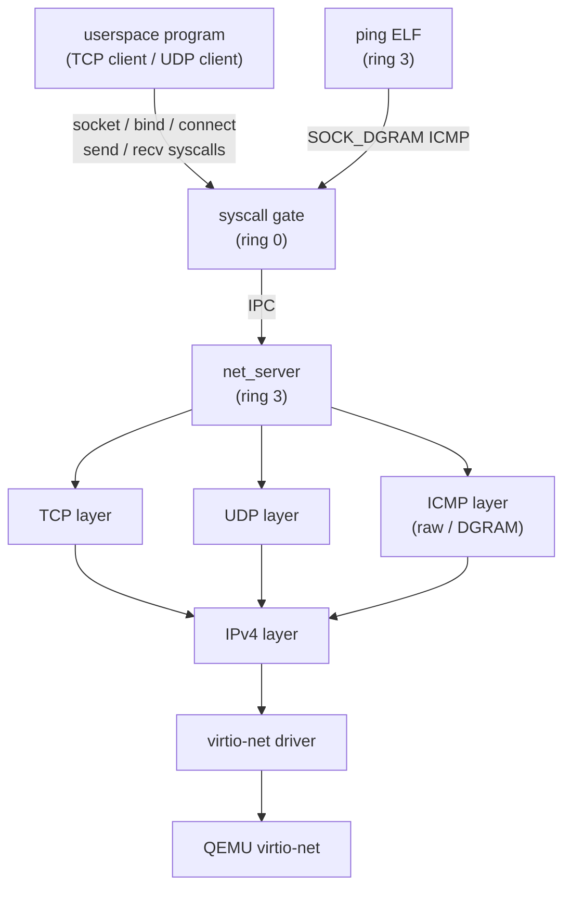

# Phase 22 — Socket API

## Milestone Goal

Expose the kernel's existing TCP/IP stack to userspace via standard Linux socket
syscalls. At the end of this phase a userspace program can open a TCP connection,
send an HTTP/1.0 request, and receive the response — entirely from ring-3 code, with
no kernel modifications needed for each new network program. The `ping` shell builtin
moves out of the kernel and into a standalone userspace ELF.

## Learning Goals

- Understand how socket syscalls map to internal kernel objects and how fds unify
  files and sockets behind the same descriptor table.
- See how a userspace network server serializes and deserializes socket operations
  over IPC.
- Learn how `poll` generalizes across fd types (files, pipes, sockets) and why it is
  essential for network programs.
- See why `ping` previously had to live in the kernel and how moving it to userspace
  demonstrates the socket layer is genuinely complete.

## Feature Scope

- **Socket syscalls** (Linux ABI numbers, AF_INET only):
  - `socket` (41): create a TCP or UDP socket fd
  - `bind` (49): bind to a local address and port
  - `connect` (42): initiate a TCP three-way handshake or set the peer for UDP
  - `listen` (50) and `accept` (43): TCP server accept loop
  - `send` / `sendto` (44 / 45): write data or a datagram
  - `recv` / `recvfrom` (45 / 47): read data or a datagram with sender address
  - `shutdown` (48): half-close a TCP connection
  - `getsockname` (51) and `getpeername` (52): query local and remote addresses
  - `setsockopt` (54) and `getsockopt` (55): `SO_REUSEADDR`, `SO_KEEPALIVE`,
    `SO_RCVBUF`, `SO_SNDBUF`, `TCP_NODELAY`
- **`poll` extension**: add socket fds to the existing `poll` syscall so programs
  can wait on multiple sockets and file descriptors simultaneously
- **Per-process socket fd integration**: sockets share the same fd table as files;
  `close` on a socket fd tears down the connection
- **ICMP via `SOCK_DGRAM`**: allow `socket(AF_INET, SOCK_DGRAM, IPPROTO_ICMP)` so
  ping can be implemented without raw sockets
- **`ping` userspace ELF**: rewrite the kernel builtin as a standalone ring-3 binary
  using the new ICMP socket; remove the kernel builtin

## Implementation Outline

1. Define a `SocketHandle` type in the kernel and add a socket slot to the
   per-process fd table alongside file and pipe slots. A socket fd must be
   indistinguishable from a file fd from userspace; `close`, `read`, and `write`
   must all work on it via the existing fd dispatch path.
2. Add a `sys_socket` dispatch path in the syscall gate: validate the domain
   (`AF_INET` only), type (`SOCK_STREAM` or `SOCK_DGRAM`), and protocol; allocate a
   `SocketHandle`; send a `NET_SOCKET_CREATE` IPC message to `net_server`; and
   return the new fd number.
3. Implement `sys_bind` and `sys_connect` as thin syscall stubs that copy the
   `sockaddr_in` from userspace, forward it to `net_server` via IPC, and block the
   calling task until the operation completes or returns an error code.
4. Implement `sys_listen` and `sys_accept`. `accept` blocks the calling task in the
   kernel; `net_server` unblocks it and returns the peer address and a new socket fd
   when the TCP handshake completes.
5. Implement `sys_send` / `sys_sendto` and `sys_recv` / `sys_recvfrom`. For TCP,
   `net_server` may need to buffer partial sends across multiple IPC messages; for
   UDP, each call maps to one datagram. Copy data through a shared page capability to
   avoid copying through the IPC message payload.
6. Implement `sys_shutdown`, `sys_getsockname`, `sys_getpeername`, `sys_setsockopt`,
   and `sys_getsockopt`. Support at minimum `SOL_SOCKET` options `SO_REUSEADDR`,
   `SO_KEEPALIVE`, `SO_RCVBUF`, `SO_SNDBUF`, and `IPPROTO_TCP` option
   `TCP_NODELAY`.
7. Extend `sys_poll` to handle socket fds. Teach `net_server` to track per-socket
   readiness state and send a notification to the kernel when a socket becomes
   readable or writable so a blocked `poll` call can be woken.
8. Add `SOCK_DGRAM` / `IPPROTO_ICMP` support to `net_server`'s socket dispatch.
   Sending on such a socket constructs an ICMP echo request; receiving delivers the
   first matching ICMP echo reply. No raw socket privilege check is required for
   ICMP DGRAM in this phase.
9. Write `userspace/ping/` as a standalone ELF binary. Open an ICMP DGRAM socket,
   send echo requests in a loop, use `poll` to wait for replies with a timeout,
   and print each round-trip time to stdout.
10. Remove the `ping` builtin from `kernel/src/main.rs` and delete the associated
    dead-code paths.
11. Remove the `#[allow(dead_code)]` annotations from the network stack modules in
    `kernel/src/net/` now that they are reachable from userspace through `net_server`.

## Acceptance Criteria

- `socket(AF_INET, SOCK_STREAM, 0)` returns a valid fd; `close` on it sends a TCP
  RST or FIN as appropriate.
- A userspace TCP client can connect to `10.0.2.2:80`, send an HTTP/1.0 `GET /`
  request, and print the response body to stdout.
- A userspace TCP server can `bind`, `listen`, and `accept` a connection from the
  QEMU host and echo data back.
- A userspace UDP client can send a datagram to a host echo server and receive the
  reply.
- `poll([{fd: sock, events: POLLIN}], 1, timeout_ms)` returns when data arrives and
  0 when it times out with no data.
- `ping 10.0.2.2` runs as a userspace ELF (not a shell builtin) and receives ICMP
  echo replies.
- The `ping` kernel builtin no longer exists in `kernel/src/main.rs`.
- `setsockopt(fd, IPPROTO_TCP, TCP_NODELAY, ...)` has observable effect (disables
  Nagle; small sends are not coalesced).

## Companion Task List

- [Phase 22 Task List](./tasks/22-socket-api-tasks.md)

## Documentation Deliverables

- document the socket syscall table: Linux numbers, parameter layouts, and how each
  routes to `net_server` via IPC
- explain how sockets integrate with the fd table alongside files and pipes
- document the IPC protocol between the syscall gate and `net_server` for each
  socket operation
- explain how `poll` is extended to cover socket fds: how `net_server` signals
  readiness back to the blocked kernel task
- explain why `SOCK_DGRAM ICMP` is used for `ping` instead of raw sockets, and what
  the kernel-side privilege check looks like
- document the before/after for the `ping` builtin removal

## How Real OS Implementations Differ

Linux's socket layer (`net/socket.c`) handles dozens of address families (AF_INET6,
AF_UNIX, AF_NETLINK, AF_PACKET, AF_VSOCK, and more), non-blocking I/O through
`epoll`, zero-copy sends via `sendfile` and `splice`, multicast group membership,
`SO_REUSEPORT` for multi-process listeners, `io_uring` for async socket I/O, and
a full `netfilter` hook chain for firewalling and NAT. The socket buffer (`sk_buff`)
is a carefully optimized structure that avoids copies across protocol layers. This
phase implements a single address family with blocking I/O and a simple `poll`
extension — enough to run real network programs but with none of the performance or
scalability mechanisms of a production stack.

## Deferred Until Later

- AF_UNIX (Unix domain sockets)
- AF_INET6 (IPv6)
- Raw sockets (`SOCK_RAW`) for userspace
- `epoll` and `epoll_wait`
- `sendfile` and zero-copy I/O
- Multicast group membership (`IP_ADD_MEMBERSHIP`)
- `SO_REUSEPORT` for multi-process listeners
- Non-blocking sockets (`O_NONBLOCK`) and `EAGAIN` handling
- DNS resolution (`getaddrinfo` / `/etc/resolv.conf`)
- TLS / DTLS
- TCP retransmission and congestion control improvements
- `recvmsg` / `sendmsg` with ancillary data (`cmsg`)
