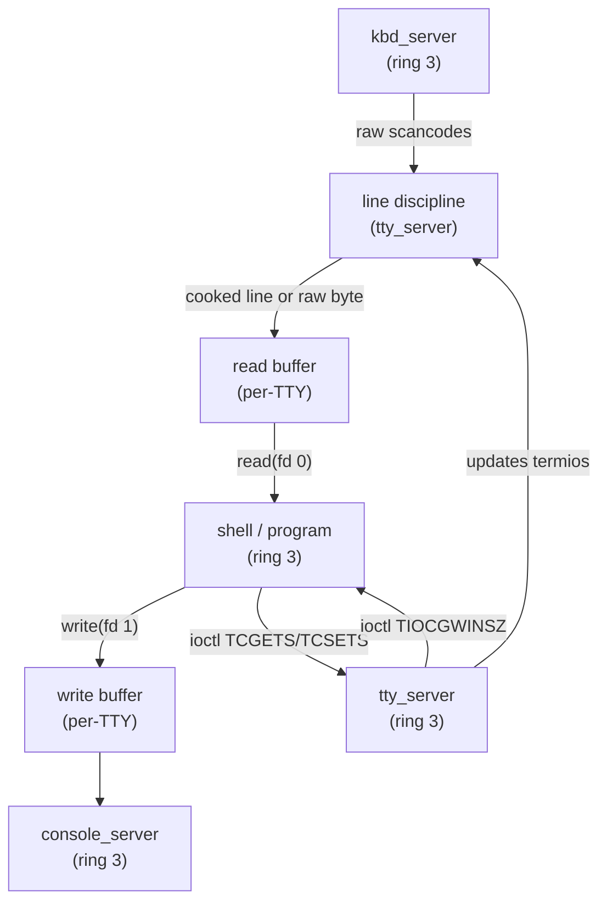

# Phase 22 — TTY and Terminal Control

## Milestone Goal

Give userspace programs a real terminal abstraction. The kernel's raw stdin buffer and
hardcoded `stdin_feeder_task` are replaced by a proper TTY layer with a configurable
line discipline. Programs can switch between cooked and raw mode via `tcgetattr` /
`tcsetattr`, query the window size via `TIOCGWINSZ`, and detect whether they are
attached to a terminal via `isatty`. The phase also lays the infrastructure for a
future PTY master/slave pair.

## Learning Goals

- Understand what a line discipline is and why it lives between the keyboard driver
  and userspace.
- See how `termios` fields map to observable input/output behaviors: echo, erase,
  kill character, INTR, QUIT, SUSP.
- Learn the difference between cooked mode (canonical), raw mode, and cbreak.
- Understand why `isatty` exists and what programs do differently when stdin is not a
  terminal.
- See the PTY master/slave model at a conceptual level and why it is needed for
  terminal multiplexers and SSH.

## Feature Scope

- **`tty_server`**: new ring-3 server that owns the TTY state; replaces
  `stdin_feeder_task`
- **Line discipline**:
  - cooked (canonical) mode: buffer until newline, handle erase (`^H`/`DEL`),
    kill (`^U`), and word-erase (`^W`)
  - raw mode: no buffering, no echo, every byte passed immediately
  - cbreak mode: no line buffering but signals still generated
  - special characters: INTR (`^C`), QUIT (`^\`), SUSP (`^Z`), EOF (`^D`)
- **`termios` struct** and the syscalls that manipulate it:
  - `tcgetattr` / `tcsetattr` implemented as `ioctl(fd, TCGETS, ...)` /
    `ioctl(fd, TCSETS, ...)`
  - `TCSANOW`, `TCSADRAIN`, `TCSAFLUSH` flush semantics
  - `c_iflag`, `c_oflag`, `c_cflag`, `c_lflag`, `c_cc` fields
- **`TIOCGWINSZ` / `TIOCSWINSZ`**: real window size stored and updated; `SIGWINCH`
  delivered to the foreground process group when the size changes
- **`isatty`**: `ioctl(fd, TCGETS, ...)` returns 0 on a TTY fd, `ENOTTY` on a plain
  file — programs that call `isatty` now behave correctly
- **PTY skeleton**: `posix_openpt` / `grantpt` / `unlockpt` / `ptsname` stubs that
  allocate a PTY pair but do not yet wire the full data path (full PTY deferred)

## Implementation Outline

1. Define the `Termios` struct in a shared userspace library crate matching the Linux
   layout (`c_iflag`, `c_oflag`, `c_cflag`, `c_lflag`, `c_cc[NCCS]`). Use the same
   field sizes and byte order as the Linux x86_64 ABI so that musl-compiled code can
   pass the struct directly through `ioctl`.
2. Create `tty_server` as a ring-3 server binary. Add it to the `xtask` image build
   so it is included in the disk image. Have `init` spawn it before the shell and
   wire stdin/stdout fds through it via capability grants.
3. Implement the cooked-mode line discipline in `tty_server`: read raw bytes from
   `kbd_server`, maintain an edit buffer, apply erase (`^H` / `DEL`), kill (`^U`),
   and word-erase (`^W`) processing, and deliver a complete line to the read buffer
   when `\n` or `^D` (EOF) is received.
4. Implement echo: in cooked mode, each accepted character is written back to
   `console_server`. Echo is suppressed when `ECHO` is clear in `c_lflag`.
5. Implement raw mode: when `ICANON` is clear in `c_lflag`, bypass line buffering and
   deliver bytes to the read buffer immediately; respect `VMIN` and `VTIME` from
   `c_cc` to control minimum read size and timeout.
6. Implement cbreak mode: `ICANON` clear but `ISIG` set, so `^C` and `^Z` still
   generate signals while reads return individual bytes.
7. Add `ioctl` dispatch in the syscall gate for `TCGETS` (0x5401), `TCSETS` (0x5402),
   `TCSETSW` (0x5403), `TCSETSF` (0x5404); route each to `tty_server` via a
   synchronous IPC call and copy the `Termios` struct through a shared page.
8. Implement `TIOCGWINSZ` (0x5413) and `TIOCSWINSZ` (0x5414) storage in
   `tty_server`. When `TIOCSWINSZ` is called with new dimensions, send `SIGWINCH` to
   the foreground process group.
9. Fix `isatty` path: `ioctl(fd, TCGETS, NULL)` on a non-TTY fd must return `ENOTTY`
   (`-25`). Ensure the fd table distinguishes TTY fds from plain file fds so the
   syscall gate returns the right error without forwarding to `tty_server`.
10. Add PTY allocation stubs: `posix_openpt` opens `/dev/ptmx` and allocates a
    `PtyPair` in `tty_server`; `grantpt` / `unlockpt` are no-ops; `ptsname` returns
    a `/dev/pts/N` path string. Opening the slave path returns a second fd backed by
    the same `PtyPair`. Full bidirectional data routing between master and slave is
    deferred.
11. Regression-test the shell: readline-style editing, `Ctrl-C`, `Ctrl-Z`, `Ctrl-D`
    (EOF), and piped input all work correctly through the new layer without
    behavioral changes compared to Phase 20.

## Acceptance Criteria

- The shell's line editing (`^H`, `^U`, `^W`, `^C`, `^D`) works identically to
  before, now routed through `tty_server`.
- A program that calls `tcgetattr` receives a valid `termios` struct; calling
  `tcsetattr(TCSANOW, &raw)` switches to raw mode and subsequent reads return
  individual bytes without echo.
- Calling `tcsetattr` to restore the saved `termios` returns the terminal to cooked
  mode.
- `ioctl(STDOUT_FILENO, TIOCGWINSZ, &ws)` returns the correct `ws_col` and `ws_row`
  values.
- `isatty(0)` returns 1 when stdin is the TTY; `isatty(3)` on a plain open file
  returns 0.
- `SIGWINCH` is delivered to the shell when `TIOCSWINSZ` is called with new
  dimensions.
- The existing shell and all Phase 14 utilities pass their acceptance criteria
  without regression.

## Companion Task List

- [Phase 22 Task List](./tasks/22-tty-pty-tasks.md)

## Documentation Deliverables

- explain the line discipline model: why it sits between the keyboard driver and
  userspace rather than in either one
- document the `termios` field layout and which flags control which behaviors
- explain the difference between canonical, raw, and cbreak modes with examples of
  which programs use each
- document the `ioctl` dispatch path from userspace through the syscall gate to
  `tty_server`
- explain `isatty` and why programs change behavior based on it (e.g., disabling
  color output when stdout is a pipe)
- explain the PTY master/slave model conceptually: why terminal emulators and SSH
  need it and how data flows between master and slave

## How Real OS Implementations Differ

Linux's TTY subsystem is one of the oldest and most complex parts of the kernel.
The line discipline (`N_TTY` and others) runs in ring 0, not in a userspace server.
The PTY implementation in `drivers/tty/pty.c` handles hundreds of `ioctl` codes,
flow control via `VSTART`/`VSTOP` (XON/XOFF), modem control lines, packet mode, and
the `/dev/pts` devpts filesystem. Real terminal emulators (xterm, alacritty) open
`/dev/ptmx`, fork a child with the slave as its controlling terminal, and process
VT100/ANSI escape sequences. This phase implements only the subset needed for an
interactive shell: termios cooked/raw switching, window size, and skeleton PTY
allocation. A full escape-sequence processor and devpts filesystem are deferred.

## Phase 22 Follow-up: Ion Interactive Mode (Complete)

The Ion shell interactive mode was blocked by several kernel bugs discovered
during investigation. All were fixed in the `fix/pipe-refcount-init` branch:

| Fix | Problem | Root Cause |
|-----|---------|------------|
| Pipe refcount init=0 | Pipe slot reuse corruption during fork+exec | `Pipe::new()` started reader/writer counts at 1 instead of 0; syscalls relied on the implicit initial count rather than explicitly incrementing |
| Futex force-clear | musl lock deadlock spinning on `futex(WAIT)` | Single-threaded OS has no other thread to release locks; `FUTEX_WAIT` now clears the lock word to 0 when `*uaddr == val` |
| CoW in copy_to_user | `EFAULT` on post-fork writes from syscall handlers | `copy_to_user` rejected CoW pages (read-only + BIT_9) instead of resolving the fault; ring-0 writes never trigger page faults |
| .elf suffix fallback | External commands not found by Ion | musl's `execvp` tried `/bin/ls` but ramdisk stores `/bin/ls.elf`; `get_file` now tries appending `.elf` |

Ion is now the default boot shell. sh0 remains available as fallback.

## Next: VT100 / ANSI Escape Sequence Processing

Ion's `liner` library redraws the prompt on every keystroke using ANSI escape
sequences (`\x1b[K` clear-to-end, `\x1b[nG` cursor column, `\r` carriage
return). The framebuffer console currently ignores these, causing each redraw
to append rather than overwrite in place. Minimum viable subset needed:

- `\r` (CR) — move cursor to column 0 (may already work)
- `\x1b[K` (EL) — erase from cursor to end of line
- `\x1b[nG` (CHA) — move cursor to column n
- `\x1b[?25l` / `\x1b[?25h` — hide/show cursor
- `\x1b[m` / `\x1b[0m` — reset attributes (SGR, can be a no-op initially)
- `\x1b[nA` / `\x1b[nB` / `\x1b[nC` / `\x1b[nD` — cursor up/down/forward/back

## Deferred Until Later

- Full PTY data path between master and slave (needed for terminal multiplexers,
  SSH, `script`)
- `/dev/pts` devpts filesystem (dynamic slave device nodes)
- `VSTART` / `VSTOP` (XON/XOFF) software flow control
- Modem control lines (DTR, RTS, CTS) and `TIOCMGET` / `TIOCMSET`
- Session leaders and controlling terminals (`TIOCSCTTY`, `setsid`)
- Packet mode (`TIOCPKT`) for terminal multiplexers
- Multiple simultaneous TTY instances beyond the single console TTY
- `openpty` libc helper (depends on full PTY data path)
