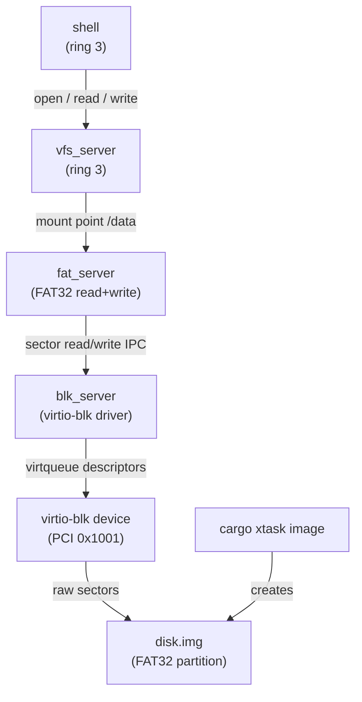

# Phase 24 — Persistent Storage

**Status:** Complete
**Source Ref:** phase-24
**Depends on:** Phase 15 (ACPI/PCI) ✅, Phase 18 (Ramdisk/Initrd) ✅
**Builds on:** Uses PCI enumeration from Phase 15 to discover virtio-blk; extends the VFS from Phase 8 with a persistent FAT32 backend
**Primary Components:** kernel/src/blk/, kernel/src/fs/fat32, xtask disk image builder

## Milestone Goal

Give m3OS a persistent block device so that files written during one boot session
survive into the next. A virtio-blk driver (the simplest PCI virtio device in QEMU)
handles raw sector I/O; a partition parser finds the FAT32 data partition; the
existing `fat_server` gains a write path that flushes directly to disk. After this
phase, writing a file to `/data` and rebooting leaves the file visible on the next
boot (and on the host via `losetup` or similar).

## Why This Phase Exists

Until this phase, all files live in a ramdisk that is discarded on every reboot.
Users cannot save work, configuration changes are lost, and the OS cannot
accumulate state across sessions. Persistent storage is a prerequisite for user
accounts (passwords must survive reboots), build tools (source files must persist),
and any workflow that involves editing and saving files. The virtio-blk driver is
the simplest path to real disk I/O in QEMU, and FAT32 provides a well-understood
writable filesystem that is also readable from the host.

## Learning Goals

- Understand how virtio devices are discovered, initialized, and driven through
  virtqueues over the PCI bus.
- Learn the MBR partition table format and how to locate a data partition after the
  UEFI ESP.
- See how FAT32 write I/O works end-to-end: BPB parsing, cluster allocation, FAT
  table update, and directory entry creation.
- Understand the difference between synchronous (blocking) block I/O and an async
  I/O queue, and why synchronous is acceptable here.
- See how `mount` integrates a new filesystem backend into the VFS dispatch table.

## Feature Scope

- **virtio-blk driver** (`blk_server`):
  - PCI device detection by vendor/device ID (0x1AF4 / 0x1001)
  - legacy virtio interface: feature negotiation, virtqueue setup via PCI BARs
  - synchronous read and write of 512-byte sectors via a single request virtqueue
  - exposes a simple IPC interface: `READ_SECTORS(lba, count, buf)` / `WRITE_SECTORS`
- **Partition table parsing**:
  - MBR: scan partition entries, identify FAT32 partition by type byte (0x0B / 0x0C)
  - GPT: parse header and partition entries, identify FAT32 GUID partition (optional)
- **FAT32 read+write driver** (extending the existing `fat_server`):
  - BPB parsing to locate FAT region, root directory cluster, and data region
  - cluster chain walking for reads and writes
  - `read`, `write` (append and overwrite), `readdir`, `mkdir`, `unlink`, `rename`, `stat`
  - FAT table update on cluster allocation and deallocation
  - directory entry creation and deletion
  - synchronous flush after every write (no writeback cache)
- **`sys_mount` stub**:
  - minimal `mount(src, target, fstype, flags, data)` syscall
  - hard-wired to detect virtio-blk, parse MBR, and register FAT32 at the given mount
    point via the VFS server
- **xtask disk image creation**:
  - create `disk.img` alongside the UEFI boot image: MBR + ESP partition (FAT32,
    copied from the existing UEFI image) + data partition (FAT32, empty)
  - pass the image to QEMU via `-drive file=disk.img,format=raw,if=virtio`

## Important Components and How They Work

### virtio-blk Driver

The driver discovers the device via PCI bus scan (VID=0x1AF4, DID=0x1001), maps
the I/O BAR, and initializes the device through the legacy virtio status byte
sequence (reset, acknowledge, DRIVER, feature negotiation, DRIVER_OK). A single
request virtqueue handles all I/O: each request is a three-descriptor chain
(header + data buffer + status byte). The driver kicks the queue and spin-polls
the used ring for completion.

### MBR Partition Parsing

Reads sector 0, scans the four partition entries, and identifies the FAT32 data
partition by type byte (0x0B or 0x0C). Returns the LBA offset and sector count
for the data partition.

### FAT32 Write Path

Cluster allocation from free FAT entries, chain extension for multi-cluster files,
directory entry creation, and FAT table flush after each mutation. Synchronous
write-through ensures data reaches disk immediately (no writeback cache).

### sys_mount Integration

On first call with `fstype="vfat"`, triggers `blk_server` initialization, runs
MBR parsing, and registers the FAT32 backend with `vfs_server` at the requested
mount point. Init calls `mount("/dev/blk0p1", "/data", "vfat", 0, "")` after
all servers are running.

## How This Builds on Earlier Phases

- **Extends Phase 15 (ACPI/PCI):** uses PCI device enumeration to discover the virtio-blk device
- **Extends Phase 18 (Ramdisk/Initrd):** complements the read-only initrd with a persistent read-write filesystem
- **Extends Phase 8 (VFS):** adds a new mount point and filesystem backend to the VFS dispatch table
- **Extends Phase 6 (IPC):** blk_server and fat_server communicate via IPC messages

## Implementation Outline

1. Update `cargo xtask image` to produce a two-partition `disk.img`: an ESP holding
   the UEFI boot files and an empty FAT32 data partition. Use `mtools` or manual
   sector writes to initialize both FAT32 volumes.
2. Add the QEMU `-drive` argument in `cargo xtask run` so QEMU exposes the virtio-blk
   device at PCI address 0:2.0 (or wherever the bus scan lands it).
3. Implement PCI device lookup in `blk_server`: scan the kernel's cached PCI device
   list for VID=0x1AF4, DID=0x1001; map the I/O BAR.
4. Initialize the virtio-blk device: reset, acknowledge, set DRIVER status, negotiate
   features (only `BLK_F_SIZE_MAX` / `BLK_F_SEG_MAX` as needed), set DRIVER_OK.
5. Set up the request virtqueue: allocate a descriptor ring, available ring, and used
   ring in contiguous physical memory; write the queue addresses into the PCI BAR
   registers.
6. Implement `read_sectors` and `write_sectors`: build a three-descriptor chain (header
   + data buffer + status byte), kick the queue, spin-poll the used ring for
   completion, check the status byte.
7. Implement MBR partition parsing in `blk_server`: read sector 0, scan the four
   partition entries, return the LBA offset and sector count for the FAT32 data
   partition.
8. Extend `fat_server` with a write path: cluster allocation from the free FAT entries,
   chain extension, directory entry creation, and FAT table flush after each
   mutation.
9. Add the `sys_mount` syscall: on first call with `fstype="vfat"`, trigger
   `blk_server` initialization, run MBR parsing, and register the FAT32 backend with
   `vfs_server` at the requested mount point.
10. Wire `init` to call `mount("/dev/blk0p1", "/data", "vfat", 0, "")` after all
    servers are running.
11. Add a shell built-in `mount` that prints the active mount table to verify.

## Acceptance Criteria

- `cargo xtask image` produces a `disk.img` with two valid FAT32 partitions that
  `fsck.fat` (run on the host) reports as clean.
- QEMU boots without regression; `blk_server` logs its PCI address and the detected
  data partition LBA at boot.
- A file written to `/data/hello.txt` inside the shell is visible on the next boot
  without re-initialization.
- The same file is readable from the host after shutdown via `losetup` + `mount` or
  `mtools mcopy`.
- `mkdir`, `unlink`, and `rename` all work inside `/data` and survive a reboot.
- Writing a file larger than one FAT32 cluster (4 KB) allocates a correct cluster
  chain; the file reads back without corruption.
- The UEFI ESP boot path is unaffected; the OS boots from the same `disk.img` that
  holds the data partition.

## Companion Task List

- [Phase 24 Task List](./tasks/24-persistent-storage-tasks.md)

## How Real OS Implementations Differ

- Production block I/O stacks are built around asynchronous submission queues (Linux
  `io_uring`, NVMe submission/completion queues, Windows I/O completion ports) so that
  a thread is never stalled waiting for a single sector.
- The page cache decouples the filesystem from disk latency: writes land in RAM first
  and are flushed in batches by writeback threads.
- FAT32 itself is rarely used for root filesystems; production systems use journaling
  filesystems (ext4, XFS, APFS, NTFS) or log-structured designs (F2FS, btrfs) that
  survive power loss without corruption.
- The virtio 1.0 split-driver model (and its modern PCIe variant with packed
  virtqueues) replaces the legacy BAR-based interface used here.
- This phase deliberately keeps every layer synchronous and stateless to make the
  control flow auditable in a single read-through.

## Deferred Until Later

- NVMe, AHCI/SATA, or USB mass storage drivers
- virtio 1.0 / modern interface (packed virtqueues, capability-based config)
- page cache and write-back buffering
- GPT partition parsing (MBR only required)
- journaling, copy-on-write, or any crash-consistency guarantee beyond FAT32's
  inherent fragility
- `fsck` integration or filesystem repair
- block device multiplexing (more than one physical disk)
- encrypted volumes (dm-crypt equivalent)
- `mmap` of file-backed pages
- file permissions, ownership, or access control
