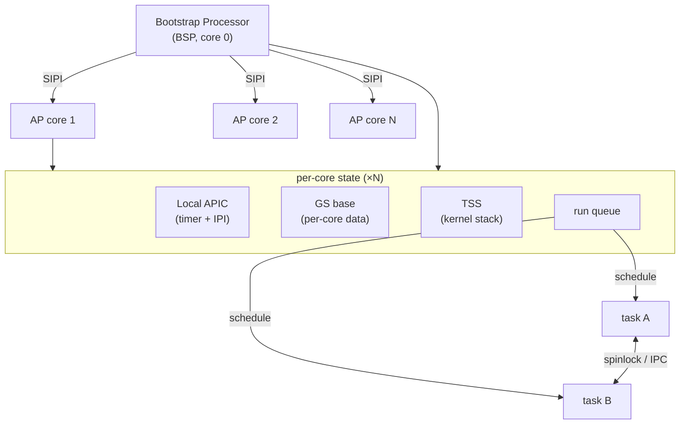

# Phase 25 — Symmetric Multiprocessing

**Status:** Complete
**Source Ref:** phase-25
**Depends on:** Phase 4 (Interrupts/APIC) ✅, Phase 17 (Scheduler) ✅
**Builds on:** Uses APIC infrastructure from Phase 4 and MADT parsing from Phase 15; extends the single-core scheduler from Phase 17 to run across all cores
**Primary Components:** kernel/src/smp/, kernel/src/task/, kernel/src/arch/x86_64/

## Milestone Goal

Boot all available CPU cores, give each its own Local APIC timer, and run the
scheduler across all cores simultaneously. Two processes should be able to execute
truly in parallel.

## Why This Phase Exists

A single-core OS cannot exploit modern multi-core hardware, and many real-world
concurrency bugs only manifest when code truly runs in parallel. Enabling SMP
forces an audit of every global data structure for thread safety, exposes race
conditions that are invisible on a single core, and teaches the fundamentals of
AP startup, per-core state, and cross-core coordination (IPI, TLB shootdown).
Without SMP, the scheduler, locking, and IPC subsystems are only tested in a
serialized environment that hides correctness issues.

## Learning Goals

- Understand the AP startup sequence: why a 16-bit real-mode trampoline is needed.
- See what "per-core" means in terms of kernel data structures.
- Learn why spinlocks must be audited before enabling a second core.

## Feature Scope

- **AP startup**: write a 16-bit trampoline page, send INIT + SIPI IPIs to each AP,
  bring APs through real mode -> protected mode -> long mode -> kernel entry
- **Per-core data**: each core gets its own GDT, TSS, kernel stack, `gs_base`
  pointer, and Local APIC mapping
- **Per-core run queues**: the scheduler maintains one queue per core; idle cores
  steal work from busy cores (simple work stealing)
- **Spinlock audit**: all global kernel data structures get `spin::Mutex` guards;
  any lock held across a timer interrupt is identified and fixed
- **IPI support**: the BSP can send inter-processor interrupts to wake idle APs or
  request TLB shootdowns
- **TLB shootdown**: when a page mapping is removed, the kernel sends a shootdown IPI
  to every core that might have cached the entry

## Important Components and How They Work

### AP Startup Sequence

A 4 KB trampoline page is allocated at a sub-1 MB physical address containing a
16-bit startup stub. For each AP: the BSP sends an INIT IPI, waits 10 ms, then
sends two SIPI IPIs with the trampoline physical page number. The trampoline
enables protected mode, sets up a temporary GDT, enables long mode, and jumps to
a Rust `ap_entry` function.

### Per-Core State

Each core initializes its own GDT, TSS, LAPIC, and kernel stack in `ap_entry`.
Per-core data is addressed via `gs_base`. Each core signals the BSP when alive and
then enters the scheduler idle loop.

### SMP-Aware Scheduler

The global run queue is split into per-core queues. When a core's queue is empty,
it steals work from the busiest core's queue (simple work stealing).

### TLB Shootdown

When a page mapping is removed (e.g., via `munmap`), the kernel sends a shootdown
IPI to every core that might have cached the stale TLB entry. The IPI handler
invalidates the relevant TLB entries on the receiving core.

## How This Builds on Earlier Phases

- **Extends Phase 4 (Interrupts/APIC):** uses Local APIC for per-core timers and IPI delivery
- **Extends Phase 15 (ACPI):** reads AP count and APIC IDs from the MADT table
- **Extends Phase 17 (Scheduler):** splits the single-core run queue into per-core queues with work stealing
- **Reuses Phase 3 (Memory):** allocates per-core kernel stacks and trampoline pages from the frame allocator

## Implementation Outline

1. Determine AP count and APIC IDs from the MADT parsed in Phase 15.
2. Allocate a 4 KB trampoline page at a sub-1 MB physical address; write the 16-bit
   startup stub.
3. For each AP: send INIT IPI, wait 10 ms, send two SIPI IPIs with the trampoline
   physical page number.
4. In the trampoline: enable protected mode, set up a temporary GDT, enable long mode,
   jump to a Rust `ap_entry` function.
5. In `ap_entry`: initialize the per-core GDT, TSS, LAPIC, and kernel stack; signal
   the BSP that this AP is alive; enter the scheduler loop.
6. Split the global run queue into per-core queues; add a work-stealing path.
7. Implement `send_ipi` using LAPIC ICR registers.
8. Add TLB shootdown IPI handler.

## Acceptance Criteria

- All cores reported in the MADT appear in the boot log as online.
- Two CPU-bound tasks run simultaneously with no corruption of shared kernel state.
- A TLB shootdown triggered by `munmap` in one process does not leave stale mappings
  on another core.
- The system remains stable under a workload that context-switches rapidly across
  multiple cores.

## Companion Task List

- [Phase 25 Task List](./tasks/25-smp-tasks.md)

## How Real OS Implementations Differ

- Production kernels use NUMA-aware memory allocation (allocating from the NUMA node
  local to each core), per-core page allocators to avoid cross-core lock contention,
  and sophisticated load-balancing heuristics.
- Linux's scheduler (CFS) tracks CPU utilization, task affinity, cache topology, and
  energy efficiency.
- This phase uses the simplest correct implementation: equal-weight round-robin with
  naive work stealing.

## Deferred Until Later

- NUMA-aware memory allocation
- CPU affinity (`sched_setaffinity`)
- real-time scheduling classes
- CPU frequency scaling (P-states)
- CPU hotplug
- per-core page allocator (SLUB/slab style)
