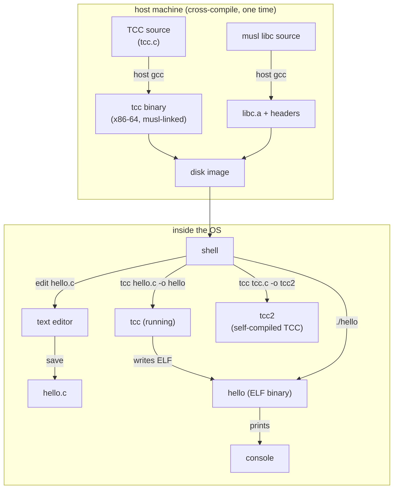

# Phase 30 - Compiler Bootstrap

## Milestone Goal

Run a C compiler natively inside the OS. A C source file written at the shell prompt
(using the editor from Phase 26) can be compiled and executed without leaving the OS.
The ultimate target is self-hosting: the compiler compiles itself.

## Learning Goals

- Understand what "bootstrapping" means: deriving a tool from itself.
- See what a compiler actually needs from an OS: file I/O, heap, process execution.
- Learn why musl is the right libc target for a resource-constrained system.
- Experience the edit-compile-run cycle inside your own OS.

## Feature Scope

**Path A — TinyCC (primary)**

- TinyCC (TCC) cross-compiled on the host targeting x86-64 ELF, linked against musl.
- musl `libc.a` and C headers bundled in the disk image at `/usr/lib` and `/usr/include`.
- `tcc hello.c -o hello` works inside the OS.
- `tcc tcc.c -o tcc2` works inside the OS (self-hosting milestone).

**Path B — Native tiny language (alternative)**

If the musl/POSIX path proves too complex, a second path avoids it entirely: implement
a small interpreter or compiler in Rust as a native userspace binary that speaks the
custom syscall ABI directly. Candidates:
- A Forth interpreter (interactive, self-extending, ~2 KB)
- A tiny Lisp/Scheme (dynamic, can be made self-hosting)
- A minimal C subset compiler targeting the custom ABI

Path B is always available as a fallback. Path A is the primary goal because it
enables running unmodified C programs from the wider ecosystem.

## Prerequisites

| Phase | Why needed |
|---|---|
| Phase 11 (Process Model) | ELF loader, `execve`, `fork`, `wait` |
| Phase 12 (POSIX Compat) | `open`/`read`/`write`, `brk`/`mmap`, musl-compatible syscalls |
| Phase 13 (Writable FS) | `/tmp` for intermediate object files and output binaries |
| Phase 14 (Shell + Tools) | Interactive shell, pipes, `PATH` lookup for running the compiler |
| Phase 26 (Text Editor) | Edit source code inside the OS before compiling |

## Implementation Outline

1. On the host: build TCC from source with `./configure --prefix=/usr --cc=x86_64-linux-musl-gcc`.
2. Verify the resulting binary is a static x86-64 ELF linked against musl.
3. Add TCC binary, musl `libc.a`, and the musl headers to the disk image build in xtask.
4. Boot the OS and verify `tcc --version` prints the expected string.
5. Write a `hello.c` inside the OS using the editor, compile it, and run it.
6. Compile a slightly larger program (e.g., a fibonacci calculator) to stress the heap.
7. Attempt the self-hosting milestone: `tcc /usr/src/tcc/tcc.c -o /tmp/tcc2`.
8. Verify the self-compiled TCC produces identical output for `hello.c`.

## Acceptance Criteria

- `tcc --version` runs inside the OS and prints the version string.
- `hello.c` compiled by TCC inside the OS runs and prints `hello, world`.
- TCC successfully compiles itself inside the OS (self-hosting milestone).
- The self-compiled `tcc2` passes the same `hello.c` test.
- No host tools are required after the disk image is built.

## Companion Task List

- [Phase 30 Task List](./tasks/30-compiler-bootstrap-tasks.md)

## Documentation Deliverables

- Explain what "bootstrapping" means and why it is a meaningful milestone.
- Document what TCC needs from the OS and how each syscall maps to OS functionality.
- Explain the musl libc build process and what headers/libs end up in the image.
- Document Path B and when it is the right choice vs. Path A.
- Write a short essay on the history of compiler bootstrapping (Ken Thompson's
  "Trusting Trust" lecture is the canonical reference).

## How Real OS Implementations Differ

Real systems ship with a full toolchain: compiler, assembler, linker, debugger, make,
and a package manager. Bootstrapping a modern Linux distribution from source requires
a carefully ordered multi-stage build (tarballs -> stage-1 gcc -> stage-2 gcc -> full
system) documented by projects like Linux From Scratch. This phase achieves the same
conceptual milestone — a system that can build and run its own tools — using TCC's
single-file simplicity instead of a multi-stage GCC build.

## Deferred Until Later

- GCC or Clang as the native compiler
- Dynamic linking and shared libraries
- Debugger support (`gdb` or `lldb`)
- Multi-stage bootstrap to remove host-compiled binaries from the chain entirely
