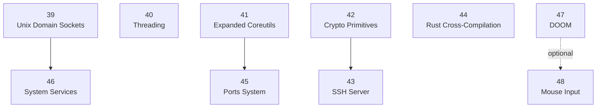
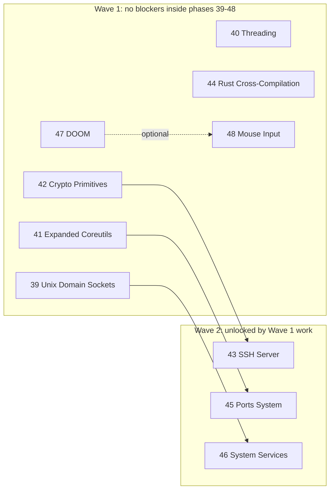

# Remaining Phase Dependency Map (39-48)

This page trims the roadmap down to the still-planned phases starting at Phase 39.
The diagrams intentionally **exclude every phase before 39**, even when an earlier
phase is a real prerequisite, so the remaining internal dependency structure is easier
to see.

## Direct remaining-phase dependencies

## Parallel work waves

## Phase-by-phase parallelization view

| Phase | Remaining-phase blockers | Can start in parallel now? | Notes |
|---|---|---:|---|
| 39 | None | Yes | Main dependency inside the remaining set for Phase 46. |
| 40 | None | Yes | Isolated from the rest of 39-48 in the current roadmap. |
| 41 | None | Yes | Only blocks Phase 45 inside the remaining set. |
| 42 | None | Yes | Sole remaining prerequisite for Phase 43. |
| 43 | 42 | No | Can run once the crypto layer is ready. |
| 44 | None | Yes | Independent of the other remaining phases. |
| 45 | 41 | No | Depends on the broader coreutils expansion. |
| 46 | 39 | No | The roadmap links this through Unix-domain-socket-backed logging. |
| 47 | None | Yes | Independent showcase phase. |
| 48 | None required | Yes | Optional value increase if paired with Phase 47 for DOOM mouse aiming. |

## Practical parallel tracks

If the goal is to maximize parallel work after Phase 38, the cleanest split is:

1. **Kernel IPC/services track:** Phase 39, then Phase 46.
2. **Threading track:** Phase 40 by itself.
3. **Tooling track:** Phase 41, then Phase 45.
4. **Security/remote access track:** Phase 42, then Phase 43.
5. **Rust toolchain track:** Phase 44 by itself.
6. **Showcase/input track:** Phase 47 and Phase 48 can proceed independently, with optional integration afterward.

That means the best immediate parallel starters are **39, 40, 41, 42, 44, 47, and 48**.
