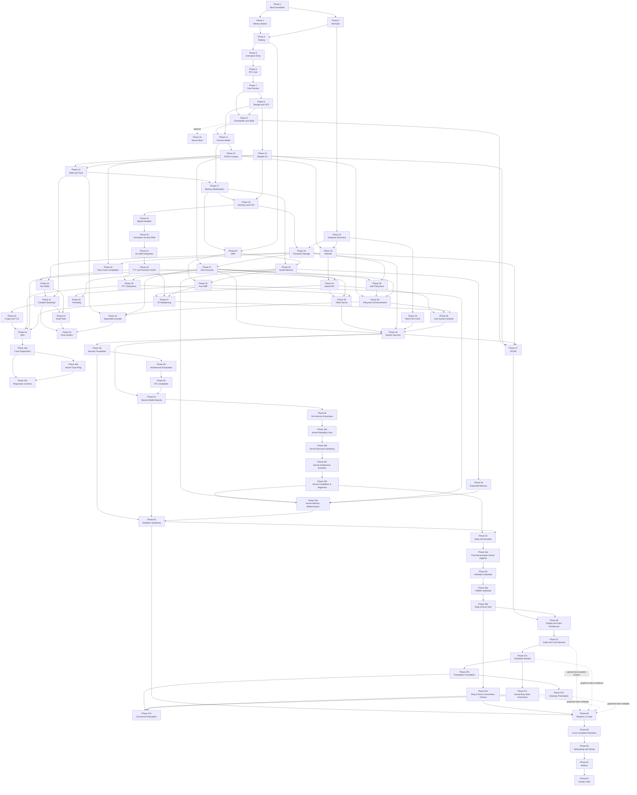

# Roadmap Guide

This directory expands the project roadmap into a learning-first set of milestones.
The goal is not to build the fastest or most feature-rich OS. The goal is to build a
small, understandable microkernel system where each phase teaches one major concept,
produces a runnable artifact, and leaves room for documentation and reflection.

Each phase page includes:

- the milestone goal
- the feature set and scope
- a high-level implementation plan
- acceptance criteria
- dependencies and deferrals
- a short note on how mature operating systems usually differ
- a companion task list in `docs/roadmap/tasks/`

## Guiding Principles

- Prefer clarity over cleverness.
- Keep each phase runnable before moving on.
- Add documentation alongside implementation, not afterward.
- Defer performance and advanced hardware support until the core ideas are clear.
- Borrow existing open-source software where it makes sense — porting teaches as much
  as writing from scratch.

## Milestone Dependency Map

## Milestone Summary

### Foundation Phases (complete)

| Phase | Theme | Primary Outcome | Status | Source Ref | Milestone | Tasks |
|---|---|---|---|---|---|---|
| 1 | Boot Foundation | Kernel boots and logs over serial | Complete | `phase-01` | [Phase 1](./01-boot-foundation.md) | [Tasks](./tasks/01-boot-foundation-tasks.md) |
| 2 | Memory Basics | Heap allocation and safe frame management | Complete | `phase-02` | [Phase 2](./02-memory-basics.md) | [Tasks](./tasks/02-memory-basics-tasks.md) |
| 3 | Interrupts | Exceptions, timer, and keyboard IRQs work | Complete | `phase-03` | [Phase 3](./03-interrupts.md) | [Tasks](./tasks/03-interrupts-tasks.md) |
| 4 | Tasking | Preemptive kernel threads run correctly | Complete | `phase-04` | [Phase 4](./04-tasking.md) | [Tasks](./tasks/04-tasking-tasks.md) |
| 5 | Userspace Entry | First ring 3 process runs via syscalls | Complete | `phase-05` | [Phase 5](./05-userspace-entry.md) | [Tasks](./tasks/05-userspace-entry-tasks.md) |
| 6 | IPC Core | Capability-based message passing works | Complete | `phase-06` | [Phase 6](./06-ipc-core.md) | [Tasks](./tasks/06-ipc-core-tasks.md) |
| 7 | Core Servers | `init`, console, and keyboard services cooperate | Complete | `phase-07` | [Phase 7](./07-core-servers.md) | [Tasks](./tasks/07-core-servers-tasks.md) |
| 8 | Storage and VFS | Simple file access through userspace servers | Complete | `phase-08` | [Phase 8](./08-storage-and-vfs.md) | [Tasks](./tasks/08-storage-and-vfs-tasks.md) |
| 9 | Framebuffer and Shell | Text UI and tiny shell become usable | Complete | `phase-09` | [Phase 9](./09-framebuffer-and-shell.md) | [Tasks](./tasks/09-framebuffer-and-shell-tasks.md) |
| 10 *(optional)* | Secure Boot | Kernel boots on real hardware with Secure Boot on | Complete | `phase-10` | [Phase 10](./10-secure-boot.md) | [Tasks](./tasks/10-secure-boot-tasks.md) |

### POSIX and Userspace Phases (complete)

| Phase | Theme | Primary Outcome | Status | Source Ref | Milestone | Tasks |
|---|---|---|---|---|---|---|
| 11 | Process Model | Arbitrary ELF binaries load and run as isolated processes | Complete | `phase-11` | [Phase 11](./11-process-model.md) | [Tasks](./tasks/11-process-model-tasks.md) |
| 12 | POSIX Compat | musl-linked C programs run without modification | Complete | `phase-12` | [Phase 12](./12-posix-compat.md) | [Tasks](./tasks/12-posix-compat-tasks.md) |
| 13 | Writable FS | Programs can create, write, and delete files | Complete | `phase-13` | [Phase 13](./13-writable-fs.md) | *not yet created* |
| 14 | Shell and Tools | Pipes, redirection, job control, and core utilities | Complete | `phase-14` | [Phase 14](./14-shell-and-tools.md) | [Tasks](./tasks/14-shell-and-tools-tasks.md) |
| 15 | Hardware Discovery | ACPI + PCI enumeration; APIC replaces legacy PIC | Complete | `phase-15` | [Phase 15](./15-hardware-discovery.md) | [Tasks](./tasks/15-hardware-discovery-tasks.md) |
| 16 | Network | virtio-net driver and minimal TCP/IP stack | Complete | `phase-16` | [Phase 16](./16-network.md) | [Tasks](./tasks/16-network-tasks.md) |

### Usability Phases (complete)

| Phase | Theme | Primary Outcome | Status | Source Ref | Milestone | Tasks |
|---|---|---|---|---|---|---|
| 17 | Memory Reclamation | Free-list allocator, CoW fork, heap growth, stack cleanup | Complete | `phase-17` | [Phase 17](./17-memory-reclamation.md) | [Tasks](./tasks/17-memory-reclamation-tasks.md) |
| 18 | Directory and VFS | `getdents64`, directory fds, real cwd, ramdisk layout | Complete | `phase-18` | [Phase 18](./18-directory-vfs.md) | [Tasks](./tasks/18-directory-vfs-tasks.md) |
| 19 | Signal Handlers | User signal handlers, trampolines, `sigreturn` | Complete | `phase-19` | [Phase 19](./19-signal-handlers.md) | [Tasks](./tasks/19-signal-handlers-tasks.md) |
| 20 | Userspace Init and Shell | Ring-3 PID 1 init, remove kernel shell | Complete | `phase-20` | [Phase 20](./20-userspace-init-shell.md) | [Tasks](./tasks/20-userspace-init-shell-tasks.md) |
| 21 | Ion Shell Integration | ion (Redox OS shell) replaces the minimal custom shell | Complete | `phase-21` | [Phase 21](./21-ion-shell.md) | [Tasks](./tasks/21-ion-shell-tasks.md) |
| 22 | TTY and Terminal Control | termios, cooked/raw mode, PTY stubs | Complete | `phase-22` | [Phase 22](./22-tty-pty.md) | [Tasks](./tasks/22-tty-pty-tasks.md) |
| 22b | ANSI Escape Sequences | VT100 CSI parser, cursor movement, SGR colors | Complete | `phase-22b` | [Phase 22](./22-tty-pty.md) | [Tasks](./tasks/22b-ansi-escape-tasks.md) |
| 23 | Socket API | BSD socket syscalls over TCP/UDP stack | Complete | `phase-23` | [Phase 23](./23-socket-api.md) | [Tasks](./tasks/23-socket-api-tasks.md) |
| 24 | Persistent Storage | virtio-blk driver, FAT32 read/write | Complete | `phase-24` | [Phase 24](./24-persistent-storage.md) | [Tasks](./tasks/24-persistent-storage-tasks.md) |
| 25 | SMP | All CPU cores run the scheduler simultaneously | Complete | `phase-25` | [Phase 25](./25-smp.md) | [Tasks](./tasks/25-smp-tasks.md) |

### Productivity Phases (complete)

| Phase | Theme | Primary Outcome | Status | Source Ref | Milestone | Tasks |
|---|---|---|---|---|---|---|
| 26 | Text Editor | Full-screen editor for creating and modifying files | Complete | `phase-26` | [Phase 26](./26-text-editor.md) | [Tasks](./tasks/26-text-editor-tasks.md) |
| 27 | User Accounts | Login, UID/GID, file permissions, passwd/shadow | Complete | `phase-27` | [Phase 27](./27-user-accounts.md) | [Tasks](./tasks/27-user-accounts-tasks.md) |
| 28 | ext2 Filesystem | Native Unix permissions, replaces FAT32 | Complete | `phase-28` | [Phase 28](./28-ext2-filesystem.md) | [Tasks](./tasks/28-ext2-filesystem-tasks.md) |
| 29 | PTY Subsystem | Pseudo-terminal pairs for remote sessions | Complete | `phase-29` | [Phase 29](./29-pty-subsystem.md) | [Tasks](./tasks/29-pty-subsystem-tasks.md) |
| 30 | Telnet Server | Remote shell access over the network | Complete | `phase-30` | [Phase 30](./30-telnet-server.md) | [Tasks](./tasks/30-telnet-server-tasks.md) |
| 31 | Compiler Bootstrap | TCC compiles C programs and itself inside the OS | Complete | `phase-31` | [Phase 31](./31-compiler-bootstrap.md) | [Tasks](./tasks/31-compiler-bootstrap-tasks.md) |
| 32 | Build Tools | make, ar, shell scripting for multi-file projects | Complete | `phase-32` | [Phase 32](./32-build-tools.md) | [Tasks](./tasks/32-build-tools-tasks.md) |

### Kernel Infrastructure Phases (phases 33-40 complete)

| Phase | Theme | Primary Outcome | Status | Source Ref | Milestone | Tasks |
|---|---|---|---|---|---|---|
| 33 | Kernel Memory | Buddy allocator, OOM retry, slab-cache groundwork, working munmap | Complete | `phase-33` | [Phase 33](./33-kernel-memory-improvements.md) | [Tasks](./tasks/33-kernel-memory-tasks.md) |
| 34 | Real-Time Clock | CMOS RTC, wall-clock time, CLOCK_REALTIME | Complete | `phase-34` | [Phase 34](./34-real-time-clock.md) | [Tasks](./tasks/34-real-time-clock-tasks.md) |
| 35 | True SMP | Per-core syscall stacks, multi-core dispatch, per-core run queues with global scheduler coordination | Complete | `phase-35` | [Phase 35](./35-true-smp-multitasking.md) | [Tasks](./tasks/35-true-smp-multitasking-tasks.md) |
| 36 | Expanded Memory | Demand paging, mprotect, large mmap, disk/RAM expansion | Complete | `phase-36` | [Phase 36](./36-expanded-memory.md) | [Tasks](./tasks/36-expanded-memory-tasks.md) |
| 37 | I/O Multiplexing | select, epoll, non-blocking I/O | Complete | `phase-37` | [Phase 37](./37-io-multiplexing.md) | [Tasks](./tasks/37-io-multiplexing-tasks.md) |
| 38 | Filesystem Enhancements | Symlinks, hard links, /proc, permissions, device nodes | Complete | `phase-38` | [Phase 38](./38-filesystem-enhancements.md) | [Tasks](./tasks/38-filesystem-enhancements-tasks.md) |
| 39 | Unix Domain Sockets | AF_UNIX stream/datagram, socketpair | Complete | `phase-39` | [Phase 39](./39-unix-domain-sockets.md) | [Tasks](./tasks/39-unix-domain-sockets-tasks.md) |
| 40 | Threading | clone CLONE_THREAD, futex, TLS, thread groups | Complete | `phase-40` | [Phase 40](./40-threading-primitives.md) | [Tasks](./tasks/40-threading-primitives-tasks.md) |

### Application Phases (complete)

| Phase | Theme | Primary Outcome | Status | Source Ref | Milestone | Tasks |
|---|---|---|---|---|---|---|
| 41 | Expanded Coreutils | head, tail, sort, find, diff, ps, less | Complete | `phase-41` | [Phase 41](./41-expanded-coreutils.md) | [Tasks](./tasks/41-expanded-coreutils-tasks.md) |
| 42 | Crypto Primitives | RustCrypto crypto-lib, sha256sum, genkey | Complete | `phase-42` | [Phase 42](./42-crypto-primitives.md) | [Tasks](./tasks/42-crypto-primitives-tasks.md) |
| 43 | SSH | SSH server (sunset IO-less SSH library) | Complete | `phase-43` | [Phase 43](./43-ssh-server.md) | [Tasks](./tasks/43-ssh-server-tasks.md) |
| 43a | Crash Diagnostics | Enriched panic/fault handlers, scheduler/fork/IPC assertions | Complete | `phase-43a` | [Phase 43a](./43a-crash-diagnostics.md) | [Tasks](./tasks/43a-crash-diagnostics-tasks.md) |
| 43b | Kernel Trace Ring | Per-core lockless trace ring, auto-dump on crash, sys_ktrace | Complete | `phase-43b` | [Phase 43b](./43b-kernel-trace-ring.md) | [Tasks](./tasks/43b-kernel-trace-ring-tasks.md) |
| 43c | Regression & Stress | xtask regression/stress commands, CI tiers, proptest/loom | Complete | `phase-43c` | [Phase 43c](./43c-regression-stress-ci.md) | [Tasks](./tasks/43c-regression-stress-ci-tasks.md) |
| 44 | Rust Cross-Compilation | Rust programs compiled on host run in the OS | Complete | `phase-44` | [Phase 44](./44-rust-cross-compilation.md) | [Tasks](./tasks/44-rust-cross-compilation-tasks.md) |
| 45 | Ports System | Source-based package building and installation | Complete | `phase-45` | [Phase 45](./45-ports-system.md) | [Tasks](./tasks/45-ports-system-tasks.md) |
| 46 | System Services | Service manager, syslog, cron, shutdown | Complete | `phase-46` | [Phase 46](./46-system-services.md) | [Tasks](./tasks/46-system-services-tasks.md) |

### Graphics Proof Phase (complete)

| Phase | Theme | Primary Outcome | Status | Source Ref | Milestone | Tasks |
|---|---|---|---|---|---|---|
| 47 | DOOM | A real full-screen graphical program runs and proves the graphics substrate under load | Complete | `phase-47` | [Phase 47](./47-doom.md) | [Tasks](./tasks/47-doom-tasks.md) |

### Convergence and Release-Critical Phases (48-50 complete, 51-52 active, 53a complete, 53+ planned)

| Phase | Theme | Primary Outcome | Status | Source Ref | Milestone | Tasks |
|---|---|---|---|---|---|---|
| 48 | Security Foundation | Repair trust-floor issues in identity, entropy, and boot defaults | Complete | `phase-48` | [Phase 48](./48-security-foundation.md) | [Tasks](./tasks/48-security-foundation-tasks.md) |
| 49 | Architectural Declaration | Make the kernel/userspace boundary explicit and enforceable | Complete | `phase-49` | [Phase 49](./49-architectural-declaration.md) | [Tasks](./tasks/49-architectural-declaration-tasks.md) |
| 50 | IPC Completion | Capability grants, bulk-data transport (copy + page grants), ring-3-safe registry, server-loop failure semantics | Complete | `phase-50` | [Phase 50](./50-ipc-completion.md) | [Tasks](./tasks/50-ipc-completion-tasks.md) |
| 51 | Service Model Maturity | Turn the Phase 46 service baseline into a trusted lifecycle model | In Progress | `phase-51` | [Phase 51](./51-service-model-maturity.md) | [Tasks](./tasks/51-service-model-maturity-tasks.md) |
| 52 | First Service Extractions | Move the first visible core services into supervised ring-3 processes | In Progress | `phase-52` | [Phase 52](./52-first-service-extractions.md) | [Tasks](./tasks/52-first-service-extractions-tasks.md) |
| 52a | Kernel Reliability Fixes | Fix stale IPC return state, sunset wake_write, clear_child_tid, exec signal reset | **Complete** | `phase-52a` | [Phase 52a](./52a-kernel-reliability-fixes.md) | [Tasks](./tasks/52a-kernel-reliability-fixes-tasks.md) |
| 52b | Kernel Structural Hardening | AddressSpace object, typed UserBuffers, batch TLB, frame zeroing, and partial task-owned return-state groundwork | **Complete** | `phase-52b` | [Phase 52b](./52b-kernel-structural-hardening.md) | [Tasks](./tasks/52b-kernel-structural-hardening-tasks.md) |
| 52c | Kernel Architecture Evolution | VMA tree, growable endpoint/capability tables, unified line-discipline infrastructure, ISR wakeup, and deferred scheduler/keyboard/notification closure | **Complete** | `phase-52c` | [Phase 52c](./52c-kernel-architecture-evolution.md) | [Tasks](./tasks/52c-kernel-architecture-evolution-tasks.md) |
| 52d | Kernel Completion and Roadmap Alignment | Audit-backed closure of the unfinished or overstated 52a/52b/52c work, integrated boot blockers, and release-gate drift before later hardening phases | Complete | `phase-52d` | [Phase 52d](./52d-kernel-completion-and-roadmap-alignment.md) | [Tasks](./tasks/52d-kernel-completion-and-roadmap-alignment-tasks.md) |
| 53a | Kernel Memory Modernization | Per-CPU page cache, magazine-based slab allocator, size-class GlobalAlloc, SMP-scalable allocation | Complete | `phase-53a` | [Phase 53a](./53a-kernel-memory-modernization.md) | [Tasks](./tasks/53a-kernel-memory-modernization-tasks.md) |
| 53 | Headless Hardening | Define the supported headless/reference workflow and release gates | Complete | `phase-53` | [Phase 53](./53-headless-hardening.md) | [Tasks](./tasks/53-headless-hardening-tasks.md) |
| 54 | Deep Serverization | Move meaningful storage/VFS and UDP policy slices into supervised ring-3 services with explicit degraded-mode fallbacks | Complete | `phase-54` | [Phase 54](./54-deep-serverization.md) | [Tasks](./tasks/54-deep-serverization-tasks.md) |
| 54a | Post-Serverization Kernel Hygiene | Close the CLOEXEC/NONBLOCK plumbing gap and relocate arch-syscall cleanup wrappers into their owning subsystems | Planned | `phase-54a` | [Phase 54a](./54a-post-serverization-kernel-hygiene.md) | [Tasks](./tasks/54a-post-serverization-kernel-hygiene-tasks.md) |

### Hardware, Local-System, and Release Phases (55, 55a, 55b complete; 55c+ planned)

| Phase | Theme | Primary Outcome | Status | Source Ref | Milestone | Tasks |
|---|---|---|---|---|---|---|
| 55 | Hardware Substrate | A narrow, real-hardware support story: PCIe MCFG + MSI/MSI-X, reusable hardware-access layer, NVMe storage, Intel 82540EM e1000 networking | Complete | `phase-55` | [Phase 55](./55-hardware-substrate.md) | [Tasks](./tasks/55-hardware-substrate-tasks.md) |
| 55a | IOMMU Substrate | ACPI DMAR/IVRS parsing, per-device VT-d / AMD-Vi domains, IOMMU-routed `DmaBuffer<T>`, closes the Phase 55 IOMMU caveat | Complete | `phase-55a` | [Phase 55a](./55a-iommu-substrate.md) | [Tasks](./tasks/55a-iommu-substrate-tasks.md) |
| 55b | Ring-3 Driver Host | Capability-gated device-host syscalls, supervised userspace NVMe and e1000 drivers, completes the Phase 55 ring-3 extraction deferral | Complete | `phase-55b` | [Phase 55b](./55b-ring-3-driver-host.md) | [Tasks](./tasks/55b-ring-3-driver-host-tasks.md) |
| 55c | Ring-3 Driver Correctness Closure | Bound-notification event multiplexing (closes SSH-over-e1000 deadlock), IOMMU BAR identity coverage (closes `--iommu` device-smoke timeouts), userspace `EAGAIN` visibility during driver restart — closes the three correctness residuals Phase 55b left behind | **Complete** | `phase-55c` | [Phase 55c](./55c-ring-3-driver-correctness-closure.md) | [Tasks](./tasks/55c-ring-3-driver-correctness-closure-tasks.md) / [Learning](./55c-ring-3-driver-correctness-closure-learning.md) |
| 56 | Display and Input Architecture | A userspace display service owns presentation and routed input | Complete | `phase-56` | [Phase 56](./56-display-and-input-architecture.md) | [Tasks](./tasks/56-display-and-input-architecture-tasks.md) |
| 57 | Audio and Local Session | The first coherent local graphical session adds audible output and a useful client baseline | Complete | `phase-57` | [Phase 57](./57-audio-and-local-session.md) | [Tasks](./tasks/57-audio-and-local-session-tasks.md) |
| 57a | Scheduler Block/Wake Protocol Rewrite | Linux-style single-state-word + condition-recheck protocol with per-task `pi_lock`; eliminates lost-wake bug class.  Graphical-stack hardware reliability deferred to 57b–57e (cooperative-starvation, not v1 lost-wake, is the residual blocker) | **Complete** | `phase-57a` | [Phase 57a](./57a-scheduler-rewrite.md) | [Tasks](./tasks/57a-scheduler-rewrite-tasks.md) |
| 57b | Preemption Foundation | Per-task `preempt_count`, full register save area (`PreemptFrame`), spinlocks raise `preempt_count`.  No-op refactor that unblocks 57d / 57e.  No behaviour change | Planned | `phase-57b` | [Phase 57b](./57b-preemption-foundation.md) | [Tasks](./tasks/57b-preemption-foundation-tasks.md) |
| 57c | Kernel Busy-Wait Audit and Conversion | Catalogue every kernel busy-spin; convert hot/unbounded sites to block+wake pairs; document hardware-bounded sites with bounds and citations.  Independent of 57b — provides direct user-pain relief for cooperative-starvation | Planned | `phase-57c` | [Phase 57c](./57c-kernel-busy-wait-conversion.md) | [Tasks](./tasks/57c-kernel-busy-wait-conversion-tasks.md) |
| 57d | Voluntary Preemption (PREEMPT_VOLUNTARY) | IRQ-return preemption check for user-mode tasks; user-mode CPU-bound tasks become preemptible within one timer tick.  Kernel mode remains non-preemptible | Planned | `phase-57d` | [Phase 57d](./57d-voluntary-preemption.md) | [Tasks](./tasks/57d-voluntary-preemption-tasks.md) |
| 57e | Full Kernel Preemption (PREEMPT_FULL) — stretch | Drop the `from_user` check; kernel-mode code becomes preemptible at any point where `preempt_count == 0`.  Cross-core reschedule-IPI wakeup latency improves measurably; same-core, timer-only, and `preempt_enable` zero-crossing paths benchmark separately and must not regress.  Adds same-CPL `iretq` resume, kernel-RSP capture, per-CPU access audit, kernel-mode `preempt_enable` immediacy | Planned | `phase-57e` | [Phase 57e](./57e-full-kernel-preemption.md) | [Tasks](./tasks/57e-full-kernel-preemption-tasks.md) |
| 58 | Release 1.0 Gate | The project defines and validates an honest 1.0 support matrix | Planned | `phase-58` | [Phase 58](./58-release-1-0-gate.md) | Deferred until implementation planning |

### Post-1.0 Platform Growth (planned)

| Phase | Theme | Primary Outcome | Status | Source Ref | Milestone | Tasks |
|---|---|---|---|---|---|---|
| 59 | Cross-Compiled Toolchains | git, Python, and Clang are bundled as a supported post-1.0 developer-toolchain set | Planned | `phase-59` | [Phase 59](./59-cross-compiled-toolchains.md) | Deferred until implementation planning |
| 60 | Networking and GitHub | Outbound developer workflows add DNS, HTTPS, git remotes, and GitHub CLI support | Planned | `phase-60` | [Phase 60](./60-networking-and-github.md) | Deferred until implementation planning |
| 61 | Node.js | A supported Node.js and npm environment runs natively inside m3OS | Planned | `phase-61` | [Phase 61](./61-nodejs.md) | Deferred until implementation planning |
| 62 | Claude Code | A modern CLI coding agent runs on the post-1.0 m3OS developer platform | Planned | `phase-62` | [Phase 62](./62-claude-code.md) | Deferred until implementation planning |

## Suggested Delivery Rhythm

```mermaid
gantt
    title Learning-First Delivery Plan
    dateFormat X
    axisFormat Phase %s

    section Foundations (complete)
    Boot Foundation      :done, p1, 0, 1
    Memory Basics        :done, p2, after p1, 1
    Interrupts           :done, p3, after p1, 1

    section Kernel Core (complete)
    Tasking              :done, p4, after p2, 1
    Userspace Entry      :done, p5, after p4, 1
    IPC Core             :done, p6, after p5, 1

    section System Services (complete)
    Core Servers         :done, p7, after p6, 1
    Storage and VFS      :done, p8, after p7, 1
    Framebuffer + Shell  :done, p9, after p8, 1

    section Process and Compatibility (complete)
    Process Model        :done, p11, after p9, 1
    POSIX Compat         :done, p12, after p11, 1
    Writable FS          :done, p13, after p8, 1
    Shell and Tools      :done, p14, after p12, 1

    section Hardware and Network (complete)
    Hardware Discovery   :done, p15, after p3, 1
    Network              :done, p16, after p15, 1

    section Usability (complete)
    Memory Reclamation   :done, p17, after p14, 1
    Directory and VFS    :done, p18, after p17, 1
    Signal Handlers      :done, p19, after p18, 1
    Userspace Init       :done, p20, after p19, 1
    Ion Shell            :done, p21, after p20, 1
    TTY and Terminal     :done, p22, after p21, 1
    Socket API           :done, p23, after p22, 1
    Persistent Storage   :done, p24, after p18, 1
    SMP                  :done, p25, after p17, 1

    section Productivity (complete)
    Text Editor          :done, p26, after p24, 1
    User Accounts        :done, p27, after p26, 1
    ext2 Filesystem      :done, p28, after p27, 1
    PTY Subsystem        :done, p29, after p27, 1
    Telnet Server        :done, p30, after p29, 1
    Compiler Bootstrap   :done, p31, after p26, 1
    Build Tools          :done, p32, after p31, 1

    section Kernel Infrastructure (complete)
    Kernel Memory        :done, p33, after p25, 1
    Real-Time Clock      :done, p34, after p15, 1
    True SMP             :done, p35, after p33, 1
    Expanded Memory      :done, p36, after p33, 1
    I/O Multiplexing     :done, p37, after p35, 1
    Filesystem Enhance   :done, p38, after p28, 1
    Unix Domain Sockets  :done, p39, after p38, 1
    Threading            :done, p40, after p35, 1

    section Applications and Developer Platform (complete)
    Expanded Coreutils   :done, p41, after p38, 1
    Crypto Primitives    :done, p42, after p31, 1
    SSH                  :done, p43, after p42, 1
    Crash Diagnostics    :done, p43a, after p43, 1
    Kernel Trace Ring    :done, p43b, after p43a, 1
    Regression + Stress  :done, p43c, after p43b, 1
    Rust Cross-Compile   :done, p44, after p24, 1
    Ports System         :done, p45, after p41, 1
    System Services      :done, p46, after p39, 1
    DOOM                 :done, p47, after p24, 1

    section Convergence and Release (active/planned)
    Security Foundation  :done, p48, after p47, 1
    Architectural Decl.  :done, p49, after p48, 1
    IPC Completion       :done, p50, after p49, 1
    Service Model Mature :active, p51, after p50, 1
    Service Extractions  :active, p52, after p51, 1
    Reliability Fixes    :done, p52a, after p52, 1
    Structural Hardening :done, p52b, after p52a, 1
    Architecture Evol.   :done, p52c, after p52b, 1
    Completion + Align   :done, p52d, after p52c, 1
    Memory Modernization :done, p53a, after p52d, 1
    Headless Hardening   :done, p53, after p53a, 1
    Deep Serverization   :done, p54, after p53, 1
    Post-Serverization Hygiene :p54a, after p54, 1

    section Hardware, Local-System, and Release (complete/planned)
    Hardware Substrate      :done, p55, after p54a, 1
    IOMMU Substrate         :p55a, after p55, 1
    Ring-3 Driver Host      :p55b, after p55a, 1
    Ring-3 Driver Correctness Closure :p55c, after p55b, 1
    Display and Input       :p56, after p55b, 1
    Audio and Local Session :p57, after p56, 1
    Scheduler Rewrite       :done, p57a, after p57, 1
    Preemption Foundation   :p57b, after p57a, 1
    Busy-Wait Conversion    :p57c, after p57a, 1
    Voluntary Preemption    :p57d, after p57b, 1
    Full Kernel Preemption  :p57e, after p57d, 1
    Release 1.0 Gate        :p58, after p55c, 1

    section Post-1.0 Platform Growth (planned)
    Cross-Compiled Toolchains :p59, after p58, 1
    Networking and GitHub     :p60, after p59, 1
    Node.js                   :p61, after p60, 1
    Claude Code               :p62, after p61, 1
```

## Required Documentation for Every Phase

Every phase should ship with documentation in two layers:

1. A design or roadmap page that explains what the feature is for, how it fits into the
   system, and what the milestone is trying to teach.
2. An implementation page or section in the relevant subsystem docs that explains the
   data structures, control flow, and important safety boundaries.

Each phase must include:

- what was implemented and how it works
- which parts are intentionally simplified vs. a production OS
- a "how real OSes differ" section explaining what was deferred and why the toy
  design is still useful for learning

## Related Documents

- [Roadmap Task Lists](./tasks/README.md)
- [Architecture & Syscalls](../appendix/architecture-and-syscalls.md)
- [Boot Process](../01-boot.md)
- [Memory Management](../02-memory.md)
- [Interrupts & Exceptions](../03-interrupts.md)
- [Tasking & Scheduling](../04-tasking.md)
- [IPC](../06-ipc.md)
- [Testing](../appendix/testing.md)
