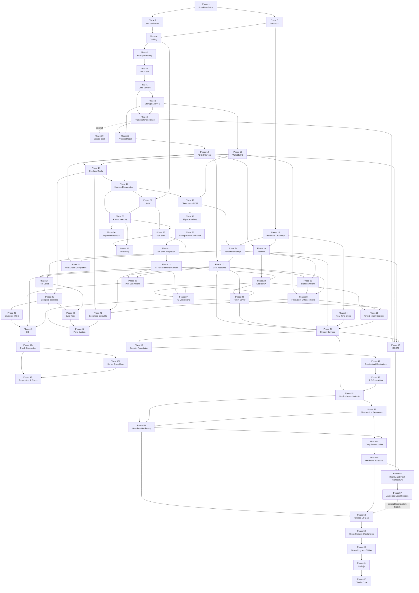

# Roadmap Guide

This directory expands the project roadmap into a learning-first set of milestones.
The goal is not to build the fastest or most feature-rich OS. The goal is to build a
small, understandable microkernel system where each phase teaches one major concept,
produces a runnable artifact, and leaves room for documentation and reflection.

Each phase page includes:

- the milestone goal
- the feature set and scope
- a high-level implementation plan
- acceptance criteria
- dependencies and deferrals
- a short note on how mature operating systems usually differ
- a companion task list in `docs/roadmap/tasks/`

## Guiding Principles

- Prefer clarity over cleverness.
- Keep each phase runnable before moving on.
- Add documentation alongside implementation, not afterward.
- Defer performance and advanced hardware support until the core ideas are clear.
- Borrow existing open-source software where it makes sense — porting teaches as much
  as writing from scratch.

## Milestone Dependency Map

## Milestone Summary

### Foundation Phases (complete)

| Phase | Theme | Primary Outcome | Status | Source Ref | Milestone | Tasks |
|---|---|---|---|---|---|---|
| 1 | Boot Foundation | Kernel boots and logs over serial | Complete | `phase-01` | [Phase 1](./01-boot-foundation.md) | [Tasks](./tasks/01-boot-foundation-tasks.md) |
| 2 | Memory Basics | Heap allocation and safe frame management | Complete | `phase-02` | [Phase 2](./02-memory-basics.md) | [Tasks](./tasks/02-memory-basics-tasks.md) |
| 3 | Interrupts | Exceptions, timer, and keyboard IRQs work | Complete | `phase-03` | [Phase 3](./03-interrupts.md) | [Tasks](./tasks/03-interrupts-tasks.md) |
| 4 | Tasking | Preemptive kernel threads run correctly | Complete | `phase-04` | [Phase 4](./04-tasking.md) | [Tasks](./tasks/04-tasking-tasks.md) |
| 5 | Userspace Entry | First ring 3 process runs via syscalls | Complete | `phase-05` | [Phase 5](./05-userspace-entry.md) | [Tasks](./tasks/05-userspace-entry-tasks.md) |
| 6 | IPC Core | Capability-based message passing works | Complete | `phase-06` | [Phase 6](./06-ipc-core.md) | [Tasks](./tasks/06-ipc-core-tasks.md) |
| 7 | Core Servers | `init`, console, and keyboard services cooperate | Complete | `phase-07` | [Phase 7](./07-core-servers.md) | [Tasks](./tasks/07-core-servers-tasks.md) |
| 8 | Storage and VFS | Simple file access through userspace servers | Complete | `phase-08` | [Phase 8](./08-storage-and-vfs.md) | [Tasks](./tasks/08-storage-and-vfs-tasks.md) |
| 9 | Framebuffer and Shell | Text UI and tiny shell become usable | Complete | `phase-09` | [Phase 9](./09-framebuffer-and-shell.md) | [Tasks](./tasks/09-framebuffer-and-shell-tasks.md) |
| 10 *(optional)* | Secure Boot | Kernel boots on real hardware with Secure Boot on | Complete | `phase-10` | [Phase 10](./10-secure-boot.md) | [Tasks](./tasks/10-secure-boot-tasks.md) |

### POSIX and Userspace Phases (complete)

| Phase | Theme | Primary Outcome | Status | Source Ref | Milestone | Tasks |
|---|---|---|---|---|---|---|
| 11 | Process Model | Arbitrary ELF binaries load and run as isolated processes | Complete | `phase-11` | [Phase 11](./11-process-model.md) | [Tasks](./tasks/11-process-model-tasks.md) |
| 12 | POSIX Compat | musl-linked C programs run without modification | Complete | `phase-12` | [Phase 12](./12-posix-compat.md) | [Tasks](./tasks/12-posix-compat-tasks.md) |
| 13 | Writable FS | Programs can create, write, and delete files | Complete | `phase-13` | [Phase 13](./13-writable-fs.md) | *not yet created* |
| 14 | Shell and Tools | Pipes, redirection, job control, and core utilities | Complete | `phase-14` | [Phase 14](./14-shell-and-tools.md) | [Tasks](./tasks/14-shell-and-tools-tasks.md) |
| 15 | Hardware Discovery | ACPI + PCI enumeration; APIC replaces legacy PIC | Complete | `phase-15` | [Phase 15](./15-hardware-discovery.md) | [Tasks](./tasks/15-hardware-discovery-tasks.md) |
| 16 | Network | virtio-net driver and minimal TCP/IP stack | Complete | `phase-16` | [Phase 16](./16-network.md) | [Tasks](./tasks/16-network-tasks.md) |

### Usability Phases (complete)

| Phase | Theme | Primary Outcome | Status | Source Ref | Milestone | Tasks |
|---|---|---|---|---|---|---|
| 17 | Memory Reclamation | Free-list allocator, CoW fork, heap growth, stack cleanup | Complete | `phase-17` | [Phase 17](./17-memory-reclamation.md) | [Tasks](./tasks/17-memory-reclamation-tasks.md) |
| 18 | Directory and VFS | `getdents64`, directory fds, real cwd, ramdisk layout | Complete | `phase-18` | [Phase 18](./18-directory-vfs.md) | [Tasks](./tasks/18-directory-vfs-tasks.md) |
| 19 | Signal Handlers | User signal handlers, trampolines, `sigreturn` | Complete | `phase-19` | [Phase 19](./19-signal-handlers.md) | [Tasks](./tasks/19-signal-handlers-tasks.md) |
| 20 | Userspace Init and Shell | Ring-3 PID 1 init, remove kernel shell | Complete | `phase-20` | [Phase 20](./20-userspace-init-shell.md) | [Tasks](./tasks/20-userspace-init-shell-tasks.md) |
| 21 | Ion Shell Integration | ion (Redox OS shell) replaces the minimal custom shell | Complete | `phase-21` | [Phase 21](./21-ion-shell.md) | [Tasks](./tasks/21-ion-shell-tasks.md) |
| 22 | TTY and Terminal Control | termios, cooked/raw mode, PTY stubs | Complete | `phase-22` | [Phase 22](./22-tty-pty.md) | [Tasks](./tasks/22-tty-pty-tasks.md) |
| 22b | ANSI Escape Sequences | VT100 CSI parser, cursor movement, SGR colors | Complete | `phase-22b` | [Phase 22](./22-tty-pty.md) | [Tasks](./tasks/22b-ansi-escape-tasks.md) |
| 23 | Socket API | BSD socket syscalls over TCP/UDP stack | Complete | `phase-23` | [Phase 23](./23-socket-api.md) | [Tasks](./tasks/23-socket-api-tasks.md) |
| 24 | Persistent Storage | virtio-blk driver, FAT32 read/write | Complete | `phase-24` | [Phase 24](./24-persistent-storage.md) | [Tasks](./tasks/24-persistent-storage-tasks.md) |
| 25 | SMP | All CPU cores run the scheduler simultaneously | Complete | `phase-25` | [Phase 25](./25-smp.md) | [Tasks](./tasks/25-smp-tasks.md) |

### Productivity Phases (complete)

| Phase | Theme | Primary Outcome | Status | Source Ref | Milestone | Tasks |
|---|---|---|---|---|---|---|
| 26 | Text Editor | Full-screen editor for creating and modifying files | Complete | `phase-26` | [Phase 26](./26-text-editor.md) | [Tasks](./tasks/26-text-editor-tasks.md) |
| 27 | User Accounts | Login, UID/GID, file permissions, passwd/shadow | Complete | `phase-27` | [Phase 27](./27-user-accounts.md) | [Tasks](./tasks/27-user-accounts-tasks.md) |
| 28 | ext2 Filesystem | Native Unix permissions, replaces FAT32 | Complete | `phase-28` | [Phase 28](./28-ext2-filesystem.md) | [Tasks](./tasks/28-ext2-filesystem-tasks.md) |
| 29 | PTY Subsystem | Pseudo-terminal pairs for remote sessions | Complete | `phase-29` | [Phase 29](./29-pty-subsystem.md) | [Tasks](./tasks/29-pty-subsystem-tasks.md) |
| 30 | Telnet Server | Remote shell access over the network | Complete | `phase-30` | [Phase 30](./30-telnet-server.md) | [Tasks](./tasks/30-telnet-server-tasks.md) |
| 31 | Compiler Bootstrap | TCC compiles C programs and itself inside the OS | Complete | `phase-31` | [Phase 31](./31-compiler-bootstrap.md) | [Tasks](./tasks/31-compiler-bootstrap-tasks.md) |
| 32 | Build Tools | make, ar, shell scripting for multi-file projects | Complete | `phase-32` | [Phase 32](./32-build-tools.md) | [Tasks](./tasks/32-build-tools-tasks.md) |

### Kernel Infrastructure Phases (phases 33-39 complete, 40 planned)

| Phase | Theme | Primary Outcome | Status | Source Ref | Milestone | Tasks |
|---|---|---|---|---|---|---|
| 33 | Kernel Memory | Slab allocator, OOM retry, working munmap | Complete | `phase-33` | [Phase 33](./33-kernel-memory-improvements.md) | [Tasks](./tasks/33-kernel-memory-tasks.md) |
| 34 | Real-Time Clock | CMOS RTC, wall-clock time, CLOCK_REALTIME | Complete | `phase-34` | [Phase 34](./34-real-time-clock.md) | [Tasks](./tasks/34-real-time-clock-tasks.md) |
| 35 | True SMP | Per-core syscall stacks, multi-core dispatch, priorities | Complete | `phase-35` | [Phase 35](./35-true-smp-multitasking.md) | [Tasks](./tasks/35-true-smp-multitasking-tasks.md) |
| 36 | Expanded Memory | Demand paging, mprotect, large mmap, disk/RAM expansion | Complete | `phase-36` | [Phase 36](./36-expanded-memory.md) | [Tasks](./tasks/36-expanded-memory-tasks.md) |
| 37 | I/O Multiplexing | select, epoll, non-blocking I/O | Complete | `phase-37` | [Phase 37](./37-io-multiplexing.md) | [Tasks](./tasks/37-io-multiplexing-tasks.md) |
| 38 | Filesystem Enhancements | Symlinks, hard links, /proc, permissions, device nodes | Complete | `phase-38` | [Phase 38](./38-filesystem-enhancements.md) | [Tasks](./tasks/38-filesystem-enhancements-tasks.md) |
| 39 | Unix Domain Sockets | AF_UNIX stream/datagram, socketpair | Complete | `phase-39` | [Phase 39](./39-unix-domain-sockets.md) | [Tasks](./tasks/39-unix-domain-sockets-tasks.md) |
| 40 | Threading | clone CLONE_THREAD, futex, TLS, thread groups | Complete | `phase-40` | [Phase 40](./40-threading-primitives.md) | [Tasks](./tasks/40-threading-primitives-tasks.md) |

### Application Phases (complete)

| Phase | Theme | Primary Outcome | Status | Source Ref | Milestone | Tasks |
|---|---|---|---|---|---|---|
| 41 | Expanded Coreutils | head, tail, sort, find, diff, ps, less | Complete | `phase-41` | [Phase 41](./41-expanded-coreutils.md) | [Tasks](./tasks/41-expanded-coreutils-tasks.md) |
| 42 | Crypto Primitives | RustCrypto crypto-lib, sha256sum, genkey | Complete | `phase-42` | [Phase 42](./42-crypto-primitives.md) | [Tasks](./tasks/42-crypto-primitives-tasks.md) |
| 43 | SSH | SSH server (sunset IO-less SSH library) | Complete | `phase-43` | [Phase 43](./43-ssh-server.md) | [Tasks](./tasks/43-ssh-server-tasks.md) |
| 43a | Crash Diagnostics | Enriched panic/fault handlers, scheduler/fork/IPC assertions | Complete | `phase-43a` | [Phase 43a](./43a-crash-diagnostics.md) | [Tasks](./tasks/43a-crash-diagnostics-tasks.md) |
| 43b | Kernel Trace Ring | Per-core lockless trace ring, auto-dump on crash, sys_ktrace | Complete | `phase-43b` | [Phase 43b](./43b-kernel-trace-ring.md) | [Tasks](./tasks/43b-kernel-trace-ring-tasks.md) |
| 43c | Regression & Stress | xtask regression/stress commands, CI tiers, proptest/loom | Complete | `phase-43c` | [Phase 43c](./43c-regression-stress-ci.md) | [Tasks](./tasks/43c-regression-stress-ci-tasks.md) |
| 44 | Rust Cross-Compilation | Rust programs compiled on host run in the OS | Complete | `phase-44` | [Phase 44](./44-rust-cross-compilation.md) | [Tasks](./tasks/44-rust-cross-compilation-tasks.md) |
| 45 | Ports System | Source-based package building and installation | Complete | `phase-45` | [Phase 45](./45-ports-system.md) | [Tasks](./tasks/45-ports-system-tasks.md) |
| 46 | System Services | Service manager, syslog, cron, shutdown | Complete | `phase-46` | [Phase 46](./46-system-services.md) | [Tasks](./tasks/46-system-services-tasks.md) |

### Graphics Proof Phase (in progress)

| Phase | Theme | Primary Outcome | Status | Source Ref | Milestone | Tasks |
|---|---|---|---|---|---|---|
| 47 | DOOM | A real full-screen graphical program runs and proves the graphics substrate under load | In Progress | `phase-47` | [Phase 47](./47-doom.md) | Deferred until implementation planning |

### Convergence and Release-Critical Phases (planned)

| Phase | Theme | Primary Outcome | Status | Source Ref | Milestone | Tasks |
|---|---|---|---|---|---|---|
| 48 | Security Foundation | Repair trust-floor issues in identity, entropy, and boot defaults | Planned | `phase-48` | [Phase 48](./48-security-foundation.md) | Deferred until implementation planning |
| 49 | Architectural Declaration | Make the kernel/userspace boundary explicit and enforceable | Planned | `phase-49` | [Phase 49](./49-architectural-declaration.md) | Deferred until implementation planning |
| 50 | IPC Completion | Finish capability grants, bulk data transport, and ring-3-safe service contracts | Planned | `phase-50` | [Phase 50](./50-ipc-completion.md) | Deferred until implementation planning |
| 51 | Service Model Maturity | Turn the Phase 46 service baseline into a trusted lifecycle model | Planned | `phase-51` | [Phase 51](./51-service-model-maturity.md) | Deferred until implementation planning |
| 52 | First Service Extractions | Move the first visible core services into supervised ring-3 processes | Planned | `phase-52` | [Phase 52](./52-first-service-extractions.md) | Deferred until implementation planning |
| 53 | Headless Hardening | Define the supported headless/reference workflow and release gates | Planned | `phase-53` | [Phase 53](./53-headless-hardening.md) | Deferred until implementation planning |
| 54 | Deep Serverization | Move storage, namespace, and networking policy further out of ring 0 | Planned | `phase-54` | [Phase 54](./54-deep-serverization.md) | Deferred until implementation planning |

### Hardware, Local-System, and Release Phases (planned)

| Phase | Theme | Primary Outcome | Status | Source Ref | Milestone | Tasks |
|---|---|---|---|---|---|---|
| 55 | Hardware Substrate | A narrow, real-hardware support story exists on a reference matrix | Planned | `phase-55` | [Phase 55](./55-hardware-substrate.md) | Deferred until implementation planning |
| 56 | Display and Input Architecture | A userspace display service owns presentation and routed input | Planned | `phase-56` | [Phase 56](./56-display-and-input-architecture.md) | Deferred until implementation planning |
| 57 | Audio and Local Session | The first coherent local graphical session adds audible output and a useful client baseline | Planned | `phase-57` | [Phase 57](./57-audio-and-local-session.md) | Deferred until implementation planning |
| 58 | Release 1.0 Gate | The project defines and validates an honest 1.0 support matrix | Planned | `phase-58` | [Phase 58](./58-release-1-0-gate.md) | Deferred until implementation planning |

### Post-1.0 Platform Growth (planned)

| Phase | Theme | Primary Outcome | Status | Source Ref | Milestone | Tasks |
|---|---|---|---|---|---|---|
| 59 | Cross-Compiled Toolchains | git, Python, and Clang are bundled as a supported post-1.0 developer-toolchain set | Planned | `phase-59` | [Phase 59](./59-cross-compiled-toolchains.md) | Deferred until implementation planning |
| 60 | Networking and GitHub | Outbound developer workflows add DNS, HTTPS, git remotes, and GitHub CLI support | Planned | `phase-60` | [Phase 60](./60-networking-and-github.md) | Deferred until implementation planning |
| 61 | Node.js | A supported Node.js and npm environment runs natively inside m3OS | Planned | `phase-61` | [Phase 61](./61-nodejs.md) | Deferred until implementation planning |
| 62 | Claude Code | A modern CLI coding agent runs on the post-1.0 m3OS developer platform | Planned | `phase-62` | [Phase 62](./62-claude-code.md) | Deferred until implementation planning |

## Suggested Delivery Rhythm

```mermaid
gantt
    title Learning-First Delivery Plan
    dateFormat X
    axisFormat Phase %s

    section Foundations (complete)
    Boot Foundation      :done, p1, 0, 1
    Memory Basics        :done, p2, after p1, 1
    Interrupts           :done, p3, after p1, 1

    section Kernel Core (complete)
    Tasking              :done, p4, after p2, 1
    Userspace Entry      :done, p5, after p4, 1
    IPC Core             :done, p6, after p5, 1

    section System Services (complete)
    Core Servers         :done, p7, after p6, 1
    Storage and VFS      :done, p8, after p7, 1
    Framebuffer + Shell  :done, p9, after p8, 1

    section Process and Compatibility (complete)
    Process Model        :done, p11, after p9, 1
    POSIX Compat         :done, p12, after p11, 1
    Writable FS          :done, p13, after p8, 1
    Shell and Tools      :done, p14, after p12, 1

    section Hardware and Network (complete)
    Hardware Discovery   :done, p15, after p3, 1
    Network              :done, p16, after p15, 1

    section Usability (complete)
    Memory Reclamation   :done, p17, after p14, 1
    Directory and VFS    :done, p18, after p17, 1
    Signal Handlers      :done, p19, after p18, 1
    Userspace Init       :done, p20, after p19, 1
    Ion Shell            :done, p21, after p20, 1
    TTY and Terminal     :done, p22, after p21, 1
    Socket API           :done, p23, after p22, 1
    Persistent Storage   :done, p24, after p18, 1
    SMP                  :done, p25, after p17, 1

    section Productivity (complete)
    Text Editor          :done, p26, after p24, 1
    User Accounts        :done, p27, after p26, 1
    ext2 Filesystem      :done, p28, after p27, 1
    PTY Subsystem        :done, p29, after p27, 1
    Telnet Server        :done, p30, after p29, 1
    Compiler Bootstrap   :done, p31, after p26, 1
    Build Tools          :done, p32, after p31, 1

    section Kernel Infrastructure (phases 33-39 complete)
    Kernel Memory        :done, p33, after p25, 1
    Real-Time Clock      :done, p34, after p15, 1
    True SMP             :done, p35, after p33, 1
    Expanded Memory      :done, p36, after p33, 1
    I/O Multiplexing     :done, p37, after p35, 1
    Filesystem Enhance   :done, p38, after p28, 1
    Unix Domain Sockets  :done, p39, after p38, 1
    Threading            :p40, after p35, 1

    section Applications (planned)
    Expanded Coreutils   :p41, after p38, 1
    Crypto and TLS       :p42, after p31, 1
    SSH                  :p43, after p42, 1
    Rust Cross-Compile   :p44, after p24, 1
    Ports System         :p45, after p41, 1
    System Services      :p46, after p39, 1

    section Showcase (planned)
    DOOM                 :p47, after p24, 1
    Mouse Input          :p48, after p47, 1
    Audio                :p49, after p47, 1

    section Cross-Compiled Runtimes (planned)
    Toolchains           :p50, after p36, 1
    Networking + GitHub  :p51, after p50, 1
    Node.js              :p52, after p51, 1
    Claude Code          :p53, after p52, 1
```

## Required Documentation for Every Phase

Every phase should ship with documentation in two layers:

1. A design or roadmap page that explains what the feature is for, how it fits into the
   system, and what the milestone is trying to teach.
2. An implementation page or section in the relevant subsystem docs that explains the
   data structures, control flow, and important safety boundaries.

Each phase must include:

- what was implemented and how it works
- which parts are intentionally simplified vs. a production OS
- a "how real OSes differ" section explaining what was deferred and why the toy
  design is still useful for learning

## Related Documents

- [Roadmap Task Lists](./tasks/README.md)
- [Architecture & Syscalls](../appendix/architecture-and-syscalls.md)
- [Boot Process](../01-boot.md)
- [Memory Management](../02-memory.md)
- [Interrupts & Exceptions](../03-interrupts.md)
- [Tasking & Scheduling](../04-tasking.md)
- [IPC](../06-ipc.md)
- [Testing](../appendix/testing.md)
