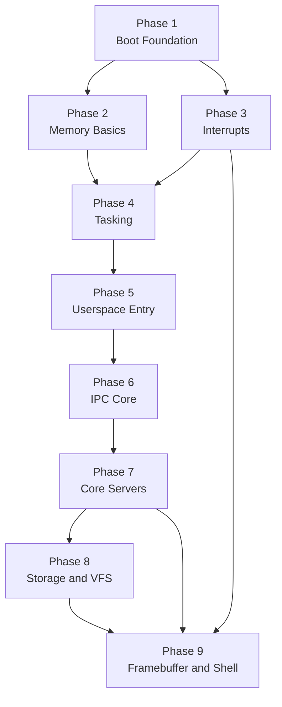

# Roadmap Guide

This directory expands the project roadmap into a learning-first set of milestones.
The goal is not to build the fastest or most feature-rich OS. The goal is to build a
small, understandable microkernel system where each phase teaches one major concept,
produces a runnable artifact, and leaves room for documentation and reflection.

Each phase page includes:

- the milestone goal
- the feature set and scope
- a high-level implementation plan
- acceptance criteria
- dependencies and deferrals
- a short note on how mature operating systems usually differ
- a companion task list in `docs/roadmap/tasks/`

## Guiding Principles

- Prefer clarity over cleverness.
- Keep each phase runnable before moving on.
- Add documentation alongside implementation, not afterward.
- Defer performance and advanced hardware support until the core ideas are clear.

## Milestone Dependency Map

## Milestone Summary

| Phase | Theme | Primary Outcome | Milestone | Tasks |
|---|---|---|---|---|
| 1 | Boot Foundation | Kernel boots and logs over serial | [Phase 1](./01-boot-foundation.md) | [Tasks](./tasks/01-boot-foundation-tasks.md) |
| 2 | Memory Basics | Heap allocation and safe frame management | [Phase 2](./02-memory-basics.md) | [Tasks](./tasks/02-memory-basics-tasks.md) |
| 3 | Interrupts | Exceptions, timer, and keyboard IRQs work | [Phase 3](./03-interrupts.md) | [Tasks](./tasks/03-interrupts-tasks.md) |
| 4 | Tasking | Preemptive kernel threads run correctly | [Phase 4](./04-tasking.md) | [Tasks](./tasks/04-tasking-tasks.md) |
| 5 | Userspace Entry | First ring 3 process runs via syscalls | [Phase 5](./05-userspace-entry.md) | [Tasks](./tasks/05-userspace-entry-tasks.md) |
| 6 | IPC Core | Capability-based message passing works | [Phase 6](./06-ipc-core.md) | [Tasks](./tasks/06-ipc-core-tasks.md) |
| 7 | Core Servers | `init`, console, and keyboard services cooperate | [Phase 7](./07-core-servers.md) | [Tasks](./tasks/07-core-servers-tasks.md) |
| 8 | Storage and VFS | Simple file access through userspace servers | [Phase 8](./08-storage-and-vfs.md) | [Tasks](./tasks/08-storage-and-vfs-tasks.md) |
| 9 | Framebuffer and Shell | Text UI and tiny shell become usable | [Phase 9](./09-framebuffer-and-shell.md) | [Tasks](./tasks/09-framebuffer-and-shell-tasks.md) |

## Suggested Delivery Rhythm

```mermaid
gantt
    title Learning-First Delivery Plan
    dateFormat X
    axisFormat Phase %s

    section Foundations
    Boot Foundation      :p1, 0, 1
    Memory Basics        :p2, after p1, 1
    Interrupts           :p3, after p1, 1

    section Kernel Core
    Tasking              :p4, after p2, 1
    Tasking Dependency   :milestone, after p3, 0
    Userspace Entry      :p5, after p4, 1
    IPC Core             :p6, after p5, 1

    section System Services
    Core Servers         :p7, after p6, 1
    Storage and VFS      :p8, after p7, 1
    Framebuffer + Shell  :p9, after p8, 1
```

## Required Documentation for Every Phase

Every phase should ship with documentation in two layers:

1. A design or roadmap page that explains what the feature is for, how it fits into the
   system, and what the milestone is trying to teach.
2. An implementation page or section in the relevant subsystem docs that explains the
   data structures, control flow, and important safety boundaries.

Each phase should also include a short "how real OSes differ" section. That section
should stay high level. The point is to help the reader understand what was simplified,
what was deferred, and why the toy design is still useful for learning.

## What to Defer Until Later

These topics should stay out of the early roadmap unless they are needed to explain a
core concept:

- SMP and per-core scheduling
- APIC and ACPI-driven hardware discovery
- dynamic linking and shared libraries
- writable filesystems and crash recovery
- POSIX compatibility layers
- advanced shell features, pipes, and job control
- performance tuning and memory optimization tricks

## Related Documents

- [Roadmap Task Lists](./tasks/README.md)
- [Architecture](../01-architecture.md)
- [Boot Process](../02-boot.md)
- [Memory Management](../03-memory.md)
- [Interrupts & Exceptions](../04-interrupts.md)
- [Tasking & Scheduling](../05-tasking.md)
- [IPC](../06-ipc.md)
- [Userspace & Syscalls](../07-userspace.md)
- [Roadmap Summary](../08-roadmap.md)
- [Testing](../09-testing.md)
