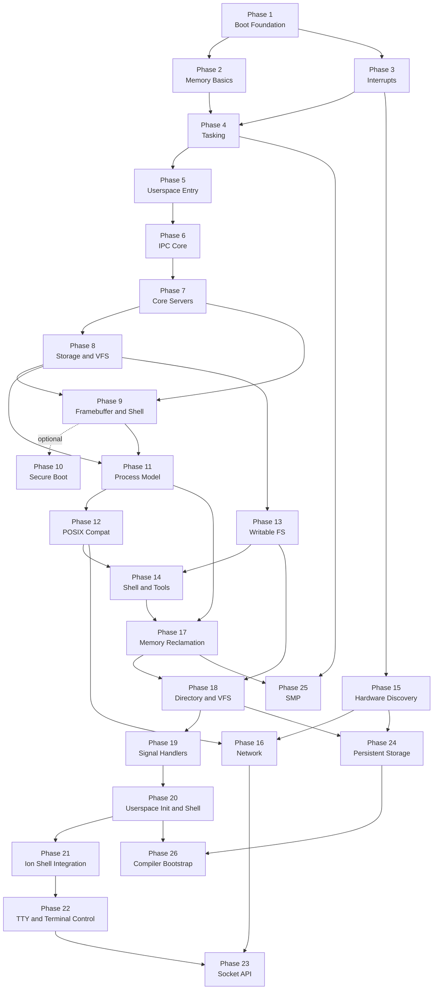

# Roadmap Guide

This directory expands the project roadmap into a learning-first set of milestones.
The goal is not to build the fastest or most feature-rich OS. The goal is to build a
small, understandable microkernel system where each phase teaches one major concept,
produces a runnable artifact, and leaves room for documentation and reflection.

Each phase page includes:

- the milestone goal
- the feature set and scope
- a high-level implementation plan
- acceptance criteria
- dependencies and deferrals
- a short note on how mature operating systems usually differ
- a companion task list in `docs/roadmap/tasks/`

## Guiding Principles

- Prefer clarity over cleverness.
- Keep each phase runnable before moving on.
- Add documentation alongside implementation, not afterward.
- Defer performance and advanced hardware support until the core ideas are clear.

## Milestone Dependency Map

## Milestone Summary

### Foundation Phases (complete)

| Phase | Theme | Primary Outcome | Milestone | Tasks |
|---|---|---|---|---|
| 1 | Boot Foundation | Kernel boots and logs over serial | [Phase 1](./01-boot-foundation.md) | [Tasks](./tasks/01-boot-foundation-tasks.md) |
| 2 | Memory Basics | Heap allocation and safe frame management | [Phase 2](./02-memory-basics.md) | [Tasks](./tasks/02-memory-basics-tasks.md) |
| 3 | Interrupts | Exceptions, timer, and keyboard IRQs work | [Phase 3](./03-interrupts.md) | [Tasks](./tasks/03-interrupts-tasks.md) |
| 4 | Tasking | Preemptive kernel threads run correctly | [Phase 4](./04-tasking.md) | [Tasks](./tasks/04-tasking-tasks.md) |
| 5 | Userspace Entry | First ring 3 process runs via syscalls | [Phase 5](./05-userspace-entry.md) | [Tasks](./tasks/05-userspace-entry-tasks.md) |
| 6 | IPC Core | Capability-based message passing works | [Phase 6](./06-ipc-core.md) | [Tasks](./tasks/06-ipc-core-tasks.md) |
| 7 | Core Servers | `init`, console, and keyboard services cooperate | [Phase 7](./07-core-servers.md) | [Tasks](./tasks/07-core-servers-tasks.md) |
| 8 | Storage and VFS | Simple file access through userspace servers | [Phase 8](./08-storage-and-vfs.md) | [Tasks](./tasks/08-storage-and-vfs-tasks.md) |
| 9 | Framebuffer and Shell | Text UI and tiny shell become usable | [Phase 9](./09-framebuffer-and-shell.md) | [Tasks](./tasks/09-framebuffer-and-shell-tasks.md) |
| 10 *(optional)* | Secure Boot | Kernel boots on real hardware with Secure Boot on | [Phase 10](./10-secure-boot.md) | [Tasks](./tasks/10-secure-boot-tasks.md) |

### POSIX and Userspace Phases

| Phase | Theme | Primary Outcome | Milestone | Tasks |
|---|---|---|---|---|
| 11 | Process Model | Arbitrary ELF binaries load and run as isolated processes | [Phase 11](./11-process-model.md) | [Tasks](./tasks/11-process-model-tasks.md) |
| 12 | POSIX Compat | musl-linked C programs run without modification | [Phase 12](./12-posix-compat.md) | [Tasks](./tasks/12-posix-compat-tasks.md) |
| 13 | Writable FS | Programs can create, write, and delete files | [Phase 13](./13-writable-fs.md) | [Tasks](./tasks/13-writable-fs-tasks.md) |
| 14 | Shell and Tools | Pipes, redirection, job control, and core utilities | [Phase 14](./14-shell-and-tools.md) | [Tasks](./tasks/14-shell-and-tools-tasks.md) |
| 15 | Hardware Discovery | ACPI + PCI enumeration; APIC replaces legacy PIC | [Phase 15](./15-hardware-discovery.md) | [Tasks](./tasks/15-hardware-discovery-tasks.md) |
| 16 | Network | virtio-net driver and minimal TCP/IP stack | [Phase 16](./16-network.md) | [Tasks](./tasks/16-network-tasks.md) |

### Usability Phases

| Phase | Theme | Primary Outcome | Milestone | Tasks |
|---|---|---|---|---|
| 17 | Memory Reclamation | Free-list allocator, CoW fork, heap growth, stack cleanup | [Phase 17](./17-memory-reclamation.md) | [Tasks](./tasks/17-memory-reclamation-tasks.md) |
| 18 | Directory and VFS | `getdents64`, directory fds, real cwd, ramdisk layout | [Phase 18](./18-directory-vfs.md) | [Tasks](./tasks/18-directory-vfs-tasks.md) |
| 19 | Signal Handlers | User signal handlers, trampolines, `sigreturn` | [Phase 19](./19-signal-handlers.md) | [Tasks](./tasks/19-signal-handlers-tasks.md) |
| 20 | Userspace Init and Shell | Ring-3 PID 1 init, remove kernel shell | [Phase 20](./20-userspace-init-shell.md) | [Tasks](./tasks/20-userspace-init-shell-tasks.md) |
| 21 | Ion Shell Integration | ion (Redox OS shell) replaces the minimal custom shell | [Phase 21](./21-ion-shell.md) | [Tasks](./tasks/21-ion-shell-tasks.md) |
| 22 | TTY and Terminal Control | termios, cooked/raw mode, PTY pairs | [Phase 22](./22-tty-pty.md) | [Tasks](./tasks/22-tty-pty-tasks.md) |
| 23 | Socket API | BSD socket syscalls over TCP/UDP stack | [Phase 23](./23-socket-api.md) | [Tasks](./tasks/23-socket-api-tasks.md) |
| 24 | Persistent Storage | virtio-blk driver, FAT32 read/write | [Phase 24](./24-persistent-storage.md) | [Tasks](./tasks/24-persistent-storage-tasks.md) |

### Advanced Phases (deferred)

| Phase | Theme | Primary Outcome | Milestone | Tasks |
|---|---|---|---|---|
| 25 | SMP | All CPU cores run the scheduler simultaneously | [Phase 25](./25-smp.md) | [Tasks](./tasks/25-smp-tasks.md) |
| 26 | Compiler Bootstrap | TCC compiles C programs and itself inside the OS | [Phase 26](./26-compiler-bootstrap.md) | *not yet created* |

## Suggested Delivery Rhythm

```mermaid
gantt
    title Learning-First Delivery Plan
    dateFormat X
    axisFormat Phase %s

    section Foundations (complete)
    Boot Foundation      :done, p1, 0, 1
    Memory Basics        :done, p2, after p1, 1
    Interrupts           :done, p3, after p1, 1

    section Kernel Core (complete)
    Tasking              :done, p4, after p2, 1
    Userspace Entry      :done, p5, after p4, 1
    IPC Core             :done, p6, after p5, 1

    section System Services (complete)
    Core Servers         :done, p7, after p6, 1
    Storage and VFS      :done, p8, after p7, 1
    Framebuffer + Shell  :done, p9, after p8, 1

    section Process and Compatibility (complete)
    Process Model        :done, p11, after p9, 1
    POSIX Compat         :done, p12, after p11, 1
    Writable FS          :done, p13, after p8, 1
    Shell and Tools      :done, p14, after p12, 1

    section Hardware (in progress)
    Hardware Discovery   :active, p15, after p3, 1
    Network              :active, p16, after p15, 1

    section Usability
    Memory Reclamation   :p17, after p14, 1
    Directory and VFS    :p18, after p17, 1
    Signal Handlers      :p19, after p18, 1
    Userspace Init       :p20, after p19, 1
    TTY and Terminal     :p21, after p20, 1
    Socket API           :p22, after p16, 1
    Persistent Storage   :p23, after p18, 1

    section Advanced
    SMP                  :p24, after p17, 1
    Compiler Bootstrap   :p25, after p23, 1
```

## Required Documentation for Every Phase

Every phase should ship with documentation in two layers:

1. A design or roadmap page that explains what the feature is for, how it fits into the
   system, and what the milestone is trying to teach.
2. An implementation page or section in the relevant subsystem docs that explains the
   data structures, control flow, and important safety boundaries.

Each phase must include:

- what was implemented and how it works
- which parts are intentionally simplified vs. a production OS
- a "how real OSes differ" section explaining what was deferred and why the toy
  design is still useful for learning

## Related Documents

- [Roadmap Task Lists](./tasks/README.md)
- [Architecture](../01-architecture.md)
- [Boot Process](../02-boot.md)
- [Memory Management](../03-memory.md)
- [Interrupts & Exceptions](../04-interrupts.md)
- [Tasking & Scheduling](../05-tasking.md)
- [IPC](../06-ipc.md)
- [Userspace & Syscalls](../07-userspace.md)
- [Roadmap Summary](../08-roadmap.md)
- [Testing](../09-testing.md)
