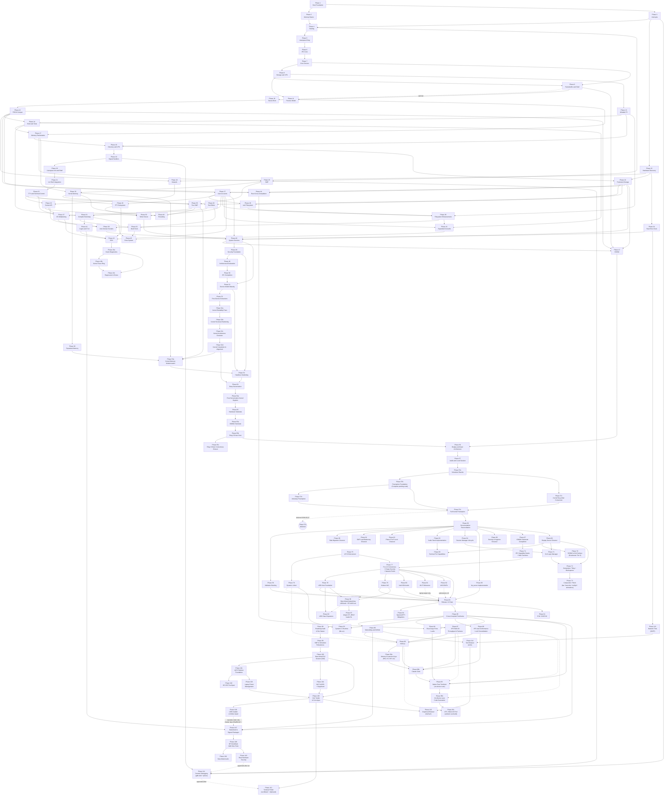
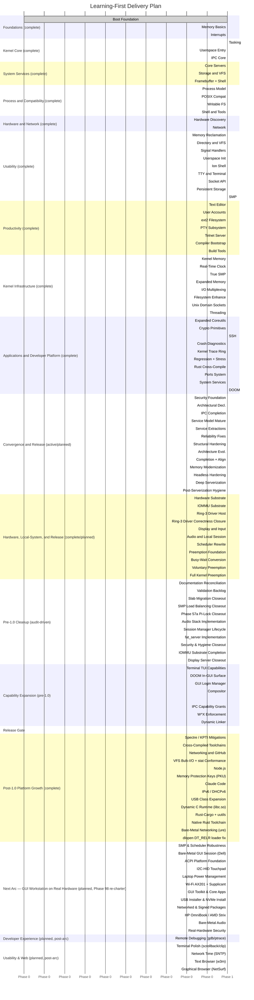

# Roadmap Guide

This directory expands the project roadmap into a learning-first set of milestones.
The goal is not to build the fastest or most feature-rich OS. The goal is to build a
small, understandable microkernel system where each phase teaches one major concept,
produces a runnable artifact, and leaves room for documentation and reflection.

Each phase page includes:

- the milestone goal
- the feature set and scope
- a high-level implementation plan
- acceptance criteria
- dependencies and deferrals
- a short note on how mature operating systems usually differ
- a companion task list in `docs/roadmap/tasks/`

## Guiding Principles

- Prefer clarity over cleverness.
- Keep each phase runnable before moving on.
- Add documentation alongside implementation, not afterward.
- Defer performance and advanced hardware support until the core ideas are clear.
- Borrow existing open-source software where it makes sense — porting teaches as much
  as writing from scratch.

## Milestone Dependency Map

```mermaid
flowchart TD
    P1["Phase 1<br/>Boot Foundation"]
    P2["Phase 2<br/>Memory Basics"]
    P3["Phase 3<br/>Interrupts"]
    P4["Phase 4<br/>Tasking"]
    P5["Phase 5<br/>Userspace Entry"]
    P6["Phase 6<br/>IPC Core"]
    P7["Phase 7<br/>Core Servers"]
    P8["Phase 8<br/>Storage and VFS"]
    P9["Phase 9<br/>Framebuffer and Shell"]

    P1 --> P2
    P1 --> P3
    P2 --> P4
    P3 --> P4
    P4 --> P5
    P5 --> P6
    P6 --> P7
    P7 --> P8
    P7 --> P9
    P8 --> P9
    P9 -.->|optional| P10["Phase 10<br/>Secure Boot"]
    P9 --> P11["Phase 11<br/>Process Model"]
    P8 --> P11
    P11 --> P12["Phase 12<br/>POSIX Compat"]
    P8 --> P13["Phase 13<br/>Writable FS"]
    P12 --> P14["Phase 14<br/>Shell and Tools"]
    P13 --> P14
    P3 --> P15["Phase 15<br/>Hardware Discovery"]
    P12 --> P16["Phase 16<br/>Network"]
    P15 --> P16
    P14 --> P17["Phase 17<br/>Memory Reclamation"]
    P11 --> P17
    P17 --> P18["Phase 18<br/>Directory and VFS"]
    P13 --> P18
    P18 --> P19["Phase 19<br/>Signal Handlers"]
    P19 --> P20["Phase 20<br/>Userspace Init and Shell"]
    P20 --> P21["Phase 21<br/>Ion Shell Integration"]
    P21 --> P22["Phase 22<br/>TTY and Terminal Control"]
    P16 --> P23["Phase 23<br/>Socket API"]
    P22 --> P23
    P18 --> P24["Phase 24<br/>Persistent Storage"]
    P15 --> P24
    P17 --> P25["Phase 25<br/>SMP"]
    P4 --> P25

    %% Productivity phases
    P22 --> P26["Phase 26<br/>Text Editor"]
    P24 --> P26
    P12 --> P27["Phase 27<br/>User Accounts"]
    P24 --> P27
    P27 --> P28["Phase 28<br/>ext2 Filesystem"]
    P24 --> P28
    P22 --> P29["Phase 29<br/>PTY Subsystem"]
    P27 --> P29
    P23 --> P30["Phase 30<br/>Telnet Server"]
    P27 --> P30
    P29 --> P30
    P26 --> P31["Phase 31<br/>Compiler Bootstrap"]
    P14 --> P31
    P31 --> P32["Phase 32<br/>Build Tools"]
    P26 --> P32

    %% Kernel infrastructure phases
    P17 --> P33["Phase 33<br/>Kernel Memory"]
    P25 --> P33
    P15 --> P34["Phase 34<br/>Real-Time Clock"]
    P25 --> P35["Phase 35<br/>True SMP"]
    P33 --> P35
    P33 --> P36["Phase 36<br/>Expanded Memory"]
    P23 --> P37["Phase 37<br/>I/O Multiplexing"]
    P22 --> P37
    P35 --> P37
    P13 --> P38
    P28 --> P38["Phase 38<br/>Filesystem Enhancements"]
    P27 --> P38
    P23 --> P39["Phase 39<br/>Unix Domain Sockets"]
    P38 --> P39
    P37 --> P39
    P35 --> P40["Phase 40<br/>Threading"]
    P33 --> P40

    %% Application phases
    P14 --> P41["Phase 41<br/>Expanded Coreutils"]
    P27 --> P41
    P38 --> P41
    P31 --> P42["Phase 42<br/>Crypto and TLS"]
    P42 --> P43["Phase 43<br/>SSH"]
    P29 --> P43
    P27 --> P43
    P37 --> P43
    P43 --> P43a["Phase 43a<br/>Crash Diagnostics"]
    P43a --> P43b["Phase 43b<br/>Kernel Trace Ring"]
    P43a --> P43c["Phase 43c<br/>Regression & Stress"]
    P43b --> P43c

    P12 --> P44["Phase 44<br/>Rust Cross-Compilation"]
    P24 --> P44
    P31 --> P45["Phase 45<br/>Ports System"]
    P32 --> P45
    P41 --> P45
    P27 --> P46["Phase 46<br/>System Services"]
    P30 --> P46
    P24 --> P46
    P34 --> P46
    P39 --> P46

    %% Shipped graphics proof phase
    P9 --> P47["Phase 47<br/>DOOM"]
    P12 --> P47
    P24 --> P47
    P46 --> P47

    %% Convergence and release-critical phases
    P46 --> P48["Phase 48<br/>Security Foundation"]
    P48 --> P49["Phase 49<br/>Architectural Declaration"]
    P49 --> P50["Phase 50<br/>IPC Completion"]
    P46 --> P51["Phase 51<br/>Service Model Maturity"]
    P50 --> P51
    P51 --> P52["Phase 52<br/>First Service Extractions"]
    P52 --> P52a["Phase 52a<br/>Kernel Reliability Fixes"]
    P52a --> P52b["Phase 52b<br/>Kernel Structural Hardening"]
    P52b --> P52c["Phase 52c<br/>Kernel Architecture Evolution"]
    P52c --> P52d["Phase 52d<br/>Kernel Completion & Alignment"]
    P52d --> P53a["Phase 53a<br/>Kernel Memory Modernization"]
    P33 --> P53a
    P35 --> P53a
    P36 --> P53a
    P48 --> P53["Phase 53<br/>Headless Hardening"]
    P51 --> P53
    P53a --> P53
    P52d --> P54["Phase 54<br/>Deep Serverization"]
    P53 --> P54
    P54 --> P54a["Phase 54a<br/>Post-Serverization Kernel Hygiene"]

    %% Hardware, local-system, and release gate phases
    P54a --> P55["Phase 55<br/>Hardware Substrate"]
    P55 --> P55a["Phase 55a<br/>IOMMU Substrate"]
    P55a --> P55b["Phase 55b<br/>Ring-3 Driver Host"]
    P55b --> P55c["Phase 55c<br/>Ring-3 Driver Correctness Closure"]
    P47 --> P56["Phase 56<br/>Display and Input Architecture"]
    P55b --> P56
    P56 --> P57["Phase 57<br/>Audio and Local Session"]
    P57 --> P57a["Phase 57a<br/>Scheduler Rewrite"]
    P57a --> P57b["Phase 57b<br/>Preemption Foundation<br/>(Complete pending soak)"]
    P57a --> P57c["Phase 57c<br/>Kernel Busy-Wait Conversion"]
    P57b --> P57d["Phase 57d<br/>Voluntary Preemption"]
    P57b --> P57e["Phase 57e<br/>Full Kernel Preemption"]
    P57c --> P57e
    P57d --> P57e
    P57e -.->|deferred 2026-05-07| P57end((Phase 57e<br/>deferred))

    %% Pre-1.0 cleanup phases (close audit-identified gaps)
    P57e --> P58["Phase 58<br/>Documentation Reconciliation"]
    P58 --> P59["Phase 59<br/>Validation Backlog"]
    P58 --> P60["Phase 60<br/>Slab Migration Closeout"]
    P58 --> P61["Phase 61<br/>SMP Load Balancing Closeout"]
    P58 --> P62["Phase 62<br/>Phase 57a Pi-Lock Closeout"]
    P58 --> P63["Phase 63<br/>Audio Stack Implementation"]
    P58 --> P64["Phase 64<br/>Session Manager Lifecycle"]
    P58 --> P65["Phase 65<br/>fat_server Implementation"]
    P58 --> P66["Phase 66<br/>Security & Hygiene Closeout"]
    P58 --> P67["Phase 67<br/>IOMMU Substrate Completion"]
    P58 --> P68["Phase 68<br/>Display Server Closeout"]

    %% Capability expansion phases
    P63 --> P69["Phase 69<br/>Terminal TUI Capabilities"]
    P68 --> P69
    P68 --> P70["Phase 70<br/>DOOM In-GUI Surface<br/>(fb-takeover Tier 3)"]
    P64 --> P71["Phase 71<br/>GUI Login Manager"]
    P68 --> P71
    P68 --> P72["Phase 72<br/>Compositor: Tiling + Workspaces"]
    P71 --> P72
    P72 --> P73["Phase 73<br/>Compositor: Polish<br/>(bar / launcher / notifyd / animations)"]
    P74["Phase 74<br/>IPC Capability Grants<br/>+ Bulk Transfers"]
    P67 --> P74
    P75["Phase 75<br/>W^X Enforcement"]
    P76["Phase 76<br/>Dynamic Linker"]
    P75 --> P76

    %% Pre-1.0 hardware + correctness (per the pre-1.0 audit)
    P77["Phase 77<br/>Pre-1.0 Correctness<br/>+ Cheap Security<br/>+ Network Polish"]
    P78["Phase 78<br/>USB Host Foundation"]
    P79["Phase 79<br/>Modern NIC"]
    P80["Phase 80<br/>Intel HDA Audio"]
    P81["Phase 81<br/>Wi-Fi Reference"]
    P82["Phase 82<br/>AHCI/SATA"]
    P74 --> P77
    P75 --> P77
    P77 --> P78
    P77 --> P79
    P77 --> P80
    P77 --> P81
    P77 --> P82

    %% Release gate
    P59 --> P83["Phase 83<br/>Release 1.0 Gate"]
    P65 --> P83
    P77 --> P83
    P78 --> P83
    P79 --> P83
    P80 --> P83
    P81 -.->|laptop-target only| P83
    P82 -.->|optional pre-1.0| P83
    P76 -.->|optional pre-1.0| P83

    %% Post-1.0 platform growth
    P83 --> P84["Phase 84<br/>Spectre/KPTI<br/>Mitigations"]
    P83 --> P85["Phase 85<br/>Cross-Compiled Toolchains"]
    P85 --> P86["Phase 86<br/>Networking and GitHub"]
    P86 --> P87["Phase 89<br/>Node.js"]
    P76 -.-> P87
    P85 --> P91["Phase 93<br/>Dynamic C Runtime<br/>(libc.so)"]
    P76 --> P91
    P91 -.-> P87
    P87 --> P88a["Phase 90a<br/>Memory Protection Keys<br/>(PKU JIT, W^X v2)"]
    P88a --> P88["Phase 90b<br/>Claude Code"]
    P87 --> P88
    P83 --> P89["Phase 91<br/>IPv6 / DHCPv6"]

    %% USB class expansion (every USB feature deferred from Phase 78)
    P78 --> P90["Phase 92<br/>USB Class Expansion"]

    %% VFS throughput + stat correctness (surfaced by Phase 85; feed the heavy-I/O phases)
    P85 --> P92["Phase 87<br/>VFS Bulk-I/O<br/>Throughput & Fairness"]
    P85 --> P93["Phase 88<br/>VFS stat Conformance<br/>+ ext2 Consolidation"]
    P92 --> P87
    P93 --> P87
    P92 --> P88
    P93 --> P88

    %% Rust toolchain growth: host-cross ports -> on-device toolchain
    P44 --> P94["Phase 94<br/>Rust-Cargo Ports<br/>+ uutils"]
    P85 --> P94
    P88 --> P95["Phase 95<br/>Native Rust Toolchain<br/>(on-device rustc)"]
    P94 --> P95
    P85 --> P95
    P92 -.-> P95
    P93 -.-> P95
    P95 --> P95b["Phase 95b<br/>On-Device rustc<br/>Code Generation"]
    P93 -.-> P95b
    P95b --> P95c["Phase 95c<br/>VFS / Block-I/O Perf<br/>(unblock rust build)"]
    P87 -.-> P95c

    %% Bare-metal real-hardware networking: USB bulk endpoints -> USB NIC
    P78 --> P96["Phase 96<br/>Bare-Metal Networking<br/>USB bulk + RTL8156 ure"]
    P79 --> P96
    P96 -.-> P90

    %% Phase 97 + the GUI-workstation re-charter arc (Phases 98 → 110)
    P96 --> P97["Phase 97<br/>dlopen DT_RELR<br/>loader fix"]
    P97 --> P98["Phase 98<br/>Roadmap Audit<br/>& Re-Charter"]
    P98 --> P99["Phase 99<br/>SMP & Scheduler<br/>Robustness"]
    P99 --> P100["Phase 100<br/>Bare-Metal GUI<br/>Session (Dell)"]
    P100 --> P101["Phase 101<br/>ACPI Platform<br/>Foundation"]
    P101 --> P102["Phase 102<br/>I2C-HID Touchpad"]
    P101 --> P103["Phase 103<br/>Laptop Power<br/>Management"]
    P100 --> P104["Phase 104<br/>Wi-Fi AX201<br/>+ Supplicant"]
    P100 --> P105["Phase 105<br/>GUI Toolkit<br/>& Core Apps"]
    P103 --> P105
    P104 --> P105
    P105 --> P106["Phase 106<br/>USB Installer<br/>& NVMe Install"]
    P106 -.->|narrative order only<br/>charter deps 85a/86c/42 ✅| P107["Phase 107<br/>Networked &<br/>Signed Packages"]
    P85 --> P107
    P86 --> P107
    P42 --> P107
    P107 --> P108["Phase 108<br/>HP OmniBook<br/>AMD Strix Point"]
    P108 --> P109["Phase 109<br/>Bare-Metal Audio"]
    P108 --> P110["Phase 110<br/>Real-Hardware<br/>Security"]

    %% Developer experience — appended after the hardware arc (Track A pull-forward)
    P3 --> P111["Phase 111<br/>Remote Debugging<br/>(gdb stub + ptrace)"]
    P19 --> P111
    P25 --> P111
    P110 -.->|appended after arc| P111

    %% Usability & Web — appended after Developer Experience
    P111 -.->|appended after| P112["Phase 112<br/>Terminal Polish<br/>(scrollback + clipboard)"]
    P105 --> P112
    P34 --> P113["Phase 113<br/>Network Time<br/>(SNTP)"]
    P113 --> P114["Phase 114<br/>Text Browser<br/>(w3m)"]
    P86 --> P114
    P114 --> P115["Phase 115<br/>Graphical Browser<br/>(NetSurf)"]
    P105 --> P115
```

## Milestone Summary

### Status-marker legend

The `Status` column accreted several visually-distinct markers over the roadmap's life; they carry **no** semantic difference in tier — all of `Complete`, `**Complete**`, `Complete ✅`, and `✅ Complete` mean the same "done" state (the emphasis/emoji are era-stylistic). The status words used in the tables:

| Marker | Meaning |
|---|---|
| `Complete` / `**Complete**` / `Complete ✅` / `✅ Complete` | Done. (Bold/emoji are cosmetic era-variants — no tier difference.) |
| `🟢 Landed` | Done and validated by an always-on gate (later-phase house style for `Complete`). |
| `🟡 Implemented` | Core landed + CI-validated; some live/hardware arms are credential-gated or skip-with-reason (honest hedge — not a bare "Complete"). |
| `Partial` | Some tracks landed, others planned/rejected — explicitly scoped (e.g. Phase 95c). |
| `Deferred` | Consciously not pursued; a post-mortem/disposition is cited (e.g. Phase 57e). |
| `Superseded` | Closed by being absorbed into / replaced by another phase, or re-scoped as a non-goal (e.g. 51→46, 59, 65). |
| `Planned` | Chartered, not yet started (the entire 99–110 arc). |
| `Validated-on-HW (run N, date)` | Hardware-only phase validated per the [bare-metal validation strategy](../appendix/bare-metal-validation.md) — not a bare "Complete" (the 99–110 HW arc convention). |

Per-phase **Validated / Claimed-unvalidated / Regressed** evidence verdicts (Phase 1→97) live in the [re-charter audit matrix](../appendix/audit-status/09-recharter-audit-2026-06.md#per-phase-verdict-matrix-phases-1--97).

### Foundation Phases (complete)

| Phase | Theme | Primary Outcome | Status | Source Ref | Milestone | Tasks |
|---|---|---|---|---|---|---|
| 1 | Boot Foundation | Kernel boots and logs over serial | Complete | `phase-01` | [Phase 1](./01-boot-foundation.md) | [Tasks](./tasks/01-boot-foundation-tasks.md) |
| 2 | Memory Basics | Heap allocation and safe frame management | Complete | `phase-02` | [Phase 2](./02-memory-basics.md) | [Tasks](./tasks/02-memory-basics-tasks.md) |
| 3 | Interrupts | Exceptions, timer, and keyboard IRQs work | Complete | `phase-03` | [Phase 3](./03-interrupts.md) | [Tasks](./tasks/03-interrupts-tasks.md) |
| 4 | Tasking | Preemptive kernel threads run correctly | Complete | `phase-04` | [Phase 4](./04-tasking.md) | [Tasks](./tasks/04-tasking-tasks.md) |
| 5 | Userspace Entry | First ring 3 process runs via syscalls | Complete | `phase-05` | [Phase 5](./05-userspace-entry.md) | [Tasks](./tasks/05-userspace-entry-tasks.md) |
| 6 | IPC Core | Capability-based message passing works | Complete | `phase-06` | [Phase 6](./06-ipc-core.md) | [Tasks](./tasks/06-ipc-core-tasks.md) |
| 7 | Core Servers | `init`, console, and keyboard services cooperate | Complete | `phase-07` | [Phase 7](./07-core-servers.md) | [Tasks](./tasks/07-core-servers-tasks.md) |
| 8 | Storage and VFS | Simple file access through userspace servers | Complete | `phase-08` | [Phase 8](./08-storage-and-vfs.md) | [Tasks](./tasks/08-storage-and-vfs-tasks.md) |
| 9 | Framebuffer and Shell | Text UI and tiny shell become usable | Complete | `phase-09` | [Phase 9](./09-framebuffer-and-shell.md) | [Tasks](./tasks/09-framebuffer-and-shell-tasks.md) |
| 10 *(optional)* | Secure Boot | Kernel boots on real hardware with Secure Boot on | Complete | `phase-10` | [Phase 10](./10-secure-boot.md) | [Tasks](./tasks/10-secure-boot-tasks.md) |

### POSIX and Userspace Phases (complete)

| Phase | Theme | Primary Outcome | Status | Source Ref | Milestone | Tasks |
|---|---|---|---|---|---|---|
| 11 | Process Model | Arbitrary ELF binaries load and run as isolated processes | Complete | `phase-11` | [Phase 11](./11-process-model.md) | [Tasks](./tasks/11-process-model-tasks.md) |
| 12 | POSIX Compat | musl-linked C programs run without modification | Complete | `phase-12` | [Phase 12](./12-posix-compat.md) | [Tasks](./tasks/12-posix-compat-tasks.md) |
| 13 | Writable FS | Programs can create, write, and delete files | Complete | `phase-13` | [Phase 13](./13-writable-fs.md) | [Tasks](./tasks/13-writable-fs-tasks.md) |
| 14 | Shell and Tools | Pipes, redirection, job control, and core utilities | Complete | `phase-14` | [Phase 14](./14-shell-and-tools.md) | [Tasks](./tasks/14-shell-and-tools-tasks.md) |
| 15 | Hardware Discovery | ACPI + PCI enumeration; APIC replaces legacy PIC | Complete | `phase-15` | [Phase 15](./15-hardware-discovery.md) | [Tasks](./tasks/15-hardware-discovery-tasks.md) |
| 16 | Network | virtio-net driver and minimal TCP/IP stack | Complete | `phase-16` | [Phase 16](./16-network.md) | [Tasks](./tasks/16-network-tasks.md) |

### Usability Phases (complete)

| Phase | Theme | Primary Outcome | Status | Source Ref | Milestone | Tasks |
|---|---|---|---|---|---|---|
| 17 | Memory Reclamation | Free-list allocator, CoW fork, heap growth, stack cleanup | Complete | `phase-17` | [Phase 17](./17-memory-reclamation.md) | [Tasks](./tasks/17-memory-reclamation-tasks.md) |
| 18 | Directory and VFS | `getdents64`, directory fds, real cwd, ramdisk layout | Complete | `phase-18` | [Phase 18](./18-directory-vfs.md) | [Tasks](./tasks/18-directory-vfs-tasks.md) |
| 19 | Signal Handlers | User signal handlers, trampolines, `sigreturn` | Complete | `phase-19` | [Phase 19](./19-signal-handlers.md) | [Tasks](./tasks/19-signal-handlers-tasks.md) |
| 20 | Userspace Init and Shell | Ring-3 PID 1 init, remove kernel shell | Complete | `phase-20` | [Phase 20](./20-userspace-init-shell.md) | [Tasks](./tasks/20-userspace-init-shell-tasks.md) |
| 21 | Ion Shell Integration | ion (Redox OS shell) replaces the minimal custom shell | Complete | `phase-21` | [Phase 21](./21-ion-shell.md) | [Tasks](./tasks/21-ion-shell-tasks.md) |
| 22 | TTY and Terminal Control | termios, cooked/raw mode, PTY stubs | Complete | `phase-22` | [Phase 22](./22-tty-pty.md) | [Tasks](./tasks/22-tty-pty-tasks.md) |
| 22b | ANSI Escape Sequences | VT100 CSI parser, cursor movement, SGR colors | Complete | `phase-22b` | [Phase 22b](./22b-ansi-parser-enhancement.md) | [Tasks](./tasks/22b-ansi-escape-tasks.md) |
| 23 | Socket API | BSD socket syscalls over TCP/UDP stack | Complete | `phase-23` | [Phase 23](./23-socket-api.md) | [Tasks](./tasks/23-socket-api-tasks.md) |
| 24 | Persistent Storage | virtio-blk driver, FAT32 read/write | Complete | `phase-24` | [Phase 24](./24-persistent-storage.md) | [Tasks](./tasks/24-persistent-storage-tasks.md) |
| 25 | SMP | All CPU cores run the scheduler simultaneously | Complete | `phase-25` | [Phase 25](./25-smp.md) | [Tasks](./tasks/25-smp-tasks.md) |

### Productivity Phases (complete)

| Phase | Theme | Primary Outcome | Status | Source Ref | Milestone | Tasks |
|---|---|---|---|---|---|---|
| 26 | Text Editor | Full-screen editor for creating and modifying files | Complete | `phase-26` | [Phase 26](./26-text-editor.md) | [Tasks](./tasks/26-text-editor-tasks.md) |
| 27 | User Accounts | Login, UID/GID, file permissions, passwd/shadow | Complete | `phase-27` | [Phase 27](./27-user-accounts.md) | [Tasks](./tasks/27-user-accounts-tasks.md) |
| 28 | ext2 Filesystem | Native Unix permissions, replaces FAT32 | Complete | `phase-28` | [Phase 28](./28-ext2-filesystem.md) | [Tasks](./tasks/28-ext2-filesystem-tasks.md) |
| 29 | PTY Subsystem | Pseudo-terminal pairs for remote sessions | Complete | `phase-29` | [Phase 29](./29-pty-subsystem.md) | [Tasks](./tasks/29-pty-subsystem-tasks.md) |
| 30 | Telnet Server | Remote shell access over the network | Complete | `phase-30` | [Phase 30](./30-telnet-server.md) | [Tasks](./tasks/30-telnet-server-tasks.md) |
| 31 | Compiler Bootstrap | TCC compiles C programs and itself inside the OS | Complete | `phase-31` | [Phase 31](./31-compiler-bootstrap.md) | [Tasks](./tasks/31-compiler-bootstrap-tasks.md) |
| 32 | Build Tools | make, ar, shell scripting for multi-file projects | Complete | `phase-32` | [Phase 32](./32-build-tools.md) | [Tasks](./tasks/32-build-tools-tasks.md) |

### Kernel Infrastructure Phases (phases 33-40 complete)

| Phase | Theme | Primary Outcome | Status | Source Ref | Milestone | Tasks |
|---|---|---|---|---|---|---|
| 33 | Kernel Memory | Buddy allocator, OOM retry, slab-cache groundwork, working munmap | Complete | `phase-33` | [Phase 33](./33-kernel-memory-improvements.md) | [Tasks](./tasks/33-kernel-memory-tasks.md) |
| 34 | Real-Time Clock | CMOS RTC, wall-clock time, CLOCK_REALTIME | Complete | `phase-34` | [Phase 34](./34-real-time-clock.md) | [Tasks](./tasks/34-real-time-clock-tasks.md) |
| 35 | True SMP | Per-core syscall stacks, multi-core dispatch, per-core run queues with global scheduler coordination | Complete | `phase-35` | [Phase 35](./35-true-smp-multitasking.md) | [Tasks](./tasks/35-true-smp-multitasking-tasks.md) |
| 36 | Expanded Memory | Demand paging, mprotect, large mmap, disk/RAM expansion | Complete | `phase-36` | [Phase 36](./36-expanded-memory.md) | [Tasks](./tasks/36-expanded-memory-tasks.md) |
| 37 | I/O Multiplexing | select, epoll, non-blocking I/O | Complete | `phase-37` | [Phase 37](./37-io-multiplexing.md) | [Tasks](./tasks/37-io-multiplexing-tasks.md) |
| 38 | Filesystem Enhancements | Symlinks, hard links, /proc, permissions, device nodes | Complete | `phase-38` | [Phase 38](./38-filesystem-enhancements.md) | [Tasks](./tasks/38-filesystem-enhancements-tasks.md) |
| 39 | Unix Domain Sockets | AF_UNIX stream/datagram, socketpair | Complete | `phase-39` | [Phase 39](./39-unix-domain-sockets.md) | [Tasks](./tasks/39-unix-domain-sockets-tasks.md) |
| 40 | Threading | clone CLONE_THREAD, futex, TLS, thread groups | Complete | `phase-40` | [Phase 40](./40-threading-primitives.md) | [Tasks](./tasks/40-threading-primitives-tasks.md) |

### Application Phases (complete)

| Phase | Theme | Primary Outcome | Status | Source Ref | Milestone | Tasks |
|---|---|---|---|---|---|---|
| 41 | Expanded Coreutils | head, tail, sort, find, diff, ps, less | Complete | `phase-41` | [Phase 41](./41-expanded-coreutils.md) | [Tasks](./tasks/41-expanded-coreutils-tasks.md) |
| 42 | Crypto Primitives | RustCrypto crypto-lib, sha256sum, genkey | Complete | `phase-42` | [Phase 42](./42-crypto-primitives.md) | [Tasks](./tasks/42-crypto-primitives-tasks.md) |
| 42b | Async Executor | Userspace cooperative async runtime (`async-rt`), reactor + waker + AsyncFd; sshd refactored to async; sunset fork patches reverted | Complete | `phase-42b` | [Phase 42b](./42b-async-executor.md) | [Tasks](./tasks/42b-async-executor-tasks.md) |
| 43 | SSH | SSH server (sunset IO-less SSH library) | Complete | `phase-43` | [Phase 43](./43-ssh-server.md) | [Tasks](./tasks/43-ssh-server-tasks.md) |
| 43a | Crash Diagnostics | Enriched panic/fault handlers, scheduler/fork/IPC assertions | Complete | `phase-43a` | [Phase 43a](./43a-crash-diagnostics.md) | [Tasks](./tasks/43a-crash-diagnostics-tasks.md) |
| 43b | Kernel Trace Ring | Per-core lockless trace ring, auto-dump on crash, sys_ktrace | Complete | `phase-43b` | [Phase 43b](./43b-kernel-trace-ring.md) | [Tasks](./tasks/43b-kernel-trace-ring-tasks.md) |
| 43c | Regression & Stress | xtask regression/stress commands, CI tiers, proptest/loom | Complete | `phase-43c` | [Phase 43c](./43c-regression-stress-ci.md) | [Tasks](./tasks/43c-regression-stress-ci-tasks.md) |
| 44 | Rust Cross-Compilation | Rust programs compiled on host run in the OS | Complete | `phase-44` | [Phase 44](./44-rust-cross-compilation.md) | [Tasks](./tasks/44-rust-cross-compilation-tasks.md) |
| 45 | Ports System | Source-based package building and installation | Complete | `phase-45` | [Phase 45](./45-ports-system.md) | [Tasks](./tasks/45-ports-system-tasks.md) |
| 46 | System Services | Service manager, syslog, cron, shutdown | Complete | `phase-46` | [Phase 46](./46-system-services.md) | [Tasks](./tasks/46-system-services-tasks.md) |

### Graphics Proof Phase (complete)

| Phase | Theme | Primary Outcome | Status | Source Ref | Milestone | Tasks |
|---|---|---|---|---|---|---|
| 47 | DOOM | A real full-screen graphical program runs and proves the graphics substrate under load | Complete | `phase-47` | [Phase 47](./47-doom.md) | [Tasks](./tasks/47-doom-tasks.md) |

### Convergence and Release-Critical Phases (48-50 complete, 51-52 active, 53a complete, 53+ planned)

| Phase | Theme | Primary Outcome | Status | Source Ref | Milestone | Tasks |
|---|---|---|---|---|---|---|
| 48 | Security Foundation | Repair trust-floor issues in identity, entropy, and boot defaults | Complete | `phase-48` | [Phase 48](./48-security-foundation.md) | [Tasks](./tasks/48-security-foundation-tasks.md) |
| 49 | Architectural Declaration | Make the kernel/userspace boundary explicit and enforceable | Complete | `phase-49` | [Phase 49](./49-architectural-declaration.md) | [Tasks](./tasks/49-architectural-declaration-tasks.md) |
| 50 | IPC Completion | Capability grants, bulk-data transport (copy + page grants), ring-3-safe registry, server-loop failure semantics | Complete | `phase-50` | [Phase 50](./50-ipc-completion.md) | [Tasks](./tasks/50-ipc-completion-tasks.md) |
| 51 | Service Model Maturity | Turn the Phase 46 service baseline into a trusted lifecycle model | Complete (folded into Phase 46) | `phase-51` | [Phase 51](./51-service-model-maturity.md) | [merged into Phase 46 tasks](./tasks/46-system-services-tasks.md) |
| 52 | First Service Extractions | Move the first visible core services into supervised ring-3 processes | Complete (umbrella for 52a–52d) | `phase-52` | [Phase 52](./52-first-service-extractions.md) | [Tasks](./tasks/52-first-service-extractions-tasks.md) |
| 52a | Kernel Reliability Fixes | Fix stale IPC return state, sunset wake_write, clear_child_tid, exec signal reset | **Complete** | `phase-52a` | [Phase 52a](./52a-kernel-reliability-fixes.md) | [Tasks](./tasks/52a-kernel-reliability-fixes-tasks.md) |
| 52b | Kernel Structural Hardening | AddressSpace object, typed UserBuffers, batch TLB, frame zeroing, and partial task-owned return-state groundwork | **Complete** | `phase-52b` | [Phase 52b](./52b-kernel-structural-hardening.md) | [Tasks](./tasks/52b-kernel-structural-hardening-tasks.md) |
| 52c | Kernel Architecture Evolution | VMA tree, growable endpoint/capability tables, unified line-discipline infrastructure, ISR wakeup, and deferred scheduler/keyboard/notification closure | **Complete** | `phase-52c` | [Phase 52c](./52c-kernel-architecture-evolution.md) | [Tasks](./tasks/52c-kernel-architecture-evolution-tasks.md) |
| 52d | Kernel Completion and Roadmap Alignment | Audit-backed closure of the unfinished or overstated 52a/52b/52c work, integrated boot blockers, and release-gate drift before later hardening phases | Complete | `phase-52d` | [Phase 52d](./52d-kernel-completion-and-roadmap-alignment.md) | [Tasks](./tasks/52d-kernel-completion-and-roadmap-alignment-tasks.md) |
| 53a | Kernel Memory Modernization | Per-CPU page cache, magazine-based slab allocator, size-class GlobalAlloc, SMP-scalable allocation | Complete | `phase-53a` | [Phase 53a](./53a-kernel-memory-modernization.md) | [Tasks](./tasks/53a-kernel-memory-modernization-tasks.md) |
| 53 | Headless Hardening | Define the supported headless/reference workflow and release gates | Complete | `phase-53` | [Phase 53](./53-headless-hardening.md) | [Tasks](./tasks/53-headless-hardening-tasks.md) |
| 54 | Deep Serverization | Move meaningful storage/VFS and UDP policy slices into supervised ring-3 services with explicit degraded-mode fallbacks | Complete | `phase-54` | [Phase 54](./54-deep-serverization.md) | [Tasks](./tasks/54-deep-serverization-tasks.md) |
| 54a | Post-Serverization Kernel Hygiene | Close the CLOEXEC/NONBLOCK plumbing gap and relocate arch-syscall cleanup wrappers into their owning subsystems | Complete (via [Phase 66](./66-security-hygiene-closeout.md)) | `phase-54a` | [Phase 54a](./54a-post-serverization-kernel-hygiene.md) | [Tasks](./tasks/54a-post-serverization-kernel-hygiene-tasks.md) |

### Hardware, Local-System, and Release Phases (55, 55a, 55b complete; 55c+ planned)

| Phase | Theme | Primary Outcome | Status | Source Ref | Milestone | Tasks |
|---|---|---|---|---|---|---|
| 55 | Hardware Substrate | A narrow, real-hardware support story: PCIe MCFG + MSI/MSI-X, reusable hardware-access layer, NVMe storage, Intel 82540EM e1000 networking | Complete | `phase-55` | [Phase 55](./55-hardware-substrate.md) | [Tasks](./tasks/55-hardware-substrate-tasks.md) |
| 55a | IOMMU Substrate | ACPI DMAR/IVRS parsing, per-device VT-d / AMD-Vi domains, IOMMU-routed `DmaBuffer<T>`, closes the Phase 55 IOMMU caveat | Complete | `phase-55a` | [Phase 55a](./55a-iommu-substrate.md) | [Tasks](./tasks/55a-iommu-substrate-tasks.md) |
| 55b | Ring-3 Driver Host | Capability-gated device-host syscalls, supervised userspace NVMe and e1000 drivers, completes the Phase 55 ring-3 extraction deferral | Complete | `phase-55b` | [Phase 55b](./55b-ring-3-driver-host.md) | [Tasks](./tasks/55b-ring-3-driver-host-tasks.md) |
| 55c | Ring-3 Driver Correctness Closure | Bound-notification event multiplexing (closes SSH-over-e1000 deadlock), IOMMU BAR identity coverage (closes `--iommu` device-smoke timeouts), userspace `EAGAIN` visibility during driver restart — closes the three correctness residuals Phase 55b left behind | **Complete** | `phase-55c` | [Phase 55c](./55c-ring-3-driver-correctness-closure.md) | [Tasks](./tasks/55c-ring-3-driver-correctness-closure-tasks.md) / [Learning](./55c-ring-3-driver-correctness-closure-learning.md) |
| 56 | Display and Input Architecture | A userspace display service owns presentation and routed input | Complete | `phase-56` | [Phase 56](./56-display-and-input-architecture.md) | [Tasks](./tasks/56-display-and-input-architecture-tasks.md) |
| 57 | Audio and Local Session | The first coherent local graphical session adds audible output and a useful client baseline | Complete | `phase-57` | [Phase 57](./57-audio-and-local-session.md) | [Tasks](./tasks/57-audio-and-local-session-tasks.md) |
| 57a | Scheduler Block/Wake Protocol Rewrite | Linux-style single-state-word + condition-recheck protocol with per-task `pi_lock`; eliminates lost-wake bug class.  Graphical-stack hardware reliability deferred to 57b–57e (cooperative-starvation, not v1 lost-wake, is the residual blocker) | **Complete** | `phase-57a` | [Phase 57a](./57a-scheduler-rewrite.md) | [Tasks](./tasks/57a-scheduler-rewrite-tasks.md) |
| 57b | Preemption Foundation | Per-task `preempt_count`, full register save area (`PreemptFrame`), spinlocks raise `preempt_count`.  No-op refactor that unblocks 57d / 57e.  No behaviour change | **Complete** | `phase-57b` | [Phase 57b](./57b-preemption-foundation.md) | [Tasks](./tasks/57b-preemption-foundation-tasks.md) |
| 57c | Kernel Busy-Wait Audit and Conversion | Catalogue every kernel busy-spin; convert hot/unbounded sites to block+wake pairs; document hardware-bounded sites with bounds and citations.  Independent of 57b — provides direct user-pain relief for cooperative-starvation | **Complete** | `phase-57c` | [Phase 57c](./57c-kernel-busy-wait-conversion.md) | [Tasks](./tasks/57c-kernel-busy-wait-conversion-tasks.md) |
| 57d | Voluntary Preemption (PREEMPT_VOLUNTARY) | IRQ-return preemption check for user-mode tasks; user-mode CPU-bound tasks become preemptible within one timer tick.  Kernel mode remains non-preemptible | **Complete** | `phase-57d` | [Phase 57d](./57d-voluntary-preemption.md) | [Tasks](./tasks/57d-voluntary-preemption-tasks.md) |
| 57e | Full Kernel Preemption (PREEMPT_FULL) — stretch | Drop the `from_user` check; kernel-mode code becomes preemptible at any point where `preempt_count == 0`.  Cross-core reschedule-IPI wakeup latency improves measurably; same-core, timer-only, and `preempt_enable` zero-crossing paths benchmark separately and must not regress.  Adds same-CPL `iretq` resume, kernel-RSP capture, per-CPU access audit, kernel-mode `preempt_enable` immediacy | **Deferred (2026-05-07)** — see [post-mortem](../post-mortems/2026-05-07-57e-preempt-full-deferred.md) | `phase-57e` | [Phase 57e](./57e-full-kernel-preemption.md) | [Tasks](./tasks/57e-full-kernel-preemption-tasks.md) |

### Pre-1.0 Cleanup Phases (post-57e; close audit-identified gaps before Release 1.0)

These phases were drafted 2026-05-08 in response to the phase-completion audit (`docs/appendix/audit-status/`). Each closes a specific category of audit-identified blocker. Phase 58 must precede the others because the audit's status reconciliation is itself a precondition for trusting downstream phase claims.

| Phase | Theme | Primary Outcome | Status | Source Ref | Milestone | Tasks |
|---|---|---|---|---|---|---|
| 58 | Documentation Reconciliation Pass | Walk every phase doc, flip Status fields to match reality, write the missing task docs (Phases 13, 22b, 42b), close Phases 51 and 52, retire/refresh stale legacy docs, consolidate handoff dirs | **Complete** | `phase-58` | [Phase 58](./58-documentation-reconciliation.md) | [Tasks](./tasks/58-documentation-reconciliation-tasks.md) |
| 59 | Validation Backlog | Run every "manual QEMU test" deferred from Phases 30/31/32/43/22b/24/57b/34/39/10; record results; flip task-doc checkboxes | Superseded (per-phase gates 63+ & the Phase 83 gate bundle; residual Secure-Boot → [Phase 110](./110-real-hardware-security.md); see [audit A.4](../appendix/audit-status/09-recharter-audit-2026-06.md#a4--10--versioning-posture-reconciliation)) | `phase-59` | [Phase 59](./59-validation-backlog.md) | [Tasks](./tasks/59-validation-backlog-tasks.md) |
| 60 | Phase 33 Slab Migration Closeout | Audit kernel `Box::new`/`Arc::new` sites; migrate the two genuinely heap-allocated hot kernel object families (Task, XSaveArea) onto the slab-cache infrastructure that landed in Phase 33 but was never used; document the inline-slot-array families that turned out not to be migration candidates. Closes audit Red Flag #4 | **Complete** | `phase-60` | [Phase 60](./60-slab-migration-closeout.md) | [Tasks](./tasks/60-slab-migration-closeout-tasks.md) |
| 61 | Phase 35 SMP Load Balancing Closeout | Audit closeout for Phase 35 SMP load balancing and Phase 25 P25-T033 TLB-shootdown deferral. Verifies `maybe_load_balance()` + `tlb_shootdown_range` from `sys_linux_munmap` + object-attached pipe / IPC wait queues; replaces pipe `yield_now()` polling with `WaitQueue` blocking; adds per-tick user/system tick split, child `tms_cutime` / `tms_cstime`, `sys_wait4` + `sys_getrusage`. Closes audit Red Flag #3 + Phase 25 P25-T033 | **Complete** | `phase-61` | [Phase 61](./61-smp-load-balancing-closeout.md) | [Tasks](./tasks/61-smp-load-balancing-closeout-tasks.md) |
| 62 | Phase 57a Pi-Lock Closeout | Land pi_lock + with_block_state at the four `TODO(57a-C/D)` scheduler sites via `with_block_state_locked_scheduler` (Shape β); kernel-wide Bug #9 audit returns zero LEAK verdicts; Track D guard-leak regression test pinned. Pending 30-minute soak. | Complete (pending soak) | `phase-62` | [Phase 62](./62-phase-57a-pi-lock-closeout.md) | [Tasks](./tasks/62-phase-57a-pi-lock-closeout-tasks.md) |
| 63 | Phase 57 Audio Stack Implementation | Real PCM emission for `audio_server` (replace accounting-only `Ac97Backend`); audio-smoke gate asserts `frames_consumed > 0` via `GetStats` + non-silent WAV; `bell-smoke` verifies BEL → Bell::ring → audible output. Closes audit § B1 / F1 | **Complete** | `phase-63` | [Phase 63](./63-audio-stack-implementation.md) | [Tasks](./tasks/63-audio-stack-implementation-tasks.md) |
| 63a | DOOM Audio Wiring | DOOM SFX + Tier 2a square/triangle synth music play through `audio_server` via two new userspace crates (`audio_mixer`, `audio_client_ffi`) and three new doomgeneric platform-layer C files; honors single-client `EBUSY` policy with silent-fallback; `doom-audio-smoke` gate asserts non-silent WAV plus two consecutive `frames_consumed > 0` runs and BEL re-arm; kernel patch-bumps to `0.63.1` (userspace-only phase) | **Complete** | `phase-63a` | [Phase 63a](./63a-doom-audio-wiring.md) | [Tasks](./tasks/63a-doom-audio-wiring-tasks.md) |
| 64 | Phase 57 Session Manager Lifecycle | Real `start/stop/restart` (replace unconditional-Ack stubs); kill-probe-based lifecycle; restart budget; text-fallback motion. Closes audit § B2 / F2 | **Complete** | `phase-64` | [Phase 64](./64-session-manager-lifecycle.md) | [Tasks](./tasks/64-session-manager-lifecycle-tasks.md) |
| 65 | Phase 54 fat_server Implementation | Real FAT32 operations in `fat_server` (replace permanent ENOSYS stub); routed via `vfs_server`. Closes audit Red Flag #14 (Phase 54 dimension) | Superseded (FAT32 writes are a 1.0 non-goal — `fat_server` stays ENOSYS; ext2 is the supported FS; see [audit A.4](../appendix/audit-status/09-recharter-audit-2026-06.md#a4--10--versioning-posture-reconciliation)) | `phase-65` | [Phase 65](./65-fat-server-implementation.md) | [Tasks](./tasks/65-fat-server-implementation-tasks.md) |
| 66 | Security & Hygiene Closeout | `/tmp` sticky-bit, atomic shadow writes, CLOEXEC plumbing on `open`/`openat`, four `*_pub` wrapper relocations, pre-seeded image hash format upgrade. Closes audit § F4/F5/C6 + Phase 54a | **Complete** | `phase-66` | [Phase 66](./66-security-hygiene-closeout.md) | [Tasks](./tasks/66-security-hygiene-closeout-tasks.md) |
| 67 | Phase 55a IOMMU Substrate Completion | AMD-Vi fault ISR, VT-d scalable mode, VT-d queued invalidation, AMD-Vi multi-BDF domains, replace 4 `todo!()` isolation tests with real harness. Closes audit § C7/E3 | **Complete** | `phase-67` | [Phase 67](./67-iommu-substrate-completion.md) | [Tasks](./tasks/67-iommu-substrate-completion-tasks.md) |
| 68 | Phase 56 Display Server Closeout | Subscription event push (`flush_subscriber_ring` + 2 new event kinds), compositor `DamageTracker` with cursor-only fast path, `ModifierSide` field with global `PROTOCOL_VERSION` 1→2 bump + v1 compatibility shim, extracted `kernel_core::init::{manifest,supervisor}` with `Vec<String>` `depends=` and typed `on-restart=` directive, static `mouse_server.conf` declaring `depends=kbd_server`. Closes audit § C5 | **Complete** | `phase-68` | [Phase 68](./68-display-server-closeout.md) | [Tasks](./tasks/68-display-server-closeout-tasks.md) |

### Capability Expansion Phases (pre-1.0; user-priority)

| Phase | Theme | Primary Outcome | Status | Source Ref | Milestone | Tasks |
|---|---|---|---|---|---|---|
| 69 | Terminal Contract Foundations | terminfo entry (`m3os-term`), alternate screen buffer, 256-color/truecolor SGR, SGR mouse reporting, DECSCUSR cursor styling, bracketed paste, SIGWINCH propagation. Hand-rolled `tui-smoke` byte-level validator. | **Complete** | `phase-69` | [Phase 69](./69-terminal-tui-capabilities.md) | [Tasks](./tasks/69-terminal-tui-capabilities-tasks.md) |
| 69a | Termios Raw Mode and Line Discipline | Full POSIX termios contract — `c_iflag`/`c_oflag`/`c_cflag`/`c_lflag`/`c_cc`, VMIN/VTIME, ISIG signal-from-terminal, `TCGETS`/`TCSETS` on TTY0 and PTY slave. Editors get byte-accurate raw-mode input. | **Complete** | `phase-69a` | [Phase 69a](./69a-terminal-termios.md) | [Tasks](./tasks/69a-terminal-termios-tasks.md) |
| 69b | UTF-8 Wire Decoding + Bitmap Glyph Expansion | UTF-8 decoder in `Screen::feed`; widen `ConsoleCmd::PutChar` to `u32`; bitmap font extended to cover Latin-1 supplement (U+0080–U+00FF) + Unicode box-drawing (U+2500–U+257F); EAW wide-cell accounting; `IUTF8` erase. | Complete | `phase-69b` | [Phase 69b](./69b-terminal-utf8-and-glyphs.md) | [Tasks](./tasks/69b-terminal-utf8-and-glyphs-tasks.md) |
| 69c | TTF Font Loader and Nerd Font Asset | TTF/OTF parser + glyph rasterizer + bounded LRU atlas; JetBrainsMono Nerd Font staged at `/usr/share/fonts/m3os/term.ttf`; runtime atlas-backed `Renderer::glyph_pixels` with static-table fallback. | Complete | `phase-69c` | [Phase 69c](./69c-terminal-font-infrastructure.md) | [Tasks](./tasks/69c-terminal-font-infrastructure-tasks.md) |
| 69d | ncurses Port and First Quality TUI Apps | `ports/lib/ncurses` (narrow + wide); `ports/util/less` + `htop` + `tmux` (with `libevent`); `cargo xtask tui-app-smoke` scripted validation. End-to-end proof of the 69-series terminal contract. | Complete | `phase-69d` | [Phase 69d](./69d-tui-app-foundation.md) | [Tasks](./tasks/69d-tui-app-foundation-tasks.md) |
| 70 | DOOM In-GUI Surface (fb-takeover Tier 3) | DOOM becomes a regular `display_server` client via the new `display_client_ffi` C-ABI bridge; multiple instances run concurrently; `fb-takeover` wrapper deprecated; `SYS_FB_YIELD` / `SYS_FB_REACQUIRE` emit deprecation `log::warn!` per call. Implements Tier 3 from `docs/appendix/fb-takeover-tiers.md` | **Complete** | `phase-70` | [Phase 70](./70-doom-in-gui-surface.md) | [Tasks](./tasks/70-doom-in-gui-surface-tasks.md) |
| 71 | GUI Login Manager | Greeter as a regular display_server client with PNG/BMP background image; in-process `setuid`+`execve(/bin/term)` so term inherits the authenticated UID/GID; 3-failure/5 s backoff; replaces autologin-as-root for graphical sessions | **Complete** | `phase-71` | [Phase 71](./71-gui-login-manager.md) | [Tasks](./tasks/71-gui-login-manager-tasks.md) |
| 72 | Compositor: Multi-Toplevel + Tiling Layout + Workspaces | Multiple toplevel clients tile under master/dwindle/spiral/grid policies; N numbered workspaces per output; chord engine; gaps + borders. Implements `tiling-compositor-path.md` Goal A | **Complete** | `phase-72` | [Phase 72](./72-compositor-tiling-workspaces.md) | [Tasks](./tasks/72-compositor-tiling-workspaces-tasks.md) |
| 73 | Compositor: Polish (bar / launcher / notifications / animations) | Native status bar, fuzzy-find launcher, notification daemon, animation engine (slide/fade), rounded corners + drop shadows. omarchy-aesthetic desktop | **Complete** | `phase-73` | [Phase 73](./73-compositor-polish.md) | [Tasks](./tasks/73-compositor-polish-tasks.md) |
| 74 | IPC Capability Grants and Bulk Transfers | `sys_cap_grant` via IPC, page-grant bulk-data transport (closes Phase 56 D-B4), IPC timeouts, many-to-one notification binding. Closes audit § E2 + Phase 6+/Phase 7+ deferrals | **Complete** | `phase-74` | [Phase 74](./74-ipc-capability-grants.md) | [Tasks](./tasks/74-ipc-capability-grants-tasks.md) |
| 75 | W^X Enforcement | Userspace code pages mapped R-X (no `WRITABLE`); `mprotect` rejects `PROT_WRITE \| PROT_EXEC`; ELF loader splits text/data segments. Closes audit § E1 | **Complete** | `phase-75` | [Phase 75](./75-wx-enforcement.md) | [Tasks](./tasks/75-wx-enforcement-tasks.md) |
| 76 | Dynamic Linker: Scaffolding + Handoff | Kernel `PT_INTERP` branch, full SysV-ABI auxv (`AT_BASE` / `AT_ENTRY`), `ld-musl-x86_64.so.1` PIE crate scaffold (transfer-only `_dlstart`), `dynlink_smoke` end-to-end gate. Closes audit § F6 scaffolding scope; full semantics in 76b–76d | **Complete** | `phase-76` | [Phase 76](./76-dynamic-linker.md) | [Tasks](./tasks/76-dynamic-linker-tasks.md) |
| 76b | Dynamic Linker: DT_NEEDED + Relocations + Constructors | Real `_dlstart` self-relocation, `PT_DYNAMIC` parse + dependency graph + topo-sort cycle detection (host-tested), x86_64 relocation primitives + SysV `elf_hash` (host-tested), `xtask::build_shared_lib`, `libhello.so` + `dynlink_hello` demo, `dynlink-hello-smoke` + `dynlink-missing-smoke` + `dynlink-cycle-smoke` gates all PASS | **Complete** | `phase-76b` | [Phase 76b](./76b-dynamic-linker-bringup.md) | [Tasks](./tasks/76b-dynamic-linker-bringup-tasks.md) |
| 76c | Dynamic Linker: dlopen | `dlopen` / `dlsym` / `dlclose` / `dlerror` with `DT_FINI_ARRAY` destructors, refcounted handle table + slab, linker self-injection so libdl symbols resolve to the linker, `libdl.so` link-time stub + `libhello_fini.so` destructor demo, `dlopen-test-smoke` gate | **Complete** | `phase-76c` | [Phase 76c](./76c-dlopen.md) | [Tasks](./tasks/76c-dlopen-tasks.md) |
| 76d | Dynamic Linker: PLT Lazy + GNU Hash + Versioning | `_dl_runtime_resolve` naked-asm trampoline + GOT[1]/GOT[2] install + lazy `JUMP_SLOT` rebase; `DT_GNU_HASH` Bloom-filter + bucket + chain lookup with dispatcher preferring GNU over SysV; `DT_VERSYM` / `DT_VERDEF` / `DT_VERNEED` parser + version-aware `sym::lookup` + warn-on-fallback + `LD_BIND_NOW`-driven strict-error mode; `dynlink-hello-gnu-smoke` (GOT[3]-mutation + W^X via `/proc/self/maps`), `dynlink-hello-versioned-smoke` (exact-match), `dynlink-hello-versioned-mismatch-smoke` (fallback + strict) end-to-end gates. Kernel bumped to `0.76.3`. | **Complete** | `phase-76d` | [Phase 76d](./76d-dynamic-linker-polish.md) | [Tasks](./tasks/76d-dynamic-linker-polish-tasks.md) |

> **Pre-1.0 audit reference:** the source-verified blocker inventory and sequencing rationale for phases 77–89 lives in [`docs/appendix/audit-status/74a-pre-1.0-audit.md`](../appendix/audit-status/74a-pre-1.0-audit.md). It is an audit artifact, not a phase — it informs Phase 83 (Release 1.0 Gate) without being on the delivery critical path itself.

### Pre-1.0 Hardware and Correctness Phases (per the pre-1.0 audit)

| Phase | Theme | Primary Outcome | Status | Source Ref | Milestone | Tasks |
|---|---|---|---|---|---|---|
| 77 | Pre-1.0 Correctness, Cheap Security, and Network Polish | Bundle phase: SSH disconnect hang + futex CHILD_CLEARTID lost-wakeup, `sys_nanosleep` cleanup, SMEP+SMAP, `PT_TLS` + multithread TLS, DNS resolver wiring, RFC 6298 TCP retransmit + 64-conn lift, AMD microcode loading, `epoll_*` verified, `/proc` ps fix, 5 handoffs resolved | Complete — htop process list populated via `/proc/<pid>/task` subtree; htop-render-probe passes | `phase-77` | [Phase 77](./77-pre-1-0-cleanup.md) | [Tasks](./tasks/77-pre-1-0-cleanup-tasks.md) |
| 78 | USB Host Foundation (xHCI + Hub + HID) | Umbrella theme: ring-3 xHCI driver + USB core + HID class; modern laptops/desktops without PS/2 get keyboard and mouse input. Single biggest 1.0 unblocker. Delivered as 78a/78b/78c. | Complete | `phase-78` | [Phase 78](./78-usb-host-foundation.md) | [78a](./tasks/78a-xhci-host-bringup-tasks.md) · [78b](./tasks/78b-usb-enumeration-hub-tasks.md) · [78c](./tasks/78c-usb-hid-and-release-tasks.md) |
| 78a | USB Host Foundation: xHCI Host-Controller Bring-Up | The `xhci` ring-3 driver claims the controller, completes full bring-up (register discovery → BIOS handoff → reset → DCBAA/scratchpad/contexts → command/event rings → MSI-X → run), and reaches a first `Enable Slot` Command Completion event off the event ring via MSI-X. Lands PCI Bus Master Enable + MSI-X table programming. Kernel `0.78.0`. | Complete | `phase-78a` | [Phase 78a](./78a-xhci-host-bringup.md) | [Tasks](./tasks/78a-xhci-host-bringup-tasks.md) |
| 78b | USB Host Foundation: Enumeration + Hub | Host-testable USB core (descriptor parser + enumeration state machine), host↔class IPC protocol crate, `usbhub` driver + `PortId` topology, and the committed `sys_device_pci_enumerate` multi-controller discovery. Full device tree enumerates and prints on boot. Kernel `0.78.1`. | Complete | `phase-78b` | [Phase 78b](./78b-usb-enumeration-hub.md) | [Tasks](./tasks/78b-usb-enumeration-hub-tasks.md) |
| 78c | USB Host Foundation: HID + Integration + Release | `usb-hid` Boot-Protocol keyboard + mouse → `KeyEvent`/`PointerEvent` injected into `kbd_server`/`mouse_server` (Phase 56 dispatcher unchanged), full `usb-smoke` QMP keystroke gate, learning doc, and the `0.78.2` USB capability cut. Kernel `0.78.2`. | Complete | `phase-78c` | [Phase 78c](./78c-usb-hid-and-release.md) | [Tasks](./tasks/78c-usb-hid-and-release-tasks.md) |
| 79 | Modern Intel/Realtek NIC | e1000e / igb / igc + RTL8111/8168 / RTL8125 ring-3 drivers over a bounded multi-NIC registry; e1000e reaches link in CI (`multi-nic-smoke`) with bidirectional TCP observed manually over `-device e1000e`, and a device-host INTx fix lets the legacy-model NIC drivers move packets; the RTL8125B real-silicon `ping` is operator-validated via VFIO; modern desktops get wired ethernet beyond the QEMU-only 82540EM. Kernel `0.79.0`. | Complete | `phase-79` | [Phase 79](./79-modern-nic.md) | [Tasks](./tasks/79-modern-nic-tasks.md) |
| 80 | Intel HDA Audio (+ Realtek codec family) | Out-of-process ring-3 HDA + extracted AC'97 drivers behind a new `driver_ipc::audio` seam; `audio_server` demoted to a pure policy/mixer server (no kernel facade). Realtek ALC888/892/1220 codecs. Splittable 80a/80b/80c. | Complete | `phase-80` | [Phase 80](./80-intel-hda-audio.md) | [Tasks](./tasks/80-intel-hda-audio-tasks.md) |
| 81 | Wi-Fi Reference Driver (MediaTek mt792x family) | Single-family ring-3 Wi-Fi driver (MT7921/MT7922 connac2 first, MT7925 in the same registry); WPA2-PSK only, chipset CCMP offload, presents as an L2 `RemoteNic`. Honest "Wi-Fi works on one family" 1.0 promise; no QEMU mt76 model so logic is host-tested + radio validated via VFIO. Kernel `0.81.0`. | Driver-side complete; radio HW-only | `phase-81` | [Phase 81](./81-wifi-reference.md) | [Tasks](./tasks/81-wifi-reference-tasks.md) |
| 82 | AHCI / SATA Storage | Ring-3 AHCI/SATA block driver presenting as a second `RemoteBlockDevice`; a SATA disk mounts the root off `ahci.block`. | Complete ✅ | `phase-82` | [Phase 82](./82-ahci-sata.md) | [Tasks](./tasks/82-ahci-sata-tasks.md) |

### Release Gate

| Phase | Theme | Primary Outcome | Status | Source Ref | Milestone | Tasks |
|---|---|---|---|---|---|---|
| 83 | Release 1.0 Gate | The project defines and validates an honest 1.0 support matrix — local-system/graphical branch in scope (screenshot-validated); kernel stays phase-tracked at `0.83.0` with "1.0" as quality-bar language, not SemVer `1.0.0`. Authoritative artifact: [`docs/release/1.0-release-gate.md`](../release/1.0-release-gate.md) | Complete ✅ (kernel `0.83.0`) | `phase-83` | [Phase 83](./83-release-1-0-gate.md) | [Tasks](./tasks/83-release-1-0-gate-tasks.md) |

### Post-1.0 Platform Growth

| Phase | Theme | Primary Outcome | Status | Source Ref | Milestone | Tasks |
|---|---|---|---|---|---|---|
| 84 | Spectre / KPTI / Retpoline / IBRS Mitigations | Spectre-v2 layer landed (retpoline + IBRS/IBPB/STIBP), `mitigations=` policy + `m3ctl mitigations status` reporter, KPTI scaffolding (host-tested PML4-pair model, GLOBAL guard, RDCL_NO auto-skip) — kernel `0.84.0`. KPTI (Meltdown) CR3-trampoline **activation** deferred to a bare-metal-validated follow-up | Spectre-v2 complete; KPTI activation deferred | `phase-84` | [Phase 84](./84-spectre-mitigations.md) | [Tasks](./tasks/84-spectre-mitigations-tasks.md) |
| 85 | Cross-Compiled Toolchains | Umbrella theme: git, Python, and Clang bundled as a supported post-1.0 developer-toolchain set, built once and installed as prebuilt content-addressed `.m3pkg` packages (never rebuilt from source on a routine image build). Delivered as 85a/85b/85c/85d. Kernel `0.85.3`. | Complete | `phase-85` | [Phase 85](./85-cross-compiled-toolchains.md) | [85a](./tasks/85a-package-infrastructure-tasks.md) · [85b](./tasks/85b-git-local-tasks.md) · [85c](./tasks/85c-python-tasks.md) · [85d](./tasks/85d-clang-llvm-tasks.md) |
| 85a | Cross-Compiled Toolchains: Package & Build-Cache Infrastructure | Content-addressed prebuilt-package cache + relocatable `.m3pkg` format + DESTDIR/relocation contract + offline in-OS `pkg` installer; existing ncurses-class ports retrofitted onto the substrate. The backbone that makes the large toolchains affordable. Kernel `0.85.0`. | Complete | `phase-85a` | [Phase 85a](./85a-package-infrastructure.md) | [Tasks](./tasks/85a-package-infrastructure-tasks.md) |
| 85b | Cross-Compiled Toolchains: git (local) | Host-cross-built musl `git` (`NO_CURL NO_OPENSSL` + zlib), local repo workflows (init/add/commit/log/diff/branch/merge), packaged via 85a + installed by `pkg install git`; first real tool exercising the substrate end-to-end. Surfaced + fixed a kernel tmpfs chmod/chown/symlink routing bug. Kernel `0.85.1`. | Complete | `phase-85b` | [Phase 85b](./85b-git-local.md) | [Tasks](./tasks/85b-git-local-tasks.md) |
| 85c | Cross-Compiled Toolchains: Python | Two-stage cross-built **fully static** CPython 3.12 (all C extensions whose dep is ported are builtin — `zlib`/`gzip` + `_curses`/`_curses_panel` against the ported ncurses; m3OS's custom `ld-musl` has no real `libc.so`) + comprehensive non-networked stdlib frozen into `python312.zip`, `pkg install python`, REPL + script workloads (`python-smoke` gate). Kernel `0.85.2`. | Complete | `phase-85c` | [Phase 85c](./85c-python.md) | [Tasks](./tasks/85c-python-tasks.md) |
| 85d | Cross-Compiled Toolchains: Clang/LLVM/LLD (+ Release) | Host-cross-built static Clang + LLD + libc++ (X86-only, `MinSizeRel`), packaged as a ~125 MB `.m3pkg` behind the `M3OS_WITH_CLANG` feature; `pkg install clang` then **compiles + links (lld) + runs C and C++ inside m3OS** (validated via a 9-compile stress gate). Surfaced + fixed a VFS `fstat` inode-identity bug (recursive `#include` dedup) — see the post-mortem + Phase 88 follow-up. Carries the umbrella learning doc + capability cut. Kernel `0.85.3`. | Complete | `phase-85d` | [Phase 85d](./85d-clang-llvm.md) | [Tasks](./tasks/85d-clang-llvm-tasks.md) |
| 86 | Networking and GitHub | Umbrella theme: authenticated outbound developer workflows — a CSPRNG / wall-clock / resolver / CA-trust foundation, then `git` over SSH and HTTPS, the Go runtime, the GitHub CLI (`gh`), and a userspace SIMD / AES-NI capstone. Delivered as 86a/86b/86c/86d/86e/86f. Kernel `0.86.5`. | ✅ Complete | `phase-86` | [Phase 86](./86-networking-and-github.md) | [86a](./tasks/86a-outbound-foundation-tasks.md) · [86b](./tasks/86b-ssh-git-transport-tasks.md) · [86c](./tasks/86c-https-git-transport-tasks.md) · [86d](./tasks/86d-go-runtime-tasks.md) · [86e](./tasks/86e-github-cli-tasks.md) · [86f](./tasks/86f-userspace-simd-tasks.md) |
| 86a | Networking and GitHub: Outbound Foundation | A ChaCha20 DRBG `getrandom` (RDSEED→RDRAND→TSC seeded, `GRND_*` honored, ≤256-byte atomicity, 256-byte cap removed) replacing the non-crypto xorshift PRNG; CSPRNG-sourced `AT_RANDOM` + TCP ISN; a fail-closed build-date wall-clock floor so certs can be validated; a validated IPv4/A-record resolver + `/etc/hosts` path (AAAA scoped out); and a SHA-256-pinned `ca-certificates` `.m3pkg` on one canonical trust path. No transport. Kernel `0.86.0`. | ✅ Complete | `phase-86a` | [Phase 86a](./86a-outbound-foundation.md) | [Tasks](./tasks/86a-outbound-foundation-tasks.md) |
| 86b | Networking and GitHub: SSH + git over SSH | A static **dropbear** `ssh` client (chosen by an in-phase dropbear-vs-sunset ADR — the broader Rust SSH field, russh/ssh-rs/thrussh/ssh2-FFI, is ruled out by the SIMD-off `ring`/`aws-lc-rs` constraint) with built-in `known_hosts`/TOFU and GitHub's ed25519 key seeded as rotatable data, bundled as `ssh.m3pkg` and wired to the **unchanged** Phase 85b `git` through `GIT_SSH` → first secure `git clone` over SSH. Kernel `0.86.1`. | 🟡 Implemented (network-free core + the live host-key-**mismatch reject** verified on m3OS — the non-blocking-`connect` kernel blocker was closed in-phase, proven by `connect-smoke`; only the real `ssh://` clone stays cred-gated, SKIP in CI) | `phase-86b` | [Phase 86b](./86b-ssh-git-transport.md) | [Tasks](./tasks/86b-ssh-git-transport-tasks.md) |
| 86c | Networking and GitHub: HTTPS/TLS + git smart-HTTP | `mbedtls` + `curl` ports (SIMD-off-safe C crypto; pure-Rust rustls deferred) + `git` rebuilt with `NO_CURL` removed + the Phase 85b absence-assertions inverted + X.509 chain/hostname verification against the 86a CA bundle + PAT credentials → `git clone`/push over HTTPS, with a **mandatory rejected-bad-cert** arm. Kernel `0.86.2`. | ✅ Complete (`git-https-smoke` PASSED 36/36 on m3OS incl. the live arms: a real `git clone https://github.com/octocat/Hello-World.git` over mbedTLS reaches `Receiving objects` + checks out HEAD, AND `self-signed.badssl.com` is REJECTED; the static curl+mbedTLS runs on-device, `pkg install git` resolves the `zlib→mbedtls→ca-certificates→curl→git` chain, and the inverted git assertions pass) | `phase-86c` | [Phase 86c](./86c-https-git-transport.md) | [Tasks](./tasks/86c-https-git-transport-tasks.md) |
| 86d | Networking and GitHub: Go-Runtime Gate | Clear the two hard Go-runtime kernel blockers (`mmap` `MAP_FIXED` + `PROT_NONE` arena reservations; edge-triggered `EPOLLET` + `EPOLLRDHUP`) and the soft one (`SIGURG`/`tgkill` async preemption), then ship `ports/lang/go` and prove a static (`CGO_ENABLED=0`) Go binary runs — goroutine rendezvous + plaintext HTTP GET — without 86c. Kernel `0.86.3`. | ✅ Complete (`go-runtime-smoke` PASSED 18/18 on m3OS: a static Go 1.24.6 binary prints `GO_HELLO_OK`, a `LockOSThread` goroutine on a 2nd OS thread via `clone(CLONE_THREAD)` completes a channel rendezvous → `GO_GOROUTINE_OK`, and a plaintext HTTP GET over the in-kernel TCP stack returns 200 → `GO_HTTP_OK`; `os.Executable` via `/proc/self/exe`, `GOMAXPROCS` via `sched_getaffinity`. Bring-up also added `epoll_pwait`(281), SA_SIGINFO `ucontext`, and `eventfd2`(290); runs single-core to avoid cross-core SMP races.) | `phase-86d` | [Phase 86d](./86d-go-runtime.md) | [Tasks](./tasks/86d-go-runtime-tasks.md) |
| 86e | Networking and GitHub: GitHub CLI (`gh`) + Native Fallback | Cross-built static `gh` 2.82.1 (≈55 MB Go, `CGO_ENABLED=0`, built-from-source with the 86d Go 1.24.6 toolchain) as a `.m3pkg` behind an `M3OS_WITH_GH` image feature (default images omit it); `GH_TOKEN` auth + `gh auth setup-git` registering `gh` as a credential helper reusing the 86c machinery; authenticated read+write PR/issue/CI workflows; and a documented native Rust GitHub-REST fallback. Two TLS stacks coexist (mbedTLS for `git`, Go `crypto/tls` for `gh`). Kernel `0.86.4`. The umbrella learning doc `docs/86-networking-and-github.md` is created in **86f**, not here (the 86f row owns it). | 🟡 Implemented (`gh-smoke` core PASSED 16/16 on m3OS: builds the `M3OS_WITH_GH` image, boots `v0.86.4`, `pkg install gh` from the bundled `.m3pkg`, and **`gh version 2.82.1` RUNS on the 86d runtime** — the heavy TLS-capable static Go binary executes; default images debugfs-verified to omit `gh.m3pkg`; `cargo xtask port build gh` is a zero-compiler pkgcache hit on rebuild. The authenticated read/write GitHub arms (`gh auth setup-git` + `gh pr list` + `gh issue create` over 86c HTTPS, secret-hygiene asserts) are implemented but `GH_TOKEN`-gated → **skip-with-reason without a secret** (a PAT can never live in repo/CI — like `git-https-smoke`'s live arms); the credential is seeded at 0600 and never crosses serial. Live-auth verification awaits a maintainer running `GH_TOKEN=<pat> cargo xtask gh-smoke`.) | `phase-86e` | [Phase 86e](./86e-github-cli.md) | [Tasks](./tasks/86e-github-cli-tasks.md) |
| 86f | Networking and GitHub: Userspace SIMD / AES-NI Capstone | An SSE/SSE2 (+AES) hardware-float **Rust userspace target** (the kernel stays soft-float — no XMM in IRQ handlers), the finished signal-frame FPU save/restore path, `_start` RSP/auxv alignment, full userspace re-validation, and hardware-AES-NI-accelerated SSH/TLS crypto (AES-NI ≈27× the soft-float baseline). Per `docs/research/simd-enablement.md` a perf capstone, **not** a prerequisite (the kernel XSAVE machinery is already live, Phase 57e/60). Owns the umbrella learning doc (`docs/86-networking-and-github.md`). Kernel `0.86.5`. | ✅ Complete | `phase-86f` | [Phase 86f](./86f-userspace-simd.md) | [Tasks](./tasks/86f-userspace-simd-tasks.md) |
| 87 | VFS Bulk-I/O Throughput & Fairness | Batched multi-block ext2 reads/writes + readahead/write-back + VFS fairness so large file I/O over the ring-3 block path (canonically `pkg install python`, a 21 MiB package — ~5,376 single-block ring0↔ring3 round-trips today) is fast and no longer freezes interactive clients (compositor/`term`) in GUI mode. Surfaced by Phase 85c; userspace `pkg` chunked-read + install progress baseline already landed there. Prerequisite for the heavy-I/O Phases 89 (Node.js) + 90 (Claude Code). Kernel `0.87.0`. | 🟢 Throughput + fairness landed (Tracks A+B+C.2+D+E): contiguous-run ext2 read **and** write coalescing in **both** readers + a `vfs_server` **write-through block cache** + 64 KiB read/write caps + **deferred metadata flush** + **multi-block allocation**. `pkg install mbedtls` device I/O **~44,000 → ~3,960 ops (~11x)** (reads ~36,200 → ~2,114, writes ~7,800 → ~1,836); install wall-clock 91 s → 66 s. Fairness: WRITE requests over 1 s eliminated (~1.35 s → 0). Gate asserts read+write `_calls`. C.1 readahead / F optional remain. | `phase-87` | [Phase 87](./87-vfs-bulk-io.md) | [Tasks](./tasks/87-vfs-bulk-io-tasks.md) |
| 88 | VFS `stat` Conformance & ext2 Consolidation | Make file metadata correct, complete, and **consistent across every access path** — same `(st_dev, st_ino)`, size, mode, and timestamps whether stat'd by path or by fd, via the kernel ext2 or the ring-3 `vfs_server` — via one canonical `fill_stat()` serializer; and reconcile the **two independent ext2 implementations** (kernel `EXT2_VOLUME` + vfs_server `Ext2State`) by sharing their resolve/read logic in `kernel_core` so they can't diverge; the same VFS/fd-layer correctness pass also makes `pwrite64` positional (write at offset without disturbing the shared fd position). Surfaced acutely by Phase 85d (in-OS clang's `redefinition of 'main'` from `fstat` returning `st_ino=0` for VFS files, collapsing distinct files onto one identity; the `pwrite64` and `clang-smoke`-matcher follow-ups were also surfaced by 85d's PR #225 review); see the post-mortem. Quality prerequisite for the `make`/`git`/`stat`-dependent toolchain phases (89, 90); complements Phase 87 (same layer, throughput). | Complete | `phase-88` | [Phase 88](./88-vfs-stat-and-ext2-consolidation.md) | [Tasks](./tasks/88-vfs-stat-and-ext2-consolidation-tasks.md) |
| 89 | Node.js | A statically-linked **jitless Node.js v22.22.3** (`--v8-options=--jitless`, static musl, sealed ~130 MB `.m3pkg`) runs natively inside m3OS **and does real network I/O over the in-kernel TCP stack**; only live-internet HTTPS + `npm install` remain opt-in (the Phase 90 dependency) | 🟢 Landed — `node-smoke` PASSES with networking always-on (`M3OS_KVM=1`, 37 s cached): boot `0.89.0` → `pkg install node` → `node --version` v22.22.3 → fs/process/event-loop/**timer** probe (NODE_TIMER_OK validates the A.1 `timerfd` end-to-end) → **`NODE_EGRESS_OK` (a full libuv `http.get` cycle over the in-kernel TCP stack)** → tls/dns/crypto load. **Two kernel fixes:** (1) `F_SETFD`→`EBADF` for closed fds (was silent-success → node's libuv CLOEXEC-all-fds loop busy-spun forever — the startup-hang fix); (2) implemented `FUTEX_REQUEUE`/`FUTEX_CMP_REQUEUE` (silent no-op deadlocked libuv's threadpool condvar — musl `pthread_cond` requeues onto the mutex — the networking fix that unblocked egress). Only the **real-internet** arms (live HTTPS + `npm install`) stay opt-in (`M3OS_NODE_NET`), skip-with-reason in CI (no outbound egress, mirroring `git-https-smoke`); no 127.0.0.1 loopback, but egress proves the TCP path. | `phase-89` | [Phase 89](./89-nodejs.md) | [Tasks](./tasks/89-nodejs-tasks.md) |
| 90a | Memory Protection Keys (PKU) + JIT V8 | Evolve the Phase 75 W^X invariant to a hardware-enforced per-thread **W^X v2** via x86 Memory Protection Keys (CR4.PKE, PTE key bits 59–62, `pkey_alloc`/`pkey_free`/`pkey_mprotect`, PKRU on the existing per-task XSAVE) — unguarded RWX stays rejected (`wx-violation` unchanged); a W+X mapping is permitted only under a non-default pkey whose default policy denies write. On that substrate, a **JIT-enabled `build_node` variant** (own content key; the 89 jitless artifact stays the default/fallback) runs V8 codegen + **working WASM** on m3OS (`pku-smoke` + `node-jit-smoke`), unblocking the 90b Claude Code TUI. Kernel `0.90.0`. | ✅ Complete (`pku-smoke` PASSES under KVM on real PKU hardware — alloc/free+ENOSPC, PKRU-denied-write fault, per-context asymmetry, signal-frame preservation, the W^X v2 accept/reject matrix — and `node-jit-smoke` PASSES 20/20: the JIT Node variant `pkey_mprotect(RWX, key)`s its code space, the kernel logs the `[wx] v2-guarded W+X mapping` grant, `NODE_JIT_OK` (TurboFan) + `NODE_WASM_OK` (`WebAssembly.Instance`), NO unguarded RWX; `wx-violation` green unchanged. V8-on-musl PKU engagement needed 4 fixes past A.1: PKEY_DISABLE_* macros in V8's gyp TUs, a global-scope NodePlatform allocator override, a **C++-linkage** pkey shim (V8 weak-declares the wrappers `extern "C++"`), and `%PrepareFunctionForOptimization`. SMP-PKU recursive-fault is a tracked Track B follow-up; gates pin single-core like go/node.) | `phase-90a` | [Phase 90a](./90a-memory-protection-keys.md) | [Tasks](./tasks/90a-memory-protection-keys-tasks.md) |
| 90b | Claude Code | **Claude Code runs natively on m3OS — including its interactive TUI.** A pinned `@anthropic-ai/claude-code@2.1.112` (the last `cli.js`-under-Node version; 2.1.113+ went native-Bun) npm tarball sealed as a `claude-code` `.m3pkg` (`DEPS=node`, offline solver install — live `npm install` impractical over the slow VFS), a `#!/usr/bin/env node` `/usr/bin/claude` launcher that imports `cli.js` in-process + pins the supported env (86a CA bundle, no auto-update/telemetry — `/bin/sh`=`ion` can't run shebang scripts with flag args), `gh`-pattern 0600 credential seeding (**subscription** `claude setup-token` OAuth token primary; `ANTHROPIC_API_KEY` alternative; in-OS `/login` paste-flow as the human path), and a `claude-smoke` gate (offline install+launch core + the A.2 SIGINT/spawn/raw-mode probes + a `SEG_OK` `Intl.Segmenter` guard + an automated QMP/PPM interactive-TUI render arm; opt-in live API + file/shell/git agent arms). Kernel `0.90.1`. | 🟢 Landed — `claude-smoke` **PASSES** (`M3OS_KVM=1`, 116 s): `pkg install claude-code` (node FIRST, dependency-first) → `claude --version` 2.1.112 → `--help` → vendored static-pie `rg` → A.2 `NODE_SIGINT_OK`/`NODE_SPAWN_OK`/`NODE_RAWMODE_OK` — **27/27 on the jitless node (CI-viable default, no PKU) and on the 90a JIT node** (`M3OS_CLAUDE_JIT=1`, KVM/PKU-gated — the embedded-`yoga.wasm` interactive-TUI variant), **and the interactive `claude` TUI renders on the JIT node**: the automated QMP/PPM render arm (`claude_tui_render_arm`) launches `claude` in the graphical `term`, screendumps, and asserts **592 changed band scanlines** (threshold 20; a blank screen ≈ 0) — the captured screenshot shows the rendered "Welcome to Claude Code v2.1.112" onboarding splash. Running the real-world `cli.js` forced **two fixes**: (1) a kernel **W^X-v2 cross-thread PKU read-recovery** (a sibling worker thread DATA-reads the per-thread-PKRU-guarded V8 code space → `PROTECTION_KEY` fault; the page-fault handler grants read on guarded *executable* pages, writes stay gated → W^X intact) — the integration test surfacing the pre-flagged SMP-PKU gap, needed for `cli.js` to launch; and (2) a node build switch from `--with-intl=small-icu` to **full-icu** (small-icu omits the ICU break-iterator data `Intl.Segmenter` needs for the TUI's grapheme segmentation, which null-deref'd V8's `JSSegments::Create`; the `mremap`/`io_uring` syscalls in the earlier trace were red herrings, correctly returning `-ENOSYS`). The JIT/WASM runtime (`node-jit-smoke`: TurboFan + `WebAssembly.Instance`) and the A.2 interactive primitives (SIGINT/spawn/raw-mode) are proven, and the interactive TUI now renders — Phase 90b's "interactive TUI first" milestone is achieved. | `phase-90b` | [Phase 90b](./90b-claude-code.md) | [Tasks](./tasks/90b-claude-code-tasks.md) |
| 91 | IPv6 / DHCPv6 | Dual-stack IPv6 on the IPv4-only stack: `Ipv6Addr` + header framing + pseudo-header checksum, ICMPv6 + **NDP** (live neighbor discovery — the guest answers SLIRP's NS with an NA), the `AF_INET6`/`sockaddr_in6` socket surface, `ping6 ::1` via an ICMPv6 internal loopback, and SLAAC + a DHCPv6 client (host-tested; live behind `M3OS_IPV6_LIVE` since libslirp sends no RA). Always-on `ipv6-smoke` CI gate PASSES — including full dual-stack TCP over IPv6 (`:tcp:ok`, family-aware accept/getpeername) and the `dns6-smoke` AAAA / RFC 6724 dual-stack `getaddrinfo` arm, both landed. | 🟢 Landed | `phase-91` | [Phase 91](./91-ipv6-dhcpv6.md) | [Tasks](./tasks/91-ipv6-dhcpv6-tasks.md) |
| 92 | USB Class Expansion | Every USB *class* feature deferred from Phase 78c, built on the **Phase 96 bulk-endpoint substrate** (PR 248/237 — `PollBulkIn`/`SubmitBulkOut`/`BulkData`/`ControlWrite`, `USB_MSG_MAX`=4096, the multi-controller `handle.rs` codec) rather than re-implementing transport: external-hub multi-tier enumeration (devices behind a `usb-hub`, addressed by the xHCI route string), live HID Report Protocol (touchpads/gaming mice + keyboard LEDs via `SET_REPORT`), a USB hot-plug event surface (Port Status Change → `AttachNotice`, detach + Disable Slot), USB mass storage (**BOT** + UAS over the inline bulk path, with the page-grant `SubmitTransfer` as the >4 KiB overflow), USB audio (UAC) / video (UVC), a generic **CDC-ECM/NCM** USB-Ethernet class driver that generalizes the Phase 96 vendor `ure` NIC, and per-controller concurrent IRQ servicing. Closes with the `0.91.0`→`0.92.0` kernel bump + the Phase 92 learning doc. **Split breadth-first**: the core (hot-plug, mass-storage BOT + data-IN/sector R/W, hub discovery, live HID Report-descriptor parse, foundation) is landed + validated and ships the **`0.92.0`** kernel bump; the deep/kernel-invasive/hardware-only remainder landed as sub-phases **92a–92e** (tier-2 enumeration + `/mnt/usb` mount, live Report-Protocol HID, isochronous UAC/UVC, multi-controller concurrency, and CDC-ECM/NCM USB-Ethernet — closing at **`0.92.5`**; see the task doc's Sub-Phase Schedule). | Complete | `phase-92` | [Phase 92](./92-usb-class-expansion.md) | [Tasks](./tasks/92-usb-class-expansion-tasks.md) |
| 93 | Dynamic C Runtime (`libc.so` + shared objects) | Ship a real musl `libc.so` + close the syscall gaps a dynamic libc needs (`mremap`, …) so genuinely dynamically-linked C programs run: a dynamic `python3` with real `lib-dynload` `.so` extensions + `ctypes`/`dlopen` of arbitrary shared objects. Lifts the Phase 85c finding that m3OS's Phase 76 loader works but has no `libc.so` to load (`DT_NEEDED not found: libc.so`); the static path stays the fallback. Prerequisite for Node native addons (Phase 89) + pip C-extension wheels. | Complete | `phase-93` | [Phase 93](./93-dynamic-c-runtime.md) | [Tasks](./tasks/93-dynamic-c-runtime-tasks.md) |
| 94 | Rust-Cargo Ports & uutils Coreutils | Establish the project's first Rust-cargo cross-compiled port class (`x86_64-unknown-linux-musl`, prebuilt-std, self-contained — no external musl-gcc) on the Phase 85a `.m3pkg` substrate, then deliver upstream [uutils/coreutils](https://github.com/uutils/coreutils) as a single static multicall binary + per-applet symlinks installed by `pkg install coreutils` into `/usr/local/bin`, where it shadows the hand-built `coreutils-rs` set by PATH precedence. Runs on the existing Phase 12 Linux-syscall compat layer (one small family of fd-relative `*at` syscalls added — `unlinkat`(263) for `rm -r`, `fchmodat`(268)/`fchmodat2`(452) for `chmod -R`, `fchownat`(260) for `chown -R`, `mkdirat`(258) for `install -D` — all surfaced by uutils' `uucore::safe_traversal`, which has no musl legacy fallback; single patch bump `0.94.0`→`0.94.1`); the ramdisk `no_std` floor is preserved for early boot + uninstall fallback. `DEPS=` empty (pure-Rust feature set). | Complete | `phase-94` | [Phase 94](./94-rust-cargo-uutils.md) | [Tasks](./tasks/94-rust-cargo-uutils-tasks.md) |
| 95 | Native Rust Toolchain (on-device `rustc`) | Run the Rust *toolchain itself* on m3OS — not just host-cross-compiled Rust programs (Phases 44/94), which already work. A **dynamic** musl `rustc` 1.96.0 (`DEPS=musl`/`libc.so` — a fully-static rustc is infeasible: rustc's own proc-macro deps can't build on a `crt-static` musl host), packaged behind an `M3OS_WITH_RUST` image feature, compiles a Rust source file to a native ELF, links it with the bundled `rust-lld`, and runs it on-device (`rustc hello.rs && ./hello`) against a prebuilt std sysroot resolved relative to the binary — the Rust analog of Phase 85d's on-device Clang (the correct precedent; Phase 86d only *runs* a pre-built Go binary, its compiler never runs on-device). Reuses the Phase 85d streaming-exec / `pread64` / large-heap kernel work + LLD. The **proc-macro** half (`cargo` + derive macros) is gated on **Phase 93**'s `libc.so` + loader TLS, because a proc-macro is a `.so` that `rustc` `dlopen`s at compile time. `mrustc` noted as a smaller, LLVM-free, Phase-93-independent first cut. | ✅ Host toolchain + on-device install landed; on-device `RUSTC_OK` codegen **landed in [95b](./95b-on-device-rustc.md)** (multithreaded `rust-lld`, `M3OS_KVM`) | `phase-95` | [Phase 95](./95-native-rust-toolchain.md) | [Tasks](./tasks/95-native-rust-toolchain-tasks.md) |
| 95b | On-Device `rustc` Code Generation | Land the milestone Phase 95's host toolchain was blocked on — make the installed dynamic musl `rustc` actually *run* on-device (`rustc hello.rs` → `RUSTC_OK`) by reworking the `ld-musl` loader + kernel mm from whole-file read+copy to a **streaming / file-backed-mmap** strategy (so the ~162 MB `librustc_driver.so` demand-pages instead of being read+copied in full), batching SMP TLB shootdowns, and landing a targeted kernel-stack strategy. Then the `cargo` + proc-macro stretch — `cargo build` proc-macro-free (`CARGO_OK`) and a derive-macro crate via on-device `dlopen` of the proc-macro `.so` against the Phase 93 `libc.so` (`CARGO_PROCMACRO_OK`). | ✅ **Complete (milestone)** — `RUSTC_OK` ACHIEVED + MULTITHREADED (2026-06-25): `rustc hello.rs` compiles, multithreaded `rust-lld` links it, the native binary runs (`RUSTC_OK`), 0 kernel faults, ~53 s fresh-install under `M3OS_KVM=1`. Areas A+B (streaming demand-paged file-backed loader via `MAP_LAZY_FILE` + a blocking vfs-IPC read from the page-fault handler, `dynamic-hello-smoke`/`smp-smoke` PASS) cleared the Phase 95 eager-load wall; the milestone then needed a crash-chain fix (process-page-table `841fd53f`, `FIONBIO` ioctl, `AT_EXECFN`+`DT_RUNPATH`/`$ORIGIN`), the **cross-DSO TLS-at-offset-0** loader fix (drops `--threads=1`), and a **thread-group fatal-kill** (`addr=0x8`) robustness fix. Area C unnecessary (A.2 removed the kstack overflow). **Deferred:** TCG-runnable gate (→ 95c VFS perf) + the cargo/proc-macro stretch (Track E, a separate `cargo-smoke` gate). See the [completion plan](../handoffs/2026-06-24-phase-95-completion-plan.md). | `phase-95b` | [Phase 95b](./95b-on-device-rustc.md) | [Tasks](./tasks/95b-on-device-rustc-tasks.md) |
| 95c | VFS / Block-I/O Performance (unblock the rust build) | ⚠️ **REFRAMED (2026-06-24, see the [completion plan](../handoffs/2026-06-24-phase-95-completion-plan.md)):** under **KVM** the FS is fast (install ~25 s, cold-load ~9.6 s) — the slow-VFS figures below are a TCG artifact, so 95c is the path to a **TCG-runnable** `rustc-smoke` gate, **not** the `RUSTC_OK` correctness blocker (that is the `rustc hello.rs` compile stall). The **supply-side** complement to 95b's demand-side lazy loader, and the subphase that *finishes* the 95-series goal. 95b instrumentation showed the ring-3 VFS runs at only ~100–200 KB/s effective (per-read IPC round-trips), so the 368 MB rust install is ~40 min of I/O — at/over the install-step timeout (the immediate `RUSTC_OK` blocker) — and cold loads crawl. 95c makes the VFS path fast the **microkernel-idiomatic** way — keeping `vfs_server` the sole ext2 authority, not moving ext2 into the kernel: **zero-copy + readahead demand-fill** (A — the server fills a kernel-granted page, no IPC-payload copy, and serves a large readahead cluster per round-trip), a **kernel page cache for file-backed pages** (B — the external-pager amortizer à la Mach memory objects / Zircon VMOs / L4Re; re-faults, shared maps, and a second run hit the cache with zero server IPC), **evicting ext2 block caches** (C), **installer coalescing** (D), and a throughput + **per-IPC-cost** gate (E). The in-kernel ext2 read fast path (F) is **REJECTED** by an architecture decision (microkernel-boundary departure; conflicts with the ext2-engine-unification) — fix perf in the ring-3 driver; reconsidered only if A+B+D + a recorded measurement prove IPC itself is the wall. `pkg install rust` then completes inside the timeout and the Phase 95b `rustc-smoke` arm flips to PASS (`RUSTC_OK`, G). Speeds clang/node/python/claude installs + cold loads too. | **Partial** — A (zero-copy+readahead) / C (LRU) / E (gate) landed; B (page cache) + D (installer) planned; **F rejected**. Reframed: not the `RUSTC_OK` blocker under KVM. | `phase-95c` | [Phase 95c](./95c-vfs-block-io-perf.md) | [Tasks](./tasks/95c-vfs-block-io-perf-tasks.md) |
| 96 | Bare-Metal Networking: USB Bulk Endpoints + RTL8156 USB-Ethernet (`ure`) | First **real-hardware** NIC: add USB **bulk** endpoints to the xHCI host stack (the transfer type Phase 78c deferred; also the groundwork Phase 90 Track D.1 Mass Storage needs), then ship a Realtek RTL815x (`0bda:8156` 2.5GbE class) USB-Ethernet driver `ure` — re-expressed from BSD `ure(4)`, OCP register tunnel + RX/TX descriptor framing — that registers on the bus-agnostic Phase 79 `RemoteNic` facade, so the in-kernel TCP/IP stack does DHCP/HTTP over a physical dongle with no network-layer change. Also lands the reusable bare-metal bring-up workflow (`xtask run --usb-passthrough`, AMT Serial-over-LAN capture, network log sink to a second machine) that the deferred touchpad/Wi-Fi phases reuse. Motivated by the bare-metal port to a Tiger Lake laptop (Intel CNVi Wi-Fi unsupported, no Ethernet port). | ✅ **Complete (2026-06-26)** — Stages 1a/1b/2 HW-validated via passthrough (claim → MAC → control-OUT init → `link up 2500M` → `RemoteNic`), `ure-smoke` + DHCP client landed, and the **RX datapath validated on bare metal** (real laptop bound a DHCP lease `ip=192.168.1.221`, which requires RX — clearing the QEMU-passthrough RX wall). Bare-metal bring-up follow-on (boot rescue, USB log persistence, PS/2 keyboard, framebuffer write-combining) landed on `docs/96-bare-metal-usb-ethernet`. | `phase-96` | [Phase 96](./96-bare-metal-usb-ethernet.md) | [Tasks](./tasks/96-bare-metal-usb-ethernet-tasks.md) |
| 97 | `dlopen-test-smoke` flake → `DT_RELR` loader fix (debugging) | Root-cause + fix the `smoke-test` **step 26** (`dlopen-test-smoke`) failure. **Confirmed cause (NOT the "TCG stall" the title implies): the `ld-musl` loader had no `DT_RELR` support.** `libhello_fini.so`'s sole relocation — its `DT_FINI_ARRAY` destructor pointer — is `.relr.dyn`-encoded (`readelf`: `RELASZ: 0`, `RELR: 0x1070`), so it was never relocated; `dlclose` → `run_destructors_for` jumped to the unrelocated in-file vaddr `0x2a0` → near-NULL `INSTRUCTION_FETCH` → `process killed`. The design doc's blocking-`vfs` AND cross-core TLB-shootdown hypotheses were **both refuted** (zero `[tlb]` lines in the reproduced dump); the failure is *toolchain-deterministic* (modern linkers emit `.relr.dyn`, older emit `.rela.dyn` which the loader already handled) and only *looked* like an intermittent stall because the gate had no FAIL pattern. Fix: host-tested `reloc::apply_relr` wired into the loader's `Dyn` parser + all three relocation sites, plus an honest `WaitPassOrFail` gate and a hoisted kernel-fatal scan. | ✅ **Complete (PR #268)** — kernel `v0.97.0`; validated by `ldso_core` host tests + a 232-iteration on-device soak + a full `smoke-test` pass | `phase-97` | [Phase 97](./97-dlopen-smoke-tcg-stall.md) | [Tasks](./tasks/97-dlopen-smoke-tcg-stall-tasks.md) / [Learning](../97-dlopen-smoke-tcg-stall.md) |
| 98 | Roadmap Audit & Re-Charter (toward a real-hardware GUI workstation) | End-of-roadmap inflection that produces a trustworthy map + a sequenced next arc. **(A) Audit:** reconcile every Phase 1→97 Status against a passing gate / recorded HW run / host test (the evidence convention is time-stratified — ~50 pre-Phase-63 rows are "Complete" with no inline evidence) into a per-phase **Validated / Claimed-unvalidated / Regressed** matrix ([`audit-status/09`](../appendix/audit-status/09-recharter-audit-2026-06.md)), and repair the rotted **index layer** (`codebase-map.md` frozen at ~Phase 55; stale `tasks/README`; `file-backed-mmap.md` contradicting 95b) + the Phase-83 1.0-gate-atop-incomplete-deps inconsistency. **(B) Re-charter** the GUI-workstation arc as Phases **99–110** (SMP-robustness → bare-metal GUI session → ACPI → I2C-HID touchpad / power → Wi-Fi+supplicant → GUI toolkit & apps → USB installer → networked+signed packaging → AMD/OmniBook → bare-metal audio → security hardening), scheduling every open deferral + the 7 open handoffs. **(C)** a **single unified workspace version** (kill phase-encoded per-crate versions that conflict in parallel) and **(D)** a slimmed `AGENTS.md` (−63%), **both executed in this PR**. Defines the [bare-metal validation strategy](../appendix/bare-metal-validation.md) the un-CI-able HW arc needs. | **Complete** | `phase-98` | [Phase 98](./98-roadmap-audit-and-recharter.md) | [Tasks](./tasks/98-roadmap-audit-and-recharter-tasks.md) |

### Next Arc — GUI Workstation on Real Hardware (Phases 99–110, chartered by Phase 98)

The dependency-sequenced arc toward a usable GUI workstation on the Dell Tiger Lake laptop, then the HP OmniBook (AMD Strix Point). The hardware-dependent phases (101/102/103/104/108/109/110) validate per the [bare-metal validation strategy](../appendix/bare-metal-validation.md) and carry a `Validated-on-HW (run N, date)` status rather than a bare "Complete" (QEMU models none of this hardware). Sequencing: `99 → 100 → {101 → 102, 101 → 103} → 104 → 105 → 106 → 107 → 108 / 109 / 110`. The consolidated status + remaining-work plan for the whole hardware arc (which phases are built-but-unvalidated vs not-yet-built, the bench sequencing, and the hardware inventory) is [hw-validation-campaign.md](../appendix/hw-validation-campaign.md).

Two sequencing notes (2026-07, re-evaluated while the Dell is unavailable):

- The `106 → 107` edge is **narrative order, not a dependency** — Phase 107's charter deps (85a `.m3pkg`+solver, 86c HTTPS/TLS, 42 ed25519) are all ✅, and nothing in it touches hardware, so 107 may run ahead of 106 whenever off-hardware bandwidth exists.
- Phase 105 splits: the **core** (toolkit, clipboard, screenshot, image viewer) gates only on 100 and is fully QEMU/QMP-PPM-validatable; only the **settings panel** is additionally sequenced after 103 (brightness/battery) and 104 (Wi-Fi picker).

| Phase | Theme | Primary Outcome | Status | Source Ref | Milestone | Tasks |
|---|---|---|---|---|---|---|
| 99 | SMP & Scheduler Robustness Hardening | Retire the recurring cross-core lost-wakeup bug class by consolidating + validating the Phase-57a single-state-word block/wake model at `-smp 8` (the 8-core laptop can't pin `-smp 1` like the toolchain gates), plus the kstack/`PROCESS_TABLE`-across-faults audit, the 4 GiB SMP panic-quiesce, the step-25 dynlink-mismatch CI flake (root-caused to a crash-dumper torn-`caller_file` deref — not the originally-suspected demand-fault NULL deref), `copyfile→EFAULT`, and the 55c `net::remote` test encoder bug. The CI-able kernel foundation the bare-metal GUI arc rests on. | Complete (all 5 tracks validated at `-smp 8`; the step-25 flake was root-caused to a torn-`caller_file` crash-dumper deref and fixed, 50/50 clean soak) | `phase-99` | [Phase 99](./99-smp-scheduler-robustness.md) | [Tasks](./tasks/99-smp-scheduler-robustness-tasks.md) |
| 100 | Bare-Metal GUI Session (Dell) | Boot the Dell to a graphical greeter login: add `display_server`/`mouse_server`/`session_manager`/`greeter` to init's `BUILTIN_CONFIGS` (omitted today → text console), add the write-combining PAT attribute to the user framebuffer VMA in `sys_framebuffer_mmap` (only the kernel console got Phase 96's WC), and drive the cursor with an interim USB mouse via the existing `usb-hid → mouse_server` inject path. Folds in the USB-kbd-text-mode + `usb-hid`/`usbhub` CPU-hog input polish. | Implemented (HW-unvalidated) — CI-green (init parse, WC PTE-flag readback, input decode/routing, render fingerprint); awaiting a recorded `Dell Precision 5560` run for `Validated-on-HW` | `phase-100` | [Phase 100](./100-bare-metal-gui-session.md) | [Tasks](./tasks/100-bare-metal-gui-session-tasks.md) |
| 101 | ACPI Platform Foundation | An ACPI namespace + pragmatic AML interpreter + `_HID`/`_CRS` device & interrupt-resource enumeration + SCI/GPE event handling — the substrate **both** the I2C-HID touchpad and laptop power require (the touchpad's I2C address + GpioInt come from ACPI `_CRS`). The hidden prerequisite the original charter missed. | In progress — Tracks A–C landed (host-tested AML interpreter + namespace/`_HID`/`_STA` queries + `_CRS` decode; QEMU q35 DSDT and synthetic Dell-shaped fixtures green in CI); Track D/E landed incl. the kernel SCI demux + `SYS_ACPI_*` surface + ring-3 `acpid` query service, **D.5 `Notify()`-subscriber routing + E.4 cap-transfer `Subscribe` push + E.3 real `RegionSpace` backend** (four new `SYS_ACPI_{IO,MEM}_*` syscalls + boot self-probes) — the extended `acpi-smoke` (power button → subscribed client) green (`M3OS_ACPI_REGRESSION`); remaining: EC `_Qxx` (with Phase 103), the `PCI_Config` region `_ADR` residual, Dell DSDT capture + HW arms | `phase-101` | [Phase 101](./101-acpi-platform-foundation.md) | [Tasks](./tasks/101-acpi-platform-foundation-tasks.md) |
| 102 | I2C-HID Touchpad (Intel LPSS) | The real built-in pointer (the laptop has no PS/2 pointer): an Intel LPSS DesignWare I2C controller (`dwiic` ref) + I2C-HID transport + multitouch report parse (reusing the Phase 92b HID Report-Protocol decode) → `mouse_server` inject, replacing the Phase 100 interim USB mouse. Depends on 101. | In progress — Tracks A–D landed + green (host-tested DesignWare planner/`TX_ABRT` + HID-over-I2C codec + `decode_touchpad_report`, and the ring-3 `i2c-hid` daemon: `acpid` discovery + `SYS_ACPI_MEM_*` register I/O + polled master/transport + `mouse_server` inject; exits clean on QEMU, `image`/`check`/`smoke-test` green); only Track E (Dell HW) pends | `phase-102` | [Phase 102](./102-i2c-hid-touchpad.md) | [Tasks](./tasks/102-i2c-hid-touchpad-tasks.md) |
| 103 | Laptop Power Management | Table-stakes daily-driver functions: battery/AC, backlight/brightness, thermal zones, lid-switch + power-button (SCI), P-states/cpufreq, and (stretch) S3/S0ix suspend-resume. The backend behind the Phase 105 settings panel. Depends on 101. | In progress — **slice 1 (Track A) landed + green**: `kernel-core::power::{battery,control}` decode + IPC codec (host-tested on Dell-shaped packages), the `AmlValue` wire codec + acpid `ACPI_EVAL` verb (charter-corrected: evaluation rides the ring-3 interpreter per the 101 split, not a kernel `acpi::power`), the `powerd` daemon (first production consumer of acpid's event push; `power` IPC service), `m3ctl power status`/`battery`, `power-smoke` gate (`M3OS_POWER_REGRESSION`); **slice 2 (Tracks C+E) landed + green**: `kernel-core::power::{thermal,governor,syscalls}` (decikelvin decode + trip classify, conservative-ramp state machine, `0x116x` syscall ABI — all host-tested), `Namespace::thermal_zones()` + acpid `ACPI_LIST_TZ` + a hand-built ThermalZone DSDT fixture (q35 declares no zones), kernel `cpufreq.rs` HWP mechanism (`probe_hwp` CPUID, `IA32_PM_ENABLE`/`IA32_HWP_REQUEST[_PKG]`; graceful no-HWP posture on QEMU) behind root-gated `SYS_POWER_SET_PERF` + read-only `SYS_POWER_CPUFREQ_STATUS`, and the governor ticking in ring-3 `powerd` (charter-corrected per the userspace-first rule: policy in powerd's 1 s recv-timeout wake, only the MSR apply in ring 0) with thermal passive/critical caps folded in; the 18-byte status wire + `m3ctl` render thermal + governor; **D.3 landed + green**: real ACPI S5 poweroff — acpid evaluates `\_S5` and registers SLP_TYP via `SYS_ACPI_REGISTER_S5` (0x1134), `sys_reboot(POWER_OFF)` de-aliased from halt to kernel-sync + PM1a_CNT S5 write, powerd routes power-button + thermal-critical into the graceful chain (fork → `/bin/shutdown` → SIGTERM init → teardown → S5; charter-corrected: init owns whole-system teardown, not session_manager), `shutdown` coreutil + `m3ctl power off` use it, and `power-smoke` ends on a guest-initiated QEMU exit; **Track B (backlight) landed + green**: `kernel-core::power::backlight` (`_BCL` decode + percent↔nearest-level mapping, host-tested), `Namespace::evaluate_with_args` + acpid `ACPI_EVAL_ARG`/`ACPI_LIST_BACKLIGHT` (the first argument-taking method on the query surface), a synthetic `_BCL`/`_BCM`(Store)/`_BQC` fixture proving the set→read-back round trip (q35 has no panel), powerd `POWER_SET_BRIGHTNESS` + `backlight_pct` in the status wire, `m3ctl backlight <pct>|up|down`, the documented Intel PWM fallback (B.2); **Track F partial (F.1 + fail-closed) landed + green**: acpid sleep-state discovery (`\_S3`/`\_S4` probe + `PNP0D80` S0ix detect, `ACPI_SLEEP_STATES` verb — live against the q35 DSDT in CI), sleep bits in the 19-byte status wire + `m3ctl power status` render, `m3ctl power suspend` → `POWER_SUSPEND` **failing closed** to a live session (no S3 resume path — refusing beats never waking; the F.2 fail-closed acceptance arm), lid-close → lockscreen fallback routing; **F.2/F.3 S3 suspend/resume landed + green in QEMU**: full suspend-to-RAM round trip (`suspend-smoke`, `M3OS_SUSPEND_REGRESSION`) — acpid registers `\_S3` (`SYS_ACPI_REGISTER_S3` 0x1135), root-gated `SYS_POWER_ENTER_SLEEP` (0x1162) quiesces (sync, cooperative AP park at the scheduler-loop boundary + run-queue drain to the BSP, virtio-blk in-flight drain + ring reset, PCI config snapshot — OVMF does not restore OS-visible BARs), arms the FACS X-vector at a 32-bit shim on the SIPI trampoline page (OVMF's legacy-vector path jumps 64-bit flat to a page-truncated address — unusable), sleeps via PM1a SLP_TYP|SLP_EN, and resumes through minimal register re-init (TSS busy-bit clear, GS bases, TSC monotonic rebase) → long-jump → task-context re-init (APIC, PCI restore, SCI+PWRBTN re-arm, virtio re-handshake, AP reboot) → powerd drains the wake-side PWRBTN artifact burst (cross-daemon deadlock otherwise) → `\_WAK` + brightness re-apply (B.3 resume hook); post-resume shell/disk/power-button all live; `power-smoke` moved to a PIIX4 `disable_s3=1` lane keeping the fail-closed arms; PS/2 keyboard/mouse re-init green post-resume (the earlier hang was the setjmp clobber misattributed); residuals: GPE re-arm, S0ix; the Dell-live arms pend | `phase-103` | [Phase 103](./103-laptop-power-management.md) | [Tasks](./tasks/103-laptop-power-management-tasks.md) |
| 104 | Wi-Fi: Intel AX201 / CNVi + Supplicant | The Dell's only built-in NIC (no Ethernet port): an `iwx`-style AX201/CNVi driver → `RemoteNic`, **plus a running supplicant/connect daemon** (`wifi-core` is only a config parser today) so the machine associates + 4-way-handshakes onto WPA2 and the DHCP client binds over Wi-Fi. | Planned | `phase-104` | [Phase 104](./104-wifi-ax201-supplicant.md) | [Tasks](./tasks/104-wifi-ax201-supplicant-tasks.md) |
| 105 | Native GUI Toolkit & Core Desktop Apps | Close the central missing layer (no widget toolkit — every GUI app hand-rolls pixels): a minimal immediate-mode Rust toolkit on `desktop_client`, a clipboard protocol, a screenshot tool, an image viewer, and a **settings/control panel** (network picker + brightness + battery + volume) — the user-facing consumer of 103/104. Notes the strong TUI-in-`term` path for file-manager/editor/archive ports. Core depends on 100 only; the settings panel is additionally sequenced after 103/104. | Core complete — **Tracks A–E all landed + green**: A `m3ui` toolkit (`toolkit-render-probe`), B compositor-brokered clipboard (`clipboard-smoke`), C `imagefmt` + `CaptureOutput` + `screenshot` (`screenshot-smoke`), D.1 `imgview` (`imgview-smoke`), D.2 audio `SetMasterVolume`, D.3 Sound slice: `settings` panel driving the volume end-to-end (`settings-smoke`), E TUI/media ports `nano`+`nnn`+`bsdtar` (`tui-app-smoke`) + `symphonia-play` (`symphonia-smoke`; first local-source port, musl-`std` over raw m3OS IPC). **D.4 power backends landed + green**: the settings Display/Power sections consume the Phase 103 `power` service — battery/thermal/sleep rows (~2 s refresh), a brightness slider that renders only when a backlight device exists (QEMU keeps the honest posture row + deterministic focus order), and a Suspend button riding `POWER_SUSPEND` (blocks across the S3 round trip); `settings-smoke` asserts the connect + posture sentinel. Remaining: the D.3 Wi-Fi-stub CI arm + D.4 Wi-Fi picker (Phase 104), D.5 on-metal | `phase-105` | [Phase 105](./105-gui-toolkit-and-apps.md) | [Tasks](./tasks/105-gui-toolkit-and-apps-tasks.md) |
| 106 | USB Installer & NVMe Install | The M1→M3 ladder: a combined GPT(ESP+ext2) writable USB image, a USB-ext2 root bootstrap in init, an NVMe root bootstrap (mirroring AHCI), and an on-device installer (raw image USB→NVMe copy first; GPT/ESP/on-device `mkfs.ext2` follow-on) + first-user setup. A writable-from-USB boot is the acceptable first milestone. | In progress — **Track A (M1) landed + green**: `cargo xtask image --combined` builds the single GPT `[ESP FAT | ext2 rootfs]` USB image (host-tested layout probe mirroring the kernel's GPT scan byte-for-byte), `blk::remote` root slot 0 adopts `usb0.block` last-resort (nvme → ahci → usb, `/drivers/` owner gate unchanged), the root mount GPT-scans past the ESP (`gpt_ext2_scan`, factored from the Phase 92a secondary-mount probe), and init's bootstrap walks AHCI then forks `/drivers/xhci` + `/drivers/usb-storage` — `usb-root-smoke` (`M3OS_USB_ROOT_REGRESSION`) boots the combined image as the machine's only (USB) disk to a writable root with on-disk service configs and a file write/read-back. Tracks B (NVMe root) → C (installer) → D (first-user) pend | GPT | ESP FAT (bootloader+kernel) | ext2 rootfs]`, composed from the `--sign` path's FAT recipe + `disk.img`'s rootfs partition via the new `create_combined_gpt_disk`); a host test replays the kernel's `usb_ext2_base_lba` probe against a synthetic image, and the real artifact verifies (ESP @ LBA 34, ext2 magic @ LBA 34850). A.2–A.5 (usb0.block root slot, GPT-aware root mount, init USB bring-up, service configs) + the `usb-root-smoke` gate are next; **Track B (M2) landed + green**: NVMe root boot + always-on `nvme-rw`/`nvme-persist` gates (`M3OS_NVME_REGRESSION`, 22s/10s) **Track C (M3 installer) — foundation + logic landed**: `/sbin/installer` + the exec-path-gated `0x117x` raw block syscalls (`RESOLVE_DEV`/`RAW_READ`/`RAW_WRITE`/`RAW_FLUSH`), the sparse raw dd-copy (GPT-span-derived, zero-skip) + flush + reboot, and a kernel root-slot-release fix (a failed root mount releases + skips the auto-adopted service so a blank internal NVMe no longer blocks the USB root). The `nvme-install-smoke` two-boot gate is written but WIP (not in CI) — blocked on USB-storage 256-sector raw-read stability; C.4/C.5 (partition-aware GPT/ESP + on-device mkfs.ext2) + the gate hardening pend. | `phase-106` | [Phase 106](./106-usb-installer-nvme.md) | [Tasks](./tasks/106-usb-installer-nvme-tasks.md) |
| 107 | Networked & Signed Package Distribution | Fetch + verify prebuilt `.m3pkg` over the network for $0: GitHub Releases as the blob store + an **ed25519-signed static `index.m3idx`**, `pkg update`/fetch over the existing Phase 86c curl/mbedTLS (no new TLS in the installer), index-verify via `crypto-lib`, and a `build-and-publish.yml` + `xtask repo-index` CI flow. The `pkg` solve/verify/extract/DB engine is 100% reused. All charter deps (85a/86c/42) are ✅ and nothing touches hardware — ran ahead of 106. | In progress — Tracks A–D landed and green: `pkg-format::index` + baked ed25519 trust root, `pkg update`/networked `pkg install` (fail-closed verify, per-blob SHA-check), `cargo xtask repo-index` (+`--gen-key`), workflow template + owner runbook (`docs/appendix/m3os-pkgs/`), `pkg-net-smoke` gate PASS at default `-smp 8` (`M3OS_PKG_NET_REGRESSION`); remaining: owner creates the public `m3os-pkgs` repo + secret, then the opt-in live-HTTPS arm | `phase-107` | `phase-107` | [Phase 107](./107-networked-signed-packages.md) | [Tasks](./tasks/107-networked-signed-packages-tasks.md) |
| 108 | HP OmniBook / AMD Strix Point Bring-up | Boot the HP OmniBook (Ryzen AI 9 365 / Strix Point), sequenced after the Dell line. Most paths are bus-agnostic and carry over free; the new work is **MT7925 connac3 Wi-Fi** (gating — device-ID already matches `is_mt792x`, needs MT7925 firmware + connac3 MCU adaptation), **bare-metal AMD-Vi validation** (coded, never run on real AMD silicon; graceful identity-map fallback), the trivial **fam1Ah microcode blob**, and the **AMD I2C-HID controller backend** (`AMDI0010` + `pinctrl-amd`/`AMDI0030`). | Planned | `phase-108` | [Phase 108](./108-amd-strix-omnibook.md) | [Tasks](./tasks/108-amd-strix-omnibook-tasks.md) |
| 109 | Bare-Metal Audio | First **determine** the Dell codec path (legacy Intel HDA vs SoundWire + SOF DSP — modern Tiger Lake often routes over SoundWire, where the Phase 80 HDA driver may not bind), then HDA bare-metal validation **or** a new SoundWire+SOF driver. A scoping risk the original charter missed. | Planned | `phase-109` | [Phase 109](./109-bare-metal-audio.md) | [Tasks](./tasks/109-bare-metal-audio-tasks.md) |
| 110 | Real-Hardware Security Hardening | Activate + bare-metal-validate **KPTI** (Phase 84 scaffolding, never activated), add **ASLR** + stack canaries / CET shadow stacks, move password hashing to **argon2id**, and formally validate/record **Secure Boot on metal** (retiring the stale Phase 59 item). Real silicon storing real user data is when these matter. | In progress — **Track C (argon2id) landed + green**: RFC 9106 argon2id + BLAKE2b (host-tested in `crypto-lib` against the reference vectors; impl in `syscall-lib` to avoid the crypto-lib→syscall-lib cycle, re-exported), `verify_password` gains an `$argon2id$` arm ahead of the `$sha256i$`/`$sha256$` fallback read path, passwd/adduser/login write argon2id (all four auth binaries now `needs_alloc`), login transparently re-hashes a legacy entry on successful login, seeded images emit argon2id via the same code path, `argon2-smoke` (`M3OS_ARGON2_REGRESSION`) PASS. **Track B.1 (ASLR) + B.2 (stack canaries) landed + green**: per-`execve` CSPRNG jitter of the stack top / mmap base / `ET_DYN` load bias (`mm/elf.rs`), and `-Z stack-protector=strong` for the userspace target + a `__stack_chk_guard`/`__stack_chk_fail`/CSPRNG-`seed_guard` runtime in `syscall-lib::stack_protector`; gates `aslr-smoke` + `stack-smash-smoke` (`M3OS_ASLR_REGRESSION`) PASS. **Track A.1 (KPTI user-half builder + self-test) landed + green**: the reusable user-PML4 builder (`kernel/src/mm/kpti.rs` — minimal entry set mapped through fresh private sub-tables at their kernel VAs, never cloning a kernel `PML4[i]` slot; the `swapgs`-free `GS_BASE`=PerCoreData design forces the PerCoreData page into the entry set) plus a boot-time self-test that builds a real user PML4, walks it, and proves via the host-tested `kernel_core::kpti` invariant that no kernel image/heap/kstack/direct-map leaf is reachable from the user CR3 (`KPTI_SELFTEST:PASS`), gate `kpti-selftest-smoke` (`M3OS_KPTI_REGRESSION`) PASS — landed with `KPTI_WIRED` still `false` so the live CR3 is untouched. Remaining: Track A.2–A.4 (the live syscall/IRQ CR3 trampoline + per-process pair wiring + flip `KPTI_WIRED`), A.5 (PCID/INVPCID), A.6 (bare-metal Meltdown-PoC reject), B.3 (CET shadow stacks), D (Secure Boot on metal) — A.6/B.3/D are bare-metal-validation-gated (QEMU TCG models no Meltdown speculation, CET, or Secure-Boot firmware) | `phase-110` | [Phase 110](./110-real-hardware-security.md) | [Tasks](./tasks/110-real-hardware-security-tasks.md) |

### Developer Experience (planned, appended after the 99–110 arc)

Not part of the hardware-bring-up narrative; a developer-tooling addition appended at the end. **Track A is pull-forward** — its near-free QEMU-gdbstub kernel debugging is usable by whoever works the in-flight 101–110 bare-metal arc, independent of where the doc sits in the numbering.

| Phase | Theme | Primary Outcome | Status | Source Ref | Milestone | Tasks |
|---|---|---|---|---|---|---|
| 111 | Remote Debugging (Source-Level Kernel + Userspace) | Turn the long-deferred "gdb stub" item into real source-level debugging in three escalating tiers: **(A)** free in-emulator **kernel** debugging via QEMU's gdbstub + a DWARF-bearing build (`cargo xtask debug` → `-s -S`); **(B)** the trap/debug-register substrate that registers the absent-since-Phase-3 `#DB` handler, upgrades `#BP`, and adds `RFLAGS.TF` single-step + a `DR0`–`DR7` wrapper + `int3` patching; **(C)** an in-kernel `kgdb`-style GDB-RSP stub over **polled COM2** with NMI-IPI **SMP all-stop** + panic→stub hook, so the same workflow works **on bare metal**; and **(D)** a `ptrace`-backed userspace debugger — generate the defined-but-unused `SIGTRAP`, convert the kill-on-trap path to **stop-and-notify**, add `sys_ptrace`, and an `m3gdbserver` so host `gdb` debugs ring-3 programs over TCP. `kgdb`/`ptrace` are build-time features, off in production (W^X/PKU/capability posture). | ✅ **Complete (merged)** — all four tracks landed and merged to `main`; every QEMU-validatable gate green. **A** (PR #311): `[profile.kdebug]` DWARF build + `cargo xtask debug` (`-s -S` + auto gdb script; PIE 1 TiB offset correction). **B** (#312): the absent-since-Phase-3 `#DB` handler + `#BP` dispatcher, `RFLAGS.TF` single-step, `DR0`–`DR7` wrapper (host-tested `kernel_core::debug_regs`), `int3` patch; `debug-substrate-smoke`. **C** (#313 codec + #314 stub): in-kernel `kgdb` stub — full-GPR `#BP`/`#DB` naked entry, polled COM2, RSP command loop (`kernel_core::gdb_rsp`), releasable NMI SMP all-stop, panic→stub hook, and GDB-Ctrl-C **async break** (BSP timer poll); `kgdb-smoke`. **D** (#315): `ptrace` — `SIGTRAP` on ring-3 `int3`, stop-and-notify, `sys_ptrace` (TRACEME/CONT/SINGLESTEP/GET+SETREGS/PEEK+POKETEXT/DETACH), cross-address-space peek/poke, `execve` exec-stop, and native `m3gdbserver` (RSP↔ptrace over TCP); `ptrace-smoke` + `ptrace-gdbserver-smoke`. `kgdb`/`ptrace` are off-in-production features. Residual (operator-owned): a source-level DWARF userspace build for a real host `gdb`, and the on-metal arms in [next-dell-session.md](../handoffs/next-dell-session.md). | `phase-111` | [Phase 111](./111-remote-debugging.md) | [Tasks](./tasks/111-remote-debugging-tasks.md) |

### Usability & Web (planned, appended after Developer Experience)

Not part of the hardware-bring-up narrative — daily-driver quality-of-life and web access, the everyday-usability gaps left after the 99–110 arc and Phase 111. Sequenced independently of the Dell bench line. Phase 113 (SNTP) precedes the browser phases because HTTPS certificate validity depends on a correct clock; Phase 115 (NetSurf) is a multi-library arc expected to split into 115a/115b.

| Phase | Theme | Primary Outcome | Status | Source Ref | Milestone | Tasks |
|---|---|---|---|---|---|---|
| 112 | Terminal Daily-Driver Polish | Make `term`'s already-stored 1000-line scrollback ring **viewable** (mouse wheel + Shift+PageUp/PageDown/Home/End, snap-to-bottom) and add **mouse text selection + compositor-brokered copy/paste** (Ctrl+Shift+C/V via the Phase 105 clipboard broker, paste bracketed via the Phase 69 `wrap_paste`). Userspace-only — the wheel event is already delivered by the Phase 56 input path and merely dropped in `term`, and the clipboard protocol already exists; this is the last user-facing mile. | Planned | `phase-112` | [Phase 112](./112-terminal-daily-driver-polish.md) | [Tasks](./tasks/112-terminal-daily-driver-polish-tasks.md) |
| 113 | Network Time Synchronization (SNTP) | Add the **first writable path to the wall clock** — a root-gated `settimeofday`/`clock_settime` syscall + a `BOOT_EPOCH_SECS` writer with a TSC re-anchor and a Phase 86a build-date anti-rollback clamp (today the RTC epoch is written exactly once at boot, `rtc.rs:237`, and cannot be corrected) — then ship a minimal `no_std` `sntpd` that queries an NTP server over UDP and **steps `CLOCK_REALTIME`**, filling the orphan `ntpd.conf` slot in init's `KNOWN_CONFIGS`. Directly fixes silent clock-drift failures in TLS cert validation (86c) and `cron` scheduling. | Planned | `phase-113` | [Phase 113](./113-network-time-sntp.md) | [Tasks](./tasks/113-network-time-sntp-tasks.md) |
| 114 | Text-Mode Web Browsing (TLS library + w3m) | Add the OS's **second TLS library — LibreSSL** (OpenSSL-API `libssl`/`libcrypto`, the class every text browser links; mbedTLS is the only TLS port today and serves only curl/git) + a small Boehm-GC port, then port **`w3m`** on top — fetching + rendering **HTTPS** pages in `term`, verified against the existing CA bundle. One new TLS library unlocks the whole OpenSSL-linking tool class; `lynx`/`links` and a `vim` port are noted follow-ons. | Planned | `phase-114` | [Phase 114](./114-text-mode-web-browsing.md) | [Tasks](./tasks/114-text-mode-web-browsing-tasks.md) |
| 115 | Graphical Web Browser (NetSurf) | Render real **HTML+CSS graphically** — port the **NetSurf** engine (~10 `libns*`/libcss/libdom/libhubbub libraries + `libnsfb` + libpng/libjpeg) and its **framebuffer frontend**, bound to `display_server` as an SHM client the way DOOM (47/70) and `imgview` (105) are, fetching over libcurl/LibreSSL. The usability-arc capstone; multi-library, expected to split into 115a (libraries) / 115b (frontend). Documented ceiling: HTML+CSS with little/no JavaScript — a documentation/static-site browser, not a modern web-app engine. | Planned | `phase-115` | [Phase 115](./115-graphical-web-browser-netsurf.md) | [Tasks](./tasks/115-graphical-web-browser-netsurf-tasks.md) |

## Suggested Delivery Rhythm

```mermaid
gantt
    title Learning-First Delivery Plan
    dateFormat X
    axisFormat Phase %s

    section Foundations (complete)
    Boot Foundation      :done, p1, 0, 1
    Memory Basics        :done, p2, after p1, 1
    Interrupts           :done, p3, after p1, 1

    section Kernel Core (complete)
    Tasking              :done, p4, after p2, 1
    Userspace Entry      :done, p5, after p4, 1
    IPC Core             :done, p6, after p5, 1

    section System Services (complete)
    Core Servers         :done, p7, after p6, 1
    Storage and VFS      :done, p8, after p7, 1
    Framebuffer + Shell  :done, p9, after p8, 1

    section Process and Compatibility (complete)
    Process Model        :done, p11, after p9, 1
    POSIX Compat         :done, p12, after p11, 1
    Writable FS          :done, p13, after p8, 1
    Shell and Tools      :done, p14, after p12, 1

    section Hardware and Network (complete)
    Hardware Discovery   :done, p15, after p3, 1
    Network              :done, p16, after p15, 1

    section Usability (complete)
    Memory Reclamation   :done, p17, after p14, 1
    Directory and VFS    :done, p18, after p17, 1
    Signal Handlers      :done, p19, after p18, 1
    Userspace Init       :done, p20, after p19, 1
    Ion Shell            :done, p21, after p20, 1
    TTY and Terminal     :done, p22, after p21, 1
    Socket API           :done, p23, after p22, 1
    Persistent Storage   :done, p24, after p18, 1
    SMP                  :done, p25, after p17, 1

    section Productivity (complete)
    Text Editor          :done, p26, after p24, 1
    User Accounts        :done, p27, after p26, 1
    ext2 Filesystem      :done, p28, after p27, 1
    PTY Subsystem        :done, p29, after p27, 1
    Telnet Server        :done, p30, after p29, 1
    Compiler Bootstrap   :done, p31, after p26, 1
    Build Tools          :done, p32, after p31, 1

    section Kernel Infrastructure (complete)
    Kernel Memory        :done, p33, after p25, 1
    Real-Time Clock      :done, p34, after p15, 1
    True SMP             :done, p35, after p33, 1
    Expanded Memory      :done, p36, after p33, 1
    I/O Multiplexing     :done, p37, after p35, 1
    Filesystem Enhance   :done, p38, after p28, 1
    Unix Domain Sockets  :done, p39, after p38, 1
    Threading            :done, p40, after p35, 1

    section Applications and Developer Platform (complete)
    Expanded Coreutils   :done, p41, after p38, 1
    Crypto Primitives    :done, p42, after p31, 1
    SSH                  :done, p43, after p42, 1
    Crash Diagnostics    :done, p43a, after p43, 1
    Kernel Trace Ring    :done, p43b, after p43a, 1
    Regression + Stress  :done, p43c, after p43b, 1
    Rust Cross-Compile   :done, p44, after p24, 1
    Ports System         :done, p45, after p41, 1
    System Services      :done, p46, after p39, 1
    DOOM                 :done, p47, after p24, 1

    section Convergence and Release (active/planned)
    Security Foundation  :done, p48, after p47, 1
    Architectural Decl.  :done, p49, after p48, 1
    IPC Completion       :done, p50, after p49, 1
    Service Model Mature :active, p51, after p50, 1
    Service Extractions  :active, p52, after p51, 1
    Reliability Fixes    :done, p52a, after p52, 1
    Structural Hardening :done, p52b, after p52a, 1
    Architecture Evol.   :done, p52c, after p52b, 1
    Completion + Align   :done, p52d, after p52c, 1
    Memory Modernization :done, p53a, after p52d, 1
    Headless Hardening   :done, p53, after p53a, 1
    Deep Serverization   :done, p54, after p53, 1
    Post-Serverization Hygiene :p54a, after p54, 1

    section Hardware, Local-System, and Release (complete/planned)
    Hardware Substrate      :done, p55, after p54a, 1
    IOMMU Substrate         :p55a, after p55, 1
    Ring-3 Driver Host      :p55b, after p55a, 1
    Ring-3 Driver Correctness Closure :p55c, after p55b, 1
    Display and Input       :p56, after p55b, 1
    Audio and Local Session :p57, after p56, 1
    Scheduler Rewrite       :done, p57a, after p57, 1
    Preemption Foundation   :done, p57b, after p57a, 1
    Busy-Wait Conversion    :done, p57c, after p57a, 1
    Voluntary Preemption    :done, p57d, after p57b, 1
    Full Kernel Preemption  :crit, p57e, after p57d, 1

    section Pre-1.0 Cleanup (audit-driven)
    Documentation Reconciliation     :p58, after p57e, 1
    Validation Backlog               :p59, after p58, 1
    Slab Migration Closeout          :p60, after p58, 1
    SMP Load Balancing Closeout      :p61, after p58, 1
    Phase 57a Pi-Lock Closeout       :p62, after p58, 1
    Audio Stack Implementation       :p63, after p58, 1
    Session Manager Lifecycle        :p64, after p58, 1
    fat_server Implementation        :p65, after p58, 1
    Security & Hygiene Closeout      :p66, after p58, 1
    IOMMU Substrate Completion       :p67, after p58, 1
    Display Server Closeout          :p68, after p58, 1

    section Capability Expansion (pre-1.0)
    Terminal TUI Capabilities :p69, after p63, 1
    DOOM In-GUI Surface       :p70, after p68, 1
    GUI Login Manager         :p71, after p68, 1
    Compositor: Tiling + Workspaces :p72, after p71, 1
    Compositor: Polish        :p73, after p72, 1
    IPC Capability Grants     :p74, after p67, 1
    W^X Enforcement           :p75, after p58, 1
    Dynamic Linker            :p76, after p75, 1

    section Release Gate
    Release 1.0 Gate          :done, p83, after p73, 1

    section Post-1.0 Platform Growth (complete)
    Spectre / KPTI Mitigations    :done, p84, after p83, 1
    Cross-Compiled Toolchains     :done, p85, after p83, 1
    Networking and GitHub         :done, p86, after p85, 1
    VFS Bulk-I/O + stat Conformance :done, p88, after p85, 1
    Node.js                       :done, p89, after p86, 1
    Memory Protection Keys (PKU)  :done, p90a, after p89, 1
    Claude Code                   :done, p90b, after p89, 1
    IPv6 / DHCPv6                 :done, p91, after p83, 1
    USB Class Expansion           :done, p92, after p83, 1
    Dynamic C Runtime (libc.so)   :done, p93, after p85, 1
    Rust-Cargo + uutils           :done, p94, after p85, 1
    Native Rust Toolchain         :done, p95, after p94, 1
    Bare-Metal Networking (ure)   :done, p96, after p83, 1
    dlopen DT_RELR loader fix     :done, p97, after p96, 1

    section Next Arc — GUI Workstation on Real Hardware (planned, Phase 98 re-charter)
    SMP & Scheduler Robustness    :p99, after p97, 1
    Bare-Metal GUI Session (Dell) :p100, after p99, 1
    ACPI Platform Foundation      :p101, after p100, 1
    I2C-HID Touchpad              :p102, after p101, 1
    Laptop Power Management       :p103, after p101, 1
    Wi-Fi AX201 + Supplicant      :p104, after p100, 1
    GUI Toolkit & Core Apps       :p105, after p104, 1
    USB Installer & NVMe Install  :p106, after p105, 1
    Networked & Signed Packages   :p107, after p106, 1
    HP OmniBook / AMD Strix       :p108, after p107, 1
    Bare-Metal Audio              :p109, after p108, 1
    Real-Hardware Security        :p110, after p108, 1

    section Developer Experience (planned, post-arc)
    Remote Debugging (gdb/ptrace) :p111, after p110, 1

    section Usability & Web (planned, post-arc)
    Terminal Polish (scrollback/clip) :p112, after p111, 1
    Network Time (SNTP)               :p113, after p112, 1
    Text Browser (w3m)                :p114, after p113, 1
    Graphical Browser (NetSurf)       :p115, after p114, 1
```

## Required Documentation for Every Phase

Every phase should ship with documentation in two layers:

1. A design or roadmap page that explains what the feature is for, how it fits into the
   system, and what the milestone is trying to teach.
2. An implementation page or section in the relevant subsystem docs that explains the
   data structures, control flow, and important safety boundaries.

Each phase must include:

- what was implemented and how it works
- which parts are intentionally simplified vs. a production OS
- a "how real OSes differ" section explaining what was deferred and why the toy
  design is still useful for learning

## Related Documents

- [Roadmap Task Lists](./tasks/README.md)
- [Architecture & Syscalls](../appendix/architecture-and-syscalls.md)
- [Boot Process](../01-boot.md)
- [Memory Management](../02-memory.md)
- [Interrupts & Exceptions](../03-interrupts.md)
- [Tasking & Scheduling](../04-tasking.md)
- [IPC](../06-ipc.md)
- [Testing](../appendix/testing.md)
