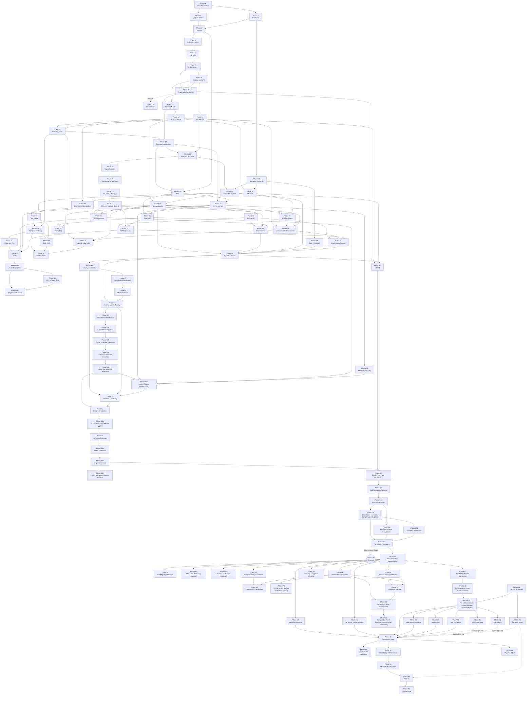

# Roadmap Guide

This directory expands the project roadmap into a learning-first set of milestones.
The goal is not to build the fastest or most feature-rich OS. The goal is to build a
small, understandable microkernel system where each phase teaches one major concept,
produces a runnable artifact, and leaves room for documentation and reflection.

Each phase page includes:

- the milestone goal
- the feature set and scope
- a high-level implementation plan
- acceptance criteria
- dependencies and deferrals
- a short note on how mature operating systems usually differ
- a companion task list in `docs/roadmap/tasks/`

## Guiding Principles

- Prefer clarity over cleverness.
- Keep each phase runnable before moving on.
- Add documentation alongside implementation, not afterward.
- Defer performance and advanced hardware support until the core ideas are clear.
- Borrow existing open-source software where it makes sense — porting teaches as much
  as writing from scratch.

## Milestone Dependency Map

```mermaid
flowchart TD
    P1["Phase 1<br/>Boot Foundation"]
    P2["Phase 2<br/>Memory Basics"]
    P3["Phase 3<br/>Interrupts"]
    P4["Phase 4<br/>Tasking"]
    P5["Phase 5<br/>Userspace Entry"]
    P6["Phase 6<br/>IPC Core"]
    P7["Phase 7<br/>Core Servers"]
    P8["Phase 8<br/>Storage and VFS"]
    P9["Phase 9<br/>Framebuffer and Shell"]

    P1 --> P2
    P1 --> P3
    P2 --> P4
    P3 --> P4
    P4 --> P5
    P5 --> P6
    P6 --> P7
    P7 --> P8
    P7 --> P9
    P8 --> P9
    P9 -.->|optional| P10["Phase 10<br/>Secure Boot"]
    P9 --> P11["Phase 11<br/>Process Model"]
    P8 --> P11
    P11 --> P12["Phase 12<br/>POSIX Compat"]
    P8 --> P13["Phase 13<br/>Writable FS"]
    P12 --> P14["Phase 14<br/>Shell and Tools"]
    P13 --> P14
    P3 --> P15["Phase 15<br/>Hardware Discovery"]
    P12 --> P16["Phase 16<br/>Network"]
    P15 --> P16
    P14 --> P17["Phase 17<br/>Memory Reclamation"]
    P11 --> P17
    P17 --> P18["Phase 18<br/>Directory and VFS"]
    P13 --> P18
    P18 --> P19["Phase 19<br/>Signal Handlers"]
    P19 --> P20["Phase 20<br/>Userspace Init and Shell"]
    P20 --> P21["Phase 21<br/>Ion Shell Integration"]
    P21 --> P22["Phase 22<br/>TTY and Terminal Control"]
    P16 --> P23["Phase 23<br/>Socket API"]
    P22 --> P23
    P18 --> P24["Phase 24<br/>Persistent Storage"]
    P15 --> P24
    P17 --> P25["Phase 25<br/>SMP"]
    P4 --> P25

    %% Productivity phases
    P22 --> P26["Phase 26<br/>Text Editor"]
    P24 --> P26
    P12 --> P27["Phase 27<br/>User Accounts"]
    P24 --> P27
    P27 --> P28["Phase 28<br/>ext2 Filesystem"]
    P24 --> P28
    P22 --> P29["Phase 29<br/>PTY Subsystem"]
    P27 --> P29
    P23 --> P30["Phase 30<br/>Telnet Server"]
    P27 --> P30
    P29 --> P30
    P26 --> P31["Phase 31<br/>Compiler Bootstrap"]
    P14 --> P31
    P31 --> P32["Phase 32<br/>Build Tools"]
    P26 --> P32

    %% Kernel infrastructure phases
    P17 --> P33["Phase 33<br/>Kernel Memory"]
    P25 --> P33
    P15 --> P34["Phase 34<br/>Real-Time Clock"]
    P25 --> P35["Phase 35<br/>True SMP"]
    P33 --> P35
    P33 --> P36["Phase 36<br/>Expanded Memory"]
    P23 --> P37["Phase 37<br/>I/O Multiplexing"]
    P22 --> P37
    P35 --> P37
    P13 --> P38
    P28 --> P38["Phase 38<br/>Filesystem Enhancements"]
    P27 --> P38
    P23 --> P39["Phase 39<br/>Unix Domain Sockets"]
    P38 --> P39
    P37 --> P39
    P35 --> P40["Phase 40<br/>Threading"]
    P33 --> P40

    %% Application phases
    P14 --> P41["Phase 41<br/>Expanded Coreutils"]
    P27 --> P41
    P38 --> P41
    P31 --> P42["Phase 42<br/>Crypto and TLS"]
    P42 --> P43["Phase 43<br/>SSH"]
    P29 --> P43
    P27 --> P43
    P37 --> P43
    P43 --> P43a["Phase 43a<br/>Crash Diagnostics"]
    P43a --> P43b["Phase 43b<br/>Kernel Trace Ring"]
    P43a --> P43c["Phase 43c<br/>Regression & Stress"]
    P43b --> P43c

    P12 --> P44["Phase 44<br/>Rust Cross-Compilation"]
    P24 --> P44
    P31 --> P45["Phase 45<br/>Ports System"]
    P32 --> P45
    P41 --> P45
    P27 --> P46["Phase 46<br/>System Services"]
    P30 --> P46
    P24 --> P46
    P34 --> P46
    P39 --> P46

    %% Shipped graphics proof phase
    P9 --> P47["Phase 47<br/>DOOM"]
    P12 --> P47
    P24 --> P47
    P46 --> P47

    %% Convergence and release-critical phases
    P46 --> P48["Phase 48<br/>Security Foundation"]
    P48 --> P49["Phase 49<br/>Architectural Declaration"]
    P49 --> P50["Phase 50<br/>IPC Completion"]
    P46 --> P51["Phase 51<br/>Service Model Maturity"]
    P50 --> P51
    P51 --> P52["Phase 52<br/>First Service Extractions"]
    P52 --> P52a["Phase 52a<br/>Kernel Reliability Fixes"]
    P52a --> P52b["Phase 52b<br/>Kernel Structural Hardening"]
    P52b --> P52c["Phase 52c<br/>Kernel Architecture Evolution"]
    P52c --> P52d["Phase 52d<br/>Kernel Completion & Alignment"]
    P52d --> P53a["Phase 53a<br/>Kernel Memory Modernization"]
    P33 --> P53a
    P35 --> P53a
    P36 --> P53a
    P48 --> P53["Phase 53<br/>Headless Hardening"]
    P51 --> P53
    P53a --> P53
    P52d --> P54["Phase 54<br/>Deep Serverization"]
    P53 --> P54
    P54 --> P54a["Phase 54a<br/>Post-Serverization Kernel Hygiene"]

    %% Hardware, local-system, and release gate phases
    P54a --> P55["Phase 55<br/>Hardware Substrate"]
    P55 --> P55a["Phase 55a<br/>IOMMU Substrate"]
    P55a --> P55b["Phase 55b<br/>Ring-3 Driver Host"]
    P55b --> P55c["Phase 55c<br/>Ring-3 Driver Correctness Closure"]
    P47 --> P56["Phase 56<br/>Display and Input Architecture"]
    P55b --> P56
    P56 --> P57["Phase 57<br/>Audio and Local Session"]
    P57 --> P57a["Phase 57a<br/>Scheduler Rewrite"]
    P57a --> P57b["Phase 57b<br/>Preemption Foundation<br/>(Complete pending soak)"]
    P57a --> P57c["Phase 57c<br/>Kernel Busy-Wait Conversion"]
    P57b --> P57d["Phase 57d<br/>Voluntary Preemption"]
    P57b --> P57e["Phase 57e<br/>Full Kernel Preemption"]
    P57c --> P57e
    P57d --> P57e
    P57e -.->|deferred 2026-05-07| P57end((Phase 57e<br/>deferred))

    %% Pre-1.0 cleanup phases (close audit-identified gaps)
    P57e --> P58["Phase 58<br/>Documentation Reconciliation"]
    P58 --> P59["Phase 59<br/>Validation Backlog"]
    P58 --> P60["Phase 60<br/>Slab Migration Closeout"]
    P58 --> P61["Phase 61<br/>SMP Load Balancing Closeout"]
    P58 --> P62["Phase 62<br/>Phase 57a Pi-Lock Closeout"]
    P58 --> P63["Phase 63<br/>Audio Stack Implementation"]
    P58 --> P64["Phase 64<br/>Session Manager Lifecycle"]
    P58 --> P65["Phase 65<br/>fat_server Implementation"]
    P58 --> P66["Phase 66<br/>Security & Hygiene Closeout"]
    P58 --> P67["Phase 67<br/>IOMMU Substrate Completion"]
    P58 --> P68["Phase 68<br/>Display Server Closeout"]

    %% Capability expansion phases
    P63 --> P69["Phase 69<br/>Terminal TUI Capabilities"]
    P68 --> P69
    P68 --> P70["Phase 70<br/>DOOM In-GUI Surface<br/>(fb-takeover Tier 3)"]
    P64 --> P71["Phase 71<br/>GUI Login Manager"]
    P68 --> P71
    P68 --> P72["Phase 72<br/>Compositor: Tiling + Workspaces"]
    P71 --> P72
    P72 --> P73["Phase 73<br/>Compositor: Polish<br/>(bar / launcher / notifyd / animations)"]
    P74["Phase 74<br/>IPC Capability Grants<br/>+ Bulk Transfers"]
    P67 --> P74
    P75["Phase 75<br/>W^X Enforcement"]
    P76["Phase 76<br/>Dynamic Linker"]
    P75 --> P76

    %% Pre-1.0 hardware + correctness (per the pre-1.0 audit)
    P77["Phase 77<br/>Pre-1.0 Correctness<br/>+ Cheap Security<br/>+ Network Polish"]
    P78["Phase 78<br/>USB Host Foundation"]
    P79["Phase 79<br/>Modern NIC"]
    P80["Phase 80<br/>Intel HDA Audio"]
    P81["Phase 81<br/>Wi-Fi Reference"]
    P82["Phase 82<br/>AHCI/SATA"]
    P74 --> P77
    P75 --> P77
    P77 --> P78
    P77 --> P79
    P77 --> P80
    P77 --> P81
    P77 --> P82

    %% Release gate
    P59 --> P83["Phase 83<br/>Release 1.0 Gate"]
    P65 --> P83
    P77 --> P83
    P78 --> P83
    P79 --> P83
    P80 --> P83
    P81 -.->|laptop-target only| P83
    P82 -.->|optional pre-1.0| P83
    P76 -.->|optional pre-1.0| P83

    %% Post-1.0 platform growth
    P83 --> P84["Phase 84<br/>Spectre/KPTI<br/>Mitigations"]
    P83 --> P85["Phase 85<br/>Cross-Compiled Toolchains"]
    P85 --> P86["Phase 86<br/>Networking and GitHub"]
    P86 --> P87["Phase 87<br/>Node.js"]
    P76 -.-> P87
    P87 --> P88["Phase 88<br/>Claude Code"]
    P83 --> P89["Phase 89<br/>IPv6 / DHCPv6"]
```

## Milestone Summary

### Foundation Phases (complete)

| Phase | Theme | Primary Outcome | Status | Source Ref | Milestone | Tasks |
|---|---|---|---|---|---|---|
| 1 | Boot Foundation | Kernel boots and logs over serial | Complete | `phase-01` | [Phase 1](./01-boot-foundation.md) | [Tasks](./tasks/01-boot-foundation-tasks.md) |
| 2 | Memory Basics | Heap allocation and safe frame management | Complete | `phase-02` | [Phase 2](./02-memory-basics.md) | [Tasks](./tasks/02-memory-basics-tasks.md) |
| 3 | Interrupts | Exceptions, timer, and keyboard IRQs work | Complete | `phase-03` | [Phase 3](./03-interrupts.md) | [Tasks](./tasks/03-interrupts-tasks.md) |
| 4 | Tasking | Preemptive kernel threads run correctly | Complete | `phase-04` | [Phase 4](./04-tasking.md) | [Tasks](./tasks/04-tasking-tasks.md) |
| 5 | Userspace Entry | First ring 3 process runs via syscalls | Complete | `phase-05` | [Phase 5](./05-userspace-entry.md) | [Tasks](./tasks/05-userspace-entry-tasks.md) |
| 6 | IPC Core | Capability-based message passing works | Complete | `phase-06` | [Phase 6](./06-ipc-core.md) | [Tasks](./tasks/06-ipc-core-tasks.md) |
| 7 | Core Servers | `init`, console, and keyboard services cooperate | Complete | `phase-07` | [Phase 7](./07-core-servers.md) | [Tasks](./tasks/07-core-servers-tasks.md) |
| 8 | Storage and VFS | Simple file access through userspace servers | Complete | `phase-08` | [Phase 8](./08-storage-and-vfs.md) | [Tasks](./tasks/08-storage-and-vfs-tasks.md) |
| 9 | Framebuffer and Shell | Text UI and tiny shell become usable | Complete | `phase-09` | [Phase 9](./09-framebuffer-and-shell.md) | [Tasks](./tasks/09-framebuffer-and-shell-tasks.md) |
| 10 *(optional)* | Secure Boot | Kernel boots on real hardware with Secure Boot on | Complete | `phase-10` | [Phase 10](./10-secure-boot.md) | [Tasks](./tasks/10-secure-boot-tasks.md) |

### POSIX and Userspace Phases (complete)

| Phase | Theme | Primary Outcome | Status | Source Ref | Milestone | Tasks |
|---|---|---|---|---|---|---|
| 11 | Process Model | Arbitrary ELF binaries load and run as isolated processes | Complete | `phase-11` | [Phase 11](./11-process-model.md) | [Tasks](./tasks/11-process-model-tasks.md) |
| 12 | POSIX Compat | musl-linked C programs run without modification | Complete | `phase-12` | [Phase 12](./12-posix-compat.md) | [Tasks](./tasks/12-posix-compat-tasks.md) |
| 13 | Writable FS | Programs can create, write, and delete files | Complete | `phase-13` | [Phase 13](./13-writable-fs.md) | [Tasks](./tasks/13-writable-fs-tasks.md) |
| 14 | Shell and Tools | Pipes, redirection, job control, and core utilities | Complete | `phase-14` | [Phase 14](./14-shell-and-tools.md) | [Tasks](./tasks/14-shell-and-tools-tasks.md) |
| 15 | Hardware Discovery | ACPI + PCI enumeration; APIC replaces legacy PIC | Complete | `phase-15` | [Phase 15](./15-hardware-discovery.md) | [Tasks](./tasks/15-hardware-discovery-tasks.md) |
| 16 | Network | virtio-net driver and minimal TCP/IP stack | Complete | `phase-16` | [Phase 16](./16-network.md) | [Tasks](./tasks/16-network-tasks.md) |

### Usability Phases (complete)

| Phase | Theme | Primary Outcome | Status | Source Ref | Milestone | Tasks |
|---|---|---|---|---|---|---|
| 17 | Memory Reclamation | Free-list allocator, CoW fork, heap growth, stack cleanup | Complete | `phase-17` | [Phase 17](./17-memory-reclamation.md) | [Tasks](./tasks/17-memory-reclamation-tasks.md) |
| 18 | Directory and VFS | `getdents64`, directory fds, real cwd, ramdisk layout | Complete | `phase-18` | [Phase 18](./18-directory-vfs.md) | [Tasks](./tasks/18-directory-vfs-tasks.md) |
| 19 | Signal Handlers | User signal handlers, trampolines, `sigreturn` | Complete | `phase-19` | [Phase 19](./19-signal-handlers.md) | [Tasks](./tasks/19-signal-handlers-tasks.md) |
| 20 | Userspace Init and Shell | Ring-3 PID 1 init, remove kernel shell | Complete | `phase-20` | [Phase 20](./20-userspace-init-shell.md) | [Tasks](./tasks/20-userspace-init-shell-tasks.md) |
| 21 | Ion Shell Integration | ion (Redox OS shell) replaces the minimal custom shell | Complete | `phase-21` | [Phase 21](./21-ion-shell.md) | [Tasks](./tasks/21-ion-shell-tasks.md) |
| 22 | TTY and Terminal Control | termios, cooked/raw mode, PTY stubs | Complete | `phase-22` | [Phase 22](./22-tty-pty.md) | [Tasks](./tasks/22-tty-pty-tasks.md) |
| 22b | ANSI Escape Sequences | VT100 CSI parser, cursor movement, SGR colors | Complete | `phase-22b` | [Phase 22b](./22b-ansi-parser-enhancement.md) | [Tasks](./tasks/22b-ansi-escape-tasks.md) |
| 23 | Socket API | BSD socket syscalls over TCP/UDP stack | Complete | `phase-23` | [Phase 23](./23-socket-api.md) | [Tasks](./tasks/23-socket-api-tasks.md) |
| 24 | Persistent Storage | virtio-blk driver, FAT32 read/write | Complete | `phase-24` | [Phase 24](./24-persistent-storage.md) | [Tasks](./tasks/24-persistent-storage-tasks.md) |
| 25 | SMP | All CPU cores run the scheduler simultaneously | Complete | `phase-25` | [Phase 25](./25-smp.md) | [Tasks](./tasks/25-smp-tasks.md) |

### Productivity Phases (complete)

| Phase | Theme | Primary Outcome | Status | Source Ref | Milestone | Tasks |
|---|---|---|---|---|---|---|
| 26 | Text Editor | Full-screen editor for creating and modifying files | Complete | `phase-26` | [Phase 26](./26-text-editor.md) | [Tasks](./tasks/26-text-editor-tasks.md) |
| 27 | User Accounts | Login, UID/GID, file permissions, passwd/shadow | Complete | `phase-27` | [Phase 27](./27-user-accounts.md) | [Tasks](./tasks/27-user-accounts-tasks.md) |
| 28 | ext2 Filesystem | Native Unix permissions, replaces FAT32 | Complete | `phase-28` | [Phase 28](./28-ext2-filesystem.md) | [Tasks](./tasks/28-ext2-filesystem-tasks.md) |
| 29 | PTY Subsystem | Pseudo-terminal pairs for remote sessions | Complete | `phase-29` | [Phase 29](./29-pty-subsystem.md) | [Tasks](./tasks/29-pty-subsystem-tasks.md) |
| 30 | Telnet Server | Remote shell access over the network | Complete | `phase-30` | [Phase 30](./30-telnet-server.md) | [Tasks](./tasks/30-telnet-server-tasks.md) |
| 31 | Compiler Bootstrap | TCC compiles C programs and itself inside the OS | Complete | `phase-31` | [Phase 31](./31-compiler-bootstrap.md) | [Tasks](./tasks/31-compiler-bootstrap-tasks.md) |
| 32 | Build Tools | make, ar, shell scripting for multi-file projects | Complete | `phase-32` | [Phase 32](./32-build-tools.md) | [Tasks](./tasks/32-build-tools-tasks.md) |

### Kernel Infrastructure Phases (phases 33-40 complete)

| Phase | Theme | Primary Outcome | Status | Source Ref | Milestone | Tasks |
|---|---|---|---|---|---|---|
| 33 | Kernel Memory | Buddy allocator, OOM retry, slab-cache groundwork, working munmap | Complete | `phase-33` | [Phase 33](./33-kernel-memory-improvements.md) | [Tasks](./tasks/33-kernel-memory-tasks.md) |
| 34 | Real-Time Clock | CMOS RTC, wall-clock time, CLOCK_REALTIME | Complete | `phase-34` | [Phase 34](./34-real-time-clock.md) | [Tasks](./tasks/34-real-time-clock-tasks.md) |
| 35 | True SMP | Per-core syscall stacks, multi-core dispatch, per-core run queues with global scheduler coordination | Complete | `phase-35` | [Phase 35](./35-true-smp-multitasking.md) | [Tasks](./tasks/35-true-smp-multitasking-tasks.md) |
| 36 | Expanded Memory | Demand paging, mprotect, large mmap, disk/RAM expansion | Complete | `phase-36` | [Phase 36](./36-expanded-memory.md) | [Tasks](./tasks/36-expanded-memory-tasks.md) |
| 37 | I/O Multiplexing | select, epoll, non-blocking I/O | Complete | `phase-37` | [Phase 37](./37-io-multiplexing.md) | [Tasks](./tasks/37-io-multiplexing-tasks.md) |
| 38 | Filesystem Enhancements | Symlinks, hard links, /proc, permissions, device nodes | Complete | `phase-38` | [Phase 38](./38-filesystem-enhancements.md) | [Tasks](./tasks/38-filesystem-enhancements-tasks.md) |
| 39 | Unix Domain Sockets | AF_UNIX stream/datagram, socketpair | Complete | `phase-39` | [Phase 39](./39-unix-domain-sockets.md) | [Tasks](./tasks/39-unix-domain-sockets-tasks.md) |
| 40 | Threading | clone CLONE_THREAD, futex, TLS, thread groups | Complete | `phase-40` | [Phase 40](./40-threading-primitives.md) | [Tasks](./tasks/40-threading-primitives-tasks.md) |

### Application Phases (complete)

| Phase | Theme | Primary Outcome | Status | Source Ref | Milestone | Tasks |
|---|---|---|---|---|---|---|
| 41 | Expanded Coreutils | head, tail, sort, find, diff, ps, less | Complete | `phase-41` | [Phase 41](./41-expanded-coreutils.md) | [Tasks](./tasks/41-expanded-coreutils-tasks.md) |
| 42 | Crypto Primitives | RustCrypto crypto-lib, sha256sum, genkey | Complete | `phase-42` | [Phase 42](./42-crypto-primitives.md) | [Tasks](./tasks/42-crypto-primitives-tasks.md) |
| 42b | Async Executor | Userspace cooperative async runtime (`async-rt`), reactor + waker + AsyncFd; sshd refactored to async; sunset fork patches reverted | Complete | `phase-42b` | [Phase 42b](./42b-async-executor.md) | [Tasks](./tasks/42b-async-executor-tasks.md) |
| 43 | SSH | SSH server (sunset IO-less SSH library) | Complete | `phase-43` | [Phase 43](./43-ssh-server.md) | [Tasks](./tasks/43-ssh-server-tasks.md) |
| 43a | Crash Diagnostics | Enriched panic/fault handlers, scheduler/fork/IPC assertions | Complete | `phase-43a` | [Phase 43a](./43a-crash-diagnostics.md) | [Tasks](./tasks/43a-crash-diagnostics-tasks.md) |
| 43b | Kernel Trace Ring | Per-core lockless trace ring, auto-dump on crash, sys_ktrace | Complete | `phase-43b` | [Phase 43b](./43b-kernel-trace-ring.md) | [Tasks](./tasks/43b-kernel-trace-ring-tasks.md) |
| 43c | Regression & Stress | xtask regression/stress commands, CI tiers, proptest/loom | Complete | `phase-43c` | [Phase 43c](./43c-regression-stress-ci.md) | [Tasks](./tasks/43c-regression-stress-ci-tasks.md) |
| 44 | Rust Cross-Compilation | Rust programs compiled on host run in the OS | Complete | `phase-44` | [Phase 44](./44-rust-cross-compilation.md) | [Tasks](./tasks/44-rust-cross-compilation-tasks.md) |
| 45 | Ports System | Source-based package building and installation | Complete | `phase-45` | [Phase 45](./45-ports-system.md) | [Tasks](./tasks/45-ports-system-tasks.md) |
| 46 | System Services | Service manager, syslog, cron, shutdown | Complete | `phase-46` | [Phase 46](./46-system-services.md) | [Tasks](./tasks/46-system-services-tasks.md) |

### Graphics Proof Phase (complete)

| Phase | Theme | Primary Outcome | Status | Source Ref | Milestone | Tasks |
|---|---|---|---|---|---|---|
| 47 | DOOM | A real full-screen graphical program runs and proves the graphics substrate under load | Complete | `phase-47` | [Phase 47](./47-doom.md) | [Tasks](./tasks/47-doom-tasks.md) |

### Convergence and Release-Critical Phases (48-50 complete, 51-52 active, 53a complete, 53+ planned)

| Phase | Theme | Primary Outcome | Status | Source Ref | Milestone | Tasks |
|---|---|---|---|---|---|---|
| 48 | Security Foundation | Repair trust-floor issues in identity, entropy, and boot defaults | Complete | `phase-48` | [Phase 48](./48-security-foundation.md) | [Tasks](./tasks/48-security-foundation-tasks.md) |
| 49 | Architectural Declaration | Make the kernel/userspace boundary explicit and enforceable | Complete | `phase-49` | [Phase 49](./49-architectural-declaration.md) | [Tasks](./tasks/49-architectural-declaration-tasks.md) |
| 50 | IPC Completion | Capability grants, bulk-data transport (copy + page grants), ring-3-safe registry, server-loop failure semantics | Complete | `phase-50` | [Phase 50](./50-ipc-completion.md) | [Tasks](./tasks/50-ipc-completion-tasks.md) |
| 51 | Service Model Maturity | Turn the Phase 46 service baseline into a trusted lifecycle model | Complete (folded into Phase 46) | `phase-51` | [Phase 51](./51-service-model-maturity.md) | [merged into Phase 46 tasks](./tasks/46-system-services-tasks.md) |
| 52 | First Service Extractions | Move the first visible core services into supervised ring-3 processes | Complete (umbrella for 52a–52d) | `phase-52` | [Phase 52](./52-first-service-extractions.md) | [Tasks](./tasks/52-first-service-extractions-tasks.md) |
| 52a | Kernel Reliability Fixes | Fix stale IPC return state, sunset wake_write, clear_child_tid, exec signal reset | **Complete** | `phase-52a` | [Phase 52a](./52a-kernel-reliability-fixes.md) | [Tasks](./tasks/52a-kernel-reliability-fixes-tasks.md) |
| 52b | Kernel Structural Hardening | AddressSpace object, typed UserBuffers, batch TLB, frame zeroing, and partial task-owned return-state groundwork | **Complete** | `phase-52b` | [Phase 52b](./52b-kernel-structural-hardening.md) | [Tasks](./tasks/52b-kernel-structural-hardening-tasks.md) |
| 52c | Kernel Architecture Evolution | VMA tree, growable endpoint/capability tables, unified line-discipline infrastructure, ISR wakeup, and deferred scheduler/keyboard/notification closure | **Complete** | `phase-52c` | [Phase 52c](./52c-kernel-architecture-evolution.md) | [Tasks](./tasks/52c-kernel-architecture-evolution-tasks.md) |
| 52d | Kernel Completion and Roadmap Alignment | Audit-backed closure of the unfinished or overstated 52a/52b/52c work, integrated boot blockers, and release-gate drift before later hardening phases | Complete | `phase-52d` | [Phase 52d](./52d-kernel-completion-and-roadmap-alignment.md) | [Tasks](./tasks/52d-kernel-completion-and-roadmap-alignment-tasks.md) |
| 53a | Kernel Memory Modernization | Per-CPU page cache, magazine-based slab allocator, size-class GlobalAlloc, SMP-scalable allocation | Complete | `phase-53a` | [Phase 53a](./53a-kernel-memory-modernization.md) | [Tasks](./tasks/53a-kernel-memory-modernization-tasks.md) |
| 53 | Headless Hardening | Define the supported headless/reference workflow and release gates | Complete | `phase-53` | [Phase 53](./53-headless-hardening.md) | [Tasks](./tasks/53-headless-hardening-tasks.md) |
| 54 | Deep Serverization | Move meaningful storage/VFS and UDP policy slices into supervised ring-3 services with explicit degraded-mode fallbacks | Complete | `phase-54` | [Phase 54](./54-deep-serverization.md) | [Tasks](./tasks/54-deep-serverization-tasks.md) |
| 54a | Post-Serverization Kernel Hygiene | Close the CLOEXEC/NONBLOCK plumbing gap and relocate arch-syscall cleanup wrappers into their owning subsystems | Planned | `phase-54a` | [Phase 54a](./54a-post-serverization-kernel-hygiene.md) | [Tasks](./tasks/54a-post-serverization-kernel-hygiene-tasks.md) |

### Hardware, Local-System, and Release Phases (55, 55a, 55b complete; 55c+ planned)

| Phase | Theme | Primary Outcome | Status | Source Ref | Milestone | Tasks |
|---|---|---|---|---|---|---|
| 55 | Hardware Substrate | A narrow, real-hardware support story: PCIe MCFG + MSI/MSI-X, reusable hardware-access layer, NVMe storage, Intel 82540EM e1000 networking | Complete | `phase-55` | [Phase 55](./55-hardware-substrate.md) | [Tasks](./tasks/55-hardware-substrate-tasks.md) |
| 55a | IOMMU Substrate | ACPI DMAR/IVRS parsing, per-device VT-d / AMD-Vi domains, IOMMU-routed `DmaBuffer<T>`, closes the Phase 55 IOMMU caveat | Complete | `phase-55a` | [Phase 55a](./55a-iommu-substrate.md) | [Tasks](./tasks/55a-iommu-substrate-tasks.md) |
| 55b | Ring-3 Driver Host | Capability-gated device-host syscalls, supervised userspace NVMe and e1000 drivers, completes the Phase 55 ring-3 extraction deferral | Complete | `phase-55b` | [Phase 55b](./55b-ring-3-driver-host.md) | [Tasks](./tasks/55b-ring-3-driver-host-tasks.md) |
| 55c | Ring-3 Driver Correctness Closure | Bound-notification event multiplexing (closes SSH-over-e1000 deadlock), IOMMU BAR identity coverage (closes `--iommu` device-smoke timeouts), userspace `EAGAIN` visibility during driver restart — closes the three correctness residuals Phase 55b left behind | **Complete** | `phase-55c` | [Phase 55c](./55c-ring-3-driver-correctness-closure.md) | [Tasks](./tasks/55c-ring-3-driver-correctness-closure-tasks.md) / [Learning](./55c-ring-3-driver-correctness-closure-learning.md) |
| 56 | Display and Input Architecture | A userspace display service owns presentation and routed input | Complete | `phase-56` | [Phase 56](./56-display-and-input-architecture.md) | [Tasks](./tasks/56-display-and-input-architecture-tasks.md) |
| 57 | Audio and Local Session | The first coherent local graphical session adds audible output and a useful client baseline | Complete | `phase-57` | [Phase 57](./57-audio-and-local-session.md) | [Tasks](./tasks/57-audio-and-local-session-tasks.md) |
| 57a | Scheduler Block/Wake Protocol Rewrite | Linux-style single-state-word + condition-recheck protocol with per-task `pi_lock`; eliminates lost-wake bug class.  Graphical-stack hardware reliability deferred to 57b–57e (cooperative-starvation, not v1 lost-wake, is the residual blocker) | **Complete** | `phase-57a` | [Phase 57a](./57a-scheduler-rewrite.md) | [Tasks](./tasks/57a-scheduler-rewrite-tasks.md) |
| 57b | Preemption Foundation | Per-task `preempt_count`, full register save area (`PreemptFrame`), spinlocks raise `preempt_count`.  No-op refactor that unblocks 57d / 57e.  No behaviour change | **Complete** | `phase-57b` | [Phase 57b](./57b-preemption-foundation.md) | [Tasks](./tasks/57b-preemption-foundation-tasks.md) |
| 57c | Kernel Busy-Wait Audit and Conversion | Catalogue every kernel busy-spin; convert hot/unbounded sites to block+wake pairs; document hardware-bounded sites with bounds and citations.  Independent of 57b — provides direct user-pain relief for cooperative-starvation | **Complete** | `phase-57c` | [Phase 57c](./57c-kernel-busy-wait-conversion.md) | [Tasks](./tasks/57c-kernel-busy-wait-conversion-tasks.md) |
| 57d | Voluntary Preemption (PREEMPT_VOLUNTARY) | IRQ-return preemption check for user-mode tasks; user-mode CPU-bound tasks become preemptible within one timer tick.  Kernel mode remains non-preemptible | **Complete** | `phase-57d` | [Phase 57d](./57d-voluntary-preemption.md) | [Tasks](./tasks/57d-voluntary-preemption-tasks.md) |
| 57e | Full Kernel Preemption (PREEMPT_FULL) — stretch | Drop the `from_user` check; kernel-mode code becomes preemptible at any point where `preempt_count == 0`.  Cross-core reschedule-IPI wakeup latency improves measurably; same-core, timer-only, and `preempt_enable` zero-crossing paths benchmark separately and must not regress.  Adds same-CPL `iretq` resume, kernel-RSP capture, per-CPU access audit, kernel-mode `preempt_enable` immediacy | **Deferred (2026-05-07)** — see [post-mortem](../post-mortems/2026-05-07-57e-preempt-full-deferred.md) | `phase-57e` | [Phase 57e](./57e-full-kernel-preemption.md) | [Tasks](./tasks/57e-full-kernel-preemption-tasks.md) |

### Pre-1.0 Cleanup Phases (post-57e; close audit-identified gaps before Release 1.0)

These phases were drafted 2026-05-08 in response to the phase-completion audit (`docs/appendix/audit-status/`). Each closes a specific category of audit-identified blocker. Phase 58 must precede the others because the audit's status reconciliation is itself a precondition for trusting downstream phase claims.

| Phase | Theme | Primary Outcome | Status | Source Ref | Milestone | Tasks |
|---|---|---|---|---|---|---|
| 58 | Documentation Reconciliation Pass | Walk every phase doc, flip Status fields to match reality, write the missing task docs (Phases 13, 22b, 42b), close Phases 51 and 52, retire/refresh stale legacy docs, consolidate handoff dirs | **Complete** | `phase-58` | [Phase 58](./58-documentation-reconciliation.md) | [Tasks](./tasks/58-documentation-reconciliation-tasks.md) |
| 59 | Validation Backlog | Run every "manual QEMU test" deferred from Phases 30/31/32/43/22b/24/57b/34/39/10; record results; flip task-doc checkboxes | Planned | `phase-59` | [Phase 59](./59-validation-backlog.md) | [Tasks](./tasks/59-validation-backlog-tasks.md) |
| 60 | Phase 33 Slab Migration Closeout | Audit kernel `Box::new`/`Arc::new` sites; migrate the two genuinely heap-allocated hot kernel object families (Task, XSaveArea) onto the slab-cache infrastructure that landed in Phase 33 but was never used; document the inline-slot-array families that turned out not to be migration candidates. Closes audit Red Flag #4 | **Complete** | `phase-60` | [Phase 60](./60-slab-migration-closeout.md) | [Tasks](./tasks/60-slab-migration-closeout-tasks.md) |
| 61 | Phase 35 SMP Load Balancing Closeout | Audit closeout for Phase 35 SMP load balancing and Phase 25 P25-T033 TLB-shootdown deferral. Verifies `maybe_load_balance()` + `tlb_shootdown_range` from `sys_linux_munmap` + object-attached pipe / IPC wait queues; replaces pipe `yield_now()` polling with `WaitQueue` blocking; adds per-tick user/system tick split, child `tms_cutime` / `tms_cstime`, `sys_wait4` + `sys_getrusage`. Closes audit Red Flag #3 + Phase 25 P25-T033 | **Complete** | `phase-61` | [Phase 61](./61-smp-load-balancing-closeout.md) | [Tasks](./tasks/61-smp-load-balancing-closeout-tasks.md) |
| 62 | Phase 57a Pi-Lock Closeout | Land pi_lock + with_block_state at the four `TODO(57a-C/D)` scheduler sites via `with_block_state_locked_scheduler` (Shape β); kernel-wide Bug #9 audit returns zero LEAK verdicts; Track D guard-leak regression test pinned. Pending 30-minute soak. | Complete (pending soak) | `phase-62` | [Phase 62](./62-phase-57a-pi-lock-closeout.md) | [Tasks](./tasks/62-phase-57a-pi-lock-closeout-tasks.md) |
| 63 | Phase 57 Audio Stack Implementation | Real PCM emission for `audio_server` (replace accounting-only `Ac97Backend`); audio-smoke gate asserts `frames_consumed > 0` via `GetStats` + non-silent WAV; `bell-smoke` verifies BEL → Bell::ring → audible output. Closes audit § B1 / F1 | **Complete** | `phase-63` | [Phase 63](./63-audio-stack-implementation.md) | [Tasks](./tasks/63-audio-stack-implementation-tasks.md) |
| 63a | DOOM Audio Wiring | DOOM SFX + Tier 2a square/triangle synth music play through `audio_server` via two new userspace crates (`audio_mixer`, `audio_client_ffi`) and three new doomgeneric platform-layer C files; honors single-client `EBUSY` policy with silent-fallback; `doom-audio-smoke` gate asserts non-silent WAV plus two consecutive `frames_consumed > 0` runs and BEL re-arm; kernel patch-bumps to `0.63.1` (userspace-only phase) | **Complete** | `phase-63a` | [Phase 63a](./63a-doom-audio-wiring.md) | [Tasks](./tasks/63a-doom-audio-wiring-tasks.md) |
| 64 | Phase 57 Session Manager Lifecycle | Real `start/stop/restart` (replace unconditional-Ack stubs); kill-probe-based lifecycle; restart budget; text-fallback motion. Closes audit § B2 / F2 | **Complete** | `phase-64` | [Phase 64](./64-session-manager-lifecycle.md) | [Tasks](./tasks/64-session-manager-lifecycle-tasks.md) |
| 65 | Phase 54 fat_server Implementation | Real FAT32 operations in `fat_server` (replace permanent ENOSYS stub); routed via `vfs_server`. Closes audit Red Flag #14 (Phase 54 dimension) | Planned | `phase-65` | [Phase 65](./65-fat-server-implementation.md) | [Tasks](./tasks/65-fat-server-implementation-tasks.md) |
| 66 | Security & Hygiene Closeout | `/tmp` sticky-bit, atomic shadow writes, CLOEXEC plumbing on `open`/`openat`, four `*_pub` wrapper relocations, pre-seeded image hash format upgrade. Closes audit § F4/F5/C6 + Phase 54a | **Complete** | `phase-66` | [Phase 66](./66-security-hygiene-closeout.md) | [Tasks](./tasks/66-security-hygiene-closeout-tasks.md) |
| 67 | Phase 55a IOMMU Substrate Completion | AMD-Vi fault ISR, VT-d scalable mode, VT-d queued invalidation, AMD-Vi multi-BDF domains, replace 4 `todo!()` isolation tests with real harness. Closes audit § C7/E3 | **Complete** | `phase-67` | [Phase 67](./67-iommu-substrate-completion.md) | [Tasks](./tasks/67-iommu-substrate-completion-tasks.md) |
| 68 | Phase 56 Display Server Closeout | Subscription event push (`flush_subscriber_ring` + 2 new event kinds), compositor `DamageTracker` with cursor-only fast path, `ModifierSide` field with global `PROTOCOL_VERSION` 1→2 bump + v1 compatibility shim, extracted `kernel_core::init::{manifest,supervisor}` with `Vec<String>` `depends=` and typed `on-restart=` directive, static `mouse_server.conf` declaring `depends=kbd_server`. Closes audit § C5 | **Complete** | `phase-68` | [Phase 68](./68-display-server-closeout.md) | [Tasks](./tasks/68-display-server-closeout-tasks.md) |

### Capability Expansion Phases (pre-1.0; user-priority)

| Phase | Theme | Primary Outcome | Status | Source Ref | Milestone | Tasks |
|---|---|---|---|---|---|---|
| 69 | Terminal Contract Foundations | terminfo entry (`m3os-term`), alternate screen buffer, 256-color/truecolor SGR, SGR mouse reporting, DECSCUSR cursor styling, bracketed paste, SIGWINCH propagation. Hand-rolled `tui-smoke` byte-level validator. | **Complete** | `phase-69` | [Phase 69](./69-terminal-tui-capabilities.md) | [Tasks](./tasks/69-terminal-tui-capabilities-tasks.md) |
| 69a | Termios Raw Mode and Line Discipline | Full POSIX termios contract — `c_iflag`/`c_oflag`/`c_cflag`/`c_lflag`/`c_cc`, VMIN/VTIME, ISIG signal-from-terminal, `TCGETS`/`TCSETS` on TTY0 and PTY slave. Editors get byte-accurate raw-mode input. | **Complete** | `phase-69a` | [Phase 69a](./69a-terminal-termios.md) | [Tasks](./tasks/69a-terminal-termios-tasks.md) |
| 69b | UTF-8 Wire Decoding + Bitmap Glyph Expansion | UTF-8 decoder in `Screen::feed`; widen `ConsoleCmd::PutChar` to `u32`; bitmap font extended to cover Latin-1 supplement (U+0080–U+00FF) + Unicode box-drawing (U+2500–U+257F); EAW wide-cell accounting; `IUTF8` erase. | Complete | `phase-69b` | [Phase 69b](./69b-terminal-utf8-and-glyphs.md) | [Tasks](./tasks/69b-terminal-utf8-and-glyphs-tasks.md) |
| 69c | TTF Font Loader and Nerd Font Asset | TTF/OTF parser + glyph rasterizer + bounded LRU atlas; JetBrainsMono Nerd Font staged at `/usr/share/fonts/m3os/term.ttf`; runtime atlas-backed `Renderer::glyph_pixels` with static-table fallback. | Complete | `phase-69c` | [Phase 69c](./69c-terminal-font-infrastructure.md) | [Tasks](./tasks/69c-terminal-font-infrastructure-tasks.md) |
| 69d | ncurses Port and First Quality TUI Apps | `ports/lib/ncurses` (narrow + wide); `ports/util/less` + `htop` + `tmux` (with `libevent`); `cargo xtask tui-app-smoke` scripted validation. End-to-end proof of the 69-series terminal contract. | Complete | `phase-69d` | [Phase 69d](./69d-tui-app-foundation.md) | [Tasks](./tasks/69d-tui-app-foundation-tasks.md) |
| 70 | DOOM In-GUI Surface (fb-takeover Tier 3) | DOOM becomes a regular `display_server` client via the new `display_client_ffi` C-ABI bridge; multiple instances run concurrently; `fb-takeover` wrapper deprecated; `SYS_FB_YIELD` / `SYS_FB_REACQUIRE` emit deprecation `log::warn!` per call. Implements Tier 3 from `docs/appendix/fb-takeover-tiers.md` | **Complete** | `phase-70` | [Phase 70](./70-doom-in-gui-surface.md) | [Tasks](./tasks/70-doom-in-gui-surface-tasks.md) |
| 71 | GUI Login Manager | Greeter as a regular display_server client with PNG/BMP background image; in-process `setuid`+`execve(/bin/term)` so term inherits the authenticated UID/GID; 3-failure/5 s backoff; replaces autologin-as-root for graphical sessions | **Complete** | `phase-71` | [Phase 71](./71-gui-login-manager.md) | [Tasks](./tasks/71-gui-login-manager-tasks.md) |
| 72 | Compositor: Multi-Toplevel + Tiling Layout + Workspaces | Multiple toplevel clients tile under master/dwindle/spiral/grid policies; N numbered workspaces per output; chord engine; gaps + borders. Implements `tiling-compositor-path.md` Goal A | **Complete** | `phase-72` | [Phase 72](./72-compositor-tiling-workspaces.md) | [Tasks](./tasks/72-compositor-tiling-workspaces-tasks.md) |
| 73 | Compositor: Polish (bar / launcher / notifications / animations) | Native status bar, fuzzy-find launcher, notification daemon, animation engine (slide/fade), rounded corners + drop shadows. omarchy-aesthetic desktop | **Complete** | `phase-73` | [Phase 73](./73-compositor-polish.md) | [Tasks](./tasks/73-compositor-polish-tasks.md) |
| 74 | IPC Capability Grants and Bulk Transfers | `sys_cap_grant` via IPC, page-grant bulk-data transport (closes Phase 56 D-B4), IPC timeouts, many-to-one notification binding. Closes audit § E2 + Phase 6+/Phase 7+ deferrals | **Complete** | `phase-74` | [Phase 74](./74-ipc-capability-grants.md) | [Tasks](./tasks/74-ipc-capability-grants-tasks.md) |
| 75 | W^X Enforcement | Userspace code pages mapped R-X (no `WRITABLE`); `mprotect` rejects `PROT_WRITE \| PROT_EXEC`; ELF loader splits text/data segments. Closes audit § E1 | **Complete** | `phase-75` | [Phase 75](./75-wx-enforcement.md) | [Tasks](./tasks/75-wx-enforcement-tasks.md) |
| 76 | Dynamic Linker: Scaffolding + Handoff | Kernel `PT_INTERP` branch, full SysV-ABI auxv (`AT_BASE` / `AT_ENTRY`), `ld-musl-x86_64.so.1` PIE crate scaffold (transfer-only `_dlstart`), `dynlink_smoke` end-to-end gate. Closes audit § F6 scaffolding scope; full semantics in 76b–76d | **Complete** | `phase-76` | [Phase 76](./76-dynamic-linker.md) | [Tasks](./tasks/76-dynamic-linker-tasks.md) |
| 76b | Dynamic Linker: DT_NEEDED + Relocations + Constructors | Real `_dlstart` self-relocation, `PT_DYNAMIC` parse + dependency graph + topo-sort cycle detection (host-tested), x86_64 relocation primitives + SysV `elf_hash` (host-tested), `xtask::build_shared_lib`, `libhello.so` + `dynlink_hello` demo, `dynlink-hello-smoke` + `dynlink-missing-smoke` + `dynlink-cycle-smoke` gates all PASS | **Complete** | `phase-76b` | [Phase 76b](./76b-dynamic-linker-bringup.md) | [Tasks](./tasks/76b-dynamic-linker-bringup-tasks.md) |
| 76c | Dynamic Linker: dlopen | `dlopen` / `dlsym` / `dlclose` / `dlerror` with `DT_FINI_ARRAY` destructors, refcounted handle table + slab, linker self-injection so libdl symbols resolve to the linker, `libdl.so` link-time stub + `libhello_fini.so` destructor demo, `dlopen-test-smoke` gate | **Complete** | `phase-76c` | [Phase 76c](./76c-dlopen.md) | [Tasks](./tasks/76c-dlopen-tasks.md) |
| 76d | Dynamic Linker: PLT Lazy + GNU Hash + Versioning | `_dl_runtime_resolve` naked-asm trampoline + GOT[1]/GOT[2] install + lazy `JUMP_SLOT` rebase; `DT_GNU_HASH` Bloom-filter + bucket + chain lookup with dispatcher preferring GNU over SysV; `DT_VERSYM` / `DT_VERDEF` / `DT_VERNEED` parser + version-aware `sym::lookup` + warn-on-fallback + `LD_BIND_NOW`-driven strict-error mode; `dynlink-hello-gnu-smoke` (GOT[3]-mutation + W^X via `/proc/self/maps`), `dynlink-hello-versioned-smoke` (exact-match), `dynlink-hello-versioned-mismatch-smoke` (fallback + strict) end-to-end gates. Kernel bumped to `0.76.3`. | **Complete** | `phase-76d` | [Phase 76d](./76d-dynamic-linker-polish.md) | [Tasks](./tasks/76d-dynamic-linker-polish-tasks.md) |

> **Pre-1.0 audit reference:** the source-verified blocker inventory and sequencing rationale for phases 77–89 lives in [`docs/appendix/audit-status/74a-pre-1.0-audit.md`](../appendix/audit-status/74a-pre-1.0-audit.md). It is an audit artifact, not a phase — it informs Phase 83 (Release 1.0 Gate) without being on the delivery critical path itself.

### Pre-1.0 Hardware and Correctness Phases (per the pre-1.0 audit)

| Phase | Theme | Primary Outcome | Status | Source Ref | Milestone | Tasks |
|---|---|---|---|---|---|---|
| 77 | Pre-1.0 Correctness, Cheap Security, and Network Polish | Bundle phase: SSH disconnect hang + futex CHILD_CLEARTID lost-wakeup, `sys_nanosleep` cleanup, SMEP+SMAP, `PT_TLS` + multithread TLS, DNS resolver wiring, RFC 6298 TCP retransmit + 64-conn lift, AMD microcode loading, `epoll_*` verified, `/proc` ps fix, 5 handoffs resolved | Complete — htop process list populated via `/proc/<pid>/task` subtree; htop-render-probe passes | `phase-77` | [Phase 77](./77-pre-1-0-cleanup.md) | [Tasks](./tasks/77-pre-1-0-cleanup-tasks.md) |
| 78 | USB Host Foundation (xHCI + Hub + HID) | Umbrella theme: ring-3 xHCI driver + USB core + HID class; modern laptops/desktops without PS/2 get keyboard and mouse input. Single biggest 1.0 unblocker. Delivered as 78a/78b/78c. | Complete | `phase-78` | [Phase 78](./78-usb-host-foundation.md) | [78a](./tasks/78a-xhci-host-bringup-tasks.md) · [78b](./tasks/78b-usb-enumeration-hub-tasks.md) · [78c](./tasks/78c-usb-hid-and-release-tasks.md) |
| 78a | USB Host Foundation: xHCI Host-Controller Bring-Up | The `xhci` ring-3 driver claims the controller, completes full bring-up (register discovery → BIOS handoff → reset → DCBAA/scratchpad/contexts → command/event rings → MSI-X → run), and reaches a first `Enable Slot` Command Completion event off the event ring via MSI-X. Lands PCI Bus Master Enable + MSI-X table programming. Kernel `0.78.0`. | Complete | `phase-78a` | [Phase 78a](./78a-xhci-host-bringup.md) | [Tasks](./tasks/78a-xhci-host-bringup-tasks.md) |
| 78b | USB Host Foundation: Enumeration + Hub | Host-testable USB core (descriptor parser + enumeration state machine), host↔class IPC protocol crate, `usbhub` driver + `PortId` topology, and the committed `sys_device_pci_enumerate` multi-controller discovery. Full device tree enumerates and prints on boot. Kernel `0.78.1`. | Complete | `phase-78b` | [Phase 78b](./78b-usb-enumeration-hub.md) | [Tasks](./tasks/78b-usb-enumeration-hub-tasks.md) |
| 78c | USB Host Foundation: HID + Integration + Release | `usb-hid` Boot-Protocol keyboard + mouse → `KeyEvent`/`PointerEvent` injected into `kbd_server`/`mouse_server` (Phase 56 dispatcher unchanged), full `usb-smoke` QMP keystroke gate, learning doc, and the `0.78.2` USB capability cut. Kernel `0.78.2`. | Complete | `phase-78c` | [Phase 78c](./78c-usb-hid-and-release.md) | [Tasks](./tasks/78c-usb-hid-and-release-tasks.md) |
| 79 | Modern Intel/Realtek NIC | e1000e / igb / igc + RTL8111/8168 / RTL8125 ring-3 drivers over a bounded multi-NIC registry; e1000e reaches link in CI (`multi-nic-smoke`) with bidirectional TCP observed manually over `-device e1000e`, and a device-host INTx fix lets the legacy-model NIC drivers move packets; the RTL8125B real-silicon `ping` is operator-validated via VFIO; modern desktops get wired ethernet beyond the QEMU-only 82540EM. Kernel `0.79.0`. | Complete | `phase-79` | [Phase 79](./79-modern-nic.md) | [Tasks](./tasks/79-modern-nic-tasks.md) |
| 80 | Intel HDA Audio (+ Realtek codec family) | Out-of-process ring-3 HDA + extracted AC'97 drivers behind a new `driver_ipc::audio` seam; `audio_server` demoted to a pure policy/mixer server (no kernel facade). Realtek ALC888/892/1220 codecs. Splittable 80a/80b/80c. | Complete | `phase-80` | [Phase 80](./80-intel-hda-audio.md) | [Tasks](./tasks/80-intel-hda-audio-tasks.md) |
| 81 | Wi-Fi Reference Driver (MediaTek mt792x family) | Single-family ring-3 Wi-Fi driver (MT7921/MT7922 connac2 first, MT7925 in the same registry); WPA2-PSK only, chipset CCMP offload, presents as an L2 `RemoteNic`. Honest "Wi-Fi works on one family" 1.0 promise; no QEMU mt76 model so logic is host-tested + radio validated via VFIO. Kernel `0.81.0`. | Driver-side complete; radio HW-only | `phase-81` | [Phase 81](./81-wifi-reference.md) | [Tasks](./tasks/81-wifi-reference-tasks.md) |
| 82 | AHCI / SATA Storage | Ring-3 AHCI/SATA block driver presenting as a second `RemoteBlockDevice`; a SATA disk mounts the root off `ahci.block`. | Complete ✅ | `phase-82` | [Phase 82](./82-ahci-sata.md) | [Tasks](./tasks/82-ahci-sata-tasks.md) |

### Release Gate

| Phase | Theme | Primary Outcome | Status | Source Ref | Milestone | Tasks |
|---|---|---|---|---|---|---|
| 83 | Release 1.0 Gate | The project defines and validates an honest 1.0 support matrix — local-system/graphical branch in scope (screenshot-validated); kernel stays phase-tracked at `0.83.0` with "1.0" as quality-bar language, not SemVer `1.0.0`. Authoritative artifact: [`docs/release/1.0-release-gate.md`](../release/1.0-release-gate.md) | Complete ✅ (kernel `0.83.0`) | `phase-83` | [Phase 83](./83-release-1-0-gate.md) | [Tasks](./tasks/83-release-1-0-gate-tasks.md) |

### Post-1.0 Platform Growth

| Phase | Theme | Primary Outcome | Status | Source Ref | Milestone | Tasks |
|---|---|---|---|---|---|---|
| 84 | Spectre / KPTI / Retpoline / IBRS Mitigations | Post-1.0 expensive security mitigations layered on top of the Phase 77 SMEP+SMAP baseline | Planned | `phase-84` | [Phase 84](./84-spectre-mitigations.md) | [Tasks](./tasks/84-spectre-mitigations-tasks.md) |
| 85 | Cross-Compiled Toolchains | git, Python, and Clang are bundled as a supported post-1.0 developer-toolchain set | Planned | `phase-85` | [Phase 85](./85-cross-compiled-toolchains.md) | Deferred until implementation planning |
| 86 | Networking and GitHub | Outbound developer workflows add DNS, HTTPS, git remotes, and GitHub CLI support | Planned | `phase-86` | [Phase 86](./86-networking-and-github.md) | Deferred until implementation planning |
| 87 | Node.js | A supported Node.js and npm environment runs natively inside m3OS | Planned | `phase-87` | [Phase 87](./87-nodejs.md) | Deferred until implementation planning |
| 88 | Claude Code | A modern CLI coding agent runs on the post-1.0 m3OS developer platform | Planned | `phase-88` | [Phase 88](./88-claude-code.md) | Deferred until implementation planning |
| 89 | IPv6 / DHCPv6 | Dual-stack IPv6 layered on top of the IPv4-only 1.0 network promise | Planned | `phase-89` | [Phase 89](./89-ipv6-dhcpv6.md) | Deferred until implementation planning |
| 90 | USB Class Expansion | Every USB feature deferred from Phase 78: external-hub multi-tier enumeration (devices behind a `usb-hub`), live HID Report Protocol (touchpads/gaming mice/multi-touch + keyboard LEDs), USB hot-plug event surface, USB mass storage (BBB/UAS bulk via the page-grant transport), USB audio (UAC) / video (UVC), and multi-controller concurrent IRQ servicing. | Planned | `phase-90` | [Phase 90](./90-usb-class-expansion.md) | Deferred until implementation planning |

## Suggested Delivery Rhythm

```mermaid
gantt
    title Learning-First Delivery Plan
    dateFormat X
    axisFormat Phase %s

    section Foundations (complete)
    Boot Foundation      :done, p1, 0, 1
    Memory Basics        :done, p2, after p1, 1
    Interrupts           :done, p3, after p1, 1

    section Kernel Core (complete)
    Tasking              :done, p4, after p2, 1
    Userspace Entry      :done, p5, after p4, 1
    IPC Core             :done, p6, after p5, 1

    section System Services (complete)
    Core Servers         :done, p7, after p6, 1
    Storage and VFS      :done, p8, after p7, 1
    Framebuffer + Shell  :done, p9, after p8, 1

    section Process and Compatibility (complete)
    Process Model        :done, p11, after p9, 1
    POSIX Compat         :done, p12, after p11, 1
    Writable FS          :done, p13, after p8, 1
    Shell and Tools      :done, p14, after p12, 1

    section Hardware and Network (complete)
    Hardware Discovery   :done, p15, after p3, 1
    Network              :done, p16, after p15, 1

    section Usability (complete)
    Memory Reclamation   :done, p17, after p14, 1
    Directory and VFS    :done, p18, after p17, 1
    Signal Handlers      :done, p19, after p18, 1
    Userspace Init       :done, p20, after p19, 1
    Ion Shell            :done, p21, after p20, 1
    TTY and Terminal     :done, p22, after p21, 1
    Socket API           :done, p23, after p22, 1
    Persistent Storage   :done, p24, after p18, 1
    SMP                  :done, p25, after p17, 1

    section Productivity (complete)
    Text Editor          :done, p26, after p24, 1
    User Accounts        :done, p27, after p26, 1
    ext2 Filesystem      :done, p28, after p27, 1
    PTY Subsystem        :done, p29, after p27, 1
    Telnet Server        :done, p30, after p29, 1
    Compiler Bootstrap   :done, p31, after p26, 1
    Build Tools          :done, p32, after p31, 1

    section Kernel Infrastructure (complete)
    Kernel Memory        :done, p33, after p25, 1
    Real-Time Clock      :done, p34, after p15, 1
    True SMP             :done, p35, after p33, 1
    Expanded Memory      :done, p36, after p33, 1
    I/O Multiplexing     :done, p37, after p35, 1
    Filesystem Enhance   :done, p38, after p28, 1
    Unix Domain Sockets  :done, p39, after p38, 1
    Threading            :done, p40, after p35, 1

    section Applications and Developer Platform (complete)
    Expanded Coreutils   :done, p41, after p38, 1
    Crypto Primitives    :done, p42, after p31, 1
    SSH                  :done, p43, after p42, 1
    Crash Diagnostics    :done, p43a, after p43, 1
    Kernel Trace Ring    :done, p43b, after p43a, 1
    Regression + Stress  :done, p43c, after p43b, 1
    Rust Cross-Compile   :done, p44, after p24, 1
    Ports System         :done, p45, after p41, 1
    System Services      :done, p46, after p39, 1
    DOOM                 :done, p47, after p24, 1

    section Convergence and Release (active/planned)
    Security Foundation  :done, p48, after p47, 1
    Architectural Decl.  :done, p49, after p48, 1
    IPC Completion       :done, p50, after p49, 1
    Service Model Mature :active, p51, after p50, 1
    Service Extractions  :active, p52, after p51, 1
    Reliability Fixes    :done, p52a, after p52, 1
    Structural Hardening :done, p52b, after p52a, 1
    Architecture Evol.   :done, p52c, after p52b, 1
    Completion + Align   :done, p52d, after p52c, 1
    Memory Modernization :done, p53a, after p52d, 1
    Headless Hardening   :done, p53, after p53a, 1
    Deep Serverization   :done, p54, after p53, 1
    Post-Serverization Hygiene :p54a, after p54, 1

    section Hardware, Local-System, and Release (complete/planned)
    Hardware Substrate      :done, p55, after p54a, 1
    IOMMU Substrate         :p55a, after p55, 1
    Ring-3 Driver Host      :p55b, after p55a, 1
    Ring-3 Driver Correctness Closure :p55c, after p55b, 1
    Display and Input       :p56, after p55b, 1
    Audio and Local Session :p57, after p56, 1
    Scheduler Rewrite       :done, p57a, after p57, 1
    Preemption Foundation   :done, p57b, after p57a, 1
    Busy-Wait Conversion    :done, p57c, after p57a, 1
    Voluntary Preemption    :done, p57d, after p57b, 1
    Full Kernel Preemption  :crit, p57e, after p57d, 1

    section Pre-1.0 Cleanup (audit-driven)
    Documentation Reconciliation     :p58, after p57e, 1
    Validation Backlog               :p59, after p58, 1
    Slab Migration Closeout          :p60, after p58, 1
    SMP Load Balancing Closeout      :p61, after p58, 1
    Phase 57a Pi-Lock Closeout       :p62, after p58, 1
    Audio Stack Implementation       :p63, after p58, 1
    Session Manager Lifecycle        :p64, after p58, 1
    fat_server Implementation        :p65, after p58, 1
    Security & Hygiene Closeout      :p66, after p58, 1
    IOMMU Substrate Completion       :p67, after p58, 1
    Display Server Closeout          :p68, after p58, 1

    section Capability Expansion (pre-1.0)
    Terminal TUI Capabilities :p69, after p63, 1
    DOOM In-GUI Surface       :p70, after p68, 1
    GUI Login Manager         :p71, after p68, 1
    Compositor: Tiling + Workspaces :p72, after p71, 1
    Compositor: Polish        :p73, after p72, 1
    IPC Capability Grants     :p74, after p67, 1
    W^X Enforcement           :p75, after p58, 1
    Dynamic Linker            :p76, after p75, 1

    section Release Gate
    Release 1.0 Gate          :p77, after p73, 1

    section Post-1.0 Platform Growth (planned)
    Cross-Compiled Toolchains :p78, after p77, 1
    Networking and GitHub     :p79, after p78, 1
    Node.js                   :p80, after p79, 1
    Claude Code               :p81, after p80, 1
```

## Required Documentation for Every Phase

Every phase should ship with documentation in two layers:

1. A design or roadmap page that explains what the feature is for, how it fits into the
   system, and what the milestone is trying to teach.
2. An implementation page or section in the relevant subsystem docs that explains the
   data structures, control flow, and important safety boundaries.

Each phase must include:

- what was implemented and how it works
- which parts are intentionally simplified vs. a production OS
- a "how real OSes differ" section explaining what was deferred and why the toy
  design is still useful for learning

## Related Documents

- [Roadmap Task Lists](./tasks/README.md)
- [Architecture & Syscalls](../appendix/architecture-and-syscalls.md)
- [Boot Process](../01-boot.md)
- [Memory Management](../02-memory.md)
- [Interrupts & Exceptions](../03-interrupts.md)
- [Tasking & Scheduling](../04-tasking.md)
- [IPC](../06-ipc.md)
- [Testing](../appendix/testing.md)
