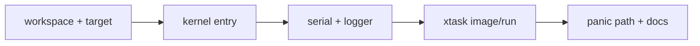

# Phase 1 Tasks - Boot Foundation

**Depends on:** none

## Implementation Tasks

- [x] P1-T001 Create or verify the workspace layout for `kernel/` and `xtask/`.
- [x] P1-T002 Configure the OS build target and runner settings used by the project.
- [x] P1-T003 Implement a minimal `kernel_main` entry point with a stable `hlt` loop.
- [x] P1-T004 Add serial initialization and basic `serial_print!` / `serial_println!` macros.
- [x] P1-T005 Install a logger backend that writes through serial.
- [x] P1-T006 Implement `cargo xtask image` to build a bootable image.
- [x] P1-T007 Implement `cargo xtask run` to launch QEMU with the expected firmware and serial configuration.
- [x] P1-T008 Add a readable panic handler for early boot failures.

## Validation Tasks

- [x] P1-T009 Confirm `cargo +nightly xtask run` boots and prints a clear startup message.
- [x] P1-T010 Confirm `cargo +nightly xtask image` produces the expected artifact.
- [x] P1-T011 Trigger an intentional panic and confirm the output is useful and the machine halts cleanly.

## Documentation Tasks

- [x] P1-T012 Document the boot flow from `xtask` to `kernel_main`.
- [x] P1-T013 Document the serial logging and panic strategy used during early boot.
- [x] P1-T014 Add a short note explaining how mature kernels usually support more boot modes, logging sinks, and diagnostics.
