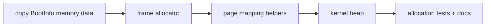

# Phase 2 Tasks - Memory Basics

**Depends on:** Phase 1

## Implementation Tasks

- [ ] P2-T001 Copy the bootloader memory map into typed kernel-owned structures.
- [ ] P2-T002 Implement a simple frame allocator for usable physical memory regions.
- [ ] P2-T003 Add safe wrappers around the page-table manipulation needed by the kernel.
- [ ] P2-T004 Reserve and map a fixed-size kernel heap region.
- [ ] P2-T005 Initialize `#[global_allocator]` after the heap is mapped.
- [ ] P2-T006 Add simple debug helpers for reporting frame and page translations.

## Validation Tasks

- [ ] P2-T007 Verify small `Box`, `Vec`, and `String` allocations succeed after heap initialization.
- [ ] P2-T008 Verify frame allocation does not reuse reserved or already allocated memory.
- [ ] P2-T009 Verify memory setup logs enough information to troubleshoot boot failures.

## Documentation Tasks

- [ ] P2-T010 Document the difference between physical frames, virtual pages, and the fixed kernel heap.
- [ ] P2-T011 Document the allocator strategy and its limitations.
- [ ] P2-T012 Add a short note explaining how mature kernels add reclaim, paging policy, and more complex allocators later.
