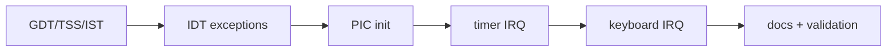

# Phase 3 Tasks - Interrupts

**Depends on:** Phase 1

## Implementation Tasks

- [x] P3-T001 Set up the GDT, TSS, and any interrupt stack entries needed for safe fault handling.
- [x] P3-T002 Build the IDT and install handlers for breakpoint, page fault, general protection fault, and double fault.
- [x] P3-T003 Initialize and remap the PIC so hardware IRQs use a known vector range.
- [x] P3-T004 Implement a timer interrupt handler that records observable progress.
- [x] P3-T005 Implement a keyboard interrupt handler that reads scancodes and places them in a simple buffer.
- [x] P3-T006 Keep all interrupt handlers minimal, non-allocating, and explicit about EOI handling.

## Validation Tasks

- [x] P3-T007 Verify a breakpoint trap produces readable diagnostic output.
- [x] P3-T008 Verify timer interrupts fire consistently enough to support later scheduling work.
- [x] P3-T009 Verify keyboard input reaches the log or buffer without blocking in the IRQ path.
- [x] P3-T010 Verify fault handlers emit enough context to debug failures.

## Documentation Tasks

- [x] P3-T011 Document the interrupt path, vector layout, and why IRQ handlers must stay small.
- [x] P3-T012 Document the purpose of the TSS and interrupt stacks at a high level.
- [x] P3-T013 Add a short note explaining how mature kernels usually use APIC-style interrupt routing and more sophisticated deferred work models.
