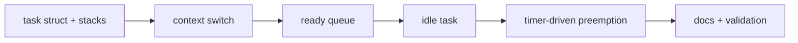

# Phase 4 Tasks - Tasking

**Depends on:** Phases 2 and 3

## Implementation Tasks

- [ ] P4-T001 Define the kernel task structure, saved register layout, and task states.
- [ ] P4-T002 Create kernel stacks and bootstrap logic for newly spawned tasks.
- [ ] P4-T003 Implement the context-switch assembly stub with a narrow, documented ABI.
- [ ] P4-T004 Add a round-robin scheduler and ready queue.
- [ ] P4-T005 Add an idle task that halts when no runnable work exists.
- [ ] P4-T006 Trigger scheduling decisions from the timer interrupt path.

## Validation Tasks

- [ ] P4-T007 Run at least two kernel tasks and verify their output interleaves over time.
- [ ] P4-T008 Verify register state survives task switches.
- [ ] P4-T009 Verify the idle task runs only when no other task is ready.

## Documentation Tasks

- [ ] P4-T010 Document the context-switch contract, including which registers are saved.
- [ ] P4-T011 Document the scheduler model and why round-robin is a good teaching default.
- [ ] P4-T012 Add a short note explaining how mature kernels introduce priorities, affinities, and more complex wakeup paths.
