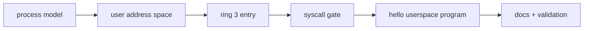

# Phase 5 Tasks - Userspace Entry

**Depends on:** Phase 4

## Implementation Tasks

- [ ] P5-T001 Define a minimal process abstraction separate from kernel-only task state where needed.
- [ ] P5-T002 Build a user address space with code, stack, and kernel-protected mappings.
- [ ] P5-T003 Implement the transition into ring 3 using the project's chosen entry path.
- [ ] P5-T004 Install the syscall entry point and dispatcher using the documented ABI.
- [ ] P5-T005 Implement at least `debug_print` and `exit` syscalls for the first user program.
- [ ] P5-T006 Create one tiny userspace binary that exercises the syscall and exit path.

## Validation Tasks

- [ ] P5-T007 Verify a userspace program can print and exit cleanly.
- [ ] P5-T008 Verify invalid userspace access to kernel memory faults cleanly.
- [ ] P5-T009 Verify the syscall path returns to the correct userspace location.

## Documentation Tasks

- [ ] P5-T010 Document the syscall ABI and ring transition at a high level.
- [ ] P5-T011 Document the first userspace memory layout and process assumptions.
- [ ] P5-T012 Add a short note explaining how mature kernels support richer executable loading, memory permissions, and process models.
