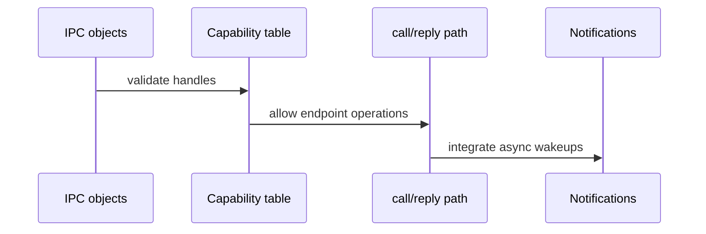

# Phase 6 Tasks - IPC Core

**Depends on:** Phase 5
**Branch:** `phase-6-ipc-core`
**PR:** https://github.com/mikecubed/ostest/pull/5

## Implementation Tasks

- [x] P6-T001 Define the kernel IPC objects needed for endpoints and notifications.
  - `ipc/message.rs`: `Message { label, data: [u64; 4] }`
  - `ipc/endpoint.rs`: `Endpoint` with sender/receiver `VecDeque`, `EndpointRegistry` (16 slots)
  - `ipc/notification.rs`: `Notification` (AtomicU64 + waiter), `NotifRegistry` with IRQ map
- [x] P6-T002 Add a per-process capability table and explicit validation for every IPC syscall.
  - `ipc/capability.rs`: `CapabilityTable` (64 slots), `CapHandle = u32`, `Capability` enum
  - `task/mod.rs`: `Task` now holds `caps: CapabilityTable`
  - Scheduler helpers: `task_cap`, `remove_task_cap`, `insert_cap`
- [x] P6-T003 Implement blocking `recv` and `send` primitives.
  - `ipc/endpoint.rs`: `recv()` / `send()` with `block_current_on_{recv,send}` + `wake_task`
  - `task/mod.rs`: `TaskState` gains `BlockedOnRecv`, `BlockedOnSend`, `BlockedOnReply`, `BlockedOnNotif`
  - `task/scheduler.rs`: `block_current_on_{recv,send,reply}`, `wake_task`, `deliver_message`, `take_message`
- [x] P6-T004 Implement synchronous `call` and `reply` semantics.
  - `ipc/endpoint.rs`: `call()` inserts a one-shot `Capability::Reply`; `reply()` wakes caller
- [x] P6-T005 Add the `reply_recv` server pattern as the primary loop for services.
  - `ipc/endpoint.rs`: `reply_recv()` = `reply()` + `recv()` on the server endpoint
- [x] P6-T006 Implement notification objects for IRQ-style asynchronous events.
  - `ipc/notification.rs`: `signal()` (atomic, ISR-safe) + `wait()` (blocking)
- [ ] P6-T007 Connect IRQ registration and delivery to the notification mechanism.
  - Wire `notification::signal_irq(irq)` into `arch/x86_64/interrupts.rs` keyboard handler
  - Add `sys_notify_register_irq` syscall + kernel API

## Validation Tasks

- [ ] P6-T008 Verify a client can send a request and receive a reply from a server.
  - Update `kernel_main` to spawn server + client kernel threads; observe IPC exchange on serial
- [ ] P6-T009 Verify invalid or forged capability handles are rejected.
  - Add `debug_assert` / log in syscall dispatch; demonstrate invalid handle returns `u64::MAX`
- [ ] P6-T010 Verify the server loop can block, reply, and receive the next message predictably.
  - Multi-message demo: client sends 3 messages; server reply_recv loop handles all
- [ ] P6-T011 Verify IRQ or signal-style notifications can wake a waiting userspace task.
  - kbd_server kernel thread blocks on notification; keypress wakes it; scancode logged

## Documentation Tasks

- [ ] P6-T012 Document the rendezvous IPC model and why it was chosen for this project.
- [ ] P6-T013 Document the capability table and the difference between endpoints and notifications.
- [ ] P6-T014 Add a short note explaining how mature microkernels optimize IPC fast paths.
