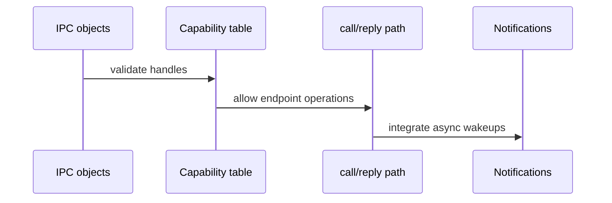

# Phase 6 Tasks - IPC Core

**Depends on:** Phase 5

## Implementation Tasks

- [ ] P6-T001 Define the kernel IPC objects needed for endpoints and notifications.
- [ ] P6-T002 Add a per-process capability table and explicit validation for every IPC syscall.
- [ ] P6-T003 Implement blocking `recv` and `send` primitives.
- [ ] P6-T004 Implement synchronous `call` and `reply` semantics.
- [ ] P6-T005 Add the `reply_recv` server pattern as the primary loop for services.
- [ ] P6-T006 Implement notification objects for IRQ-style asynchronous events.
- [ ] P6-T007 Connect IRQ registration and delivery to the notification mechanism.

## Validation Tasks

- [ ] P6-T008 Verify a client can send a request and receive a reply from a server.
- [ ] P6-T009 Verify invalid or forged capability handles are rejected.
- [ ] P6-T010 Verify the server loop can block, reply, and receive the next message predictably.
- [ ] P6-T011 Verify IRQ or signal-style notifications can wake a waiting userspace task.

## Documentation Tasks

- [ ] P6-T012 Document the rendezvous IPC model and why it was chosen for this project.
- [ ] P6-T013 Document the capability table and the difference between endpoints and notifications.
- [ ] P6-T014 Add a short note explaining how mature microkernels optimize IPC fast paths and often support more advanced transfer patterns.
