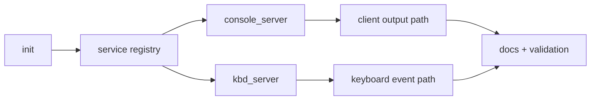

# Phase 7 Tasks - Core Servers

**Depends on:** Phase 6

## Implementation Tasks

- [ ] P7-T001 Implement `init` as the first userspace process responsible for early service startup.
- [ ] P7-T002 Add a simple service registry or nameserver model for discovering early services.
- [ ] P7-T003 Move console output behind `console_server`.
- [ ] P7-T004 Route keyboard events through `kbd_server`.
- [ ] P7-T005 Define the IPC contracts used by clients to find and talk to these services.
- [ ] P7-T006 Keep bootstrap ordering explicit and simple enough to debug from logs.

<!-- Phase 7 implementation started 2026-03-23 on branch phase-7-core-servers -->

## Validation Tasks

- [ ] P7-T007 Verify `init` launches the initial service set in the expected order.
- [ ] P7-T008 Verify userspace clients can discover the console service and send output through it.
- [ ] P7-T009 Verify keyboard events reach userspace through `kbd_server` rather than ad hoc kernel code.

## Documentation Tasks

- [ ] P7-T010 Document the service startup sequence and ownership boundaries between kernel and servers.
- [ ] P7-T011 Document the registry or nameserver approach used for early bootstrapping.
- [ ] P7-T012 Add a short note explaining how mature systems usually add supervision, restart policy, and richer service discovery later.
