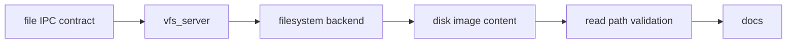

# Phase 8 Tasks - Storage and VFS

**Depends on:** Phase 7

## Implementation Tasks

- [x] P8-T001 Define a small file-oriented IPC contract for open and read operations.
- [x] P8-T002 Implement `vfs_server` as a path router rather than a monolithic filesystem.
- [x] P8-T003 Implement one read-only filesystem backend, such as a small FAT-based service.
- [x] P8-T004 Add sample files to the boot media or image content used for demos.
- [x] P8-T005 Keep write support, caching, and mutation out of the first storage milestone.

<!-- Phase 8 implementation started 2026-03-23 on branch phase-8-storage-and-vfs -->

## Validation Tasks

- [x] P8-T006 Verify a userspace client can open a known file by path and read its contents.
- [x] P8-T007 Verify missing files and invalid paths return predictable errors.
- [x] P8-T008 Verify the ownership boundary between VFS routing and filesystem-specific logic stays clear.

## Documentation Tasks

- [x] P8-T009 Document the first file service protocol and the split between VFS and the filesystem backend.
- [x] P8-T010 Document how sample files are packaged into the disk image for demos and tests.
- [x] P8-T011 Add a short note explaining how mature OSes add writable filesystems, caching, permissions, and crash-consistency features later.
