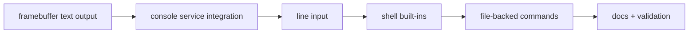

# Phase 9 Tasks - Framebuffer and Shell

**Branch:** `phase-9-framebuffer-and-shell` | **PR:** #8 (draft)
**Depends on:** Phases 7 and 8

## Implementation Tasks

- [ ] P9-T001 Parse the framebuffer information needed for simple text-mode rendering.
- [ ] P9-T002 Add fixed-font text rendering primitives suitable for a toy terminal.
- [ ] P9-T003 Extend the console path so output can reach both serial and the framebuffer.
- [ ] P9-T004 Implement line input with basic editing behavior.
- [ ] P9-T005 Build a tiny shell with a small set of built-in commands such as `help`, `echo`, `ls`, and `cat`.
- [ ] P9-T006 Route file-oriented shell commands through the documented service interfaces.

## Validation Tasks

- [ ] P9-T007 Verify text appears on screen and remains readable as output grows.
- [ ] P9-T008 Verify keyboard input flows through userspace services into the shell.
- [ ] P9-T009 Verify built-in commands behave predictably and exercise the storage stack.

## Documentation Tasks

- [ ] P9-T010 Document framebuffer ownership, text rendering, and terminal-state management at a high level.
- [ ] P9-T011 Document the shell command model and which services it depends on.
- [ ] P9-T012 Add a short note explaining how mature systems add richer terminals, process launching, shells, and graphics stacks later.
