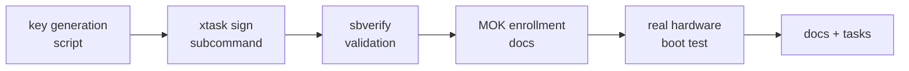

# Phase 10 Tasks - Secure Boot Signing (Optional)

**Depends on:** Phase 1 (xtask build pipeline), Phase 9 (framebuffer — so there is
something visible to confirm the boot succeeded)

## Setup Tasks

- [ ] P10-T001 Write a `scripts/gen-secure-boot-keys.sh` script that runs `openssl req`
  to generate a 4096-bit RSA key pair (`ostest.key`) and self-signed certificate
  (`ostest.crt`) valid for 10 years, with CN=`ostest Secure Boot Key`. Add both to
  `.gitignore` — the private key must never be committed.
- [ ] P10-T002 Document the expected output files and where they should be placed
  relative to the repo root so `cargo xtask sign` can find them.

## Implementation Tasks

- [ ] P10-T003 Add a `sign` subcommand to `xtask/src/main.rs` (or a `--sign` flag on
  `image`) that accepts optional `--key` and `--cert` path arguments, defaulting to
  `ostest.key` and `ostest.crt` in the repo root.
- [ ] P10-T004 In the `sign` subcommand, run `sbsign --key <key> --cert <cert>
  --output <signed.efi> <unsigned.efi>` via `std::process::Command`. Fail with a clear
  error if `sbsign` is not found (`sbsigntool` package on Debian/Ubuntu).
- [ ] P10-T005 After signing, run `sbverify --cert <cert> <signed.efi>` to confirm the
  signature is valid before reporting success.
- [ ] P10-T006 Print the path of the signed EFI binary and a one-line reminder about
  MOK enrollment on success.

## Validation Tasks

- [ ] P10-T007 Verify `sbverify --cert ostest.crt bootx64-signed.efi` exits 0.
- [ ] P10-T008 Verify the unsigned binary fails `sbverify` against the cert (expected).
- [ ] P10-T009 On a real machine with Secure Boot enabled: enroll the cert via
  `mokutil --import ostest.crt`, reboot through MOKManager, confirm boot succeeds.
- [ ] P10-T010 On the same machine: temporarily disable the enrolled key and confirm
  the signed binary is rejected by firmware (Secure Boot is actually enforcing).

## Documentation Tasks

- [ ] P10-T011 Add a `docs/10-secure-boot.md` implementation page covering:
  - the UEFI Secure Boot key hierarchy (PK / KEK / db / dbx)
  - the `gen-secure-boot-keys.sh` + `cargo xtask sign` workflow end-to-end
  - the MOK enrollment steps (`mokutil --import`, reboot, MOKManager UI)
  - how to verify Secure Boot state (`mokutil --sb-state`, `dmesg | grep -i secure`)
- [ ] P10-T012 Add a short note in `docs/10-secure-boot.md` explaining the shim chain
  and why it is not needed for personal use.
- [ ] P10-T013 Update `docs/roadmap/README.md` and `docs/08-roadmap.md` to mark
  Phase 10 complete once validation passes on real hardware.
