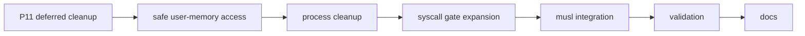

# Phase 12 Tasks - POSIX Compatibility Layer

**Depends on:** Phase 11 (ELF Loader and Process Model)

---

## Carried Forward from Phase 11

These items were deferred during Phase 11 implementation and must be completed
before the Phase 12 POSIX layer can build on a correct foundation.

### Process and Interrupt Model

- [ ] P12-T001 Replace `block_current_on_recv()` in the `page_fault_handler` and
  `general_protection_fault_handler` with a safe two-phase kill path: set a
  per-CPU `KILL_PENDING` atomic flag in the exception handler, then IRET to a
  kernel-mode trampoline that calls `sys_exit(-11)` outside interrupt context.
  This eliminates the context switch from inside an exception handler, which
  violates the project's interrupt-handler contract (AGENTS.md).

- [ ] P12-T002 Free the old address space on `sys_execve` success. Implement a
  `free_process_page_table(cr3_phys)` function that walks PML4 indices 0–255
  (user half only), frees every mapped physical frame, and frees the page-table
  structure frames themselves. Call it in `sys_execve` after switching to the new
  CR3.

- [ ] P12-T003 Reap permanently blocked kernel tasks from the scheduler queue after
  a process exits. When `sys_exit` / the fault kill path permanently blocks a
  kernel task, mark it `TaskState::Dead` (new state) and have the scheduler skip
  and remove dead entries on the next scheduling pass so they do not accumulate
  indefinitely.

- [ ] P12-T004 Add `RFlags::TRAP_FLAG` to the `SFMASK` written during SYSCALL setup
  so that a userspace program with the trap flag set does not cause the kernel
  SYSCALL handler to execute under single-step, generating spurious `#DB`
  exceptions on every instruction.

### Safe User-Memory Access

- [ ] P12-T005 Implement `copy_from_user(dst: &mut [u8], src_vaddr: u64) -> Result<(), ()>`
  and `copy_to_user(dst_vaddr: u64, src: &[u8]) -> Result<(), ()>` using page-table
  translation via the physical-memory offset. These replace the current pattern of
  casting userspace pointers directly — which causes ring-0 page faults on unmapped
  addresses.

- [ ] P12-T006 Replace `sys_debug_print`'s direct `from_raw_parts` with `copy_from_user`.
  The current range check guards against obviously out-of-range pointers but cannot
  detect unmapped-but-in-range addresses.

- [ ] P12-T007 Replace `path_name_buf`'s direct `from_raw_parts` with `copy_from_user`.

- [ ] P12-T008 Replace `sys_waitpid`'s direct `status_ptr` write with `copy_to_user`.
  The current alignment + range check is necessary but not sufficient — an unmapped
  in-range address still triggers a ring-0 fault.

- [ ] P12-T009 Replace `setup_abi_stack`'s `virt_to_kptr` null-check pattern with a
  `copy_to_user` equivalent that returns `Result` and propagates failures rather than
  silently dropping writes. Update `setup_abi_stack`'s return type to `Result<u64, ElfError>`.

### Build Infrastructure

- [ ] P12-T010 Move userspace ELF generation out of `kernel/initrd/` version control.
  Generate binaries into `OUT_DIR` via a `build.rs` in the kernel crate (or a
  dedicated `build-userspace` xtask step that is a prerequisite of `check`/`run`/`image`)
  and add `kernel/initrd/*.elf` to `.gitignore`. This eliminates stale binary commits
  and noisy binary diffs.

---

## Phase 12 Implementation Tasks

### Syscall Gate Expansion

- [ ] P12-T011 Audit the ~40 Linux syscall numbers that musl requires and list which
  are already implemented (with different numbers) vs. missing entirely.

- [ ] P12-T012 Add a Linux-ABI dispatch table in the syscall gate that maps Linux
  syscall numbers to the existing internal implementations. Keep the custom
  Phase 11 numbers working alongside.

- [ ] P12-T013 Implement `read(fd, buf, count)` over the IPC path to `vfs_server`.

- [ ] P12-T014 Implement `write(fd, buf, count)` — stdout/stderr should reach
  `console_server`.

- [ ] P12-T015 Implement `open(path, flags)` / `openat` / `close` over `vfs_server`.

- [ ] P12-T016 Implement `fstat` / `fstatat` returning minimal `stat` structs.

- [ ] P12-T017 Implement `lseek`.

- [ ] P12-T018 Implement `mmap(NULL, len, PROT_READ|PROT_WRITE, MAP_PRIVATE|MAP_ANONYMOUS)`
  as a simple frame allocator wrapper. Reject non-anonymous maps for now.

- [ ] P12-T019 Implement `munmap` (free frames, unmap pages).

- [ ] P12-T020 Implement `brk` / `sbrk` backed by the same frame allocator.

- [ ] P12-T021 Implement `exit` and `exit_group` using the Phase 11 path.

- [ ] P12-T022 Implement `getpid` using the Phase 11 path.

- [ ] P12-T023 Implement `writev` / `readv` as loops over `write` / `read`.

- [ ] P12-T024 Implement `getcwd` / `chdir` (stub returning `/` for now).

- [ ] P12-T025 Implement `ioctl` with only the TIOCGWINSZ stub needed by musl's
  terminal detection.

- [ ] P12-T026 Implement `uname` returning a fixed-string kernel identity.

### musl Integration

- [ ] P12-T027 Compile musl on the host targeting `x86_64-unknown-none`, patching
  only the `__syscall` stubs to use the Linux syscall numbers added above.

- [ ] P12-T028 Write a minimal `crt0.s` that satisfies the SysV AMD64 entry
  convention: read `argc`/`argv`/`envp` from the stack, call `__libc_start_main`,
  and fall through to `exit`.

- [ ] P12-T029 Bundle musl headers and the compiled `libc.a` in the disk image so
  programs compiled on the host can link against them.

## Validation Tasks

- [ ] P12-T030 Compile a "hello world" C binary on the host with `cc -static -o hello hello.c`
  (targeting musl), copy to the image, and run inside the OS.

- [ ] P12-T031 Verify `printf`, `malloc`, `fopen`, and `exit` all work correctly in
  the hello world binary.

- [ ] P12-T032 Confirm the existing Phase 11 Rust userspace binaries still work after
  the Linux ABI dispatch table is added.

- [ ] P12-T033 Confirm that a process with the trap flag set in RFLAGS before a SYSCALL
  does not generate spurious `#DB` exceptions in the kernel (validates P12-T004).

## Documentation Tasks

- [ ] P12-T034 Document the Linux syscall number mapping table and the dual-dispatch
  strategy (Phase 11 custom numbers alongside Linux-compatible numbers).

- [ ] P12-T035 Explain what musl needs vs. what glibc needs and why musl is the
  right first libc target for a toy OS.

- [ ] P12-T036 Document the C runtime entry sequence: `_start` → `__libc_start_main`
  → `main` → `exit`, with the SysV stack layout each step expects.

- [ ] P12-T037 Document which syscalls are real, which are stubbed, and what the
  gaps mean for program compatibility.

- [ ] P12-T038 Document the `copy_from_user` / `copy_to_user` design and why direct
  pointer casts from syscall arguments are unsafe.
