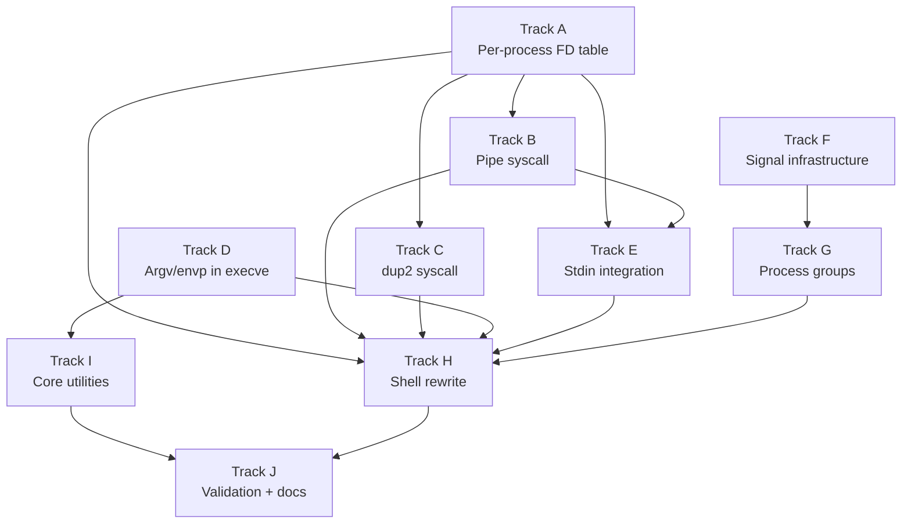

# Phase 14 — Shell and Userspace Tools: Task List

**Depends on:** Phase 12 (POSIX Compat) ✅, Phase 13 (Writable FS) ✅
**Goal:** Interactive shell with pipes, I/O redirection, job control, environment
variables, and core utilities compiled as standalone ELF binaries.

## Prerequisite Analysis

Current state (post-Phase 13):
- FD table is **global** (not per-process) — must be moved into `Process`
- `execve` ignores argv/envp — must parse from user pointers
- `read(0, ...)` returns `-EAGAIN` — no stdin integration
- Shell is a kernel task using IPC — must become a userspace program (or at
  minimum, must be able to fork+exec external commands)
- No `pipe`, `dup2`, `kill`, or signal syscalls
- Keyboard input is IPC-based (kbd_server), not connected to FD 0
- No process groups, no signal delivery, no Ctrl-C/Ctrl-Z

Already implemented from Phase 12/13 (no new work needed):
- `getcwd` (syscall 79) — returns "/" (stub)
- `chdir` (syscall 80) — stub (always succeeds, cwd is global)
- `rename` (syscall 82) — tmpfs only
- `O_APPEND` flag — supported in `open()`
- `mkdir`, `rmdir`, `unlink`, `truncate`, `ftruncate`, `fsync` — tmpfs only

## Track Layout

| Track | Scope | Dependencies |
|---|---|---|
| A | Per-process FD table | — |
| B | Pipe syscall + kernel pipe buffer | A |
| C | dup2 syscall | A |
| D | Argv/envp support in execve | — |
| E | Stdin integration (keyboard → FD 0) | A, B |
| F | Signal infrastructure (SIGINT, SIGTSTP, SIGCONT, SIGCHLD) | — |
| G | Process groups + foreground/background | F |
| H | Shell rewrite (fork+exec, pipes, redirection, variables) | A–G |
| I | Core utilities (standalone ELF binaries) | D |
| J | Validation + documentation | H, I |

Tracks A and D are independent and can start in parallel.
Tracks F and I are independent of A–E and can also run in parallel.

---

## Track A — Per-Process FD Table

Move the global `FD_TABLE` into `struct Process` so each process has its own
file descriptors, offsets, and permissions.  Fork duplicates the parent's table.

| Task | Description |
|---|---|
| P14-T001 | Add `fd_table: [Option<FdEntry>; MAX_FDS]` field to `Process` struct |
| P14-T002 | Initialize FDs 0/1/2 (stdin/stdout/stderr) when creating a new process |
| P14-T003 | Modify `sys_fork` to deep-clone parent's `fd_table` into child |
| P14-T004 | Modify all FD syscalls (read, write, open, close, fstat, lseek, ftruncate, fsync) to index into the calling process's `fd_table` instead of the global table |
| P14-T005 | Remove the global `FD_TABLE` static |
| P14-T006 | Verify existing Phase 11–13 tests still pass after migration |

## Track B — Pipe Syscall

Implement `pipe(int pipefd[2])` (Linux syscall 22).  Allocates a kernel ring
buffer and returns two FDs: one for reading, one for writing.

| Task | Description |
|---|---|
| P14-T007 | Define `Pipe` struct: ring buffer (4 KiB), read/write offsets, reader/writer-open flags |
| P14-T008 | Add `FdBackend::PipeRead { pipe_id }` and `FdBackend::PipeWrite { pipe_id }` variants |
| P14-T009 | Implement `sys_pipe(pipefd_ptr)`: allocate Pipe, allocate two FD slots, write `[read_fd, write_fd]` to user memory |
| P14-T010 | Implement pipe-aware `read()`: block (yield-loop) if buffer empty and writer still open; return 0 (EOF) if writer closed |
| P14-T011 | Implement pipe-aware `write()`: block if buffer full and reader still open; return `-EPIPE` if reader closed |
| P14-T012 | Implement pipe-aware `close()`: mark reader/writer as closed; free pipe when both sides closed |
| P14-T013 | Add syscall 22 to dispatch table |

## Track C — dup2 Syscall

Implement `dup2(oldfd, newfd)` (Linux syscall 33).  Duplicates an FD entry
so that two FD numbers refer to the same underlying file/pipe.

| Task | Description |
|---|---|
| P14-T014 | Implement `sys_dup2(oldfd, newfd)`: close newfd if open, copy FdEntry from oldfd to newfd, return newfd |
| P14-T015 | Handle edge case: `dup2(fd, fd)` returns fd without closing |
| P14-T016 | Add syscall 33 to dispatch table |

## Track D — Argv/Envp in Execve

Extend `sys_execve` to read argv and envp arrays from user memory and pass
them to `setup_abi_stack`.

| Task | Description |
|---|---|
| P14-T017 | Parse argv pointer array from user memory (null-terminated array of char* pointers) |
| P14-T018 | Parse envp pointer array from user memory (same format) |
| P14-T019 | Copy argv/envp strings into kernel buffers via `copy_from_user` |
| P14-T020 | Pass argv/envp to `setup_abi_stack` instead of hardcoded `&[name]` / empty |
| P14-T021 | Verify echo-args.elf receives correct arguments when launched with argv |

## Track E — Stdin Integration

Connect keyboard input to FD 0 so userspace processes can `read(0, buf, n)`.

| Task | Description |
|---|---|
| P14-T022 | Add a kernel-level stdin pipe: kbd_server writes scancodes→chars into the write end |
| P14-T023 | Wire FD 0 in new processes to the read end of the stdin pipe |
| P14-T024 | Implement line-buffered mode: accumulate input until Enter, then make the line available to `read(0, ...)` |
| P14-T025 | Echo typed characters to stdout (console) as they arrive |
| P14-T026 | Handle Backspace in the line buffer |

## Track F — Signal Infrastructure

Add minimal signal support: delivery, default actions, and the syscalls needed
for job control.

| Task | Description |
|---|---|
| P14-T027 | Add `pending_signals: u64` bitfield to `Process` (one bit per signal 1–63) |
| P14-T028 | Add `signal_action: [SignalAction; 32]` table to `Process` (Default / Ignore / Handler) |
| P14-T029 | Implement `sys_kill(pid, sig)` (syscall 62): set pending bit on target process |
| P14-T030 | Implement `sys_rt_sigaction(sig, act, oldact)` (syscall 13): install/query signal handler |
| P14-T031 | Check pending signals on return to userspace (in SYSRET path); deliver default action (terminate for SIGINT, stop for SIGTSTP) |
| P14-T032 | Implement SIGCONT: resume a stopped process |
| P14-T033 | Add syscalls 62, 13, 14 (kill, rt_sigaction, rt_sigprocmask stub) to dispatch table |
| P14-T033a | Deliver SIGCHLD to parent when child exits or stops |

## Track G — Process Groups and Job Control

Add process group tracking so the shell can manage foreground/background jobs
and deliver signals to groups.

| Task | Description |
|---|---|
| P14-T034 | Add `pgid: Pid` field to `Process`; default to own PID |
| P14-T035 | Implement `sys_setpgid(pid, pgid)` (syscall 109) and `sys_getpgid(pid)` (syscall 121) |
| P14-T036 | Extend `sys_kill` to support negative PID (kill process group) |
| P14-T037 | Track foreground process group in the terminal (global `FG_PGID`) |
| P14-T038 | Wire Ctrl-C in kbd_server to send SIGINT to `FG_PGID` |
| P14-T039 | Wire Ctrl-Z in kbd_server to send SIGTSTP to `FG_PGID` |
| P14-T040 | Implement `waitpid(-1, ...)` to wait for any child |
| P14-T041 | Implement `WUNTRACED` flag in waitpid to report stopped children |
| P14-T041a | Encode waitpid status correctly: `WIFEXITED` (code << 8), `WIFSTOPPED` (sig << 8 \| 0x7f), `WIFSIGNALED` (sig) |

## Track H — Shell Rewrite

Replace the current kernel-task shell with a full fork+exec interactive shell.
The shell can remain a kernel task for Phase 14 (moving it to userspace ELF
is a future phase goal), but it must use fork+exec to launch commands.

| Task | Description |
|---|---|
| P14-T042 | Shell main loop: read line from stdin, parse, execute, loop |
| P14-T043 | Command parser: split on `\|` for pipes, handle `>`, `<`, `>>`, `&` |
| P14-T044 | Simple command execution: `fork()` → child `execve(cmd, argv, envp)` → parent `waitpid()` |
| P14-T045 | Pipeline execution: `fork` two children, connect with `pipe` + `dup2`, wait for both |
| P14-T046 | Output redirection: `cmd > file` — child opens file, `dup2` to stdout, `execve` |
| P14-T047 | Input redirection: `cmd < file` — child opens file, `dup2` to stdin, `execve` |
| P14-T048 | Append redirection: `cmd >> file` — open with `O_APPEND` |
| P14-T049 | Background execution: `cmd &` — don't `waitpid`, track in job list |
| P14-T050 | Environment variables: `export KEY=val` stores in hash map; `$KEY` expansion in parser |
| P14-T051 | Built-in `cd`: call `chdir` syscall, update `PWD` env var |
| P14-T052 | Built-in `exit`: exit shell with code |
| P14-T053 | Built-in `export` / `unset` / `env`: manage environment |
| P14-T054 | Built-in `fg` / `bg`: move job to foreground/background, send SIGCONT |
| P14-T055 | Built-in `help`: list available commands |
| P14-T056 | PATH search: look up command in `$PATH` directories before exec |

## Track I — Core Utilities

Compile each utility as a standalone musl-linked static ELF binary.  Each
exercises a specific subset of the syscall surface.

| Task | Description |
|---|---|
| P14-T057 | `echo` — print arguments to stdout |
| P14-T058 | `true` / `false` — exit 0 / exit 1 |
| P14-T059 | `cat` — read file(s) and write to stdout (exercises read+write) |
| P14-T060 | `ls` — list directory entries via `getdents64` or tmpfs file list |
| P14-T061 | `pwd` — print working directory via `getcwd` |
| P14-T062 | `mkdir` / `rmdir` — create/remove directories |
| P14-T063 | `rm` — remove files via `unlink` |
| P14-T064 | `cp` — copy file: open+read source, open+write dest |
| P14-T065 | `mv` — rename file via `rename`, fallback to cp+rm |
| P14-T066 | `env` — print all environment variables |
| P14-T067 | `sleep` — sleep for N seconds (needs `nanosleep` syscall 35) |
| P14-T067a | `grep` — search stdin or file(s) for a fixed string, print matching lines (needed for `ls \| grep txt` acceptance criterion) |
| P14-T068 | Implement `sys_nanosleep` (syscall 35): yield-loop for tick count |
| P14-T069 | Implement `getdents64` (syscall 217) for real: return tmpfs directory entries in Linux dirent64 format |
| P14-T070 | Add all utility binaries to musl build list in xtask and embed in ramdisk |

## Track J — Validation and Documentation

| Task | Description |
|---|---|
| P14-T071 | Acceptance: `echo hello` prints "hello" |
| P14-T072 | Acceptance: `cat /tmp/test.txt` prints file contents |
| P14-T073 | Acceptance: `cat file.txt > /tmp/copy.txt` creates a copy via redirection (roadmap AC) |
| P14-T074 | Acceptance: `ls \| grep txt` produces filtered listing (roadmap AC) |
| P14-T075 | Acceptance: Ctrl-C kills foreground command, shell survives (roadmap AC) |
| P14-T076 | Acceptance: `sleep 10 &` runs in background, shell stays responsive (roadmap AC) |
| P14-T076a | Acceptance: `fg` brings a background job to the foreground (roadmap AC) |
| P14-T077 | Acceptance: `export FOO=bar && env` shows FOO=bar |
| P14-T077a | Acceptance: `export PATH=/bin && ls` — PATH-based command lookup works (roadmap AC) |
| P14-T078 | Acceptance: all utility binaries run standalone and produce correct output (roadmap AC) |
| P14-T079 | `cargo xtask check` passes (clippy + fmt) |
| P14-T080 | QEMU boot validation — no panics, no regressions |
| P14-T081 | Write `docs/14-shell-and-tools.md`: pipes, dup2, process groups, signal delivery, execve envp |

---

## Deferred Until Later

These items are explicitly out of scope for Phase 14:

- stderr redirection (`2>&1`, `2>file`)
- pipelines longer than two stages (`cmd1 | cmd2 | cmd3`)
- subshells (`$(...)` and backtick expansion)
- here-documents (`<<EOF`)
- `trap` built-in (custom signal handlers in shell scripts)
- shell scripting (loops, conditionals, functions)
- tab completion
- glob expansion (`*.txt`)
- moving the shell to a userspace ELF binary (currently remains a kernel task)
- per-process working directory (cwd is global)
- close-on-exec (`O_CLOEXEC` / `FD_CLOEXEC`)

---

## Dependency Graph

## Parallelization Strategy

**Wave 1 (independent):** Tracks A, D, F can all start simultaneously.
**Wave 2 (after A):** Tracks B, C, E can start once per-process FDs land.
Track I can start as soon as D is done (utilities just need argv/envp).
**Wave 3 (after B, C, E, F, G):** Track H (shell rewrite) needs everything.
**Wave 4:** Track J (validation) after H and I converge.
