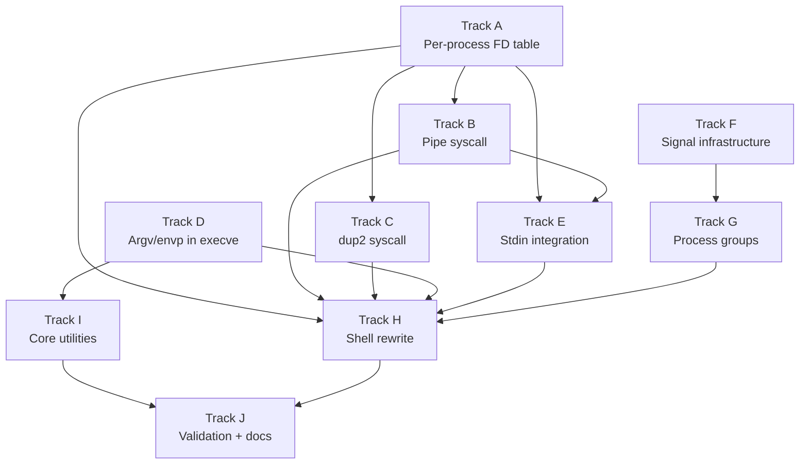

# Phase 14 — Shell and Userspace Tools: Task List

**Status:** Complete
**Source Ref:** phase-14
**Depends on:** Phase 12 (POSIX Compat) ✅, Phase 13 (Writable FS) ✅
**Goal:** Interactive shell with pipes, I/O redirection, job control, environment
variables, and core utilities compiled as standalone ELF binaries.

## Track Layout

| Track | Scope | Dependencies | Status |
|---|---|---|---|
| A | Per-process FD table | — | ✅ Done |
| B | Pipe syscall + kernel pipe buffer | A | ✅ Done |
| C | dup2 syscall | A | ✅ Done |
| D | Argv/envp support in execve | — | ✅ Done |
| E | Stdin integration (keyboard -> FD 0) | A, B | ✅ Done |
| F | Signal infrastructure (SIGINT, SIGTSTP, SIGCONT, SIGCHLD) | — | ✅ Done |
| G | Process groups + foreground/background | F | ✅ Done |
| H | Shell rewrite (fork+exec, pipes, redirection, variables) | A-G | ✅ Done |
| I | Core utilities (standalone ELF binaries) | D | ✅ Done |
| J | Validation + documentation | H, I | ✅ Done |

Tracks A and D are independent and can start in parallel.
Tracks F and I are independent of A-E and can also run in parallel.

---

## Track A — Per-Process FD Table

Move the global `FD_TABLE` into `struct Process` so each process has its own
file descriptors, offsets, and permissions. Fork duplicates the parent's table.

### A.1 — Add fd_table field to Process struct

**File:** `kernel/src/process/mod.rs`
**Symbol:** `Process::fd_table`
**Why it matters:** Per-process file descriptors are required for correct POSIX semantics where each process has independent FD state.

**Acceptance:**
- [x] `fd_table: [Option<FdEntry>; MAX_FDS]` field added to `Process` struct

### A.2 — Initialize FDs 0/1/2 for new processes

**File:** `kernel/src/process/mod.rs`
**Why it matters:** Every process needs stdin/stdout/stderr available at boot to interact with the terminal.

**Acceptance:**
- [x] FDs 0/1/2 (stdin/stdout/stderr) initialized when creating a new process

### A.3 — Deep-clone fd_table in sys_fork

**File:** `kernel/src/arch/x86_64/syscall.rs`
**Symbol:** `sys_fork`
**Why it matters:** Forked children must inherit the parent's open file descriptors so pipes and redirections work across fork boundaries.

**Acceptance:**
- [x] `sys_fork` deep-clones parent's `fd_table` into child

### A.4 — Migrate FD syscalls to per-process table

**Files:** `kernel/src/arch/x86_64/syscall.rs`, `kernel/src/process/mod.rs`
**Why it matters:** All FD operations must reference the calling process's table rather than a global table for process isolation.

**Acceptance:**
- [x] All FD syscalls (read, write, open, close, fstat, lseek, ftruncate, fsync) index into the calling process's `fd_table`

### A.5 — Remove global FD_TABLE static

**File:** `kernel/src/process/mod.rs`
**Why it matters:** Eliminating the global table prevents cross-process FD leaks and enforces per-process isolation.

**Acceptance:**
- [x] Global `FD_TABLE` static removed

### A.6 — Verify existing tests after migration

**Why it matters:** Ensures the per-process FD migration does not regress Phase 11-13 functionality.

**Acceptance:**
- [x] Existing Phase 11-13 tests still pass

---

## Track B — Pipe Syscall

Implement `pipe(int pipefd[2])` (Linux syscall 22). Allocates a kernel ring
buffer and returns two FDs: one for reading, one for writing.

### B.1 — Define Pipe struct

**File:** `kernel/src/pipe.rs`
**Symbol:** `Pipe`
**Why it matters:** The kernel pipe buffer is the foundation for inter-process communication via the shell pipeline operator.

**Acceptance:**
- [x] `Pipe` struct defined with ring buffer (4 KiB), read/write offsets, reader/writer-open flags

### B.2 — Add PipeRead and PipeWrite FdBackend variants

**File:** `kernel/src/process/mod.rs`
**Symbol:** `FdBackend::PipeRead`, `FdBackend::PipeWrite`
**Why it matters:** The FD backend must distinguish pipe endpoints so read/write/close dispatch correctly.

**Acceptance:**
- [x] `FdBackend::PipeRead { pipe_id }` and `FdBackend::PipeWrite { pipe_id }` variants added

### B.3 — Implement sys_pipe

**File:** `kernel/src/arch/x86_64/syscall.rs`
**Symbol:** `sys_pipe`
**Why it matters:** The pipe syscall is required for shell pipelines (`cmd1 | cmd2`).

**Acceptance:**
- [x] `sys_pipe(pipefd_ptr)` allocates Pipe, allocates two FD slots, writes `[read_fd, write_fd]` to user memory

### B.4 — Pipe-aware read

**File:** `kernel/src/arch/x86_64/syscall.rs`
**Why it matters:** Readers must block when the pipe buffer is empty and detect EOF when the writer closes.

**Acceptance:**
- [x] Pipe read blocks (yield-loop) if buffer empty and writer still open
- [x] Returns 0 (EOF) if writer closed

### B.5 — Pipe-aware write

**File:** `kernel/src/arch/x86_64/syscall.rs`
**Why it matters:** Writers must block when the pipe buffer is full and detect broken pipes when the reader closes.

**Acceptance:**
- [x] Pipe write blocks if buffer full and reader still open
- [x] Returns `-EPIPE` if reader closed

### B.6 — Pipe-aware close

**File:** `kernel/src/arch/x86_64/syscall.rs`
**Why it matters:** Closing one end of a pipe must signal the other end so EOF and EPIPE are delivered correctly.

**Acceptance:**
- [x] Close marks reader/writer as closed
- [x] Pipe freed when both sides closed

### B.7 — Add syscall 22 to dispatch table

**File:** `kernel/src/arch/x86_64/syscall.rs`
**Why it matters:** The pipe syscall must be reachable from userspace via the syscall dispatch.

**Acceptance:**
- [x] Syscall 22 dispatched to `sys_pipe`

---

## Track C — dup2 Syscall

Implement `dup2(oldfd, newfd)` (Linux syscall 33). Duplicates an FD entry
so that two FD numbers refer to the same underlying file/pipe.

### C.1 — Implement sys_dup2

**File:** `kernel/src/arch/x86_64/syscall.rs`
**Symbol:** `sys_dup2`
**Why it matters:** dup2 is essential for I/O redirection — the shell uses it to redirect stdin/stdout before exec.

**Acceptance:**
- [x] `sys_dup2(oldfd, newfd)` closes newfd if open, copies FdEntry from oldfd to newfd, returns newfd
- [x] `dup2(fd, fd)` returns fd without closing

### C.2 — Add syscall 33 to dispatch table

**File:** `kernel/src/arch/x86_64/syscall.rs`
**Why it matters:** The dup2 syscall must be reachable from userspace.

**Acceptance:**
- [x] Syscall 33 dispatched to `sys_dup2`

---

## Track D — Argv/Envp in Execve

Extend `sys_execve` to read argv and envp arrays from user memory and pass
them to `setup_abi_stack`.

### D.1 — Parse argv from user memory

**File:** `kernel/src/arch/x86_64/syscall.rs`
**Symbol:** `sys_execve`
**Why it matters:** Programs need command-line arguments to function (e.g., `cat file.txt`).

**Acceptance:**
- [x] Argv pointer array parsed from user memory (null-terminated array of char* pointers)

### D.2 — Parse envp from user memory

**File:** `kernel/src/arch/x86_64/syscall.rs`
**Why it matters:** Environment variables must be passed through exec for PATH, HOME, and other settings.

**Acceptance:**
- [x] Envp pointer array parsed from user memory (same format)

### D.3 — Copy argv/envp into kernel buffers

**File:** `kernel/src/arch/x86_64/syscall.rs`
**Why it matters:** Strings must be safely copied from user memory before the old address space is destroyed.

**Acceptance:**
- [x] Argv/envp strings copied into kernel buffers via `copy_from_user`

### D.4 — Pass argv/envp to setup_abi_stack

**File:** `kernel/src/mm/elf.rs`
**Symbol:** `setup_abi_stack`
**Why it matters:** The ABI stack setup must place real arguments for the new process image.

**Acceptance:**
- [x] Argv/envp passed to `setup_abi_stack` instead of hardcoded values

### D.5 — Verify echo-args receives correct arguments

**File:** `userspace/echo-args/`
**Why it matters:** End-to-end validation that argv reaches the user binary.

**Acceptance:**
- [x] echo-args.elf receives correct arguments when launched with argv

---

## Track E — Stdin Integration

Connect keyboard input to FD 0 so userspace processes can `read(0, buf, n)`.

### E.1 — Kernel-level stdin pipe

**File:** `kernel/src/stdin.rs`
**Why it matters:** Keyboard input must flow through the FD system so userspace can read from stdin.

**Acceptance:**
- [x] Kernel-level stdin pipe created: kbd handler writes chars into the write end

### E.2 — Wire FD 0 to stdin pipe

**File:** `kernel/src/process/mod.rs`
**Why it matters:** New processes need FD 0 connected to the stdin pipe for interactive input.

**Acceptance:**
- [x] FD 0 in new processes wired to the read end of the stdin pipe

### E.3 — Line-buffered mode

**File:** `kernel/src/stdin.rs`
**Why it matters:** Line buffering provides a usable interactive editing experience where input is committed on Enter.

**Acceptance:**
- [x] Input accumulated until Enter, then made available to `read(0, ...)`

### E.4 — Echo typed characters

**File:** `kernel/src/stdin.rs`
**Why it matters:** Users need visual feedback of what they are typing.

**Acceptance:**
- [x] Typed characters echoed to stdout (console) as they arrive

### E.5 — Handle Backspace

**File:** `kernel/src/stdin.rs`
**Why it matters:** Backspace support is essential for correcting typos in interactive input.

**Acceptance:**
- [x] Backspace handled in the line buffer

---

## Track F — Signal Infrastructure

Add minimal signal support: delivery, default actions, and the syscalls needed
for job control.

### F.1 — Add pending_signals bitfield to Process

**File:** `kernel/src/process/mod.rs`
**Symbol:** `Process::pending_signals`
**Why it matters:** A per-process signal bitfield tracks which signals are waiting for delivery.

**Acceptance:**
- [x] `pending_signals: u64` bitfield added to `Process` (one bit per signal 1-63)

### F.2 — Add signal_action table to Process

**File:** `kernel/src/process/mod.rs`
**Symbol:** `Process::signal_actions`
**Why it matters:** Each process needs its own signal disposition table to customize signal handling.

**Acceptance:**
- [x] `signal_action: [SignalAction; 32]` table added to `Process`

### F.3 — Implement sys_kill

**File:** `kernel/src/arch/x86_64/syscall.rs`
**Symbol:** `sys_kill`
**Why it matters:** The kill syscall is the primary mechanism for sending signals between processes.

**Acceptance:**
- [x] `sys_kill(pid, sig)` sets pending bit on target process

### F.4 — Implement sys_rt_sigaction

**File:** `kernel/src/arch/x86_64/syscall.rs`
**Symbol:** `sys_rt_sigaction`
**Why it matters:** Processes need to install custom signal handlers or ignore specific signals.

**Acceptance:**
- [x] `sys_rt_sigaction(sig, act, oldact)` installs/queries signal handler

### F.5 — Check pending signals on return to userspace

**File:** `kernel/src/arch/x86_64/syscall.rs`
**Symbol:** `check_pending_signals`
**Why it matters:** Signals must be delivered promptly when returning to ring 3 to ensure responsive job control.

**Acceptance:**
- [x] Pending signals checked on SYSRET path
- [x] Default action delivered (terminate for SIGINT, stop for SIGTSTP)

### F.6 — Implement SIGCONT

**File:** `kernel/src/process/mod.rs`
**Why it matters:** SIGCONT resumes stopped processes, completing the job control signal trio.

**Acceptance:**
- [x] SIGCONT resumes a stopped process

### F.7 — Add signal syscalls to dispatch table

**File:** `kernel/src/arch/x86_64/syscall.rs`
**Why it matters:** Signal syscalls must be reachable from userspace.

**Acceptance:**
- [x] Syscalls 62, 13, 14 (kill, rt_sigaction, rt_sigprocmask stub) added to dispatch table

### F.8 — Deliver SIGCHLD on child exit/stop

**File:** `kernel/src/process/mod.rs`
**Why it matters:** The shell needs SIGCHLD to detect when background jobs finish or stop.

**Acceptance:**
- [x] SIGCHLD delivered to parent when child exits or stops

---

## Track G — Process Groups and Job Control

Add process group tracking so the shell can manage foreground/background jobs
and deliver signals to groups.

### G.1 — Add pgid field to Process

**File:** `kernel/src/process/mod.rs`
**Symbol:** `Process::pgid`
**Why it matters:** Process groups enable the shell to manage sets of related processes as a single job.

**Acceptance:**
- [x] `pgid: Pid` field added to `Process`; defaults to own PID

### G.2 — Implement setpgid and getpgid

**File:** `kernel/src/arch/x86_64/syscall.rs`
**Symbol:** `sys_setpgid`, `sys_getpgid`
**Why it matters:** The shell uses setpgid to place pipeline members into a common process group.

**Acceptance:**
- [x] `sys_setpgid(pid, pgid)` (syscall 109) and `sys_getpgid(pid)` (syscall 121) implemented

### G.3 — Extend sys_kill for negative PID

**File:** `kernel/src/arch/x86_64/syscall.rs`
**Why it matters:** Negative PID in kill targets an entire process group, enabling group-wide signal delivery.

**Acceptance:**
- [x] `sys_kill` supports negative PID (kill process group)

### G.4 — Track foreground process group

**File:** `kernel/src/main.rs`
**Symbol:** `FG_PGID`
**Why it matters:** The terminal must know which process group is in the foreground to route keyboard signals correctly.

**Acceptance:**
- [x] Foreground process group tracked in the terminal (global `FG_PGID`)

### G.5 — Wire Ctrl-C to SIGINT

**File:** `kernel/src/arch/x86_64/interrupts.rs`
**Why it matters:** Ctrl-C must send SIGINT to the foreground process group for interactive job control.

**Acceptance:**
- [x] Ctrl-C in kbd handler sends SIGINT to `FG_PGID`

### G.6 — Wire Ctrl-Z to SIGTSTP

**File:** `kernel/src/arch/x86_64/interrupts.rs`
**Why it matters:** Ctrl-Z must suspend the foreground process group so users can background jobs.

**Acceptance:**
- [x] Ctrl-Z in kbd handler sends SIGTSTP to `FG_PGID`

### G.7 — Implement waitpid(-1, ...)

**File:** `kernel/src/arch/x86_64/syscall.rs`
**Why it matters:** The shell needs to wait for any child process to exit to manage job completion.

**Acceptance:**
- [x] `waitpid(-1, ...)` waits for any child

### G.8 — Implement WUNTRACED flag

**File:** `kernel/src/arch/x86_64/syscall.rs`
**Why it matters:** WUNTRACED allows the shell to detect when a foreground job is stopped by Ctrl-Z.

**Acceptance:**
- [x] `WUNTRACED` flag in waitpid reports stopped children

### G.9 — Encode waitpid status correctly

**File:** `kernel/src/arch/x86_64/syscall.rs`
**Why it matters:** The status encoding must match POSIX macros so musl's WIFEXITED/WIFSTOPPED/WIFSIGNALED work correctly.

**Acceptance:**
- [x] `WIFEXITED` (code << 8), `WIFSTOPPED` (sig << 8 | 0x7f), `WIFSIGNALED` (sig) encoded correctly

---

## Track H — Shell Rewrite

Replace the current kernel-task shell with a full fork+exec interactive shell.
The shell can remain a kernel task for Phase 14 (moving it to userspace ELF
is a future phase goal), but it must use fork+exec to launch commands.

### H.1 — Shell main loop

**File:** `userspace/shell/src/main.rs`
**Why it matters:** The shell main loop is the primary user interaction point for the OS.

**Acceptance:**
- [x] Shell reads line from stdin, parses, executes, loops

### H.2 — Command parser

**File:** `userspace/shell/src/main.rs`
**Why it matters:** The parser must recognize pipes, redirections, and background operators to support shell syntax.

**Acceptance:**
- [x] Parser splits on `|` for pipes, handles `>`, `<`, `>>`, `&`

### H.3 — Simple command execution

**File:** `userspace/shell/src/main.rs`
**Why it matters:** Fork+exec is the fundamental process creation pattern in Unix shells.

**Acceptance:**
- [x] `fork()` -> child `execve(cmd, argv, envp)` -> parent `waitpid()`

### H.4 — Pipeline execution

**File:** `userspace/shell/src/main.rs`
**Why it matters:** Pipelines connect processes via pipes for composable data processing.

**Acceptance:**
- [x] Two children forked, connected with `pipe` + `dup2`, waited for both

### H.5 — Output redirection

**File:** `userspace/shell/src/main.rs`
**Why it matters:** Output redirection allows capturing command output to files.

**Acceptance:**
- [x] `cmd > file` -- child opens file, `dup2` to stdout, `execve`

### H.6 — Input redirection

**File:** `userspace/shell/src/main.rs`
**Why it matters:** Input redirection allows feeding file contents to commands.

**Acceptance:**
- [x] `cmd < file` -- child opens file, `dup2` to stdin, `execve`

### H.7 — Append redirection

**File:** `userspace/shell/src/main.rs`
**Why it matters:** Append mode prevents overwriting existing file contents on redirect.

**Acceptance:**
- [x] `cmd >> file` -- open with `O_APPEND`

### H.8 — Background execution

**File:** `userspace/shell/src/main.rs`
**Why it matters:** Background jobs let users run long-running commands without blocking the shell.

**Acceptance:**
- [x] `cmd &` -- don't `waitpid`, track in job list

### H.9 — Environment variables

**File:** `userspace/shell/src/main.rs`
**Why it matters:** Environment variables provide configuration and state to child processes.

**Acceptance:**
- [x] `export KEY=val` stores in hash map; `$KEY` expansion in parser

### H.10 — Built-in cd

**File:** `userspace/shell/src/main.rs`
**Why it matters:** cd must be a shell built-in because changing directory affects the shell process itself.

**Acceptance:**
- [x] `cd` calls `chdir` syscall, updates `PWD` env var

### H.11 — Built-in exit

**File:** `userspace/shell/src/main.rs`
**Why it matters:** The exit built-in provides a clean way to terminate the shell session.

**Acceptance:**
- [x] `exit` exits shell with code

### H.12 — Built-in export / unset / env

**File:** `userspace/shell/src/main.rs`
**Why it matters:** Environment management built-ins are needed to configure child process environments.

**Acceptance:**
- [x] `export` / `unset` / `env` manage environment

### H.13 — Built-in fg / bg

**File:** `userspace/shell/src/main.rs`
**Why it matters:** fg and bg allow users to move jobs between foreground and background.

**Acceptance:**
- [x] `fg` / `bg` move job to foreground/background, send SIGCONT

### H.14 — Built-in help

**File:** `userspace/shell/src/main.rs`
**Why it matters:** Help provides discoverability of available shell commands.

**Acceptance:**
- [x] `help` lists available commands

### H.15 — PATH search

**File:** `userspace/shell/src/main.rs`
**Why it matters:** PATH-based lookup lets users run commands without specifying full paths.

**Acceptance:**
- [x] Command looked up in `$PATH` directories before exec

---

## Track I — Core Utilities

Compile each utility as a standalone musl-linked static ELF binary. Each
exercises a specific subset of the syscall surface.

### I.1 — echo

**File:** `userspace/coreutils/echo.c`
**Why it matters:** echo is the simplest output utility and validates basic write syscall.

**Acceptance:**
- [x] `echo` prints arguments to stdout

### I.2 — true / false

**Files:** `userspace/coreutils/true.c`, `userspace/coreutils/false.c`
**Why it matters:** true/false validate process exit codes.

**Acceptance:**
- [x] `true` exits 0, `false` exits 1

### I.3 — cat

**File:** `userspace/coreutils/cat.c`
**Why it matters:** cat exercises read+write syscalls on file descriptors.

**Acceptance:**
- [x] `cat` reads file(s) and writes to stdout

### I.4 — ls

**File:** `userspace/coreutils/ls.c`
**Why it matters:** ls exercises getdents64 and directory listing.

**Acceptance:**
- [x] `ls` lists directory entries via `getdents64`

### I.5 — pwd

**File:** `userspace/coreutils/pwd.c`
**Why it matters:** pwd validates the getcwd syscall.

**Acceptance:**
- [x] `pwd` prints working directory via `getcwd`

### I.6 — mkdir / rmdir

**Files:** `userspace/coreutils/mkdir.c`, `userspace/coreutils/rmdir.c`
**Why it matters:** Directory creation/removal validates the corresponding syscalls.

**Acceptance:**
- [x] `mkdir` / `rmdir` create/remove directories

### I.7 — rm

**File:** `userspace/coreutils/rm.c`
**Why it matters:** rm validates the unlink syscall.

**Acceptance:**
- [x] `rm` removes files via `unlink`

### I.8 — cp

**File:** `userspace/coreutils/cp.c`
**Why it matters:** cp exercises open+read+write across two file descriptors.

**Acceptance:**
- [x] `cp` copies file: open+read source, open+write dest

### I.9 — mv

**File:** `userspace/coreutils/mv.c`
**Why it matters:** mv validates the rename syscall with cp+rm fallback.

**Acceptance:**
- [x] `mv` renames file via `rename`, fallback to cp+rm

### I.10 — env

**File:** `userspace/coreutils/env.c`
**Why it matters:** env validates that environment variables are passed through exec correctly.

**Acceptance:**
- [x] `env` prints all environment variables

### I.11 — sleep

**File:** `userspace/coreutils/sleep.c`
**Why it matters:** sleep validates the nanosleep syscall and timer functionality.

**Acceptance:**
- [x] `sleep` sleeps for N seconds (uses `nanosleep` syscall 35)

### I.12 — grep

**File:** `userspace/coreutils/grep.c`
**Why it matters:** grep validates stdin piping and fixed-string search, enabling `ls | grep txt`.

**Acceptance:**
- [x] `grep` searches stdin or file(s) for a fixed string, prints matching lines

### I.13 — Implement sys_nanosleep

**File:** `kernel/src/arch/x86_64/syscall.rs`
**Symbol:** `sys_nanosleep`
**Why it matters:** nanosleep is required by the sleep utility and any timed operations.

**Acceptance:**
- [x] `sys_nanosleep` (syscall 35) implemented: yield-loop for tick count

### I.14 — Implement getdents64

**File:** `kernel/src/arch/x86_64/syscall.rs`
**Symbol:** `sys_getdents64`
**Why it matters:** getdents64 returns directory entries in Linux dirent64 format, required by ls.

**Acceptance:**
- [x] `getdents64` (syscall 217) returns tmpfs directory entries in Linux dirent64 format

### I.15 — Add utility binaries to ramdisk

**Component:** `xtask/` build system
**Why it matters:** All utilities must be embedded in the ramdisk so they are available at boot.

**Acceptance:**
- [x] All utility binaries added to musl build list in xtask and embedded in ramdisk

---

## Track J — Validation and Documentation

### J.1 — echo hello

**Acceptance:**
- [x] `echo hello` prints "hello"

### J.2 — cat /tmp/test.txt

**Acceptance:**
- [x] `cat /tmp/test.txt` prints file contents

### J.3 — Output redirection

**Acceptance:**
- [x] `cat file.txt > /tmp/copy.txt` creates a copy via redirection

### J.4 — Pipe with grep

**Acceptance:**
- [x] `ls | grep txt` produces filtered listing

### J.5 — Ctrl-C handling

**Acceptance:**
- [x] Ctrl-C kills foreground command, shell survives

### J.6 — Background job

**Acceptance:**
- [x] `sleep 10 &` runs in background, shell stays responsive

### J.7 — fg built-in

**Acceptance:**
- [x] `fg` brings a background job to the foreground

### J.8 — Environment variable export

**Acceptance:**
- [x] `export FOO=bar && env` shows FOO=bar

### J.9 — PATH-based command lookup

**Acceptance:**
- [x] `export PATH=/bin && ls` -- PATH-based command lookup works

### J.10 — All utilities run correctly

**Acceptance:**
- [x] All utility binaries run standalone and produce correct output

### J.11 — Quality gates

**Acceptance:**
- [x] `cargo xtask check` passes (clippy + fmt)
- [x] QEMU boot validation -- no panics, no regressions

### J.12 — Documentation

**Acceptance:**
- [x] `docs/14-shell-and-tools.md` written: pipes, dup2, process groups, signal delivery, execve envp

---

## Deferred Until Later

These items are explicitly out of scope for Phase 14:

- stderr redirection (`2>&1`, `2>file`)
- pipelines longer than two stages (`cmd1 | cmd2 | cmd3`)
- subshells (`$(...)` and backtick expansion)
- here-documents (`<<EOF`)
- `trap` built-in (custom signal handlers in shell scripts)
- shell scripting (loops, conditionals, functions)
- tab completion
- glob expansion (`*.txt`)
- moving the shell to a userspace ELF binary (currently remains a kernel task)
- per-process working directory (cwd is global)
- close-on-exec (`O_CLOEXEC` / `FD_CLOEXEC`)

---

## Documentation Notes

- Phase 14 introduced per-process FD tables (replacing the global FD_TABLE from Phase 12/13), pipes, dup2, signal infrastructure, process groups, job control, and a full fork+exec shell.
- Core utilities were compiled as standalone musl-linked ELF binaries.
- The shell remained a kernel task in this phase; moving it to userspace was deferred.

---

## Dependency Graph

## Parallelization Strategy

**Wave 1 (independent):** Tracks A, D, F can all start simultaneously.
**Wave 2 (after A):** Tracks B, C, E can start once per-process FDs land.
Track I can start as soon as D is done (utilities just need argv/envp).
**Wave 3 (after B, C, E, F, G):** Track H (shell rewrite) needs everything.
**Wave 4:** Track J (validation) after H and I converge.
