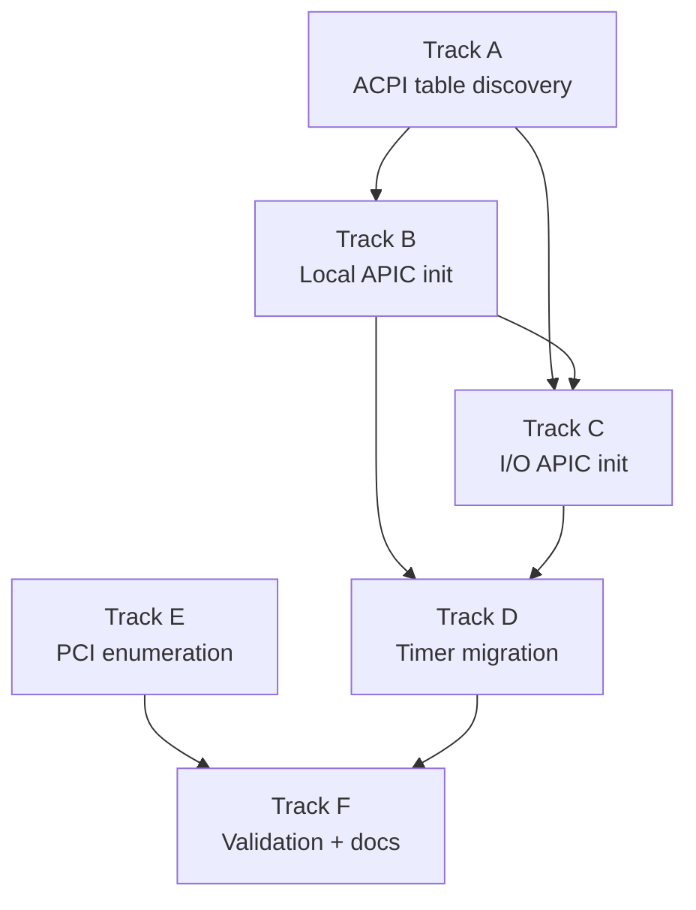

# Phase 15 — Hardware Discovery (ACPI + PCI): Task List

**Status:** Complete
**Source Ref:** phase-15
**Depends on:** Phase 3 (Interrupts) ✅
**Goal:** Parse ACPI tables, replace the 8259 PIC with the Local APIC + I/O APIC,
and enumerate PCI devices so later phases can discover hardware dynamically.

## Track Layout

| Track | Scope | Dependencies | Status |
|---|---|---|---|
| A | ACPI table discovery and parsing | — | ✅ Done |
| B | Local APIC initialization | A | ✅ Done |
| C | I/O APIC initialization | A, B | ✅ Done |
| D | Timer migration (PIT -> LAPIC timer) | B, C | ✅ Done |
| E | PCI bus enumeration | — | ✅ Done |
| F | Validation + documentation | B, C, D, E | ✅ Done |

Tracks A and E are independent and can start in parallel.

---

## Track A — ACPI Table Discovery

Parse the RSDP from `BootInfo`, walk the RSDT/XSDT, and extract the MADT and
FADT tables into typed kernel structures.

### A.1 — Read RSDP address from BootInfo

**File:** `kernel/src/main.rs`
**Why it matters:** The RSDP is the entry point into the ACPI table chain; without it, no hardware can be discovered dynamically.

**Acceptance:**
- [x] `boot_info.rsdp_addr` read in `kernel_main` and stored in a global

### A.2 — Define RSDP structures

**File:** `kernel/src/acpi/mod.rs`
**Why it matters:** The RSDP v1/v2 structures must be correctly defined to locate the root system descriptor table.

**Acceptance:**
- [x] `RsdpDescriptor` and `RsdpDescriptorV2` defined with signature, checksum, revision, RSDT/XSDT addresses

### A.3 — Validate RSDP

**File:** `kernel/src/acpi/mod.rs`
**Why it matters:** Checksum validation ensures the RSDP was not corrupted in memory.

**Acceptance:**
- [x] "RSD PTR " signature verified and checksum validated (sum of all bytes mod 256 == 0)

### A.4 — Define ACPI SDT header struct

**File:** `kernel/src/acpi/mod.rs`
**Symbol:** `AcpiSdtHeader`
**Why it matters:** The SDT header is the common prefix for all ACPI tables and is needed to identify and validate them.

**Acceptance:**
- [x] `AcpiSdtHeader` struct defined: signature, length, revision, checksum, OEM fields

### A.5 — Parse RSDT/XSDT

**File:** `kernel/src/acpi/mod.rs`
**Why it matters:** Walking the root table provides access to all child ACPI tables (MADT, FADT, etc.).

**Acceptance:**
- [x] `parse_rsdt()` / `parse_xsdt()` read the root table and iterate child SDT pointers

### A.6 — SDT signature lookup

**File:** `kernel/src/acpi/mod.rs`
**Why it matters:** Signature-based lookup enables finding specific tables like "APIC" (MADT) and "FACP" (FADT).

**Acceptance:**
- [x] Given a 4-byte signature, returns a pointer to the matching table

### A.7 — Define MADT structures

**File:** `kernel/src/acpi/mod.rs`
**Symbol:** `MadtHeader`
**Why it matters:** The MADT contains Local APIC IDs, I/O APIC addresses, and IRQ source overrides needed for interrupt routing.

**Acceptance:**
- [x] `MadtHeader` and entry types defined: Local APIC (type 0), I/O APIC (type 1), Interrupt Source Override (type 2)

### A.8 — Parse MADT entries

**File:** `kernel/src/acpi/mod.rs`
**Symbol:** `parse_madt`
**Why it matters:** Parsing MADT entries provides the CPU topology and interrupt routing configuration.

**Acceptance:**
- [x] Variable-length MADT entries iterated; Local APIC IDs, I/O APIC base, IRQ source overrides collected

### A.9 — Define FADT structure (minimal)

**File:** `kernel/src/acpi/mod.rs`
**Why it matters:** The FADT flags indicate whether a legacy 8259 PIC is present, guiding the migration strategy.

**Acceptance:**
- [x] `FADT.IAPC_BOOT_ARCH` flags parsed to detect legacy 8259 PIC presence

### A.10 — Log ACPI discovery results

**File:** `kernel/src/acpi/mod.rs`
**Why it matters:** Boot-time logging of ACPI results confirms correct hardware detection for debugging.

**Acceptance:**
- [x] CPU count, APIC IDs, I/O APIC base, source overrides logged at boot

---

## Track B — Local APIC Initialization

Map the Local APIC MMIO registers and bring up the BSP's Local APIC.

### B.1 — Read Local APIC base address

**File:** `kernel/src/arch/x86_64/apic.rs`
**Why it matters:** The LAPIC base address is needed to memory-map its control registers.

**Acceptance:**
- [x] Local APIC base address read from MADT (or MSR `IA32_APIC_BASE` 0x1B as fallback)

### B.2 — Verify LAPIC MMIO page accessible

**File:** `kernel/src/arch/x86_64/apic.rs`
**Why it matters:** The LAPIC registers at 0xFEE0_0000 must be accessible via the physical memory offset for MMIO access.

**Acceptance:**
- [x] LAPIC MMIO page verified accessible via `physical_memory_offset`

### B.3 — Define LAPIC register offsets

**File:** `kernel/src/arch/x86_64/apic.rs`
**Why it matters:** Named register offsets prevent magic-number errors when programming the LAPIC.

**Acceptance:**
- [x] Register offsets defined: ID (0x020), Version (0x030), TPR (0x080), EOI (0x0B0), Spurious (0x0F0), ICR (0x300/0x310), LVT Timer (0x320), Timer Initial Count (0x380), Timer Current Count (0x390), Timer Divide (0x3E0)

### B.4 — Implement lapic_init

**File:** `kernel/src/arch/x86_64/apic.rs`
**Symbol:** `lapic_init`
**Why it matters:** Enabling the LAPIC is required before any APIC-based interrupt routing can work.

**Acceptance:**
- [x] Spurious Interrupt Vector register written to enable LAPIC (bit 8 = 1, vector = 0xFF)

### B.5 — Spurious interrupt handler

**File:** `kernel/src/arch/x86_64/interrupts.rs`
**Why it matters:** The spurious interrupt vector must have a handler to prevent unhandled interrupt faults.

**Acceptance:**
- [x] Spurious interrupt handler at vector 0xFF in IDT (no-op, no EOI)

### B.6 — Implement lapic_eoi

**File:** `kernel/src/arch/x86_64/apic.rs`
**Symbol:** `lapic_eoi`
**Why it matters:** Writing EOI to the LAPIC is required to acknowledge interrupts and allow further interrupt delivery.

**Acceptance:**
- [x] `lapic_eoi()` writes 0 to the EOI register

---

## Track C — I/O APIC Initialization

Program the I/O APIC to route keyboard and serial IRQs, then disable the
legacy 8259 PIC.

### C.1 — Read I/O APIC base address

**File:** `kernel/src/arch/x86_64/apic.rs`
**Why it matters:** The I/O APIC base address from the MADT is needed to program its redirection table.

**Acceptance:**
- [x] I/O APIC base address read from MADT (typically 0xFEC0_0000)

### C.2 — I/O APIC register access

**File:** `kernel/src/arch/x86_64/apic.rs`
**Why it matters:** The I/O APIC uses indirect register access via IOREGSEL/IOWIN, which must be implemented correctly.

**Acceptance:**
- [x] Indirect read/write via IOREGSEL (offset 0x00) and IOWIN (offset 0x10) implemented

### C.3 — Read I/O APIC version register

**File:** `kernel/src/arch/x86_64/apic.rs`
**Why it matters:** The version register reveals how many redirection entries are available.

**Acceptance:**
- [x] Maximum redirection entry count determined from version register (reg 0x01)

### C.4 — Define redirection table entry format

**File:** `kernel/src/arch/x86_64/apic.rs`
**Why it matters:** The 64-bit redirection table entry format controls how each IRQ is routed to a CPU.

**Acceptance:**
- [x] 64-bit entry format defined: vector, delivery mode, destination mode, polarity, trigger mode, mask, destination APIC ID

### C.5 — Program keyboard IRQ redirection

**File:** `kernel/src/arch/x86_64/apic.rs`
**Why it matters:** Keyboard interrupts must be routed through the I/O APIC to the BSP for continued input handling.

**Acceptance:**
- [x] IRQ 1 (keyboard) routed to BSP LAPIC ID, vector 33, edge-triggered, active-high (with MADT source overrides applied)

### C.6 — Program serial IRQ redirection

**File:** `kernel/src/arch/x86_64/apic.rs`
**Why it matters:** Serial port interrupts must continue working after the PIC-to-APIC migration.

**Acceptance:**
- [x] IRQ 4 (COM1 serial) routed to BSP LAPIC ID, appropriate vector, edge-triggered

### C.7 — Mask unused I/O APIC entries

**File:** `kernel/src/arch/x86_64/apic.rs`
**Why it matters:** Masking unused entries prevents spurious interrupts from unconfigured devices.

**Acceptance:**
- [x] All unused I/O APIC redirection entries masked

### C.8 — Disable legacy 8259 PIC

**File:** `kernel/src/arch/x86_64/apic.rs`
**Why it matters:** The legacy PIC must be disabled after APIC migration to prevent duplicate interrupt delivery.

**Acceptance:**
- [x] Legacy 8259 PIC remapped then fully masked (0xFF to both data ports)

### C.9 — Update keyboard IRQ handler for LAPIC EOI

**File:** `kernel/src/arch/x86_64/interrupts.rs`
**Why it matters:** IRQ handlers must send EOI to the LAPIC instead of the PIC after the migration.

**Acceptance:**
- [x] Keyboard IRQ handler calls `lapic_eoi()` instead of PIC EOI

### C.10 — Update serial IRQ handler for LAPIC EOI

**File:** `kernel/src/arch/x86_64/interrupts.rs`
**Why it matters:** Serial IRQ handler must also use LAPIC EOI for consistent interrupt acknowledgment.

**Acceptance:**
- [x] Serial IRQ handler calls `lapic_eoi()`

---

## Track D — Timer Migration (PIT -> LAPIC Timer)

Replace the PIT-driven scheduler timer with the Local APIC timer.

### D.1 — Calibrate LAPIC timer

**File:** `kernel/src/arch/x86_64/apic.rs`
**Why it matters:** The LAPIC timer frequency varies by hardware and must be calibrated against a known time source.

**Acceptance:**
- [x] PIT channel 2 one-shot used to measure LAPIC ticks per millisecond (~10 ms window)

### D.2 — Store calibrated ticks-per-ms

**File:** `kernel/src/arch/x86_64/apic.rs`
**Why it matters:** The calibration value is needed for all future timer programming.

**Acceptance:**
- [x] Calibrated ticks-per-ms stored in a global

### D.3 — Configure LAPIC timer periodic mode

**File:** `kernel/src/arch/x86_64/apic.rs`
**Why it matters:** The LAPIC timer in periodic mode provides regular preemption ticks for the scheduler.

**Acceptance:**
- [x] LVT Timer register configured (vector 32, periodic), divide configuration set, initial count set for ~10 ms period

### D.4 — Update timer handler for LAPIC EOI

**File:** `kernel/src/arch/x86_64/interrupts.rs`
**Why it matters:** The timer handler must acknowledge via LAPIC EOI after the PIC-to-APIC migration.

**Acceptance:**
- [x] Timer IRQ handler (vector 32) calls `lapic_eoi()` instead of PIC EOI

### D.5 — Verify tick count and scheduler

**Why it matters:** The scheduler must continue to function correctly with the new timer source.

**Acceptance:**
- [x] `TICK_COUNT` still increments and `signal_reschedule()` still fires

### D.6 — Stop the PIT

**File:** `kernel/src/arch/x86_64/apic.rs`
**Why it matters:** The PIT should be stopped or masked after the LAPIC timer takes over to avoid interference.

**Acceptance:**
- [x] PIT disabled or fires into masked PIC vector after LAPIC timer is running

---

## Track E — PCI Bus Enumeration

Scan PCI configuration space via legacy port I/O and build a device list.

### E.1 — Implement pci_config_read_u32

**File:** `kernel/src/pci/mod.rs`
**Symbol:** `pci_config_read_u32`
**Why it matters:** PCI config space access is the foundation for all device discovery and driver initialization.

**Acceptance:**
- [x] Address written to port 0xCF8, data read from port 0xCFC

### E.2 — Implement pci_config_read_u16 and u8

**File:** `kernel/src/pci/mod.rs`
**Why it matters:** Many PCI fields are 16-bit or 8-bit and need properly extracted helpers.

**Acceptance:**
- [x] `pci_config_read_u16` and `pci_config_read_u8` extract from u32 read

### E.3 — Define PciDevice struct

**File:** `kernel/src/pci/mod.rs`
**Symbol:** `PciDevice`
**Why it matters:** A typed device struct captures all PCI config information needed by drivers.

**Acceptance:**
- [x] `PciDevice` struct defined: bus, device, function, vendor_id, device_id, class_code, subclass, prog_if, header_type, bars, interrupt_line, interrupt_pin

### E.4 — Implement pci_scan

**File:** `kernel/src/pci/mod.rs`
**Symbol:** `pci_scan`
**Why it matters:** Full bus enumeration discovers all hardware available to the OS.

**Acceptance:**
- [x] Bus 0-255, device 0-31, function 0-7 iterated; vendor_id 0xFFFF skipped; multi-function detected via header type bit 7

### E.5 — Read PCI device details

**File:** `kernel/src/pci/mod.rs`
**Why it matters:** Each device's class, BARs, and interrupt info are needed for driver matching.

**Acceptance:**
- [x] Class, subclass, header type, BARs, and interrupt line read for each discovered function

### E.6 — Store devices in static array

**File:** `kernel/src/pci/mod.rs`
**Why it matters:** A static device list provides a consistent view for all driver subsystems.

**Acceptance:**
- [x] Discovered devices stored in `[Option<PciDevice>; MAX_PCI_DEVICES]` with device count

### E.7 — Expose pci_device_list accessor

**File:** `kernel/src/pci/mod.rs`
**Symbol:** `pci_device_list`
**Why it matters:** A read-only accessor lets other kernel subsystems (virtio-net, virtio-blk) find their devices.

**Acceptance:**
- [x] `pci_device_list() -> &[PciDevice]` read-only accessor exposed

### E.8 — Log PCI device list at boot

**File:** `kernel/src/pci/mod.rs`
**Why it matters:** Boot-time PCI logging confirms device discovery and aids debugging.

**Acceptance:**
- [x] Full PCI device list logged: bus:dev.fn, vendor:device, class/subclass

---

## Track F — Validation and Documentation

### F.1 — LAPIC timer preemption

**Acceptance:**
- [x] Kernel boots using LAPIC timer for preemption instead of the PIT

### F.2 — Keyboard via I/O APIC

**Acceptance:**
- [x] Keyboard interrupts delivered via I/O APIC without regression

### F.3 — Legacy PIC disabled

**Acceptance:**
- [x] Legacy 8259 PIC fully masked and disabled

### F.4 — PCI device list logged

**Acceptance:**
- [x] Boot log prints full PCI device list with vendor ID and class codes

### F.5 — ACPI MADT logged

**Acceptance:**
- [x] ACPI parsing logs CPU count and APIC IDs found in MADT

### F.6 — No regressions

**Acceptance:**
- [x] Existing shell, pipes, utilities, and job control work without regression

### F.7 — Quality gates

**Acceptance:**
- [x] `cargo xtask check` passes (clippy + fmt)
- [x] QEMU boot validation -- no panics, no regressions

### F.8 — Documentation

**Acceptance:**
- [x] `docs/15-hardware-discovery.md` written: ACPI table chain, MADT entries, LAPIC vs I/O APIC, PCI config space, why PIC can't do SMP

---

## Deferred Until Later

These items are explicitly out of scope for Phase 15:

- ACPI AML interpreter and dynamic hardware events
- PCIe extended config space via MCFG (MMIO-based)
- MSI and MSI-X interrupt routing
- PCI device power management (D-states)
- ACPI S-states (sleep, hibernate)
- PCIe hotplug
- Application Processor (AP) startup (Phase 25: SMP)
- IOMMU / DMA remapping
- HPET as timer source
- PCI BAR MMIO mapping for specific device drivers (Phase 16: Network)

---

## Documentation Notes

- Phase 15 replaced the 8259 PIC with APIC-based interrupt routing (Local APIC + I/O APIC) and migrated the scheduler timer from PIT to LAPIC timer.
- PCI bus enumeration was added, providing the foundation for Phase 16 (virtio-net).
- ACPI table parsing was introduced for hardware discovery.

---

## Dependency Graph

## Parallelization Strategy

**Wave 1 (independent):** Tracks A and E can start simultaneously -- ACPI
parsing and PCI enumeration have no shared state.
**Wave 2 (after A):** Track B (LAPIC init) needs the MADT data from Track A.
**Wave 3 (after B):** Tracks C and D depend on the LAPIC being up. C must
complete before D can fully validate (D replaces the timer, C replaces IRQ
routing -- both must be done before the PIC can be disabled).
**Wave 4:** Track F (validation) after all hardware changes land.
