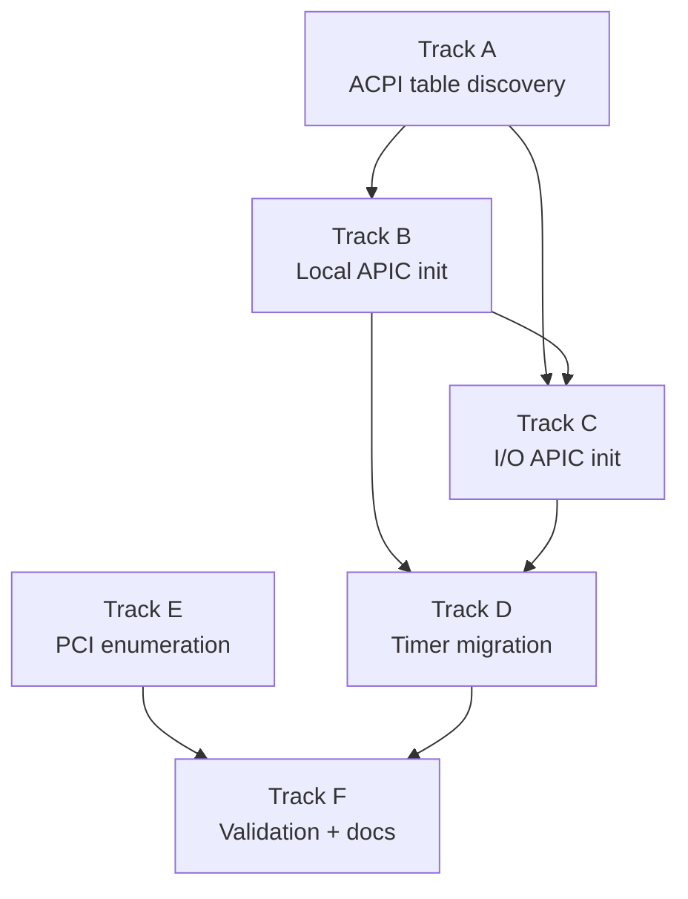

# Phase 15 — Hardware Discovery (ACPI + PCI): Task List

**Depends on:** Phase 3 (Interrupts) ✅
**Goal:** Parse ACPI tables, replace the 8259 PIC with the Local APIC + I/O APIC,
and enumerate PCI devices so later phases can discover hardware dynamically.

## Prerequisite Analysis

Current state (post-Phase 14):
- Interrupts use the **8259 PIC** (`pic8259::ChainedPics`, vectors 32–39)
- Timer IRQ (vector 32) drives the scheduler via `signal_reschedule()`
- Keyboard IRQ (vector 33) reads scancodes from PS/2 port 0x60
- EOI sent to PIC after every IRQ handler
- `BootInfo::rsdp_addr` is available from `bootloader_api` but **never read**
- Physical memory is identity-mapped at `physical_memory_offset` — MMIO pages
  can be accessed if their physical address is known
- No ACPI table parsing, no APIC code, no PCI enumeration
- Timer frequency is whatever QEMU/firmware defaults to (not programmable)

Already implemented (no new work needed):
- IDT with exception and IRQ handlers (`arch/x86_64/interrupts.rs`)
- Page-table infrastructure with `map_to()` support (`mm/paging.rs`)
- Per-process page tables with kernel half shared (`mm/mod.rs`)
- Frame allocator (`mm/frame_allocator.rs`)

## Track Layout

| Track | Scope | Dependencies |
|---|---|---|
| A | ACPI table discovery and parsing | — |
| B | Local APIC initialization | A |
| C | I/O APIC initialization | A, B |
| D | Timer migration (PIT → LAPIC timer) | B, C |
| E | PCI bus enumeration | — |
| F | Validation + documentation | B, C, D, E |

Tracks A and E are independent and can start in parallel.

---

## Track A — ACPI Table Discovery

Parse the RSDP from `BootInfo`, walk the RSDT/XSDT, and extract the MADT and
FADT tables into typed kernel structures.

| Task | Description |
|---|---|
| P15-T001 | Read `boot_info.rsdp_addr` in `kernel_main` and store the physical address in a global `Once<PhysAddr>` |
| P15-T002 | Define RSDP v1/v2 structures (`RsdpDescriptor`, `RsdpDescriptorV2`) with signature, checksum, revision, RSDT/XSDT addresses |
| P15-T003 | Implement `validate_rsdp()`: verify "RSD PTR " signature and checksum (sum of all bytes mod 256 == 0) |
| P15-T004 | Define ACPI SDT header struct (`AcpiSdtHeader`): signature, length, revision, checksum, OEM fields |
| P15-T005 | Implement `parse_rsdt()` / `parse_xsdt()`: read the root table, iterate 32-bit (RSDT) or 64-bit (XSDT) pointers to child SDTs |
| P15-T006 | Implement SDT signature lookup: given a 4-byte signature (e.g. "APIC", "FACP"), return a pointer to the matching table |
| P15-T007 | Define MADT structures: `MadtHeader`, entry types — Local APIC (type 0), I/O APIC (type 1), Interrupt Source Override (type 2) |
| P15-T008 | Implement `parse_madt()`: iterate variable-length MADT entries, collect Local APIC IDs, I/O APIC base address, and IRQ source overrides into kernel structs |
| P15-T009 | Define FADT structure (minimal): parse `FADT.IAPC_BOOT_ARCH` flags to detect whether legacy 8259 PIC is present |
| P15-T010 | Log ACPI discovery results: CPU count, APIC IDs, I/O APIC base, source overrides |

## Track B — Local APIC Initialization

Map the Local APIC MMIO registers and bring up the BSP's Local APIC.

| Task | Description |
|---|---|
| P15-T011 | Read the Local APIC base address from MADT (or MSR `IA32_APIC_BASE` 0x1B as fallback) |
| P15-T012 | Verify the LAPIC MMIO page is accessible via `physical_memory_offset` (it lives at 0xFEE0_0000 by default; the bootloader's identity map should cover it) |
| P15-T013 | Define LAPIC register offsets: ID (0x020), Version (0x030), TPR (0x080), EOI (0x0B0), Spurious (0x0F0), ICR (0x300/0x310), LVT Timer (0x320), Timer Initial Count (0x380), Timer Current Count (0x390), Timer Divide (0x3E0) |
| P15-T014 | Implement `lapic_init()`: write Spurious Interrupt Vector register to enable the LAPIC (bit 8 = 1, vector = 0xFF for spurious) |
| P15-T015 | Add a spurious interrupt handler at vector 0xFF in the IDT (no-op, no EOI) |
| P15-T016 | Implement `lapic_eoi()`: write 0 to the EOI register |

## Track C — I/O APIC Initialization

Program the I/O APIC to route keyboard and serial IRQs, then disable the
legacy 8259 PIC.

| Task | Description |
|---|---|
| P15-T017 | Read the I/O APIC base address from the MADT (typically 0xFEC0_0000) |
| P15-T018 | Implement I/O APIC register access: indirect read/write via IOREGSEL (offset 0x00) and IOWIN (offset 0x10) MMIO registers |
| P15-T019 | Read I/O APIC Version register (reg 0x01) to determine the maximum redirection entry count |
| P15-T020 | Define redirection table entry format: 64-bit — vector, delivery mode, destination mode, polarity, trigger mode, mask, destination APIC ID |
| P15-T021 | Program redirection entry for IRQ 1 (keyboard): route to BSP LAPIC ID, vector 33, edge-triggered, active-high (apply source overrides from MADT if present) |
| P15-T022 | Program redirection entry for IRQ 4 (COM1 serial): route to BSP LAPIC ID, appropriate vector, edge-triggered |
| P15-T023 | Mask all other I/O APIC redirection entries that are not in use |
| P15-T024 | Disable the legacy 8259 PIC: remap to vectors 0x20–0x2F then mask all IRQs (write 0xFF to both data ports) |
| P15-T025 | Update keyboard IRQ handler to call `lapic_eoi()` instead of PIC EOI |
| P15-T026 | Update serial IRQ handler (if present) to call `lapic_eoi()` |

## Track D — Timer Migration (PIT → LAPIC Timer)

Replace the PIT-driven scheduler timer with the Local APIC timer.

| Task | Description |
|---|---|
| P15-T027 | Calibrate the LAPIC timer: use the PIT (channel 2, one-shot) to measure LAPIC ticks per millisecond — program PIT for ~10 ms, count LAPIC ticks elapsed |
| P15-T028 | Store the calibrated ticks-per-ms value in a global for timer programming |
| P15-T029 | Configure the LAPIC timer in periodic mode: write LVT Timer register (vector 32, periodic), set divide configuration, set initial count for ~10 ms period |
| P15-T030 | Update the timer IRQ handler (vector 32) to call `lapic_eoi()` instead of PIC EOI |
| P15-T031 | Verify `TICK_COUNT` still increments and `signal_reschedule()` still fires |
| P15-T032 | Stop the PIT after LAPIC timer is running (disable PIT channel 0 or just let it fire into a masked PIC vector) |

## Track E — PCI Bus Enumeration

Scan PCI configuration space via legacy port I/O and build a device list.

| Task | Description |
|---|---|
| P15-T033 | Implement `pci_config_read_u32(bus, device, function, offset)`: write address to port 0xCF8, read data from port 0xCFC |
| P15-T034 | Implement `pci_config_read_u16` and `pci_config_read_u8` helpers (extract from the u32 read) |
| P15-T035 | Define `PciDevice` struct: bus, device, function, vendor_id, device_id, class_code, subclass, prog_if, header_type, bars (6 × u32), interrupt_line, interrupt_pin |
| P15-T036 | Implement `pci_scan()`: iterate bus 0–255, device 0–31, function 0–7; skip if vendor_id == 0xFFFF; check header type bit 7 for multi-function |
| P15-T037 | For each discovered function: read class, subclass, header type, BARs, and interrupt line into `PciDevice` |
| P15-T038 | Store discovered devices in a static array (`[Option<PciDevice>; MAX_PCI_DEVICES]`) with a device count |
| P15-T039 | Expose `pci_device_list() -> &[PciDevice]` read-only accessor for other kernel subsystems |
| P15-T040 | Log the full PCI device list at boot: bus:dev.fn, vendor:device, class/subclass |

## Track F — Validation and Documentation

| Task | Description |
|---|---|
| P15-T041 | Acceptance: kernel boots using LAPIC timer for preemption instead of the PIT |
| P15-T042 | Acceptance: keyboard interrupts delivered via I/O APIC without regression (shell still works) |
| P15-T043 | Acceptance: legacy 8259 PIC is fully masked and disabled |
| P15-T044 | Acceptance: boot log prints full PCI device list with vendor ID and class codes |
| P15-T045 | Acceptance: ACPI parsing logs the CPU count and APIC IDs found in the MADT |
| P15-T046 | Acceptance: existing shell, pipes, utilities, and job control work without regression |
| P15-T047 | `cargo xtask check` passes (clippy + fmt) |
| P15-T048 | QEMU boot validation — no panics, no regressions |
| P15-T049 | Write `docs/15-hardware-discovery.md`: ACPI table chain, MADT entries, LAPIC vs I/O APIC, PCI config space, why PIC can't do SMP |

---

## Deferred Until Later

These items are explicitly out of scope for Phase 15:

- ACPI AML interpreter and dynamic hardware events
- PCIe extended config space via MCFG (MMIO-based)
- MSI and MSI-X interrupt routing
- PCI device power management (D-states)
- ACPI S-states (sleep, hibernate)
- PCIe hotplug
- Application Processor (AP) startup (Phase 17: SMP)
- IOMMU / DMA remapping
- HPET as timer source
- PCI BAR MMIO mapping for specific device drivers (Phase 16: Network)

---

## Dependency Graph

## Parallelization Strategy

**Wave 1 (independent):** Tracks A and E can start simultaneously — ACPI
parsing and PCI enumeration have no shared state.
**Wave 2 (after A):** Track B (LAPIC init) needs the MADT data from Track A.
**Wave 3 (after B):** Tracks C and D depend on the LAPIC being up. C must
complete before D can fully validate (D replaces the timer, C replaces IRQ
routing — both must be done before the PIC can be disabled).
**Wave 4:** Track F (validation) after all hardware changes land.
