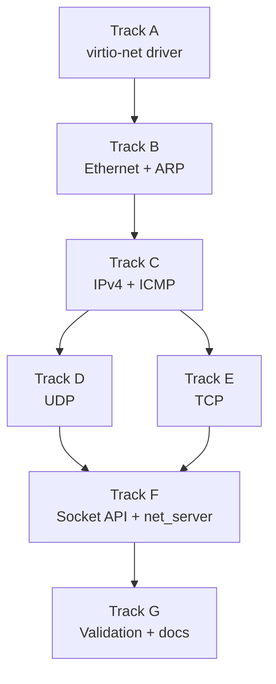

# Phase 16 — Network Stack: Task List

**Depends on:** Phase 12 (POSIX Compat) ✅, Phase 15 (Hardware Discovery) ✅
**Goal:** Implement a minimal TCP/IP network stack over virtio-net so the OS can
ping, send/receive UDP datagrams, and open/accept TCP connections.

## Prerequisite Analysis

Current state (post-Phase 15):
- PCI enumeration discovers all devices on the bus (`pci_device_list()`)
- PCI config space read helpers exist (`pci_config_read_u32/u16/u8`)
- I/O APIC routes IRQs to the BSP LAPIC; EOI via `lapic_eoi()`
- POSIX syscall layer in place (Phase 12) with `read`, `write`, `open`, `close`, etc.
- Userspace servers communicate via IPC endpoints and capabilities
- Physical memory accessible via `physical_memory_offset` for MMIO mapping
- Page capability grants available for shared-memory data transfer
- No network driver, no protocol stack, no socket API

Already implemented (no new work needed):
- PCI device scanning and device list (Phase 15)
- I/O APIC redirection table programming (Phase 15)
- POSIX syscall dispatch (`arch/x86_64/syscall.rs`)
- IPC endpoints and capability transfer (Phase 6)
- Userspace process spawning and ELF loading (Phase 11)
- Page-granularity shared memory grants (Phase 6)
- Frame allocator and page table mapping (Phase 2)

## Track Layout

| Track | Scope | Dependencies |
|---|---|---|
| A | virtio-net driver | — |
| B | Ethernet and ARP layers | A |
| C | IPv4 and ICMP | B |
| D | UDP | C |
| E | TCP | C |
| F | Socket API and net_server | D, E |
| G | Validation and documentation | F |

---

## Track A — virtio-net Driver

Initialize the virtio-net PCI device, set up virtqueues, and provide a raw
Ethernet frame send/receive interface.

| Task | Description |
|---|---|
| P16-T001 | Find the virtio-net device in the PCI device list: vendor 0x1AF4, device 0x1000 (transitional) or 0x1041 (modern); class 0x02/0x00 |
| P16-T002 | Read BARs from PCI config space to locate the virtio common configuration, notify, ISR, and device-specific regions (legacy I/O bar or modern capability-based) |
| P16-T003 | Implement virtio device reset sequence: write 0 to status register, then set ACKNOWLEDGE and DRIVER bits |
| P16-T004 | Implement feature negotiation: read device feature bits, mask to the features we support (MAC, STATUS, at minimum), write driver feature bits, set FEATURES_OK |
| P16-T005 | Define `Virtqueue` struct: descriptor table (16-byte entries), available ring, used ring — all page-aligned, physically contiguous allocations |
| P16-T006 | Implement `virtqueue_init(queue_index)`: read queue size, allocate descriptor/available/used ring memory, write physical addresses to the device |
| P16-T007 | Initialize virtqueue 0 (receive) and virtqueue 1 (transmit) for the virtio-net device |
| P16-T008 | Implement `virtio_net_recv()`: post receive buffers to the RX virtqueue (descriptor with write-only flag), poll or wait for used ring entries |
| P16-T009 | Implement `virtio_net_send(frame: &[u8])`: build a descriptor chain with the virtio-net header (12 bytes, zeroed for simple sends) + Ethernet frame, add to available ring, notify device |
| P16-T010 | Read the device MAC address from the device-specific configuration region |
| P16-T011 | Route the virtio-net IRQ through the I/O APIC: read the PCI interrupt line, program an I/O APIC redirection entry for it, add an IDT handler that checks the ISR status register and processes completed TX/RX descriptors |
| P16-T012 | Implement interrupt-driven receive: ISR handler signals a notification object, driver task wakes and processes received frames |

## Track B — Ethernet and ARP

Parse and construct Ethernet frames. Implement ARP for IPv4 address resolution.

| Task | Description |
|---|---|
| P16-T013 | Define `EthernetFrame` struct: destination MAC (6), source MAC (6), EtherType (2), payload, FCS (handled by hardware) |
| P16-T014 | Implement `ethernet_parse(raw: &[u8]) -> EthernetFrame`: extract header fields and payload slice |
| P16-T015 | Implement `ethernet_build(dst: MacAddr, src: MacAddr, ethertype: u16, payload: &[u8]) -> Vec<u8>`: construct a frame ready for `virtio_net_send()` |
| P16-T016 | Implement EtherType dispatch: 0x0806 → ARP handler, 0x0800 → IPv4 handler |
| P16-T017 | Define ARP packet structure: hardware type, protocol type, hw/proto lengths, operation (request=1, reply=2), sender/target hardware+protocol addresses |
| P16-T018 | Implement `arp_parse(payload: &[u8]) -> ArpPacket` and `arp_build(op, sender_mac, sender_ip, target_mac, target_ip) -> Vec<u8>` |
| P16-T019 | Implement ARP cache: fixed-size array of `(Ipv4Addr, MacAddr, tick_count)` entries with LRU eviction |
| P16-T020 | Implement `arp_resolve(target_ip) -> Option<MacAddr>`: check cache, return immediately on hit |
| P16-T021 | Implement ARP request path: on cache miss, broadcast an ARP request (target MAC = FF:FF:FF:FF:FF:FF), queue the outgoing packet, and set a timeout |
| P16-T022 | Implement ARP reply handler: on receiving an ARP reply, update the cache and transmit any queued packets waiting for that address |
| P16-T023 | Implement ARP request responder: when receiving an ARP request for our IP, send an ARP reply with our MAC |

## Track C — IPv4 and ICMP

Send and receive IPv4 packets. Implement ICMP echo for `ping`.

| Task | Description |
|---|---|
| P16-T024 | Define `Ipv4Header` struct: version/IHL, DSCP/ECN, total length, identification, flags/fragment offset, TTL, protocol, header checksum, source IP, destination IP |
| P16-T025 | Implement `ipv4_parse(payload: &[u8]) -> (Ipv4Header, &[u8])`: validate version==4, extract header and payload |
| P16-T026 | Implement IPv4 header checksum calculation (RFC 1071): ones' complement sum of all 16-bit words in the header |
| P16-T027 | Implement `ipv4_build(src, dst, protocol, payload) -> Vec<u8>`: construct a valid IPv4 packet with computed checksum, TTL=64, no fragmentation |
| P16-T028 | Implement `ipv4_send(dst_ip, protocol, payload)`: resolve destination MAC via ARP (use gateway MAC if destination is not on the local subnet), wrap in Ethernet frame, send |
| P16-T029 | Configure the network interface with a static IP (10.0.2.15/24) and default gateway (10.0.2.2) — QEMU user-mode networking defaults |
| P16-T030 | Implement protocol dispatch on received IPv4 packets: protocol 1 → ICMP, protocol 17 → UDP, protocol 6 → TCP |
| P16-T031 | Define ICMP header struct: type, code, checksum, rest-of-header (4 bytes) |
| P16-T032 | Implement ICMP echo reply: on receiving type 8 (echo request), respond with type 0 (echo reply) using the same identifier, sequence number, and data |
| P16-T033 | Implement `ping(target_ip)`: send ICMP echo request (type 8), wait for echo reply with matching identifier and sequence number, report round-trip time |

## Track D — UDP

Minimal UDP send/receive with port multiplexing.

| Task | Description |
|---|---|
| P16-T034 | Define `UdpHeader` struct: source port (2), destination port (2), length (2), checksum (2) |
| P16-T035 | Implement `udp_parse(payload: &[u8]) -> (UdpHeader, &[u8])`: extract header and data |
| P16-T036 | Implement `udp_build(src_port, dst_port, payload) -> Vec<u8>`: construct UDP datagram with optional checksum (checksum may be zero for simplicity) |
| P16-T037 | Implement UDP port binding table: map `(protocol, local_port)` to a waiting task or ring buffer |
| P16-T038 | Implement `udp_send(dst_ip, dst_port, src_port, data)`: build UDP packet, pass to `ipv4_send()` |
| P16-T039 | Implement `udp_recv(port) -> (src_ip, src_port, data)`: block until a datagram arrives on the bound port |

## Track E — TCP

Implement the TCP state machine for a single connection at a time.

| Task | Description |
|---|---|
| P16-T040 | Define `TcpHeader` struct: source port, destination port, sequence number, acknowledgment number, data offset, flags (SYN/ACK/FIN/RST/PSH), window size, checksum, urgent pointer |
| P16-T041 | Implement TCP checksum: pseudo-header (src IP, dst IP, protocol, TCP length) + TCP header + data, ones' complement sum |
| P16-T042 | Implement `tcp_parse(payload: &[u8]) -> (TcpHeader, &[u8])` and `tcp_build(header_fields, payload) -> Vec<u8>` |
| P16-T043 | Define `TcpState` enum: `Closed`, `Listen`, `SynSent`, `SynReceived`, `Established`, `FinWait1`, `FinWait2`, `CloseWait`, `LastAck`, `TimeWait` |
| P16-T044 | Define `TcpConnection` struct: local/remote IP+port, state, send sequence variables (SND.UNA, SND.NXT, SND.WND), receive sequence variables (RCV.NXT, RCV.WND), send/receive buffers |
| P16-T045 | Implement active open (client connect): send SYN, transition to `SynSent`, on SYN-ACK send ACK and transition to `Established` |
| P16-T046 | Implement passive open (server listen): on incoming SYN, send SYN-ACK, transition to `SynReceived`, on ACK transition to `Established` |
| P16-T047 | Implement data send: copy data to send buffer, construct TCP segment with current SND.NXT, advance SND.NXT, pass to `ipv4_send()` |
| P16-T048 | Implement data receive: on incoming data segment, validate sequence number against RCV.NXT, copy payload to receive buffer, advance RCV.NXT, send ACK |
| P16-T049 | Implement connection close (active): send FIN → `FinWait1` → receive ACK → `FinWait2` → receive FIN → send ACK → `TimeWait` → `Closed` |
| P16-T050 | Implement connection close (passive): receive FIN → send ACK → `CloseWait` → application closes → send FIN → `LastAck` → receive ACK → `Closed` |
| P16-T051 | Implement RST handling: on RST received, immediately transition to `Closed` and signal error to application |
| P16-T052 | Implement simple flow control: honor the receiver's advertised window, do not send beyond SND.UNA + SND.WND |

## Track F — Socket API and net_server

Expose the network stack as a userspace server with BSD socket syscalls.

| Task | Description |
|---|---|
| P16-T053 | Create `userspace/net_server` crate: a `no_std` userspace binary that owns the entire network stack |
| P16-T054 | Establish a shared-memory region between the kernel's virtio-net driver and net_server using page capability grants for zero-copy frame delivery |
| P16-T055 | Implement the net_server main loop: receive raw frames from the driver via shared memory notification, dispatch through Ethernet → IP → TCP/UDP layers |
| P16-T056 | Define socket syscall numbers: `sys_socket`, `sys_bind`, `sys_connect`, `sys_listen`, `sys_accept`, `sys_send`, `sys_recv`, `sys_sendto`, `sys_recvfrom`, `sys_close` (reuse existing close) |
| P16-T057 | Implement `sys_socket(domain, type, protocol)`: allocate a socket descriptor (capability), create an IPC endpoint to net_server |
| P16-T058 | Implement `sys_bind(sockfd, addr, port)`: send bind request to net_server via IPC, register the local address/port |
| P16-T059 | Implement `sys_connect(sockfd, addr, port)`: send connect request to net_server, block until TCP handshake completes (or UDP "connect" just sets the default destination) |
| P16-T060 | Implement `sys_listen(sockfd, backlog)` and `sys_accept(sockfd)`: for TCP servers, put socket in listen state, accept returns a new connected socket descriptor |
| P16-T061 | Implement `sys_send(sockfd, buf, len)` / `sys_recv(sockfd, buf, len)`: for connected TCP/UDP sockets, transfer data via IPC to/from net_server |
| P16-T062 | Implement `sys_sendto` / `sys_recvfrom`: for unconnected UDP sockets, include destination/source address in the IPC message |
| P16-T063 | Add `ping` as a shell built-in or userspace utility: parse target IP, call ICMP echo via net_server, display RTT |
| P16-T064 | Add a simple `nc`-like utility for testing: `nc <ip> <port>` opens a TCP connection, pipes stdin/stdout |

## Track G — Validation and Documentation

| Task | Description |
|---|---|
| P16-T065 | Acceptance: QEMU boots with virtio-net device detected and initialized (MAC address logged) |
| P16-T066 | Acceptance: `ping 10.0.2.2` receives ICMP echo replies from the QEMU gateway |
| P16-T067 | Acceptance: a UDP echo client sends a datagram and receives it back via QEMU user-mode networking |
| P16-T068 | Acceptance: a TCP client inside the OS connects to a host listener, exchanges a line of text, and closes cleanly |
| P16-T069 | Acceptance: a TCP server inside the OS accepts a connection from the host |
| P16-T070 | Acceptance: existing shell, pipes, utilities, and job control work without regression |
| P16-T071 | `cargo xtask check` passes (clippy + fmt) |
| P16-T072 | QEMU boot validation — no panics, no regressions |
| P16-T073 | Write `docs/16-network.md`: virtio transport (descriptor rings, available/used ring), Ethernet/ARP/IP/TCP/UDP layering, TCP state machine diagram, socket API routing via IPC, ARP cache design |

---

## Deferred Until Later

These items are explicitly out of scope for Phase 16:

- TCP retransmission timer and congestion control (CUBIC, BBR)
- IPv6
- DNS resolution
- TLS / DTLS
- `epoll` / `select` / `poll` for non-blocking socket I/O
- Multiple simultaneous TCP connections
- Checksum offload via virtio features
- DHCP client (static IP configuration only)
- Scatter-gather DMA
- VLAN tagging
- Zero-copy sendmsg/recvmsg

---

## Dependency Graph

## Parallelization Strategy

**Wave 1:** Track A — virtio-net driver initialization is the foundation; no other
track can start until raw frame send/receive works.
**Wave 2 (after A):** Track B — Ethernet framing and ARP must be in place before
any IP-level work.
**Wave 3 (after B):** Track C — IPv4 and ICMP. This is the first testable
milestone (`ping` should work after this track).
**Wave 4 (after C):** Tracks D and E can proceed in parallel — UDP and TCP both
build on IPv4 but are independent of each other.
**Wave 5 (after D + E):** Track F — the socket API and net_server tie everything
together.
**Wave 6:** Track G — validation after all protocol layers are in place.
