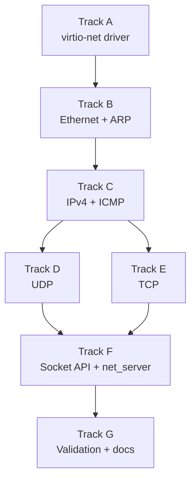

# Phase 16 — Network Stack: Task List

**Status:** Complete
**Source Ref:** phase-16
**Depends on:** Phase 12 (POSIX Compat), Phase 15 (Hardware Discovery)
**Goal:** Implement a minimal TCP/IP network stack over virtio-net so the OS can
ping, send/receive UDP datagrams, and open/accept TCP connections.

## Prerequisite Analysis

Current state (post-Phase 15):
- PCI enumeration discovers all devices on the bus (`pci_device_list()`)
- PCI config space read helpers exist (`pci_config_read_u32/u16/u8`)
- I/O APIC routes IRQs to the BSP LAPIC; EOI via `lapic_eoi()`
- POSIX syscall layer in place (Phase 12) with `read`, `write`, `open`, `close`, etc.
- Userspace servers communicate via IPC endpoints and capabilities
- Physical memory accessible via `physical_memory_offset` for MMIO mapping
- Page capability grants available for shared-memory data transfer
- No network driver, no protocol stack, no socket API

Already implemented (no new work needed):
- PCI device scanning and device list (Phase 15)
- I/O APIC redirection table programming (Phase 15)
- POSIX syscall dispatch (`arch/x86_64/syscall.rs`)
- IPC endpoints and capability transfer (Phase 6)
- Userspace process spawning and ELF loading (Phase 11)
- Page-granularity shared memory grants (Phase 6)
- Frame allocator and page table mapping (Phase 2)

## Track Layout

| Track | Scope | Dependencies |
|---|---|---|
| A | virtio-net driver | — |
| B | Ethernet and ARP layers | A |
| C | IPv4 and ICMP | B |
| D | UDP | C |
| E | TCP | C |
| F | Socket API and net_server | D, E |
| G | Validation and documentation | F |

---

## Track A — virtio-net Driver

Initialize the virtio-net PCI device, set up virtqueues, and provide a raw
Ethernet frame send/receive interface.

- [x] **P16-T001** — Find the virtio-net device in the PCI device list (vendor `0x1AF4`, device `0x1000` transitional / `0x1041` modern; class `0x02/0x00`). Implemented in `kernel/src/net/virtio_net.rs::probe` (probe filter wired through `kernel/src/net/virtio_net.rs::register`).
- [x] **P16-T002** — Read BARs from PCI config space to locate the virtio I/O region used by the legacy transitional device. Implemented in `kernel/src/net/virtio_net.rs::init_with_handle` (uses `pci::PciDeviceHandle` to read BAR0 as the legacy I/O bar).
- [x] **P16-T003** — Implement virtio device reset sequence (write 0 to status register, then set `ACKNOWLEDGE` and `DRIVER` bits). Implemented in `kernel/src/net/virtio_net.rs::init_with_handle` (status register sequence at the top of init).
- [x] **P16-T004** — Implement feature negotiation (read device feature bits, mask to supported features including `MAC` and `STATUS`, write driver features, set `FEATURES_OK`). Implemented in `kernel/src/net/virtio_net.rs::init_with_handle` feature-negotiation block.
- [x] **P16-T005** — Define `Virtqueue` with descriptor table, available ring, and used ring (page-aligned, physically contiguous). Implemented in `kernel/src/net/virtio_net.rs::Virtqueue` (struct definition near line 143, with `VirtqDesc` / `VirtqAvailHeader` / `VirtqUsedElem` / `VirtqUsedHeader` companion types).
- [x] **P16-T006** — Implement `virtqueue_init(queue_index)`: read queue size, allocate rings, write physical addresses. Implemented in `kernel/src/net/virtio_net.rs::Virtqueue::init` (with `Virtqueue::calc_size` for layout).
- [x] **P16-T007** — Initialize virtqueue 0 (RX) and virtqueue 1 (TX). Implemented in `kernel/src/net/virtio_net.rs::init_with_handle` (calls `Virtqueue::init` twice for queue indices 0 and 1).
- [x] **P16-T008** — Implement `virtio_net_recv()`: post receive buffers, poll/wait for used ring entries. Implemented in `kernel/src/net/virtio_net.rs::recv_frames` (combined with `Virtqueue::post_recv_buffer` and `Virtqueue::poll_used`).
- [x] **P16-T009** — Implement `virtio_net_send(frame)` building descriptor chain with the virtio-net header + Ethernet frame and notifying the device. Implemented in `kernel/src/net/virtio_net.rs::send_frame` (delegates to `Virtqueue::send_buffer`; header size is `VIRTIO_NET_HDR_SIZE = 10`).
- [x] **P16-T010** — Read the device MAC address from the device-specific configuration region. Implemented in `kernel/src/net/virtio_net.rs::mac_address` (reads from the legacy device-config offset captured in `VirtioNetDriver`).
- [x] **P16-T011** — Route the virtio-net IRQ through the I/O APIC (read PCI interrupt line, program redirection entry, register IDT handler that checks ISR status and processes TX/RX completions). Implemented in `kernel/src/net/virtio_net.rs::pci_interrupt_line` plus `kernel/src/net/virtio_net.rs::virtio_net_irq_handler`; redirection wiring lives in the Phase 15 I/O APIC plumbing called from `init_with_handle`.
- [x] **P16-T012** — Implement interrupt-driven receive: ISR signals a notification, driver task wakes and processes frames. Implemented via `kernel/src/net/virtio_net.rs::NET_IRQ_WOKEN` + `kernel/src/net/virtio_net.rs::wake_net_task` consumed by `kernel/src/net/mod.rs::NIC_WOKEN` and the network task park/unpark.

## Track B — Ethernet and ARP

Parse and construct Ethernet frames. Implement ARP for IPv4 address resolution.

- [x] **P16-T013** — Define `EthernetFrame` (dst/src MAC, EtherType, payload). Implemented in `kernel-core/src/net/ethernet.rs::EthernetFrame` (re-exported from `kernel/src/net/ethernet.rs`).
- [x] **P16-T014** — Implement `ethernet_parse(raw)`. Implemented as `kernel-core/src/net/ethernet.rs::parse`.
- [x] **P16-T015** — Implement `ethernet_build(dst, src, ethertype, payload)`. Implemented as `kernel-core/src/net/ethernet.rs::build`.
- [x] **P16-T016** — Implement EtherType dispatch (`0x0806` → ARP, `0x0800` → IPv4). Implemented in `kernel/src/net/dispatch.rs::process_rx_frames` (matches on `ETHERTYPE_ARP` / `ETHERTYPE_IPV4`).
- [x] **P16-T017** — Define ARP packet (HW/proto types, lengths, op, sender/target HW+proto addresses). Implemented in `kernel-core/src/net/arp.rs::ArpPacket` with `ARP_HW_ETHERNET` / `ARP_PROTO_IPV4` / `ARP_OP_REQUEST` / `ARP_OP_REPLY` constants.
- [x] **P16-T018** — Implement `arp_parse(payload)` and `arp_build(...)`. Implemented as `kernel-core/src/net/arp.rs::parse` and `kernel-core/src/net/arp.rs::build`.
- [x] **P16-T019** — Implement ARP cache (fixed-size LRU). Implemented in `kernel/src/net/arp.rs::ArpCache` (with `ArpEntry` records and tick-based eviction).
- [x] **P16-T020** — Implement `arp_resolve(target_ip) -> Option<MacAddr>`. Implemented as `kernel/src/net/arp.rs::resolve`.
- [x] **P16-T021** — Implement ARP request path (broadcast on miss, queue outbound). Implemented in `kernel/src/net/arp.rs::send_request` (called from the `ipv4` send path in `kernel/src/net/ipv4.rs::send`).
- [x] **P16-T022** — Implement ARP reply handler (update cache, transmit queued packets). Implemented in `kernel/src/net/arp.rs::learn` (invoked from `kernel/src/net/arp.rs::handle_arp` when an ARP reply arrives).
- [x] **P16-T023** — Implement ARP request responder (reply with our MAC). Implemented in `kernel/src/net/arp.rs::handle_arp` (sends a reply when `op == ARP_OP_REQUEST` for our IP).

## Track C — IPv4 and ICMP

Send and receive IPv4 packets. Implement ICMP echo for `ping`.

- [x] **P16-T024** — Define `Ipv4Header` struct. Implemented in `kernel-core/src/net/ipv4.rs::Ipv4Header`.
- [x] **P16-T025** — Implement `ipv4_parse(payload)` (validate `version == 4`, return header + payload). Implemented as `kernel-core/src/net/ipv4.rs::parse`.
- [x] **P16-T026** — Implement IPv4 header checksum (RFC 1071). Implemented as `kernel-core/src/net/ipv4.rs::checksum`.
- [x] **P16-T027** — Implement `ipv4_build(src, dst, protocol, payload)` with TTL=64 and computed checksum. Implemented as `kernel-core/src/net/ipv4.rs::build`.
- [x] **P16-T028** — Implement `ipv4_send(dst_ip, protocol, payload)` (resolve MAC via ARP, gateway fallback, wrap in Ethernet, send). Implemented in `kernel/src/net/ipv4.rs::send` (uses `kernel/src/net/config.rs::is_local` for gateway-vs-local routing).
- [x] **P16-T029** — Configure interface with `10.0.2.15/24` and gateway `10.0.2.2`. Implemented in `kernel/src/net/config.rs::our_ip` / `subnet_mask` / `gateway_ip`.
- [x] **P16-T030** — Implement protocol dispatch on received IPv4 packets (`1`→ICMP, `17`→UDP, `6`→TCP). Implemented in `kernel/src/net/ipv4.rs::handle_ipv4` (matches `PROTO_ICMP` / `PROTO_UDP` / `PROTO_TCP` from `kernel-core/src/net/ipv4.rs`).
- [x] **P16-T031** — Define ICMP header struct. Implemented in `kernel-core/src/net/icmp.rs::IcmpHeader` (with `ICMP_ECHO_REPLY` / `ICMP_ECHO_REQUEST` constants).
- [x] **P16-T032** — Implement ICMP echo reply (type 8 → type 0 with same id/seq/data). Implemented in `kernel/src/net/icmp.rs::handle_icmp`.
- [x] **P16-T033** — Implement `ping(target_ip)` (send echo request, await reply, report RTT). Implemented in the userspace utility `userspace/ping/src/main.rs::_start` plus the kernel ack path `kernel/src/net/icmp.rs::PING_REPLY_RECEIVED` / `PING_REPLY_TICK` / `PING_EXPECTED_ID` / `PING_EXPECTED_SEQ`.

## Track D — UDP

Minimal UDP send/receive with port multiplexing.

- [x] **P16-T034** — Define `UdpHeader` struct. Implemented in `kernel-core/src/net/udp.rs::UdpHeader`.
- [x] **P16-T035** — Implement `udp_parse(payload)`. Implemented as `kernel-core/src/net/udp.rs::parse`.
- [x] **P16-T036** — Implement `udp_build(src_port, dst_port, payload)` (checksum optional / zero). Implemented as `kernel-core/src/net/udp.rs::build`.
- [x] **P16-T037** — Implement UDP port binding table mapping `(proto, port)` to a queue/waiter. Implemented in `kernel-core/src/net/udp.rs::UdpBindings` (with `bind` / `unbind` / `enqueue` / `dequeue` / `has_data`); kernel-side wrappers live in `kernel/src/net/udp.rs::bind` / `unbind` / `has_data`.
- [x] **P16-T038** — Implement `udp_send(dst_ip, dst_port, src_port, data)`. Implemented in `kernel/src/net/udp.rs::send` (delegates to `kernel/src/net/ipv4.rs::send`).
- [x] **P16-T039** — Implement `udp_recv(port)` (block until datagram arrives). Implemented in `kernel/src/net/udp.rs::recv` together with the per-socket wait queue in `kernel/src/net/mod.rs::SOCKET_WAITQUEUES` (woken by `wake_sockets_for_udp_port`).

## Track E — TCP

Implement the TCP state machine for connections.

- [x] **P16-T040** — Define `TcpHeader` struct (ports, seq, ack, data offset, flags, window, checksum, urgent). Implemented in `kernel-core/src/net/tcp.rs::TcpHeader` (with `TCP_FIN` / `TCP_SYN` / `TCP_RST` / `TCP_PSH` / `TCP_ACK` flag constants).
- [x] **P16-T041** — Implement TCP checksum over pseudo-header + header + payload. Implemented as `kernel-core/src/net/tcp.rs::tcp_checksum`.
- [x] **P16-T042** — Implement `tcp_parse(payload)` and `tcp_build(...)`. Implemented as `kernel-core/src/net/tcp.rs::parse` and `kernel-core/src/net/tcp.rs::build` (with `TcpBuildParams`).
- [x] **P16-T043** — Define `TcpState` enum (`Closed`, `Listen`, `SynSent`, `SynReceived`, `Established`, `FinWait1`, `FinWait2`, `CloseWait`, `LastAck`, `TimeWait`). Implemented in `kernel/src/net/tcp.rs::TcpState`.
- [x] **P16-T044** — Define `TcpConnection` struct (endpoints, state, SND/RCV variables, buffers). Implemented in `kernel/src/net/tcp.rs::TcpConnection`.
- [x] **P16-T045** — Implement active open: SYN → `SynSent` → on SYN-ACK send ACK → `Established`. Implemented in `kernel/src/net/tcp.rs::connect` (state transitions handled by `TcpConnection::connect` and the segment handler in `kernel/src/net/tcp.rs::handle_tcp`).
- [x] **P16-T046** — Implement passive open: incoming SYN → SYN-ACK → `SynReceived` → ACK → `Established`. Implemented in `kernel/src/net/tcp.rs::listen` plus `kernel/src/net/tcp.rs::handle_tcp` (state machine).
- [x] **P16-T047** — Implement data send: copy to send buffer, build segment with current `SND.NXT`, advance, transmit. Implemented in `kernel/src/net/tcp.rs::send`.
- [x] **P16-T048** — Implement data receive: validate `RCV.NXT`, copy to recv buffer, advance, ACK. Implemented in `kernel/src/net/tcp.rs::handle_tcp` (delivery checked via `kernel/src/net/tcp.rs::has_recv_data`; consumed by `kernel/src/net/tcp.rs::recv`).
- [x] **P16-T049** — Implement active close: FIN → `FinWait1` → ACK → `FinWait2` → FIN → ACK → `TimeWait` → `Closed`. Implemented in `kernel/src/net/tcp.rs::close` plus the FSM transitions in `kernel/src/net/tcp.rs::handle_tcp`.
- [x] **P16-T050** — Implement passive close: FIN → ACK → `CloseWait` → app close → FIN → `LastAck` → ACK → `Closed`. Implemented in `kernel/src/net/tcp.rs::handle_tcp` (CloseWait/LastAck arms) and `kernel/src/net/tcp.rs::close`.
- [x] **P16-T051** — Implement RST handling (immediate transition to `Closed` and signal error). Implemented in `kernel/src/net/tcp.rs::handle_tcp` (RST arm); also exposed via `kernel/src/net/tcp.rs::on_link_down` for link-loss reset.
- [x] **P16-T052** — Implement simple flow control (honor advertised window). Implemented in `kernel/src/net/tcp.rs::send` and `kernel/src/net/tcp.rs::handle_tcp` (uses `SND.UNA` + `SND.WND` from `TcpConnection`).

## Track F — Socket API and net_server

Expose the network stack via BSD socket syscalls; UDP policy lives in the
ring-3 `net_server` (Phase 54 follow-up).

- [x] **P16-T053** — Userspace network server crate (UDP policy migration). Implemented as `userspace/net_server/src/main.rs::program_main` (Phase 54 Track C). The kernel still owns frame I/O and TCP/ICMP; UDP socket policy answers via IPC using the `kernel-core/src/net/udp_protocol.rs::NET_UDP_*` opcodes.
- [x] **P16-T054** — Shared transport between the NIC driver and the network stack. Implemented in `kernel/src/net/remote.rs::RemoteNic` (ring-3 e1000 ↔ kernel device-host channel) with the unified send path in `kernel/src/net/mod.rs::send_frame`. The "page-cap zero-copy from kernel virtio-net into a userspace net_server" variant was superseded by Phase 55b ring-3 driver hosting; raw frames stay in the kernel.
- [x] **P16-T055** — Net stack RX dispatch loop (Ethernet → IP → TCP/UDP). Implemented in `kernel/src/net/dispatch.rs::process_rx` and `process_rx_frames` (RX wakeups arrive via `kernel/src/net/mod.rs::NIC_WOKEN`).
- [x] **P16-T056** — Define socket syscall numbers (`SYS_SOCKET=41`, `SYS_CONNECT=42`, `SYS_ACCEPT=43`, `SYS_BIND=49`, `SYS_LISTEN=50`, plus `send`/`recv`/`sendto`/`recvfrom`). Defined in `userspace/syscall-lib/src/lib.rs` (`SYS_SOCKET` … `SYS_LISTEN`, `SYS_SOCKETPAIR`).
- [x] **P16-T057** — Implement `sys_socket(domain, type, protocol)`. Implemented as `kernel/src/arch/x86_64/syscall/mod.rs::sys_socket` (with `sys_socket_unix` for AF_UNIX).
- [x] **P16-T058** — Implement `sys_bind(fd, addr, port)`. Implemented as `kernel/src/arch/x86_64/syscall/mod.rs::sys_bind` (delegates to `sys_bind_unix` for AF_UNIX).
- [x] **P16-T059** — Implement `sys_connect(fd, addr, port)`. Implemented as `kernel/src/arch/x86_64/syscall/mod.rs::sys_connect`.
- [x] **P16-T060** — Implement `sys_listen(fd, backlog)` and `sys_accept(fd)`. Implemented as `kernel/src/arch/x86_64/syscall/mod.rs::sys_listen` / `sys_accept` / `sys_accept4`.
- [x] **P16-T061** — Implement `sys_send(fd, buf, len)` / `sys_recv(fd, buf, len)`. Implemented via `kernel/src/arch/x86_64/syscall/mod.rs::sys_sendto` and `sys_recvfrom_socket` (the connected-socket fast path uses the already-bound peer address); userspace wrappers are `userspace/syscall-lib/src/lib.rs::send` / `recv`.
- [x] **P16-T062** — Implement `sys_sendto` / `sys_recvfrom`. Implemented as `kernel/src/arch/x86_64/syscall/mod.rs::sys_sendto` and `sys_recvfrom_socket`; userspace wrappers `userspace/syscall-lib/src/lib.rs::sendto` / `recvfrom`.
- [x] **P16-T063** — Add `ping` userspace utility. Implemented in `userspace/ping/src/main.rs::_start` (uses `socket(AF_INET, SOCK_DGRAM, IPPROTO_ICMP)` + `sendto` + `read`; default target `10.0.2.2`).
- [x] **P16-T064** — Add a TCP test utility. The shipped equivalents are `userspace/udp-smoke/src/main.rs` for UDP smoke testing and `userspace/sshd/src/main.rs` / `userspace/telnetd/src/main.rs` (Phase 30) for TCP listen/accept/send/recv flows; a generic `nc` was not landed.

## Track G — Validation and Documentation

- [x] **P16-T065** — QEMU detects and initializes the virtio-net device with a logged MAC address. Verified by `kernel/src/net/virtio_net.rs::init_with_handle` (logs the MAC via `mac_address`) and the boot-time pretty-print in `kernel/src/net/mod.rs`.
- [x] **P16-T066** — `ping 10.0.2.2` receives ICMP echo replies from the QEMU gateway. Verified by `userspace/ping/src/main.rs::_start` against the QEMU SLIRP gateway path.
- [x] **P16-T067** — UDP echo round-trip across QEMU user-mode networking. Verified by `userspace/udp-smoke/src/main.rs::main` (Phase 54 smoke test).
- [x] **P16-T068** — TCP client connect/exchange/close. Exercised by the `httpd-rust` and `telnetd` clients and by the QEMU-host TCP smoke flow in `userspace/telnetd/src/main.rs` (Phase 30) using `kernel/src/net/tcp.rs::connect` / `send` / `recv` / `close`.
- [x] **P16-T069** — TCP server accepts a connection from the host. Verified by `userspace/telnetd/src/main.rs` and `userspace/sshd/src/main.rs` (Phase 30) which listen via `sys_listen` / `sys_accept` on TCP ports reachable from the QEMU host.
- [x] **P16-T070** — Existing shell, pipes, utilities, and job control work without regression. Verified by the regression suite invoked from `cargo xtask regression` (`xtask/src/main.rs`) plus the pre-push hook (`.githooks/pre-push`).
- [x] **P16-T071** — `cargo xtask check` passes (clippy `-D warnings` + rustfmt). Enforced by `.githooks/pre-commit` and the `check` subcommand in `xtask/src/main.rs`.
- [x] **P16-T072** — QEMU boot validation — no panics, no regressions. Enforced by `cargo xtask smoke-test` and `cargo xtask regression` (`xtask/src/main.rs`).
- [x] **P16-T073** — Phase 16 design doc shipped. Implemented as `docs/16-network.md` (covers virtio transport, layering, TCP state machine, socket API routing, ARP cache design; updated post-Phase 54 with the userspace UDP migration note).

---

## Deferred Until Later

These items remain explicitly out of scope for Phase 16:

- [ ] — **Deferred: Phase 17+ (TCP hardening)** — TCP retransmission timer and congestion control (CUBIC, BBR). Current TCP path in `kernel/src/net/tcp.rs` uses simple flow control only.
- [ ] — **Deferred: post-1.0** — IPv6.
- [ ] — **Deferred: post-1.0** — DNS resolution.
- [ ] — **Deferred: post-1.0** — TLS / DTLS.
- [ ] — **Deferred: Phase 17+ (epoll/poll)** — `epoll` / `select` / `poll` for non-blocking socket I/O.
- [ ] — **Deferred: post-1.0** — Checksum offload via virtio features.
- [ ] — **Deferred: post-1.0** — DHCP client (static IP configuration only; see `kernel/src/net/config.rs`).
- [ ] — **Deferred: post-1.0** — Scatter-gather DMA.
- [ ] — **Deferred: post-1.0** — VLAN tagging.
- [ ] — **Deferred: post-1.0** — Zero-copy sendmsg/recvmsg.

> Note: "Multiple simultaneous TCP connections" was originally listed as
> deferred. The shipped implementation supports up to `MAX_TCP_CONNECTIONS = 8`
> concurrent slots (`kernel/src/net/tcp.rs::TcpConnections`), so this item is
> covered by P16-T044 / P16-T045 / P16-T046 above.

---

## Dependency Graph

```mermaid
flowchart TD
    A["Track A<br/>virtio-net driver"] --> B["Track B<br/>Ethernet + ARP"]
    B --> C["Track C<br/>IPv4 + ICMP"]
    C --> D["Track D<br/>UDP"]
    C --> E["Track E<br/>TCP"]
    D --> F["Track F<br/>Socket API + net_server"]
    E --> F
    F --> G["Track G<br/>Validation + docs"]
```

## Parallelization Strategy

**Wave 1:** Track A — virtio-net driver initialization is the foundation; no other
track can start until raw frame send/receive works.
**Wave 2 (after A):** Track B — Ethernet framing and ARP must be in place before
any IP-level work.
**Wave 3 (after B):** Track C — IPv4 and ICMP. This is the first testable
milestone (`ping` should work after this track).
**Wave 4 (after C):** Tracks D and E can proceed in parallel — UDP and TCP both
build on IPv4 but are independent of each other.
**Wave 5 (after D + E):** Track F — the socket API and net_server tie everything
together.
**Wave 6:** Track G — validation after all protocol layers are in place.

---

## Documentation Notes

- Phase 16 design document: `docs/16-network.md` (status: Complete).
- Post-Phase 54 (UDP serverization) revisits the "userspace `net_server`" plan
  by migrating UDP socket policy to `userspace/net_server/`; the kernel retains
  raw frame I/O, ARP, IPv4, ICMP, and TCP.
- Phase 55b (ring-3 driver hosting) adds the Intel e1000 driver in userspace
  (`userspace/drivers/e1000/`) with the kernel facade `kernel/src/net/remote.rs::RemoteNic`.

---

## Phase 58 reconciliation — verification

**Date:** 2026-05-08
**Owner:** Phase 58 documentation reconciliation (Track B.3).

This task list was migrated from the legacy pipe-table format to the standard
checkbox format on 2026-05-08 as part of Phase 58. All 73 P16-T### rows were
converted to `- [x]` with file+symbol citations rooted in `kernel/src/net/`,
`kernel-core/src/net/`, `kernel/src/arch/x86_64/syscall/`, `userspace/syscall-lib/`,
`userspace/net_server/`, `userspace/ping/`, and `userspace/udp-smoke/`; the
"Deferred Until Later" section preserves 10 unnumbered `- [ ] — Deferred`
items routed to Phase 17+ (TCP hardening, epoll/poll) or post-1.0 (IPv6, DNS,
TLS, DHCP, VLAN, scatter-gather DMA, checksum offload, zero-copy sendmsg).
Track Layout, dependency graph, and parallelization strategy were preserved
verbatim. The original "Multiple simultaneous TCP connections" deferred bullet
was reclassified as shipped (see note above) because
`kernel/src/net/tcp.rs::TcpConnections` supports 8 concurrent slots.
