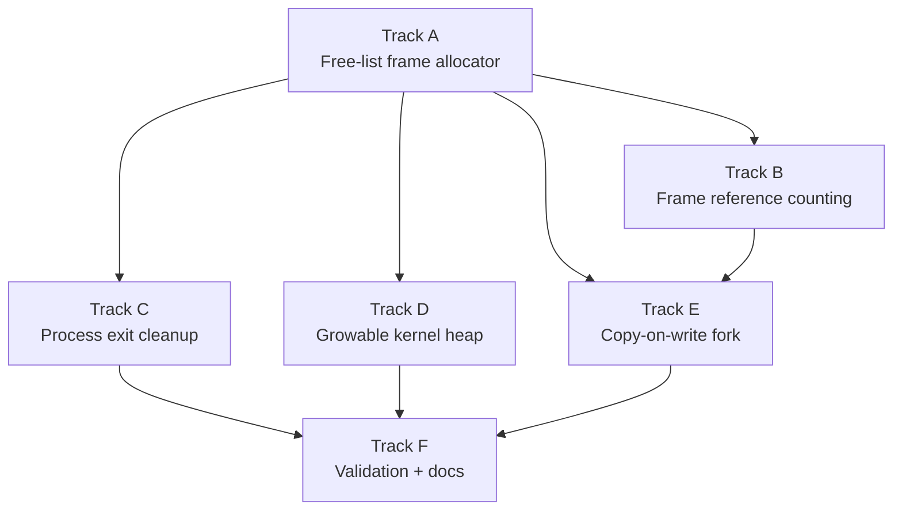

# Phase 17 — Memory Reclamation: Task List

**Depends on:** Phase 11 (Process Model) ✅, Phase 14 (Shell and Tools) ✅
**Goal:** Replace the bump frame allocator with a free-list allocator, add frame
reference counting, make the kernel heap growable, free kernel stacks on process
exit, and switch `fork` from eager full-copy to copy-on-write.

## Prerequisite Analysis

Current state (post-Phase 16):
- **Frame allocator** (`mm/frame_allocator.rs`): `BumpAllocator` that walks
  bootloader memory regions sequentially; `allocate_frame()` bumps a pointer
  forward; `free_frame()` is a no-op stub — frames are never reclaimed
- **Page table teardown** (`mm/mod.rs`): `free_process_page_table()` exists and
  walks all user-half PTEs calling `free_frame()` — but since `free_frame()` is
  a no-op, no memory is actually freed
- **Process exit** (`syscall.rs:sys_exit`): marks process as `Zombie`, restores
  kernel CR3, marks task dead — but does **not** call `free_process_page_table()`
  and does **not** free the kernel stack; both leak permanently
- **Scheduler cleanup** (`scheduler.rs:drain_dead`): removes `Dead` tasks from
  the task vec but does **not** reclaim kernel stacks (allocated via
  `Box::into_raw()` in `Task::new()`)
- **Fork** (`syscall.rs:sys_fork`): creates a new page table and calls
  `copy_user_pages()` which does a full eager copy — allocates a fresh frame for
  every user page and memcpy's 4 KiB per page; O(resident set) cost
- **Page fault handler** (`interrupts.rs`): ring-3 faults kill the process via
  `fault_kill_trampoline`; no CoW handling
- **Kernel heap** (`mm/heap.rs`): fixed 1 MiB at `HEAP_START = 0xFFFF_8000_0000_0000`;
  uses `linked_list_allocator` crate; no growth mechanism
- **Reference counting**: none — no per-frame metadata

Already implemented (no new work needed):
- Page table walking infrastructure (`OffsetPageTable`, `mapper_for_frame()`)
- `free_process_page_table()` structure (just needs working `free_frame()`)
- `restore_kernel_cr3()` for switching back to kernel page table
- `copy_from_user()` / `copy_to_user()` validation
- Process table with PID, state, exit code tracking

## Track Layout

| Track | Scope | Dependencies |
|---|---|---|
| A | Free-list frame allocator | — |
| B | Frame reference counting | A |
| C | Process exit cleanup (page table + kernel stack) | A |
| D | Growable kernel heap | A |
| E | Copy-on-write fork | A, B |
| F | Validation and documentation | C, D, E |

---

## Track A — Free-List Frame Allocator

Replace the bump allocator with a linked free-list that can both allocate and
reclaim individual 4 KiB frames.

| Task | Description |
|---|---|
| P17-T001 | Define `FreeListAllocator` struct: `head: Option<u64>` (physical address of first free frame), `free_count: usize`, `total_frames: usize`; each free frame stores the physical address of the next free frame in its first 8 bytes (intrusive linked list via the identity-mapped physical memory region) |
| P17-T002 | Implement `FreeListAllocator::init(regions)`: walk all `Usable` memory regions from the bootloader, skip frames below `ALLOC_MIN_ADDR` (1 MiB), push each frame onto the free list by writing the current `head` into the frame's first 8 bytes and updating `head`; count total frames |
| P17-T003 | Implement `allocate_frame() -> Option<PhysFrame>`: pop `head` from the free list — read the next pointer from `head`'s first 8 bytes, update `head`, decrement `free_count`, return the frame |
| P17-T004 | Implement `free_frame(phys: u64)`: push the frame back onto the free list — write `head` into the frame's first 8 bytes, set `head = phys`, increment `free_count` |
| P17-T005 | Add double-free detection: write a magic value (e.g., `0xDEAD_FRAME_FREE_LIST`) into bytes 8..16 of each free frame; on `free_frame()`, check if the magic is already present and panic with a diagnostic message if so |
| P17-T006 | Replace the `BumpAllocator` in `FRAME_ALLOCATOR` with `FreeListAllocator`; update the `init()`, `allocate_frame()`, and `free_frame()` public API signatures (the public interface stays the same) |
| P17-T007 | Add `pub fn free_count() -> usize` and `pub fn total_frames() -> usize` accessors for diagnostics and acceptance testing |
| P17-T008 | Log frame allocator stats at boot: total usable frames, initial free count |

## Track B — Frame Reference Counting

Add a per-frame reference count so CoW pages and shared mappings can track when
a physical frame is safe to free.

| Task | Description |
|---|---|
| P17-T009 | Determine the highest physical frame number from the bootloader memory map; store as `MAX_FRAME_NUMBER` |
| P17-T010 | Allocate a `RefCount` table: a `Vec<AtomicU16>` with `MAX_FRAME_NUMBER + 1` entries, initialized to zero; allocate from the kernel heap after heap init |
| P17-T011 | Implement `refcount_inc(phys_frame)`: atomically increment the count for the given frame number; panic on overflow (> `u16::MAX`) |
| P17-T012 | Implement `refcount_dec(phys_frame) -> u16`: atomically decrement and return the new count; panic on underflow (decrement below 0) |
| P17-T013 | Implement `refcount_get(phys_frame) -> u16`: read the current reference count |
| P17-T014 | Hook `refcount_inc` into `allocate_frame()`: every freshly allocated frame starts with refcount 1 |
| P17-T015 | Hook `refcount_dec` into `free_frame()`: decrement the count; only push the frame onto the free list if the new count is 0; otherwise the frame is still shared and must not be freed |

## Track C — Process Exit Cleanup

Fix the two main leaks: process page table frames and kernel stacks.

| Task | Description |
|---|---|
| P17-T016 | Call `free_process_page_table()` during `sys_exit`: after `restore_kernel_cr3()`, pass the dying process's PML4 frame to the teardown function so all user pages and table frames are reclaimed |
| P17-T017 | Also call `free_process_page_table()` for processes killed by faults: update `fault_kill_trampoline` to free the page table before calling `mark_current_dead()` |
| P17-T018 | Verify `free_process_page_table()` correctly walks all four levels (PML4 → PDPT → PD → PT) for the user half (entries 0..256) and calls `free_frame()` / `refcount_dec()` on each leaf page and intermediate table frame |
| P17-T019 | Update `free_process_page_table()` to use reference counting: call `refcount_dec()` instead of unconditional `free_frame()` for leaf pages; only free when refcount reaches 0 (required for CoW correctness in Track E) |
| P17-T020 | Reclaim kernel stacks in `drain_dead()`: store the kernel stack `Box<[u8]>` (or its base address and size) in a recoverable form so that when a `Dead` task is reaped, its kernel stack memory is freed back to the heap allocator |
| P17-T021 | Verify: currently `Task::_stack` is a `Box<[u8]>` that is dropped when the `Task` is removed from the vec in `drain_dead()` — confirm this already frees the heap memory, or fix if not |

## Track D — Growable Kernel Heap

Allow the kernel heap to grow beyond its initial 1 MiB when allocations fail.

| Task | Description |
|---|---|
| P17-T022 | Increase the heap virtual region reservation: change `HEAP_SIZE` from 1 MiB to a larger reserved ceiling (e.g., `HEAP_MAX_SIZE = 64 * 1024 * 1024`) but only map the initial 1 MiB at boot |
| P17-T023 | Track the current mapped extent: add a `static HEAP_MAPPED: AtomicUsize` initialized to the initial heap size (1 MiB) |
| P17-T024 | Implement `grow_heap(additional_bytes)`: map fresh frames into the next unmapped portion of the heap virtual region via the active page table mapper, then call `ALLOCATOR.lock().extend(additional_bytes)` to tell the linked-list allocator about the new memory |
| P17-T025 | Hook the OOM path in `#[alloc_error_handler]`: instead of immediately panicking, attempt `grow_heap()` with a 1 MiB chunk; if growth succeeds, retry the allocation; if growth fails (frame allocator exhausted or max heap size reached), then panic |
| P17-T026 | Add a safety cap: panic if total heap mapped exceeds `HEAP_MAX_SIZE` to prevent runaway growth |

## Track E — Copy-on-Write Fork

Replace the eager full-copy fork with copy-on-write semantics.

| Task | Description |
|---|---|
| P17-T027 | Implement `cow_clone_user_pages(parent_cr3, child_cr3)`: walk all user PTEs in the parent's page table; for each present, writable leaf page: clear the `WRITABLE` bit in both parent and child PTEs, increment the frame's reference count, and map the same physical frame in the child's page table with the same flags (minus writable) |
| P17-T028 | Handle non-writable pages in `cow_clone`: pages that are already read-only (e.g., code segments) can be shared directly — just map the same frame in the child and increment the reference count (no flag change needed) |
| P17-T029 | Flush the parent's TLB after clearing writable bits: call `invlpg` for each modified PTE (or flush the entire TLB with a CR3 reload) to ensure the CPU does not use stale writable entries |
| P17-T030 | Replace `copy_user_pages()` call in `sys_fork` with `cow_clone_user_pages()`; remove the old `copy_user_pages()` function (or keep for reference behind `#[allow(dead_code)]` initially) |
| P17-T031 | Update the page fault handler to detect CoW faults: a ring-3 write fault where the PTE is present but not writable and the frame's reference count is > 0 indicates a CoW page (as opposed to a true protection violation) |
| P17-T032 | Implement CoW fault resolution: allocate a fresh frame, copy the 4 KiB contents from the old frame (via identity-mapped physical memory), map the new frame at the faulting address with `WRITABLE` restored, decrement the old frame's reference count (freeing it if count reaches 0) |
| P17-T033 | Handle the refcount-1 fast path: if the faulting frame's reference count is exactly 1, the current process is the sole owner — simply remap the existing frame as writable without copying or allocating |
| P17-T034 | Ensure correctness with `execve`: when `sys_execve` replaces a process image, any remaining CoW-shared pages must have their reference counts decremented; verify `free_process_page_table()` (Track C, T019) handles this |

## Track F — Validation and Documentation

| Task | Description |
|---|---|
| P17-T035 | Acceptance: `free_frame()` returns frames to the allocator; `free_count()` increases after a process exits |
| P17-T036 | Acceptance: fork 100 times and exit each child; verify `free_count()` returns to roughly its original value (within a small margin for the test process itself) |
| P17-T037 | Acceptance: a parent and forked child share physical pages (verify via `refcount_get()` > 1); the child writing to a page triggers a CoW fault and creates a private copy |
| P17-T038 | Acceptance: the kernel heap grows past 1 MiB when a large allocation is requested (e.g., `Vec::with_capacity(300_000)`) |
| P17-T039 | Acceptance: kernel stacks of exited processes are reclaimed (heap free space stabilizes after repeated fork+exit) |
| P17-T040 | Acceptance: double-free of a frame panics with a diagnostic message |
| P17-T041 | Acceptance: existing shell, pipes, utilities, and networking work without regression |
| P17-T042 | `cargo xtask check` passes (clippy + fmt) |
| P17-T043 | QEMU boot validation — no panics, no regressions |
| P17-T044 | Write `docs/17-memory.md` (or update `docs/03-memory.md`): free-list frame allocator data structure and alloc/free paths, frame reference counting and CoW interaction, copy-on-write fork step by step, heap growth strategy, kernel stack lifecycle |

---

## Deferred Until Later

These items are explicitly out of scope for Phase 17:

- Buddy allocator with power-of-two coalescing
- Slab or SLUB allocator for small kernel objects
- Demand paging from disk (swap)
- Huge page (2 MiB / 1 GiB) support
- NUMA-aware frame allocation
- `mmap(MAP_PRIVATE)` with CoW semantics for file-backed pages
- Kernel stack guard pages (unmapped page below each stack)
- Memory pressure notifications and OOM killer
- Per-process memory usage tracking and limits

---

## Dependency Graph

## Parallelization Strategy

**Wave 1:** Track A — the free-list allocator is the foundation; every other
track depends on having a working `free_frame()`.
**Wave 2 (after A):** Tracks B, C, and D can proceed in parallel — reference
counting, process exit cleanup, and heap growth are independent of each other.
Track C only needs the basic free-list (no refcounting yet for simple unshared
pages), and Track D only needs `allocate_frame()`.
**Wave 3 (after A + B):** Track E — CoW fork requires both the free-list
allocator (to allocate new frames on fault) and reference counting (to track
shared pages).
**Wave 4:** Track F — validation after all memory reclamation features are in
place.
