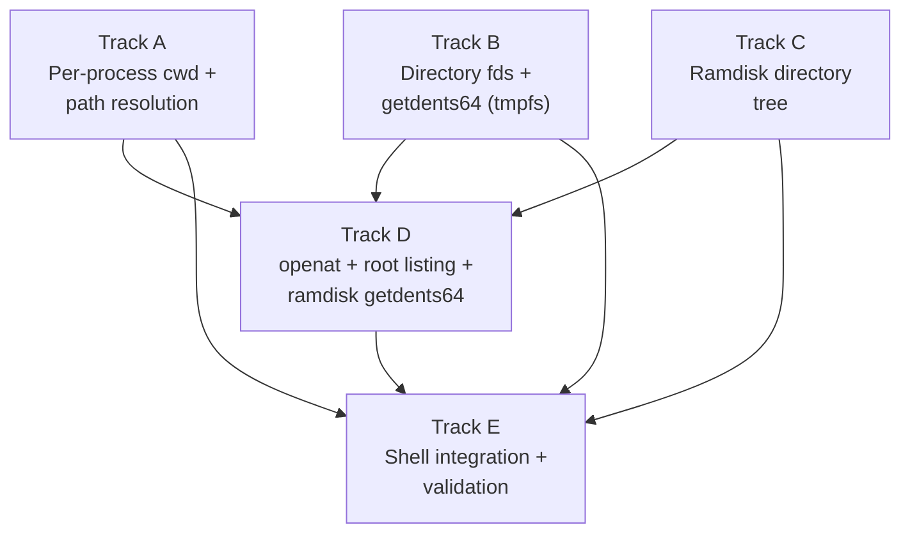

# Phase 18 — Directory and VFS: Task List

**Depends on:** Phase 17 (Memory Reclamation) ✅
**Goal:** Make the filesystem navigable with per-process working directories,
directory file descriptors, `getdents64`, hierarchical ramdisk, path resolution,
and `openat`.

## Prerequisite Analysis

Current state (post-Phase 17):
- **Process struct** (`process/mod.rs`): no `cwd` field — every process
  implicitly operates in `/`
- **FdBackend enum**: has `Stdout`, `Stdin`, `Ramdisk`, `Tmpfs`, `PipeRead`,
  `PipeWrite` — no directory variant; opening a directory returns EISDIR
- **Tmpfs** (`fs/tmpfs.rs`): tree structure with `TmpfsNode::Dir(DirData)`;
  `list_dir(path)` returns `Vec<(String, bool)>` but is unused from syscalls
- **Ramdisk** (`fs/ramdisk.rs`): flat `const FILES: &[RamdiskFile]` array with
  20 embedded files at root level; no directory hierarchy at all
- **sys_open** (`syscall.rs`): routes `/tmp/...` to tmpfs, everything else to
  ramdisk; no O_DIRECTORY support; no path resolution against cwd
- **sys_chdir**: stub that always returns 0 (no-op)
- **sys_getcwd**: stub that always returns `"/"`
- **sys_getdents64**: stub that returns ENOSYS
- **sys_openat**: dispatched (syscall 257) but ignores `dirfd` — delegates
  directly to `sys_open`
- **Path resolution**: no `resolve_path` function; relative paths not supported
- **Shell `cd`**: only updates `$PWD` environment variable; no actual chdir

Already implemented (no new work needed):
- tmpfs tree structure with `mkdir`, `rmdir`, `stat`, `list_dir`
- FD table with alloc/close/dup2 infrastructure
- `read_user_cstr` for reading paths from userspace
- `copy_to_user` / `copy_from_user` for userspace buffer I/O
- `tmpfs_relative_path` helper for `/tmp/...` routing
- Shell fork/exec pipeline with I/O redirection

## Track Layout

| Track | Scope | Dependencies |
|---|---|---|
| A | Per-process cwd + path resolution | — |
| B | Directory file descriptors + getdents64 (tmpfs) | — |
| C | Ramdisk directory tree | — |
| D | openat + cross-fs root listing + ramdisk getdents64 | A, B, C |
| E | Shell integration + validation | A, B, C, D |

---

## Track A — Per-Process Working Directory and Path Resolution

Add a `cwd` field to the process struct and implement path resolution so all
path-accepting syscalls join relative paths against the calling process's cwd.

| Task | Description |
|---|---|
| P18-T001 | Add `cwd: String` field to `Process` struct in `process/mod.rs`; initialize to `"/"` in `spawn_process()` and `spawn_process_with_cr3()` |
| P18-T002 | Copy `cwd` from parent to child in `spawn_process_with_cr3_and_fds()` (fork path) so forked children inherit the parent's working directory |
| P18-T003 | Implement `resolve_path(cwd: &str, path: &str) -> String`: if `path` starts with `/`, use it as-is; otherwise join `cwd + "/" + path`; normalize `.` and `..` components (`.` = skip, `..` = pop parent, `..` at root stays at root); collapse multiple slashes; handle empty path as `.` (current dir); ensure result starts with `/` and never ends with `/` (except for root) |
| P18-T004 | Implement `sys_chdir(path_ptr)`: read path from userspace, call `resolve_path(cwd, path)`, verify the resolved path exists and is a directory (check `/` itself, check tmpfs via `stat`, check ramdisk via the new tree), update `process.cwd` to the resolved path; return ENOENT if not found, ENOTDIR if not a directory |
| P18-T005 | Implement `sys_getcwd(buf_ptr, size)`: read current process's `cwd` from the process table, copy it (null-terminated) to userspace; return the buffer pointer on success; return ERANGE if `size` is too small |
| P18-T006 | Update `sys_open` to call `resolve_path(cwd, path)` before routing to tmpfs or ramdisk, so relative paths (e.g., `open("file.txt")` while cwd is `/tmp`) resolve correctly |
| P18-T007 | Update `sys_mkdir`, `sys_rmdir`, `sys_unlink`, `sys_rename`, `sys_stat` (and any other path-accepting syscalls) to call `resolve_path` before performing the filesystem operation |

## Track B — Directory File Descriptors and getdents64 (tmpfs)

Allow opening directories as file descriptors and implement `getdents64` for
tmpfs directories.

| Task | Description |
|---|---|
| P18-T008 | Add `FdBackend::Dir { path: String }` variant to the `FdBackend` enum in `process/mod.rs` |
| P18-T009 | Define `O_DIRECTORY = 0o200000` constant in `syscall.rs` |
| P18-T010 | Implement an `is_directory(resolved_path)` helper that checks whether a resolved absolute path is a directory across all filesystems: returns `true` for `/` itself, for tmpfs paths where `stat` shows `is_dir`, and for ramdisk paths that are directory nodes |
| P18-T011 | Update `sys_open` to handle `O_DIRECTORY`: if `O_DIRECTORY` is set, verify the target is a directory (using `is_directory`) and return an fd with `FdBackend::Dir`; return ENOTDIR if the target is a regular file. When `O_DIRECTORY` is NOT set but the target is a directory, also return a `Dir` fd (instead of the current EISDIR error) |
| P18-T012 | Define the `linux_dirent64` layout: `d_ino` (u64), `d_off` (i64), `d_reclen` (u16), `d_type` (u8), `d_name` (null-terminated variable-length); define `DT_REG = 8`, `DT_DIR = 4` constants |
| P18-T013 | Implement `sys_getdents64(fd, buf_ptr, count)` for tmpfs directories: look up the fd, verify it's `FdBackend::Dir`, call `tmpfs.list_dir(path)` to get children, serialize each entry as `linux_dirent64` into a kernel buffer, copy to userspace; use `fd.offset` as an entry index for resumption across calls; include `.` and `..` synthetic entries at positions 0 and 1 |
| P18-T014 | Handle `sys_read` on a directory fd: return EISDIR (reading raw bytes from a directory is not allowed) |
| P18-T015 | Handle `sys_close` on a directory fd: no special cleanup needed beyond removing the fd slot |

## Track C — Ramdisk Directory Tree

Replace the flat file array with a hierarchical tree structure.

The Rust const-eval constraint means recursive types cannot be built in a single
`const` expression. Use separate `static` items for each directory level:

```rust
static BIN_ENTRIES: &[(&str, RamdiskNode)] = &[
    ("exit0.elf", RamdiskNode::File { content: include_bytes!(...) }),
    ("cat.elf", RamdiskNode::File { content: include_bytes!(...) }),
    // ...
];
static ROOT_ENTRIES: &[(&str, RamdiskNode)] = &[
    ("bin", RamdiskNode::Dir { children: BIN_ENTRIES }),
    ("etc", RamdiskNode::Dir { children: ETC_ENTRIES }),
];
```

| Task | Description |
|---|---|
| P18-T016 | Define `RamdiskNode` enum: `File { content: &'static [u8] }` and `Dir { children: &'static [(&'static str, RamdiskNode)] }`; use separate `static` items per directory level to work around Rust const-eval limitations |
| P18-T017 | Restructure the `FILES` constant into a tree: root `/` contains `bin/` (all `.elf` binaries), `etc/` (text files like `hello.txt`, `readme.txt`); remove the old flat `RamdiskFile` struct and `FILES` array |
| P18-T018 | Implement `ramdisk_lookup(path) -> Option<&'static RamdiskNode>`: walk the tree following path components to find a file or directory node; handle paths like `/bin/cat.elf`, `/`, `/bin` |
| P18-T019 | Implement `ramdisk_list_dir(path) -> Option<Vec<(String, bool)>>`: return children of a ramdisk directory node as (name, is_dir) pairs; return `None` if the path is not a directory |
| P18-T020 | Update ramdisk `handle_open` to use `ramdisk_lookup` instead of the old linear search; support opening files at subdirectory paths (e.g., `/bin/cat.elf`) |
| P18-T021 | Update the ELF loader in `main.rs`: the launcher's `get_file()` calls, the `resolve_command()` function, and any direct ramdisk references must use new paths under `/bin/` (e.g., `"exit0.elf"` → `"bin/exit0.elf"` or `/bin/exit0.elf`) |
| P18-T022 | Update or remove the ramdisk `FILE_LIST` / `name_list()` IPC endpoint: either generate a hierarchical name list from the tree or remove it if `getdents64` replaces its use |

## Track D — openat, Root Listing, and Ramdisk getdents64

Implement `openat`, unified root directory listing, and `getdents64` for
ramdisk directories. Requires Tracks A, B, and C.

| Task | Description |
|---|---|
| P18-T023 | Implement `sys_getdents64` for ramdisk directories: iterate children of the ramdisk directory node via `ramdisk_list_dir`, synthesize `.` and `..` entries, serialize into userspace buffer with offset tracking (same `linux_dirent64` format as tmpfs) |
| P18-T024 | Implement unified root directory listing: when `getdents64` is called on an fd for `/`, synthesize entries from both the ramdisk root children (`bin`, `etc`) and tmpfs root children (`tmp`); deduplicate if both sources have the same name |
| P18-T025 | Handle `sys_open("/")` as a directory open: the root path is neither a tmpfs path nor a ramdisk path; treat it as a special case that returns `FdBackend::Dir { path: "/" }` |
| P18-T026 | Update `sys_open` ramdisk path routing: after `resolve_path`, use `ramdisk_lookup` for non-tmpfs paths; handle both file opens (return `FdBackend::Ramdisk`) and directory opens (return `FdBackend::Dir`) |
| P18-T027 | Define `AT_FDCWD = -100i64 as u64` constant and register syscall 257 (`openat`) in the syscall dispatch table (currently dispatched but ignores dirfd) |
| P18-T028 | Implement `sys_openat(dirfd, path_ptr, flags, mode)`: if `dirfd == AT_FDCWD`, resolve path against process cwd (same as `sys_open`); if `dirfd` is a valid directory fd, resolve path relative to that directory's path; return EBADF if dirfd is invalid, ENOTDIR if dirfd is not a directory fd |
| P18-T029 | Ensure backward compatibility: `sys_open` (syscall 2) delegates to the same code path as `sys_openat(AT_FDCWD, ...)` so existing userspace binaries (musl libc `open()` emits `openat`) continue to work |

## Track E — Shell Integration and Validation

Wire the shell `ls` and `cd` commands and validate all acceptance criteria.

| Task | Description |
|---|---|
| P18-T030 | Update the kernel shell's `cd` builtin to validate the target directory exists (using `is_directory` or similar) and update the shell's working directory state; also update `$PWD` |
| P18-T031 | Update the shell's `resolve_command` function to search for commands under `/bin/` (e.g., `ls` resolves to `/bin/ls.elf`) |
| P18-T032 | Verify the musl-compiled `ls.elf` binary works: it uses `getdents64` internally; after syscall implementation it should list directory entries |
| P18-T033 | Acceptance: `ls /bin` lists the ELF binaries placed there by the image builder |
| P18-T034 | Acceptance: `ls /tmp` lists files created at runtime |
| P18-T035 | Acceptance: `ls /` shows `bin`, `tmp`, `etc`, and any other top-level entries |
| P18-T036 | Acceptance: `cd /bin && pwd` prints `/bin` |
| P18-T037 | Acceptance: `cd nonexistent` returns an error and does not change the working directory |
| P18-T038 | Acceptance: `getcwd()` returns the correct absolute path after one or more `chdir` calls |
| P18-T039 | Acceptance: opening a directory without `O_DIRECTORY` returns a valid directory fd |
| P18-T040 | Acceptance: opening a regular file with `O_DIRECTORY` returns ENOTDIR |
| P18-T041 | Acceptance: `getdents64` on a large directory correctly resumes across multiple calls (offset tracking) |
| P18-T042 | Acceptance: relative paths (`open("shell")` while cwd is `/bin`) resolve correctly |
| P18-T043 | Acceptance: `openat(dirfd, "file")` resolves relative to the directory fd's path |
| P18-T044 | Acceptance: all existing tests pass without modification (exit0, fork-test, tmpfs-test, echo-args) |
| P18-T045 | `cargo xtask check` passes (clippy + fmt) |
| P18-T046 | QEMU boot validation — no panics, no regressions |
| P18-T047 | Write documentation: per-process cwd, path resolution algorithm, `linux_dirent64` layout, ramdisk tree structure, directory fds, `openat`/`AT_FDCWD` semantics |

---

## Deferred Until Later

These items are explicitly out of scope for Phase 18:

- Full VFS abstraction layer with pluggable filesystem drivers
- Mount points and `mount` / `umount` syscalls
- Symbolic links and `readlink`
- Hard links and link counts
- Real inode numbers (currently synthesized or zero)
- Permission bits and `chmod` / `chown`
- `..` across mount boundaries
- `fstat` / `fstatat` for directory fds
- `renameat2` and cross-directory rename
- `fdopendir` / `dirfd` userspace functions

---

## Dependency Graph



## Parallelization Strategy

**Wave 1:** Tracks A, B, and C can proceed in parallel — per-process cwd,
directory fds + tmpfs getdents64, and ramdisk restructuring are independent of
each other. Track A modifies the process struct and syscall path resolution.
Track B adds `FdBackend::Dir` and `getdents64` for tmpfs. Track C restructures
the ramdisk into a tree (no syscall changes).

**Wave 2 (after A + B + C):** Track D — `openat` requires path resolution
(Track A) and directory fds (Track B); ramdisk `getdents64` and unified root
listing require the ramdisk tree (Track C) and the `getdents64` serialization
format from Track B.

**Wave 3 (after all):** Track E — shell integration and full validation after
all features are in place.
